# Technical Specification

# 1. Introduction

## 1.1 Executive Summary

### 1.1.1 Project Overview

This Technical Specification documents the **Artifact9** repository in its current, directly-observable state. At the time of authoring, the repository establishes only a project identifier and contains no implementation artifacts, configuration manifests, or supplementary documentation. The project name is asserted via a single Markdown level-1 heading (`# Artifact9`) within the repository's `README.md` file, which constitutes the entirety of the codebase contents.

The Introduction therefore serves a dual purpose: it formally records the project identity that *has* been established, and it transparently catalogs the categories of project information that have *not yet* been declared. This dual framing ensures that downstream readers—architects, developers, product owners, and reviewers—receive an accurate baseline against which subsequent design and implementation activities can be measured.

| Attribute | Declared Value | Source of Record |
|-----------|----------------|------------------|
| Project Name | Artifact9 | `README.md` (H1 heading) |
| Repository Artifacts | 1 file, 0 subfolders | Repository root listing |
| Implementation Status | Pre-implementation / Initial repository state | Direct observation |
| Specification Basis | Documentation-derived from observable artifacts only | This document |

### 1.1.2 Core Business Problem

The business problem, opportunity statement, or domain objective that motivated the creation of Artifact9 has not been articulated in any artifact present in the repository. The `README.md` file does not include a narrative description, problem framing, mission statement, or any other content beyond the project name. As a consequence, this specification does not attempt to infer a business problem; doing so would constitute fabrication rather than documentation.

### 1.1.3 Key Stakeholders and Users

No stakeholder roles, user personas, audience segments, or governance assignments are declared anywhere in the repository. The table below enumerates the stakeholder dimensions that are typically captured in a Technical Specification's introduction and indicates the current status of each.

| Stakeholder Dimension | Currently Declared? | Status |
|-----------------------|---------------------|--------|
| End Users / Personas | No | To be defined |
| Business Sponsors | No | To be defined |
| Operations / Support Owners | No | To be defined |
| Compliance / Regulatory Stakeholders | No | To be defined |

### 1.1.4 Expected Business Impact and Value Proposition

No value proposition, expected business outcome, return-on-investment projection, qualitative benefit, or strategic alignment statement is present in the repository. The Artifact9 codebase does not yet contain the content necessary to derive impact statements. This section will require population during subsequent project initiation activities, at which point the documented baseline established here can serve as the "before" reference state.

## 1.2 System Overview

### 1.2.1 Project Context

#### Business Context and Market Positioning

The repository contains no narrative, metadata, tags, manifests, or supporting documents that describe the business context or market positioning of Artifact9. No vertical, domain, customer segment, or competitive landscape information is present. The single declared element—the project name "Artifact9"—is non-descriptive and does not, in itself, communicate a problem space.

#### Current System Limitations

No predecessor system, legacy platform, migration target, or replacement scope is referenced in the repository. Because no prior-state system is identified, this specification cannot characterize current-state limitations, technical debt, or modernization drivers. If Artifact9 is intended as a replacement, augmentation, or successor to an existing platform, that relationship has not yet been recorded in the repository and must be added during a later specification phase.

#### Integration with Existing Enterprise Landscape

The repository declares no integration touchpoints, enterprise system dependencies, or interoperability requirements. The following enterprise integration categories were specifically examined and found to be absent:

| Integration Category | Declared in Repository? |
|----------------------|-------------------------|
| External APIs / Web Services | No |
| Databases / Persistent Stores | No |
| Messaging / Event Streams | No |
| Identity / Access Management Providers | No |
| Third-Party SaaS Connections | No |
| File / Batch Interfaces | No |

### 1.2.2 High-Level Description

#### Primary System Capabilities

The repository exposes no executable capabilities. There are no application entry points, command-line interfaces, HTTP endpoints, message handlers, scheduled tasks, user interfaces, or library exports defined. The repository's only observable interface is a documentation surface consisting of one Markdown file containing the project title.

#### Major System Components

The repository structure consists of a single root-level documentation file. No modules, packages, services, layers, or runtime components are defined. The current physical structure can be represented as follows.

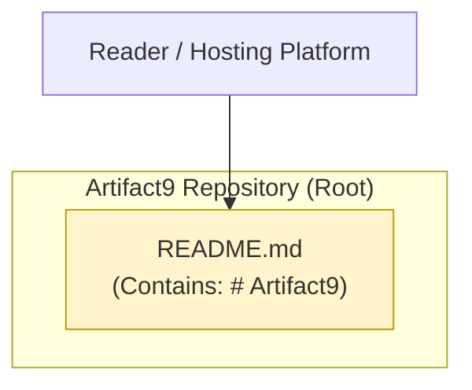

The repository root, when rendered by code hosting platforms or documentation tooling, surfaces `README.md` as the default project landing artifact. No other components participate in the system at this time.

#### Core Technical Approach

The core technical approach—including architectural style, primary technology stack, runtime environment, programming language(s), deployment model, and infrastructure target—has not been declared. The table below summarizes the technical-approach dimensions that are conventionally established at project inception and their current declaration status in the Artifact9 repository.

| Technical Dimension | Declared in Repository? | Evidence |
|---------------------|-------------------------|----------|
| Programming Language(s) | No | No source files of any extension present |
| Framework(s) | No | No package manifests or lockfiles present |
| Runtime / Execution Model | No | No entry points or process definitions present |
| Deployment Target | No | No container, IaC, or pipeline definitions present |

### 1.2.3 Success Criteria

#### Measurable Objectives

No measurable objectives have been documented in the repository. There are no requirements documents, acceptance criteria, or objective statements present in any form.

#### Critical Success Factors

No critical success factors are recorded in the repository. Project-level success conditions, dependency assumptions, and risk-mitigation prerequisites have not yet been captured.

#### Key Performance Indicators (KPIs)

No KPIs, service-level objectives, service-level agreements, error budgets, or operational thresholds are defined. The following table enumerates the KPI categories that are typically established for enterprise software systems and indicates that each is currently undefined.

| KPI Category | Currently Defined? | Status |
|--------------|--------------------|--------|
| Functional / Feature KPIs | No | Not yet defined |
| Performance & Scalability KPIs | No | Not yet defined |
| Availability & Reliability KPIs | No | Not yet defined |
| User Adoption / Engagement KPIs | No | Not yet defined |

## 1.3 Scope

### 1.3.1 In-Scope Elements

Because the Artifact9 repository has not declared a feature set, integration set, user-group set, or geographic footprint, the in-scope inventory captured here reflects only the artifacts that demonstrably exist in the codebase. This rigorous boundary prevents the specification from claiming scope that has not been authoritatively established.

#### Core Features and Functionalities

| In-Scope Element | Description | Evidence Source |
|------------------|-------------|-----------------|
| Project Identity Declaration | Establishment of the project name "Artifact9" via the root `README.md` | `README.md` H1 heading |
| Root-Level README Surface | A discoverable Markdown landing artifact rendered by hosting platforms | `README.md` presence at repository root |

No additional features, workflows, integrations, or technical requirements are presently in scope because none have been declared in the repository.

#### Implementation Boundaries

| Boundary Dimension | Currently Established? | Notes |
|--------------------|------------------------|-------|
| System Boundaries | No | No system components or interfaces exist to bound |
| User Groups Covered | No | No user roles or audiences are defined |
| Geographic / Market Coverage | No | No locality, region, or market is referenced |
| Data Domains Included | No | No data models, schemas, or domains are referenced |

### 1.3.2 Out-of-Scope Elements

Out-of-scope determinations conventionally rest upon the prior identification of an in-scope feature set—items are excluded relative to what is included. Because Artifact9 has not yet declared an in-scope feature set, an explicit, evidence-grounded list of excluded features cannot be authored. The table below records the principal categories that remain unaddressed in the repository and would therefore not be supported by the codebase in its current state.

| Out-of-Scope Category | Rationale at Current Repository State |
|-----------------------|----------------------------------------|
| Source Code Execution | No executable source files exist in the repository |
| Build, Test, or Deployment Operations | No build, test, or pipeline definitions exist |
| External System Integrations | No integration contracts or clients are declared |
| Data Persistence and Retrieval | No data stores, schemas, or persistence layers exist |
| User Interface / API Surfaces | No UI assets or API definitions exist |
| Authentication, Authorization, or Security Controls | No identity, access, or security configurations exist |

Future-phase considerations, deferred capabilities, and excluded use cases will need to be enumerated once a baseline feature set has been formally defined for Artifact9.

### 1.3.3 Repository State Assessment

To make the boundary conditions of this Introduction unambiguous, the following table summarizes the complete state of the Artifact9 repository at the time of specification authoring. This table is the authoritative reference for the scope statements above.

| Repository Aspect | Observed State |
|-------------------|----------------|
| Total Files | 1 (`README.md`) |
| Total Subfolders | 0 |
| Total Lines of Documentation Content | 1 line (the project H1 heading) |
| Total Lines of Source Code | 0 |
| Total Configuration / Manifest Files | 0 |
| Total Test or Quality-Assurance Artifacts | 0 |

The Introduction will require revision once the Artifact9 repository transitions from its current initialization state to one containing implementation artifacts, design documentation, and stakeholder-validated business context. Until then, this section provides the most accurate, evidence-grounded baseline that can be derived from the codebase.

## 1.4 References

### 1.4.1 Files Examined

- `README.md` — The only file present in the repository. Contains a single Markdown level-1 heading (`# Artifact9`) and provides the sole authoritative source for the project name. Examined to determine project identity, documented capabilities, declared scope, and any stakeholder or business context (none present beyond the project name).

### 1.4.2 Folders Examined

- `` (repository root, depth 0) — The repository root directory. Examined to enumerate all top-level files and subfolders. Contains exactly one file (`README.md`) and zero subfolders, confirming the absence of source code modules, configuration files, build infrastructure, test suites, and supplementary documentation.

### 1.4.3 Specification Sections Referenced

No cross-references to other Technical Specification sections were retrieved during the authoring of this Introduction, as no related sections were available in the provided reference list at the time of authoring.

# 2. Product Requirements

## 2.1 AUTHORING PREMISE AND METHODOLOGY

### 2.1.1 Documentary Integrity Standard

This Product Requirements section adheres to the same evidence-grounded documentation standard established in Section 1 of this Technical Specification. As articulated in Section 1.1.2, "this specification does not attempt to infer a business problem; doing so would constitute fabrication rather than documentation." The same prohibition against inference and extrapolation governs the present section.

Consequently, all entries within the Feature Catalog, Functional Requirements Tables, Feature Relationships, Implementation Considerations, and Traceability Matrix subsections below are drawn exclusively from artifacts that are demonstrably present in the Artifact9 repository. Where the conventional content of a product-requirements section cannot be evidence-grounded, the absence is recorded transparently rather than filled with synthetic content.

### 2.1.2 State of Requirements Declaration in the Artifact9 Repository

The Artifact9 repository, at the time of this specification's authoring, is in a pre-implementation / initial repository state. The complete repository contents consist of one file (`README.md`) holding a single Markdown level-1 heading (`# Artifact9`), zero subdirectories, and zero supporting artifacts. This empirical state was authoritatively recorded in the Section 1.3.3 Repository State Assessment, which is reproduced below for the reader's convenience.

| Repository Aspect | Observed State |
|-------------------|----------------|
| Total Files | 1 (`README.md`) |
| Total Subfolders | 0 |
| Total Lines of Documentation Content | 1 line (the project H1 heading) |
| Total Lines of Source Code | 0 |
| Total Configuration / Manifest Files | 0 |

The implication for Section 2 is direct: **no functional product features, no user stories, no acceptance criteria, no business rules, no input/output contracts, no performance criteria, and no compliance requirements have been declared anywhere in the Artifact9 codebase.** Section 1.2.2 of this specification states unambiguously that "the repository exposes no executable capabilities. There are no application entry points, command-line interfaces, HTTP endpoints, message handlers, scheduled tasks, user interfaces, or library exports defined." Section 1.2.3 further confirms that "no measurable objectives have been documented in the repository. There are no requirements documents, acceptance criteria, or objective statements present in any form."

### 2.1.3 Section Authoring Approach

In keeping with the methodology outlined above, this section is authored as a **baseline scaffold**. Each conventional subsection of a Product Requirements deliverable is presented with:

1. The dimensions that *would* be populated when a requirements set is formally elicited.
2. The current declared/undeclared status of each dimension, drawn from observable repository contents.
3. Explicit traceability to the Section 1 references that corroborate the absence or presence of each dimension.

This approach mirrors the closing position of Section 1.3.3, which records that "the Introduction will require revision once the Artifact9 repository transitions from its current initialization state." Section 2 likewise constitutes a baseline scaffold pending future requirements elicitation.

---

## 2.2 FEATURE CATALOG

### 2.2.1 Feature Catalog Status

The Artifact9 repository contains **no declared product features**. A product feature, for the purposes of this specification, is a unit of user-facing or system-facing capability with defined inputs, outputs, behaviors, and acceptance conditions. Because Section 1.2.2 affirms that no executable capabilities, interfaces, or library exports are present in the repository, no items meeting the definition of a product feature can be cataloged at this time.

To preserve traceability with Section 1.3.1—which enumerates the only two observable repository artifacts as "in-scope elements"—this subsection records those two artifacts as **Pre-Feature Observable Artifacts (Documentation Surface)**. They are intentionally not assigned F-XXX identifiers because they do not exhibit the input/output, behavioral, or acceptance-criteria attributes that the F-XXX scheme presupposes; assigning such identifiers would constitute the fabrication that this specification consistently avoids.

### 2.2.2 Conventional Feature Metadata Dimensions

The table below enumerates the metadata dimensions that the Section Prompt for this specification requires for each declared feature, alongside the current declaration status in the Artifact9 repository.

| Metadata Dimension | Currently Declared? | Source of Evidence |
|--------------------|---------------------|--------------------|
| Unique ID (F-XXX) | No | No features exist to identify |
| Feature Name | No | No features declared in `README.md` |
| Feature Category | No | No category taxonomy declared |
| Priority Level | No | No prioritization recorded |
| Status (Proposed/Approved/etc.) | No | No lifecycle markers recorded |

Because every metadata dimension is "Not Declared," no feature-metadata table can be populated with evidence-grounded rows.

### 2.2.3 Pre-Feature Observable Artifacts (Documentation Surface)

The two observable artifacts identified in Section 1.3.1 are reproduced here for completeness. These artifacts represent the entirety of what currently exists in the repository and are catalogued here strictly as documentation surfaces, not as testable product features.

#### Observable Artifact A — Project Identity Declaration

| Attribute | Recorded Value |
|-----------|----------------|
| Nature | Documentation Artifact (not a product feature) |
| Description | Establishment of the project name "Artifact9" via the H1 heading in `README.md` |
| Evidence Source | `README.md` (Markdown level-1 heading `# Artifact9`) |
| Cross-Reference | Section 1.3.1 (In-Scope Elements) |

**Overview.** This artifact records the single piece of project information that has been authoritatively declared in the repository. Its scope is limited to identifying the project by name.

**Business Value.** No business value statement is declared. Section 1.1.4 records that "no value proposition, expected business outcome, return-on-investment projection, qualitative benefit, or strategic alignment statement is present in the repository."

**User Benefits.** No user-benefit statement is declared. Section 1.1.3 records that no end users, personas, business sponsors, operations owners, or compliance stakeholders have been identified.

**Technical Context.** Plain UTF-8 Markdown content rendered by code hosting platforms (e.g., GitHub, GitLab) and Markdown-aware tooling. No runtime, framework, or execution context is involved.

**Dependencies.** None declared.

| Dependency Category | Declared? |
|---------------------|-----------|
| Prerequisite Features | No (none exist) |
| System Dependencies | No (no runtime/host declared) |
| External Dependencies | No (Section 1.2.1 confirms zero integrations) |
| Integration Requirements | No (Section 1.2.1 confirms zero integrations) |

#### Observable Artifact B — Root-Level README Surface

| Attribute | Recorded Value |
|-----------|----------------|
| Nature | Documentation Artifact (not a product feature) |
| Description | A discoverable Markdown landing artifact rendered by hosting platforms |
| Evidence Source | Presence of `README.md` at the repository root |
| Cross-Reference | Section 1.3.1 (In-Scope Elements); Section 1.2.2 (Major System Components) |

**Overview.** This artifact represents the existence of the `README.md` file itself at the repository root, where code hosting platforms surface it as the default project landing page.

**Business Value.** Not declared. No statement of strategic alignment, ROI, or business outcome is associated with the README's presence in the repository.

**User Benefits.** Not declared. No audience for the README is identified in any artifact.

**Technical Context.** A single root-level `README.md` file; the only file in the repository. Rendered automatically by Markdown-aware hosting platforms. No build, transformation, or runtime processing is associated with the artifact.

**Dependencies.** None declared.

| Dependency Category | Declared? |
|---------------------|-----------|
| Prerequisite Features | No (no other features exist) |
| System Dependencies | Implicit: Markdown rendering by hosting platform (not declared) |
| External Dependencies | No (Section 1.2.1 confirms zero integrations) |
| Integration Requirements | No (Section 1.2.1 confirms zero integrations) |

### 2.2.4 Functional Feature Inventory

| Feature ID | Feature Name | Category | Status |
|------------|--------------|----------|--------|
| *(none assigned)* | *(none declared)* | *(none declared)* | *(none declared)* |

The functional feature inventory is empty pending requirements elicitation. This row-zero state is the authoritative record of the current product-feature inventory for Artifact9.

---

## 2.3 FUNCTIONAL REQUIREMENTS

### 2.3.1 Requirements Inventory Status

Functional requirements, in the conventional F-XXX-RQ-YYY format, presuppose at least one declared feature against which requirements are framed. Because Section 2.2.4 demonstrates that no features are declared, no functional requirements can be authored that satisfy the evidence-grounding standard of this specification. The subsections below preserve the structural shape that requirements would take once feature elicitation occurs, but record no fabricated requirement rows.

### 2.3.2 Requirement Detail Dimensions

The table below enumerates the requirement-detail dimensions specified by the authoring prompt and indicates their current population status.

| Requirement Dimension | Currently Populated? | Reason |
|-----------------------|----------------------|--------|
| Requirement ID (F-XXX-RQ-YYY) | No | No parent features exist |
| Description | No | No behavior is declared |
| Acceptance Criteria | No | Section 1.2.3 confirms none exist |
| Priority (Must/Should/Could) | No | No prioritization recorded |
| Complexity (High/Medium/Low) | No | No implementation evidence to rate |

### 2.3.3 Technical Specification Dimensions

| Specification Dimension | Currently Populated? | Reason |
|--------------------------|----------------------|--------|
| Input Parameters | No | No interfaces or signatures declared |
| Output / Response | No | No interfaces or signatures declared |
| Performance Criteria | No | Section 1.2.3 records no performance KPIs |
| Data Requirements | No | Section 1.2.1 records no data domains |

### 2.3.4 Validation Rule Dimensions

| Validation Dimension | Currently Populated? | Reason |
|----------------------|----------------------|--------|
| Business Rules | No | No business problem framed (Section 1.1.2) |
| Data Validation | No | No data structures declared |
| Security Requirements | No | No security controls declared (Section 1.3.2) |
| Compliance Requirements | No | No compliance stakeholders declared (Section 1.1.3) |

### 2.3.5 Functional Requirements Table (Empty Scaffold)

| Requirement ID | Description | Acceptance Criteria | Priority |
|----------------|-------------|---------------------|----------|
| *(none defined)* | *(awaiting feature elicitation)* | *(awaiting acceptance criteria definition)* | *(awaiting prioritization)* |

This empty scaffold is preserved so that future revisions of this specification can populate rows directly without restructuring the table.

---

## 2.4 FEATURE RELATIONSHIPS

### 2.4.1 Feature Dependency Map

A feature dependency map records inter-feature relationships such as prerequisite, mutual-exclusion, or co-deployment dependencies. Because the Functional Feature Inventory in Section 2.2.4 is empty, **no feature-to-feature dependencies exist to map.** The diagram below records this empty state in a manner that remains structurally extensible once features are declared.

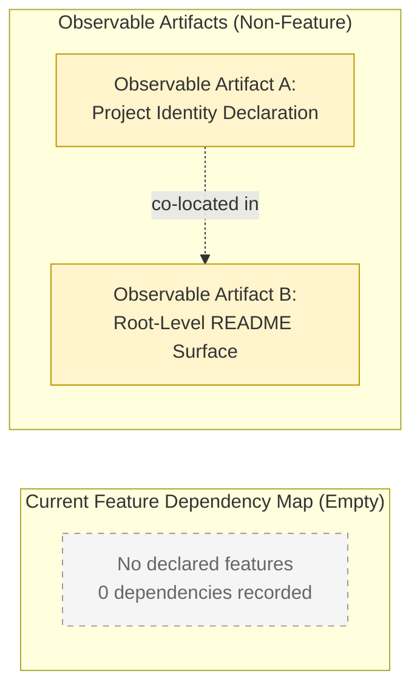

The dashed relationship between Observable Artifact A and Observable Artifact B is purely structural: Artifact A (the H1 heading) is co-located within the file represented by Artifact B (the `README.md` file). This is a containment relationship inherent to the file's contents and is not a product-feature dependency.

### 2.4.2 Integration Points

Integration points record the boundaries at which a feature interacts with external systems, services, or modules. The Section 1.2.1 enterprise-integration audit confirms zero declared integrations across all conventional categories.

| Integration Category | Currently Declared? |
|----------------------|---------------------|
| External APIs / Web Services | No |
| Databases / Persistent Stores | No |
| Messaging / Event Streams | No |
| Identity / Access Management Providers | No |
| Third-Party SaaS Connections | No |
| File / Batch Interfaces | No |

No integration points exist to document.

### 2.4.3 Shared Components and Common Services

Shared components and common services are reusable artifacts (libraries, modules, utility services) leveraged by multiple features. Section 1.2.2 records that "the repository structure consists of a single root-level documentation file. No modules, packages, services, layers, or runtime components are defined." Accordingly:

| Shared-Component Dimension | Currently Declared? |
|----------------------------|---------------------|
| Shared Libraries / Modules | No |
| Common Services | No |
| Cross-Cutting Concerns (Logging, Auth, Telemetry) | No |
| Utility / Helper Packages | No |

No shared components or common services exist to document.

---

## 2.5 IMPLEMENTATION CONSIDERATIONS

### 2.5.1 Technical Constraints

Technical constraints derive from declared technology choices, runtime environments, and integration commitments. Section 1.2.2 records that no programming languages, frameworks, runtime models, or deployment targets have been declared. The following table enumerates the technical-constraint dimensions that would typically apply and notes their current undeclared status.

| Technical Constraint Dimension | Currently Declared? |
|--------------------------------|---------------------|
| Programming Language Restrictions | No |
| Framework / Library Constraints | No |
| Runtime / Platform Constraints | No |
| Deployment Target Constraints | No |

The only de facto technical constraint discernible from the repository is that the existing artifact (`README.md`) is a UTF-8 Markdown document. This constraint applies only to the documentation surface itself and not to any product feature.

### 2.5.2 Performance Requirements

Section 1.2.3 explicitly states that no Performance & Scalability KPIs are currently defined. No throughput, latency, response-time, or resource-utilization targets exist anywhere in the repository.

| Performance Dimension | Currently Declared? |
|-----------------------|---------------------|
| Throughput Targets | No |
| Latency / Response-Time Targets | No |
| Concurrency Targets | No |
| Resource-Utilization Budgets | No |

### 2.5.3 Scalability Considerations

Scalability considerations require a baseline workload model and growth projections, neither of which are present in the repository. No horizontal-scaling, vertical-scaling, partitioning, sharding, or capacity-planning information has been recorded.

| Scalability Dimension | Currently Declared? |
|-----------------------|---------------------|
| Horizontal Scaling Strategy | No |
| Vertical Scaling Strategy | No |
| Workload Projections | No |
| Capacity Planning | No |

### 2.5.4 Security Implications

Section 1.3.2 lists "Authentication, Authorization, or Security Controls" as out-of-scope at the current repository state, on the basis that "no identity, access, or security configurations exist." The conventional security dimensions are therefore unaddressed:

| Security Dimension | Currently Declared? |
|---------------------|---------------------|
| Authentication Mechanism | No |
| Authorization Model | No |
| Data Encryption (At Rest / In Transit) | No |
| Auditing and Logging Controls | No |

### 2.5.5 Maintenance Requirements

Maintenance requirements arise from operational obligations—patching, upgrading, monitoring, supporting, and decommissioning a production system. Because no production system, runtime, or operational artifact exists in the Artifact9 repository, no maintenance requirements can currently be attached to any feature.

| Maintenance Dimension | Currently Declared? |
|-----------------------|---------------------|
| Patch / Upgrade Cadence | No |
| Monitoring / Observability Requirements | No |
| Support / On-Call Model | No |
| Decommissioning Plan | No |

The single de facto maintenance task that may be implied by the current repository is the eventual revision of `README.md` content as the project advances; this is a documentation-update activity rather than a system-maintenance requirement.

---

## 2.6 TRACEABILITY MATRIX

### 2.6.1 Requirement-to-Artifact Traceability

The traceability matrix is conventionally used to map each requirement (F-XXX-RQ-YYY) to its parent feature (F-XXX), source artifact, and verifying test case. Because Sections 2.2 and 2.3 demonstrate that no features and no requirements are declared, the matrix below is presented as an empty scaffold whose columns will be populated once requirements are formally elicited.

| Requirement ID | Parent Feature | Source Artifact | Test Case |
|----------------|----------------|-----------------|-----------|
| *(none defined)* | *(none defined)* | *(none defined)* | *(none defined)* |

### 2.6.2 Section Cross-Reference Map

To preserve traceability between this Product Requirements section and the established Section 1 baseline, the following cross-reference map records which Section 1 subsection corroborates each assertion of absence made in Section 2.

| Section 2 Assertion | Corroborating Section 1 Reference |
|---------------------|------------------------------------|
| No executable capabilities exist | Section 1.2.2 (High-Level Description) |
| No measurable objectives or KPIs exist | Section 1.2.3 (Success Criteria) |
| No integrations or external dependencies exist | Section 1.2.1 (Project Context) |
| No stakeholders or user roles declared | Section 1.1.3 (Key Stakeholders and Users) |
| No business problem or value proposition declared | Sections 1.1.2 and 1.1.4 |
| Only two observable artifacts identified | Section 1.3.1 (In-Scope Elements) |
| Repository state of 1 file / 0 subfolders | Section 1.3.3 (Repository State Assessment) |

### 2.6.3 Observable-Artifact Traceability

| Observable Artifact | Section 1.3.1 In-Scope Entry | Section 1 Cross-Reference | Source File |
|---------------------|-------------------------------|---------------------------|-------------|
| Project Identity Declaration | Yes (Entry 1) | Section 1.1.1 (Project Name = Artifact9) | `README.md` |
| Root-Level README Surface | Yes (Entry 2) | Section 1.2.2 (Major System Components) | `README.md` |

### 2.6.4 Outstanding Traceability Gaps

The following gaps are recorded so that future authoring activity can resolve them in a structured manner.

| Gap | Required Future Action |
|-----|------------------------|
| No F-XXX features assigned | Conduct feature elicitation and assign F-XXX identifiers |
| No F-XXX-RQ-YYY requirements assigned | Decompose each feature into testable requirements |
| No source-code artifacts to map | Begin implementation activities |
| No test-case identifiers | Establish a test plan and assign test-case identifiers |

---

## 2.7 ASSUMPTIONS, CONSTRAINTS, AND REVISION TRIGGERS

### 2.7.1 Documented Assumptions

The following assumptions are made by this section. Each is recorded so that it can be reviewed and confirmed or invalidated during subsequent specification phases.

| ID | Assumption | Basis |
|----|------------|-------|
| A-2.1 | The Artifact9 repository is the authoritative and complete source of requirements information at this time. | No other source has been provided or referenced. |
| A-2.2 | The absence of declared features represents a project lifecycle state (initialization), not an oversight or omission. | Section 1.1.1 characterizes the state as "pre-implementation." |
| A-2.3 | Future requirements elicitation will produce features that will be assigned identifiers starting at F-001. | Convention-aligned with the F-XXX schema specified by the authoring prompt. |

### 2.7.2 Specification Constraints

| ID | Constraint | Rationale |
|----|------------|-----------|
| C-2.1 | No F-XXX feature identifiers may be assigned in this revision. | No features are declared in the repository; assigning identifiers would constitute fabrication. |
| C-2.2 | No F-XXX-RQ-YYY requirement identifiers may be assigned in this revision. | No features exist to parent requirements; assigning identifiers would constitute fabrication. |
| C-2.3 | All Section 2 content must be traceable to either `README.md` or to a Section 1 subsection. | Specification-wide evidence-grounding standard inherited from Section 1. |

### 2.7.3 Revision Triggers

The following events should trigger a revision of this Section 2.

| Trigger | Expected Revision |
|---------|-------------------|
| First declaration of a feature, user story, or use case in the repository | Populate the Feature Catalog with F-001 onward |
| Introduction of source-code or configuration artifacts | Populate Implementation Considerations with declared constraints |
| Declaration of integrations or external dependencies | Populate Integration Points in Section 2.4.2 |
| Declaration of acceptance criteria, KPIs, or performance targets | Populate Functional Requirements Tables and Performance Requirements |
| Declaration of stakeholders or user roles | Cross-reference into Feature Descriptions for user benefits |

### 2.7.4 Version Tracking

| Specification Version | Section 2 State | Trigger for Next Revision |
|-----------------------|-----------------|---------------------------|
| v0 (current) | Baseline scaffold; no features declared | First feature declaration in the repository |

---

## 2.8 REFERENCES

### 2.8.1 Files Examined

- `README.md` — The sole file present in the Artifact9 repository. Confirmed contents: a single Markdown level-1 heading (`# Artifact9`). Examined to determine whether any features, user stories, acceptance criteria, or technical requirements have been declared; none were found beyond the project-name assertion.

### 2.8.2 Folders Examined

- `` (repository root, depth 0) — Examined to enumerate top-level files and subfolders. Contains exactly one file (`README.md`) and zero subfolders. Confirms the absence of source-code modules, manifest files, configuration files, test artifacts, and supplementary documentation that could host feature declarations.

### 2.8.3 Specification Sections Referenced

- **Section 1.1 Executive Summary** — Used to corroborate the pre-implementation state, the absence of stakeholders, and the absence of a business problem or value proposition.
- **Section 1.2 System Overview** — Used to corroborate the absence of executable capabilities, the absence of integrations, the absence of components, and the absence of declared technical-approach dimensions.
- **Section 1.3 Scope** — Used as the authoritative source for the two Observable Repository Artifacts (Project Identity Declaration; Root-Level README Surface) and for the Repository State Assessment table reproduced in Section 2.1.2.
- **Section 1.4 References** — Used to confirm the inventory of previously examined artifacts so that Section 2 does not introduce any new source claims beyond what Section 1 has already verified.

# 3. Technology Stack

## 3.1 AUTHORING PREMISE AND EVIDENCE BOUNDARY

### 3.1.1 Inheritance of the Evidence-Grounding Standard

This section is authored under the same documentary integrity standard established in Section 2.1 and codified by constraint **C-2.3** in Section 2.7.2, which requires that all specification content be traceable to either `README.md` or a prior Section 1 subsection. Section 1.2.2 (Core Technical Approach) records the authoritative determination that "the core technical approach—including architectural style, primary technology stack, runtime environment, programming language(s), deployment model, and infrastructure target—has not been declared." Section 1.3.3 (Repository State Assessment) further confirms that the repository contains exactly one file (`README.md`), zero subfolders, zero lines of source code, and zero configuration or manifest files.

Consequently, this Technology Stack section does **not** declare languages, frameworks, libraries, services, datastores, or pipelines. To do so in the absence of repository evidence would constitute fabrication. Instead, this section establishes a baseline scaffold that:

- Records each Technology Stack dimension prescribed by the section prompt
- Documents the current "Not Declared" status of each dimension against the repository
- Cross-references the authoritative Section 1 / Section 2 subsections that confirm each absence
- Notes the single de facto technical characteristic observable in the repository (the `README.md` Markdown/UTF-8 surface)
- Specifies the revision triggers that will require this section to be repopulated as the repository advances

### 3.1.2 Implications for the Default Technology Stack

The authoring prompt provides a Default Technology Stack reference (covering cloud platform, containerization, infrastructure-as-code, CI/CD, backend language and framework, identity, database, AI framework, frontend, cross-platform, and native-application choices). After reconciling this default reference against the repository, none of the items in the default stack appear in the Artifact9 codebase: there are no source files of any language, no manifests referencing any framework, no Dockerfile, no Terraform configuration, no GitHub Actions workflows, no authentication configuration, no database connection definitions, and no AI/ML configuration of any kind.

Adopting the Default Technology Stack verbatim into Section 3 would:

1. Violate the inherited evidence-grounding standard (Section 2.1 and C-2.3)
2. Contradict the authoritative absence declarations of Sections 1.2.1, 1.2.2, 1.3.2, and 2.5.1
3. Introduce technology commitments into the specification that have not been authorized by any artifact in the repository

Section 3 therefore acknowledges the Default Technology Stack as a *reference candidate set* for future declaration decisions but does not adopt it. The actual technology stack will be populated by future revisions of this section in response to the revision triggers documented in Section 3.10.2.

### 3.1.3 Section Organization

The remainder of Section 3 is organized according to the six dimensions specified by the section prompt:

| Subsection | Dimension | Authoritative Cross-Reference |
|------------|-----------|-------------------------------|
| 3.2 | Programming Languages | Section 1.2.2; Section 2.5.1 |
| 3.3 | Frameworks and Libraries | Section 1.2.2; Section 2.5.1 |
| 3.4 | Open Source Dependencies | Section 1.2.1; Section 1.3.2 |
| 3.5 | Third-Party Services | Section 1.2.1; Section 2.4 (Integration Points) |
| 3.6 | Databases and Storage | Section 1.2.1; Section 1.3.1; Section 1.3.2 |
| 3.7 | Development and Deployment | Section 1.2.2; Section 1.3.2; Section 2.5.1 |

Subsections 3.8 (Observable Characteristics), 3.9 (Current-State Diagram), 3.10 (Constraints and Revision Triggers), and 3.11 (References) follow.

---

## 3.2 PROGRAMMING LANGUAGES

### 3.2.1 Currently Declared Languages

No programming languages are declared in the Artifact9 repository. This determination is recorded authoritatively in Section 1.2.2 ("Programming Language(s) | No | No source files of any extension present") and is reconfirmed in Section 2.5.1 ("Programming Language Restrictions | No"). The repository contains no source files of any conventional language extension (e.g., `.py`, `.js`, `.ts`, `.java`, `.go`, `.rs`, `.swift`, `.kt`, `.m`, `.cs`, `.rb`, `.php`, `.scala`, `.cpp`, `.c`).

| Platform / Component | Declared Language | Version | Selection Justification | Evidence Source |
|----------------------|-------------------|---------|-------------------------|-----------------|
| Backend / Server | Not Declared | — | Not Applicable (no language declared) | Section 1.2.2 |
| Frontend / Web | Not Declared | — | Not Applicable (no language declared) | Section 1.2.2 |
| Mobile / Native | Not Declared | — | Not Applicable (no language declared) | Section 1.2.2 |
| Scripting / Automation | Not Declared | — | Not Applicable (no language declared) | Section 1.2.2 |
| Infrastructure / IaC | Not Declared | — | Not Applicable (no language declared) | Section 1.2.2 |

### 3.2.2 Selection Criteria Status

Because no programming language has been declared, no selection criteria have been recorded. The following selection-criteria dimensions that would typically govern language choice are currently unaddressed:

| Selection Criterion | Currently Recorded? | Notes |
|---------------------|---------------------|-------|
| Performance Profile Fit | No | No performance targets exist (per Section 2.5.2) |
| Ecosystem Maturity | No | No ecosystem commitment recorded |
| Team Skill Alignment | No | No team or stakeholder roles recorded |
| Long-Term Support Considerations | No | No maintenance plan recorded (per Section 2.5.5) |
| Interoperability Requirements | No | No integration points recorded (per Section 1.2.1) |
| Licensing Compatibility | No | No license posture recorded |

### 3.2.3 Markdown as a De Facto Documentation Language

The single language artifact present in the repository is **Markdown**, used solely for the project's documentation surface (`README.md`). Per Section 2.5.1, "the existing artifact (`README.md`) is a UTF-8 Markdown document. This constraint applies only to the documentation surface itself and not to any product feature." Markdown is therefore noted here as a documentation-format observation rather than as a declared programming language in the system architecture sense.

| Observable Format | Scope of Applicability | Version / Specification | Evidence |
|-------------------|------------------------|-------------------------|----------|
| Markdown (CommonMark-compatible) | Documentation surface only (`README.md`) | Not pinned by any artifact in the repository | `README.md` content `# Artifact9` |
| Character Encoding | Documentation surface only | UTF-8 (per Section 2.5.1) | `README.md` byte content |

---

## 3.3 FRAMEWORKS AND LIBRARIES

### 3.3.1 Currently Declared Frameworks

No frameworks or libraries are declared in the Artifact9 repository. Section 1.2.2 records this authoritatively ("Framework(s) | No | No package manifests or lockfiles present"), and Section 2.5.1 reconfirms the absence ("Framework / Library Constraints | No"). The repository contains no `package.json`, `requirements.txt`, `Pipfile`, `pyproject.toml`, `pom.xml`, `build.gradle`, `Cargo.toml`, `go.mod`, `composer.json`, `Gemfile`, `mix.exs`, `Package.swift`, or any other package manifest of any ecosystem.

| Framework Category | Declared Framework | Version | Compatibility Requirements | Justification | Evidence Source |
|--------------------|--------------------|---------|----------------------------|---------------|-----------------|
| Web / API Framework | Not Declared | — | Not Applicable | Not Applicable | Section 1.2.2 |
| Frontend Framework | Not Declared | — | Not Applicable | Not Applicable | Section 1.2.2 |
| Mobile / Native Framework | Not Declared | — | Not Applicable | Not Applicable | Section 1.2.2 |
| Data Access / ORM | Not Declared | — | Not Applicable | Not Applicable | Section 1.2.2 |
| Testing Framework | Not Declared | — | Not Applicable | Not Applicable | Section 1.3.3 |
| AI / ML Framework | Not Declared | — | Not Applicable | Not Applicable | Section 1.2.2 |
| Logging / Observability | Not Declared | — | Not Applicable | Not Applicable | Section 2.5.5 |

### 3.3.2 Compatibility and Version Considerations

No version constraints, compatibility matrices, or minimum-version baselines have been recorded for any framework or library. No upgrade cadence, security-patch window, or end-of-life policy has been declared (per Section 2.5.5).

### 3.3.3 Justification Status

Because no framework has been declared, no justification can be recorded. The Default Technology Stack referenced in Section 3.1.2 is not adopted, and any future framework selection (whether drawn from that reference set or otherwise) will be accompanied by an explicit justification at the time of declaration.

---

## 3.4 OPEN SOURCE DEPENDENCIES

### 3.4.1 Package Manifests and Lockfiles

No package manifests and no lockfiles exist in the Artifact9 repository. Section 1.3.3 records "Total Configuration / Manifest Files | 0," and Section 1.2.2 records "no package manifests or lockfiles present." As a consequence, no direct (declared) open source dependencies can be enumerated, and no transitive dependencies can be resolved.

| Ecosystem | Manifest Present? | Lockfile Present? | Resolved Direct Dependencies | Resolved Transitive Dependencies |
|-----------|-------------------|-------------------|------------------------------|----------------------------------|
| npm / yarn / pnpm | No | No | 0 | 0 |
| PyPI (pip / Poetry / Pipenv) | No | No | 0 | 0 |
| Maven / Gradle | No | No | 0 | 0 |
| NuGet | No | No | 0 | 0 |
| Cargo | No | No | 0 | 0 |
| Go Modules | No | No | 0 | 0 |
| RubyGems / Bundler | No | No | 0 | 0 |
| Composer | No | No | 0 | 0 |
| Swift Package Manager / CocoaPods | No | No | 0 | 0 |

### 3.4.2 Registry and Version Status

Because no manifests exist, no package registries have been targeted and no versions have been pinned. The following registry / versioning dimensions are therefore unaddressed:

| Dimension | Currently Recorded? |
|-----------|---------------------|
| Public Registry Endpoints | No |
| Private / Internal Registry Endpoints | No |
| Version Pinning Strategy (exact / range / wildcard) | No |
| Vulnerability Scanning Posture | No |
| License Compliance Process | No |
| Software Bill of Materials (SBOM) Production | No |

### 3.4.3 Transitive Dependency Status

No lockfiles exist; therefore no transitive dependency closure can be produced. No dependency graph, no supply-chain attestation, and no provenance metadata is currently available.

---

## 3.5 THIRD-PARTY SERVICES

### 3.5.1 External APIs and Integrations

Section 1.2.1 records that no external APIs, web services, or third-party SaaS connections are declared. The authoritative integration audit table in Section 1.2.1 (Integration with Existing Enterprise Landscape) was specifically examined and recorded all categories as "No." Section 2.4 (Feature Relationships) reconfirms zero integration points. No client SDKs, no webhook handlers, no OAuth provider configurations, and no API gateway definitions are present in the repository.

| Third-Party Service Category | Declared? | Provider | Version / API Contract | Authentication Method | Evidence |
|------------------------------|-----------|----------|------------------------|----------------------|----------|
| External APIs / Web Services | No | — | — | — | Section 1.2.1 |
| Third-Party SaaS Connections | No | — | — | — | Section 1.2.1 |
| File / Batch Interfaces | No | — | — | — | Section 1.2.1 |
| Messaging / Event Streams | No | — | — | — | Section 1.2.1 |

### 3.5.2 Authentication Services

No identity or access-management provider has been declared. Section 1.2.1 records "Identity / Access Management Providers | No," and Section 2.5.4 confirms "Authentication Mechanism | No" and "Authorization Model | No." No identity-provider configuration, no token-issuance configuration, no single-sign-on metadata, and no role/permission model has been declared.

### 3.5.3 Monitoring Tools

No monitoring, observability, alerting, log-aggregation, or application-performance-management tools have been declared. Section 2.5.5 records "Monitoring / Observability Requirements | No." No telemetry collectors, no log shippers, no metrics endpoints, and no dashboard definitions exist.

### 3.5.4 Cloud Services

No cloud-platform commitment of any kind has been declared. Section 1.2.2 records "Deployment Target | No | No container, IaC, or pipeline definitions present," and Section 1.3.2 lists "Build, Test, or Deployment Operations" as out-of-scope at the current repository state. There are no IAM policies, network configurations, compute provisioning manifests, storage bucket definitions, or managed-service references for any cloud provider in the repository.

| Cloud Service Category | Declared Provider | Service Tier | Region | Evidence |
|------------------------|-------------------|--------------|--------|----------|
| Compute (VM / Container / Serverless) | Not Declared | — | — | Section 1.2.2 |
| Object / Blob Storage | Not Declared | — | — | Section 1.2.1 |
| Managed Database | Not Declared | — | — | Section 1.2.1 |
| Networking / CDN | Not Declared | — | — | Section 1.2.2 |
| Secrets / Key Management | Not Declared | — | — | Section 2.5.4 |
| Identity (IAM) | Not Declared | — | — | Section 1.2.1 |

---

## 3.6 DATABASES AND STORAGE

### 3.6.1 Primary and Secondary Databases

No primary database, no secondary or replica database, and no analytical store has been declared. Section 1.2.1 records "Databases / Persistent Stores | No"; Section 1.3.1 records "Data Domains Included | No | No data models, schemas, or domains are referenced"; and Section 1.3.2 records "Data Persistence and Retrieval | No data stores, schemas, or persistence layers exist."

| Datastore Role | Declared Engine | Version | Persistence Strategy | Evidence Source |
|----------------|-----------------|---------|----------------------|-----------------|
| Primary OLTP Datastore | Not Declared | — | Not Applicable | Section 1.2.1 |
| Read Replica / Secondary | Not Declared | — | Not Applicable | Section 1.2.1 |
| Analytical / OLAP Store | Not Declared | — | Not Applicable | Section 1.2.1 |
| Document / NoSQL Store | Not Declared | — | Not Applicable | Section 1.2.1 |
| Search / Indexing Store | Not Declared | — | Not Applicable | Section 1.2.1 |
| Vector / Embeddings Store | Not Declared | — | Not Applicable | Section 1.2.1 |
| Time-Series Store | Not Declared | — | Not Applicable | Section 1.2.1 |

### 3.6.2 Caching Solutions

No caching tier (in-process cache, distributed cache, CDN edge cache, or HTTP response cache) has been declared. Because no application runtime exists (per Section 1.2.2), the surface area on which a cache could operate has not been defined.

### 3.6.3 Storage Services and Persistence Strategies

No object storage, no file storage, no block storage, and no archival storage has been declared. Section 1.3.2 records "Data Persistence and Retrieval" as out-of-scope at the current repository state. The following storage dimensions remain unaddressed:

| Storage Dimension | Currently Declared? |
|-------------------|---------------------|
| Object / Blob Storage Provider | No |
| File / Network Storage | No |
| Backup and Restore Strategy | No |
| Data Retention Policy | No |
| Encryption at Rest | No (per Section 2.5.4) |
| Encryption in Transit | No (per Section 2.5.4) |

---

## 3.7 DEVELOPMENT AND DEPLOYMENT

### 3.7.1 Development Tools

No development-tooling configuration is present in the repository. There are no editor configurations (`.editorconfig`), no linter or formatter configurations, no IDE workspace files, no pre-commit hooks, and no developer environment manifests (e.g., `.devcontainer`, `Vagrantfile`, `.nvmrc`, `.python-version`). Section 1.3.3 records the absence of "Configuration / Manifest Files."

| Development Tool Category | Declared? | Evidence |
|---------------------------|-----------|----------|
| Editor / IDE Configuration | No | Section 1.3.3 |
| Linting / Static Analysis | No | Section 1.3.3 |
| Code Formatting | No | Section 1.3.3 |
| Pre-Commit / Git Hooks | No | Section 1.3.3 |
| Developer Environment Image / Sandbox | No | Section 1.3.3 |
| Documentation Generator | No | Section 1.3.3 |

### 3.7.2 Build System

No build system has been declared. There is no `Makefile`, `build.gradle`, `pom.xml`, `Cargo.toml`, `go.mod`, `Rakefile`, `tox.ini`, `setup.py`, `setup.cfg`, `pyproject.toml`, or any other build descriptor. Section 1.3.2 records "Build, Test, or Deployment Operations" as out-of-scope at the current repository state.

| Build System Dimension | Declared? | Evidence |
|------------------------|-----------|----------|
| Build Tool / Orchestrator | No | Section 1.3.2 |
| Task Runner | No | Section 1.3.2 |
| Artifact / Package Output | No | Section 1.3.2 |
| Build Reproducibility Strategy | No | Section 1.3.2 |

### 3.7.3 Containerization

No containerization is declared. There is no `Dockerfile`, no `docker-compose.yml`, no Kubernetes manifest (`Deployment`, `StatefulSet`, `Service`, `Ingress`, `ConfigMap`, `Secret`), no Helm chart, no Kustomize overlay, no OCI image reference, and no container-registry coordinate. Section 1.2.2 confirms "no container, IaC, or pipeline definitions present."

| Containerization Dimension | Declared? | Evidence |
|----------------------------|-----------|----------|
| Container Image Definition | No | Section 1.2.2 |
| Local Composition / Orchestration | No | Section 1.2.2 |
| Production Orchestrator (e.g., Kubernetes) | No | Section 1.2.2 |
| Container Registry | No | Section 1.2.2 |
| Base Image Policy | No | Section 1.2.2 |

### 3.7.4 CI/CD Requirements

No continuous-integration or continuous-deployment pipeline is declared. There is no `.github/workflows/` directory, no `.gitlab-ci.yml`, no `Jenkinsfile`, no `azure-pipelines.yml`, no `bitbucket-pipelines.yml`, no `circle.yml`, and no `buildspec.yml`. Section 1.2.2 confirms the absence of pipeline definitions, and Section 1.3.2 records "Build, Test, or Deployment Operations" as out-of-scope.

| CI/CD Dimension | Declared? | Evidence |
|-----------------|-----------|----------|
| CI Workflow Definitions | No | Section 1.2.2 |
| CD Workflow Definitions | No | Section 1.2.2 |
| Quality Gates (lint / test / scan) | No | Section 1.3.2 |
| Deployment Environments (dev / staging / prod) | No | Section 1.2.2 |
| Release / Versioning Strategy | No | Section 1.2.2 |
| Rollback / Promotion Strategy | No | Section 1.2.2 |
| Infrastructure as Code (Terraform / CloudFormation / Pulumi / Bicep) | No | Section 1.2.2 |
| Secrets Management Integration | No | Section 2.5.4 |

---

## 3.8 OBSERVABLE DE FACTO TECHNICAL CHARACTERISTICS

### 3.8.1 The Markdown / UTF-8 Documentation Surface

The single de facto technical characteristic discernible from the repository is the documentation-surface format established by `README.md`. As recorded verbatim in Section 2.5.1, "the existing artifact (`README.md`) is a UTF-8 Markdown document. This constraint applies only to the documentation surface itself and not to any product feature." This characteristic is captured here for completeness; it does **not** constitute a declared technology stack component.

| Observable Characteristic | Scope | Authority |
|---------------------------|-------|-----------|
| File Format | Markdown (CommonMark-compatible) | `README.md` H1 heading content |
| Character Encoding | UTF-8 | `README.md` byte content |
| File Size | 11 bytes | Section 1.3.3 |
| File Count | 1 | Section 1.3.3 |
| Applicability | Documentation surface only | Section 2.5.1 |

### 3.8.2 Implicit Hosting Platform Renderer

When the repository is published to any code-hosting platform that renders Markdown (such platforms are referenced generically in Section 1.2.2 as "code hosting platforms or documentation tooling"), the `README.md` artifact is rendered as the default project landing artifact. The specific renderer is *implicit* and is **not** declared in the repository; it depends entirely on where the repository is hosted. No hosting platform, no rendering specification, and no Markdown flavor (GitHub Flavored Markdown, GitLab Flavored Markdown, etc.) is declared.

---

## 3.9 CURRENT-STATE TECHNOLOGY STACK DIAGRAM

### 3.9.1 Empty-State Visualization Convention

The following diagram applies the empty-state visualization convention established by Section 2.4: dashed borders are used for nodes representing dimensions that are "Not Declared," and solid borders are used for the single observable artifact (`README.md`) and the implicit renderer relationship. This is a diagram of the *current* state and will be replaced by a populated technology-stack diagram when the revision triggers in Section 3.10.2 are met.

### 3.9.2 Diagram

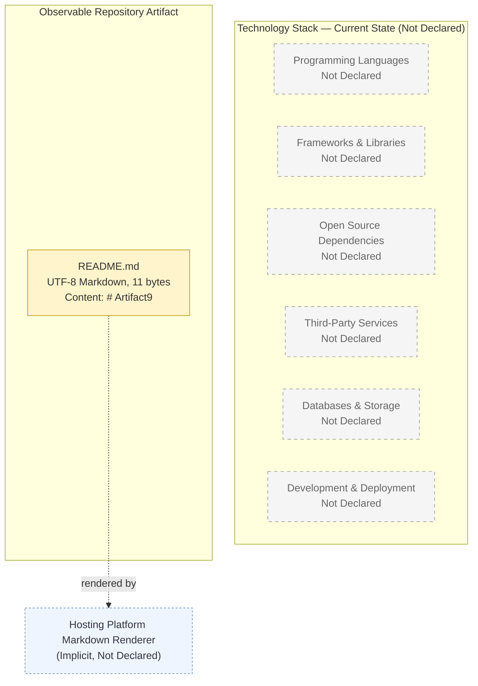

---

## 3.10 SPECIFICATION CONSTRAINTS AND REVISION TRIGGERS

### 3.10.1 Section 3 Constraints

The following constraints govern Section 3 and extend the constraint series introduced by Section 2.7.2.

| ID | Constraint | Rationale |
|----|------------|-----------|
| C-3.1 | No specific language, framework, library, database, service, or pipeline may be declared in this revision of Section 3. | The repository contains no source files, manifests, or configurations referencing any such component. Declaration would constitute fabrication and would violate C-2.3. |
| C-3.2 | The Default Technology Stack referenced by the section prompt may not be adopted as the declared stack in this revision. | None of its components appear in the repository; adopting it would violate C-2.3 and contradict Sections 1.2.1, 1.2.2, 1.3.2, and 2.5.1. |
| C-3.3 | No version numbers may be assigned to any technology stack item in this revision. | No versioned components exist; assignment would constitute fabrication. |
| C-3.4 | The Markdown / UTF-8 documentation-surface observation (Section 3.8.1) is scoped exclusively to `README.md` and may not be characterized as a product technology choice. | Section 2.5.1 explicitly limits the applicability of this observation to the documentation surface. |
| C-3.5 | All Section 3 content must remain traceable to either `README.md` or to a prior Section 1 or Section 2 subsection. | Specification-wide evidence-grounding standard inherited from C-2.3. |

### 3.10.2 Section 3 Revision Triggers

The following events should trigger a revision of this Section 3, following the precedent pattern of Section 2.7.3.

| Trigger | Expected Section 3 Revision |
|---------|------------------------------|
| Introduction of source files of any programming language | Populate Section 3.2 (Programming Languages) with the declared languages, versions, and platform/component mapping |
| Introduction of a package manifest (e.g., `package.json`, `pyproject.toml`, `pom.xml`, `Cargo.toml`, `go.mod`) | Populate Section 3.3 (Frameworks and Libraries) and Section 3.4 (Open Source Dependencies) |
| Introduction of a lockfile (e.g., `package-lock.json`, `poetry.lock`, `Pipfile.lock`, `go.sum`, `Cargo.lock`) | Populate Section 3.4 (Open Source Dependencies) transitive-closure table |
| Declaration of an external API client, webhook handler, or SaaS integration | Populate Section 3.5 (Third-Party Services) |
| Declaration of an identity-provider configuration | Populate Section 3.5.2 (Authentication Services) |
| Declaration of an observability stack | Populate Section 3.5.3 (Monitoring Tools) |
| Introduction of a Dockerfile or container manifest | Populate Section 3.7.3 (Containerization) |
| Introduction of IaC artifacts (Terraform, CloudFormation, Pulumi, Bicep) | Populate Section 3.5.4 (Cloud Services) and Section 3.7.4 (CI/CD) |
| Introduction of CI/CD workflow files | Populate Section 3.7.4 (CI/CD Requirements) |
| Declaration of a database connection or ORM configuration | Populate Section 3.6 (Databases and Storage) |
| Declaration of a caching tier or storage service | Populate Section 3.6.2 / Section 3.6.3 |

### 3.10.3 Version Tracking

| Specification Version | Section 3 State | Trigger for Next Revision |
|-----------------------|-----------------|---------------------------|
| v0 (current) | Baseline scaffold; no technology stack components declared | First introduction of any source file, manifest, lockfile, container definition, IaC artifact, or CI/CD workflow in the repository |

---

## 3.11 REFERENCES

### 3.11.1 Repository Artifacts Examined

- `README.md` — Sole file in the repository (11 bytes, single H1 heading `# Artifact9`). Verified to contain no technology declarations, no dependency references, no configuration directives, and no integration definitions. Provides the basis for the Markdown / UTF-8 observation in Section 3.8.1.
- `/` (repository root) — Contains exactly one file (`README.md`) and zero subfolders. Verified absence of any source-code directories, configuration directories, build directories, test directories, IaC directories, CI/CD directories, or container/orchestration directories.

### 3.11.2 Technical Specification Sections Referenced

- **Section 1.2.1 (Project Context — Integration with Existing Enterprise Landscape)** — Authoritative source confirming that all six enterprise integration categories (External APIs, Databases, Messaging, Identity, SaaS, File/Batch) are "Not Declared." Used to ground Section 3.5 and Section 3.6.
- **Section 1.2.2 (High-Level Description — Core Technical Approach)** — Authoritative source declaring that programming language(s), framework(s), runtime / execution model, and deployment target are "Not Declared." Used to ground Section 3.2, Section 3.3, Section 3.7.3, and Section 3.7.4.
- **Section 1.3.1 (In-Scope Elements)** — Confirms that the only in-scope elements are the Project Identity Declaration and the Root-Level README Surface; data domains are not in scope. Used to bound Section 3.6.
- **Section 1.3.2 (Out-of-Scope Elements)** — Records that Source Code Execution, Build / Test / Deployment Operations, External System Integrations, Data Persistence and Retrieval, UI / API Surfaces, and Authentication / Authorization / Security Controls are all out of scope at the current repository state. Used to ground Section 3.4, Section 3.5, Section 3.6, and Section 3.7.
- **Section 1.3.3 (Repository State Assessment)** — Provides the canonical inventory of repository contents (1 file, 0 subfolders, 0 source lines, 0 configuration/manifest files). Used to ground every "Not Declared" determination across Section 3.
- **Section 2.1 (Authoring Premise and Methodology)** — Establishes the documentary integrity standard and prohibition against fabrication that governs Section 3.
- **Section 2.4 (Feature Relationships — Integration Points)** — Reconfirms zero integration points. Used to ground Section 3.5.
- **Section 2.5.1 (Technical Constraints)** — Records all technical-constraint dimensions as "Not Declared" and provides the explicit Markdown / UTF-8 observation reproduced in Section 3.8.1.
- **Section 2.5.4 (Security Implications)** — Records that authentication, authorization, encryption (at rest / in transit), and auditing are all "Not Declared." Used to ground Section 3.5.2 and Section 3.6.3.
- **Section 2.5.5 (Maintenance Requirements)** — Records that monitoring / observability and support models are "Not Declared." Used to ground Section 3.5.3 and Section 3.7.
- **Section 2.7.2 (Specification Constraints)** — Establishes constraint C-2.3 (specification-wide evidence-grounding traceability), which is inherited by Section 3 as C-3.5.
- **Section 2.7.3 (Revision Triggers)** — Provides the precedent revision-trigger pattern applied in Section 3.10.2.

# 4. Process Flowchart

## 4.1 AUTHORING PREMISE AND PROCESS DECLARATION BOUNDARY

### 4.1.1 Documentary Integrity Standard Inherited from Sections 1, 2, and 3

This Process Flowchart section adheres to the same evidence-grounded documentation standard established by Section 1.1.2 ("this specification does not attempt to infer a business problem; doing so would constitute fabrication rather than documentation"), reinforced by Section 2.1.1 ("the same prohibition against inference and extrapolation governs the present section"), and extended by Section 3.1 through constraint C-3.5 ("all Section 3 content must remain traceable to either `README.md` or to a prior Section 1 or Section 2 subsection").

Consequently, all process flows, decision points, swim lanes, state transitions, integration sequences, error-handling paths, validation rules, and timing constraints documented in this section are drawn exclusively from artifacts that are demonstrably present in the Artifact9 repository. Where the conventional content of a Process Flowchart deliverable cannot be evidence-grounded, the absence is recorded transparently rather than filled with synthetic content.

### 4.1.2 State of Process Declaration in the Artifact9 Repository

At the time of this specification's authoring, the Artifact9 repository consists of one file (`README.md`) holding a single Markdown level-1 heading (`# Artifact9`), zero subdirectories, and zero supporting artifacts. The repository-level baseline that constrains Section 4 is reproduced from Section 1.3.3 below for the reader's convenience.

| Repository Aspect | Observed State |
|-------------------|----------------|
| Total Files | 1 (`README.md`) |
| Total Subfolders | 0 |
| Total Lines of Documentation Content | 1 line (the project H1 heading) |
| Total Lines of Source Code | 0 |
| Total Configuration / Manifest Files | 0 |
| Total Test or Quality-Assurance Artifacts | 0 |

The implication for Section 4 is direct and absolute: **no business processes, user journeys, system interactions, decision points, validation rules, authorization checkpoints, state machines, transaction boundaries, retry mechanisms, fallback processes, error notification flows, timing constraints, SLAs, or recovery procedures have been declared anywhere in the Artifact9 codebase.** Section 1.2.2 of this specification states unambiguously that "the repository exposes no executable capabilities. There are no application entry points, command-line interfaces, HTTP endpoints, message handlers, scheduled tasks, user interfaces, or library exports defined." Section 1.2.1 confirms zero declared integrations across all six conventional enterprise integration categories. Section 2.3.4 records that business rules, data validation rules, security requirements, and compliance requirements are uniformly "Not Declared."

### 4.1.3 Section Authoring Approach

In keeping with the methodology outlined above and mirroring the section authoring approach formalized in Section 2.1.3, this section is authored as a **baseline scaffold**. Each conventional subsection of a Process Flowchart deliverable is presented with:

1. The dimensions that *would* be populated when a process model is formally elicited and implemented.
2. The current declared/undeclared status of each dimension, drawn from observable repository contents.
3. Explicit traceability to the Section 1, Section 2, or Section 3 references that corroborate the absence or presence of each dimension.
4. An empty-state Mermaid visualization following the convention established by Section 2.4.1 (Feature Dependency Map) and Section 3.9 (Current-State Technology Stack Diagram), namely: dashed gray borders for "Not Declared" dimensions, solid light-yellow borders for the single observable artifact (`README.md`), and dashed light-blue borders for the implicit (not declared) renderer relationship.

This approach ensures Section 4 remains structurally extensible: when source code, integrations, state machines, or runtime behaviors are introduced into the repository, each empty-state diagram and table can be populated without restructuring the document.

---

## 4.2 SYSTEM WORKFLOWS

### 4.2.1 Core Business Processes

#### 4.2.1.1 End-to-End User Journey Inventory

A core business process is an end-to-end sequence of activities, decision points, and system interactions that fulfills a defined business objective for one or more declared user personas. The conventional inputs for documenting such a process are: a declared user persona, a declared business objective, a declared system surface (UI/API/CLI) through which the user interacts, and a declared back-end capability that fulfills the objective.

The Artifact9 repository declares none of these inputs. Section 1.1.3 records the absence of user personas, sponsors, and operations owners; Section 1.2.2 records the absence of any executable capability; Section 1.2.3 records the absence of measurable objectives, critical success factors, and KPIs; Section 2.2.4 records the absence of any features that would parent a business process.

| Core Business Process Dimension | Declared in Repository? | Authoritative Cross-Reference |
|---------------------------------|-------------------------|-------------------------------|
| Declared Business Objective | No | Section 1.1.2; Section 1.2.3 |
| Declared User Persona / Actor | No | Section 1.1.3 |
| Declared System Surface (UI / API / CLI) | No | Section 1.2.2; Section 1.3.2 |
| Declared Back-End Capability | No | Section 1.2.2 |
| Declared Decision Points / Business Rules | No | Section 2.3.4 |
| Declared Error / Exception Paths | No | Section 1.2.2; Section 2.5.5 |
| Declared SLA / Timing Constraint | No | Section 1.2.3; Section 2.5.2 |

Because zero core business processes are declared, zero end-to-end user journeys, zero system interactions, zero decision diamonds, and zero error-handling paths exist to flowchart.

#### 4.2.1.2 Empty-State Core Business Process Visualization

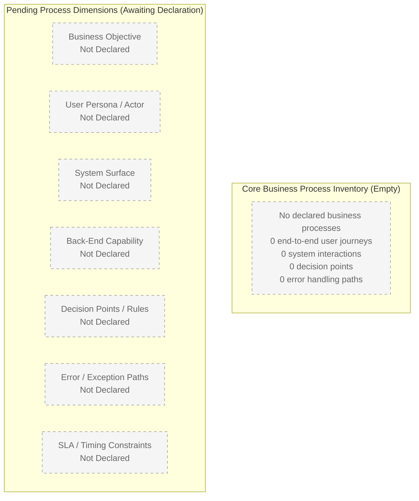

### 4.2.2 Integration Workflows

#### 4.2.2.1 Integration Workflow Inventory

An integration workflow records the data flow between systems, the API interactions, the event-processing flows, and the batch-processing sequences that traverse system boundaries. The conventional inputs for documenting such a workflow are: at least one declared external endpoint, at least one declared message contract or schema, at least one declared transport protocol, and at least one declared trigger (synchronous request, asynchronous event, or scheduled batch).

The Section 1.2.1 enterprise-integration audit confirms zero declared integrations across all six conventional categories. The Section 2.4.2 feature-level integration audit independently confirms the same result.

| Integration Category (Audited Twice) | Section 1.2.1 Status | Section 2.4.2 Status |
|--------------------------------------|----------------------|----------------------|
| External APIs / Web Services | Not Declared | Not Declared |
| Databases / Persistent Stores | Not Declared | Not Declared |
| Messaging / Event Streams | Not Declared | Not Declared |
| Identity / Access Management Providers | Not Declared | Not Declared |
| Third-Party SaaS Connections | Not Declared | Not Declared |
| File / Batch Interfaces | Not Declared | Not Declared |

| Integration Workflow Dimension | Declared in Repository? | Authoritative Cross-Reference |
|--------------------------------|-------------------------|-------------------------------|
| Data Flow Between Systems | No | Section 1.2.1; Section 2.4.2 |
| API Interactions (REST / GraphQL / gRPC / SOAP) | No | Section 1.2.2; Section 3.5 |
| Event Processing Flows (Pub/Sub, Queue, Stream) | No | Section 1.2.1 (Messaging = No) |
| Batch Processing Sequences (Scheduled, ETL) | No | Section 1.2.1 (File/Batch = No) |
| Webhook Handlers | No | Section 3.5 |
| Message Contracts / Schemas | No | Section 1.2.1; Section 3.6 |
| Transport Protocols | No | Section 1.2.2; Section 3.2 |

Because zero integrations are declared, zero data flows, zero API interactions, zero event-processing flows, and zero batch-processing sequences exist to sequence-diagram.

#### 4.2.2.2 Empty-State Integration Workflow Visualization

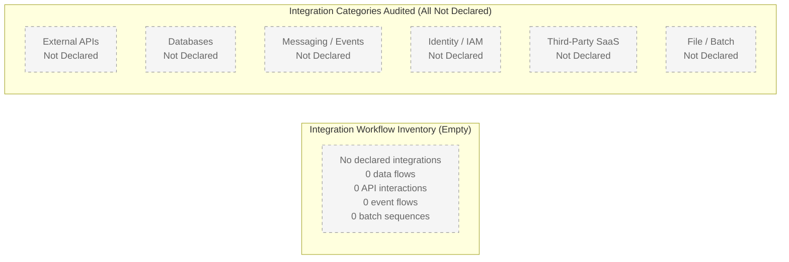

---

## 4.3 FLOWCHART REQUIREMENT COVERAGE

### 4.3.1 Process Element Inventory

This subsection enumerates the conventional process elements that a populated Section 4 would describe for each major workflow. Because zero workflows are declared, every element below is recorded as "Not Declared" with explicit traceability to the prior section that corroborates the absence.

| Required Process Element | Declared in Repository? | Authoritative Cross-Reference |
|--------------------------|-------------------------|-------------------------------|
| Start and End Points | No | Section 2.2.4 (zero features to bookend) |
| Process Steps | No | Section 2.3.5 (zero functional requirements) |
| Decision Diamonds | No | Section 2.3.4 (Business Rules = Not Declared) |
| System Boundaries | No | Section 1.3.1 ("No system components or interfaces exist to bound") |
| User Touchpoints | No | Section 1.1.3 (no personas declared); Section 1.2.2 (no UI surface) |
| Error States | No | Section 1.2.2 (no runtime); Section 2.5.5 (no maintenance model) |
| Recovery Paths | No | Section 2.5.5 (no operational model declared) |
| Timing Constraints | No | Section 1.2.3 (no KPIs / SLAs); Section 2.5.2 (no performance dimensions) |
| Swim Lanes for Actors / Systems | No | Section 1.1.3 (no actors); Section 1.2.2 (no systems) |

### 4.3.2 Validation Rule Coverage

A populated Section 4 would annotate each process step with the business rules, data validation requirements, authorization checkpoints, and regulatory compliance checks applicable to that step. The conventional inputs for such annotations are: declared business rules, declared field-level or message-level schemas, declared authentication/authorization models, and declared regulatory frameworks.

The Section 2.3.4 explicit-content compliance enumeration confirms uniform absence across all four dimensions.

| Validation / Compliance Dimension | Declared in Repository? | Authoritative Cross-Reference |
|-----------------------------------|-------------------------|-------------------------------|
| Business Rules at Each Step | No | Section 2.3.4 (Business Rules = No) |
| Data Validation Requirements | No | Section 2.3.4 (Data Validation = No); Section 1.2.1 (no data domains) |
| Authorization Checkpoints | No | Section 2.5.4 (Authorization Model = No); Section 1.2.1 (no IAM) |
| Regulatory Compliance Checks | No | Section 2.3.4 (Compliance = No); Section 1.1.3 (no compliance stakeholders) |
| Field-Level Schemas | No | Section 3.6 (no databases / schemas declared) |
| Message Contracts | No | Section 1.2.1 (no messaging declared) |
| Identity / Authentication Model | No | Section 2.5.4; Section 3.5.2 |

Because zero validation rules and zero compliance checks are declared, zero rule annotations exist to attach to flowchart steps.

---

## 4.4 TECHNICAL IMPLEMENTATION

### 4.4.1 State Management

A populated Section 4 would describe state transitions, data persistence points, caching requirements, and transaction boundaries for each stateful component. The conventional inputs for such descriptions are: at least one declared state machine, at least one declared datastore, at least one declared caching tier, and at least one declared transactional resource.

Section 1.3.2 explicitly records "Data Persistence and Retrieval" as Out-of-Scope at the current repository state because "no data stores, schemas, or persistence layers exist." Section 3.6 records every database, storage, and caching dimension as "Not Declared."

| State-Management Dimension | Declared in Repository? | Authoritative Cross-Reference |
|----------------------------|-------------------------|-------------------------------|
| State Transitions | No | Section 1.2.2 (no executable capability); Section 1.3.2 |
| Data Persistence Points | No | Section 1.3.2; Section 3.6 |
| Caching Requirements | No | Section 3.6.2 |
| Transaction Boundaries | No | Section 3.6 (no datastores) |
| State Machines / Workflow Engines | No | Section 1.2.2 (no runtime); Section 3.3 (no frameworks) |
| Idempotency Keys / Correlation IDs | No | Section 1.2.1 (no messaging) |

Because zero state machines, zero persistence layers, zero caches, and zero transactional resources are declared, zero state transitions, zero persistence points, zero caching boundaries, and zero transaction boundaries exist to document.

### 4.4.2 Error Handling

A populated Section 4 would describe retry mechanisms, fallback processes, error notification flows, and recovery procedures for each fault-tolerant component. The conventional inputs for such descriptions are: at least one declared runtime, at least one declared failure mode, at least one declared notification channel, and at least one declared recovery procedure.

Section 1.2.2 confirms that the repository "exposes no executable capabilities." Section 2.5.5 confirms zero declared maintenance requirements. Section 3.5.3 confirms zero declared monitoring tools.

| Error-Handling Dimension | Declared in Repository? | Authoritative Cross-Reference |
|--------------------------|-------------------------|-------------------------------|
| Retry Mechanisms | No | Section 2.5.5 (no maintenance dimensions) |
| Fallback / Circuit-Breaker Processes | No | Section 1.2.2 (no runtime) |
| Error Notification Flows | No | Section 3.5.3 (no monitoring tools) |
| Recovery Procedures | No | Section 2.5.5 (no operational model) |
| Dead-Letter Handling | No | Section 1.2.1 (no messaging) |
| Compensation / Saga Flows | No | Section 1.2.2 (no transactional services) |
| Failure Mode Catalog | No | Section 1.2.2 (no runtime); Section 2.5.5 |

Because no runtime exists, no errors can occur, and consequently zero retry mechanisms, zero fallback processes, zero notification flows, and zero recovery procedures exist to flowchart.

#### 4.4.2.1 Empty-State Error Handling Visualization

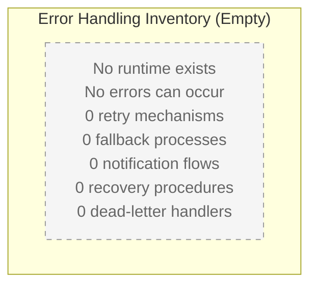

---

## 4.5 REQUIRED DIAGRAMS

The Section 4 prompt requires five categories of Mermaid diagrams: a high-level system workflow, detailed process flows for each core feature, error-handling flowcharts, integration sequence diagrams, and state transition diagrams. Because zero declared processes, features, integrations, errors, or state machines exist, each diagram is rendered in its empty-state form following the convention established by Sections 2.4.1 and 3.9. The single exception is the high-level system workflow, where the implicit Reader → Hosting Platform → `README.md` rendering flow described in Sections 1.2.2 and 3.8.2 is the one observable de facto interaction in the repository and is therefore rendered with the styling reserved for actual artifacts and implicit relationships.

### 4.5.1 High-Level System Workflow Diagram

The only observable de facto workflow in the Artifact9 repository is the implicit Markdown-rendering interaction described in Section 1.2.2 ("the repository root, when rendered by code hosting platforms or documentation tooling, surfaces `README.md` as the default project landing artifact") and elaborated in Section 3.8.2 ("the specific renderer is *implicit* and is **not** declared in the repository"). This workflow has no declared decision points beyond the implicit "is README.md present at root?" lookup behavior of the rendering platform; no declared error states; no declared timing budget; and no declared SLA.

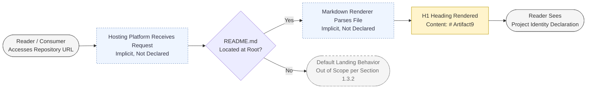

**Annotations applicable to this workflow:**

| Annotation Dimension | Value at Current Repository State |
|----------------------|-----------------------------------|
| Declared SLA / Timing Budget | None (Section 1.2.3) |
| Declared Business Rule at Decision Point | None (the lookup is implicit hosting-platform behavior, not a declared rule) |
| Declared Validation Rule | None (Section 2.3.4) |
| Declared Authorization Checkpoint | None (Section 2.5.4) |
| Declared Error State at "No" Branch | None (out-of-scope per Section 1.3.2) |
| Declared Recovery Path | None (Section 2.5.5) |
| Declared User Persona | None (the "Reader / Consumer" is a generic placeholder, not a declared persona per Section 1.1.3) |

### 4.5.2 Detailed Process Flows for Each Core Feature

A populated Section 4 would include one detailed process-flow diagram per declared feature. Because Section 2.2.4 records that the Functional Feature Inventory is empty, zero feature-level process flows can be authored. The empty-state diagram below records this condition.

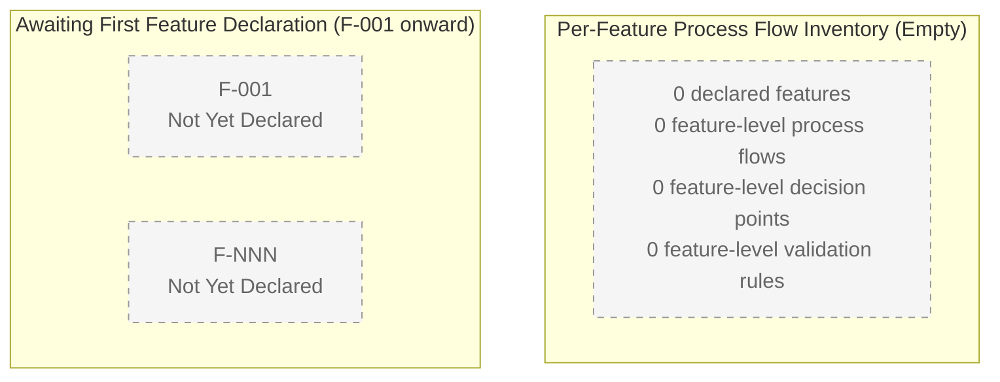

### 4.5.3 Error Handling Flowchart

A populated Section 4 would include one error-handling flowchart per declared runtime component. Because Section 1.2.2 records that the repository "exposes no executable capabilities," no runtime component exists to fail and consequently no error-handling flowchart can be authored. The empty-state diagram below records this condition.

```mermaid
flowchart LR
    StartError([Error-Handling Flowchart<br/>Empty Scaffold])
    NoErrors[No Runtime Declared<br/>No Errors Possible]
    NoRetry[No Retry Mechanism<br/>Not Declared]
    NoFallback[No Fallback Process<br/>Not Declared]
    NoNotify[No Notification Flow<br/>Not Declared]
    NoRecover[No Recovery Procedure<br/>Not Declared]
    EndError([Empty Scaffold End])

    StartError --> NoErrors
    NoErrors --> NoRetry
    NoRetry --> NoFallback
    NoFallback --> NoNotify
    NoNotify --> NoRecover
    NoRecover --> EndError

    classDef empty fill:#f5f5f5,stroke:#999,color:#666,stroke-dasharray: 5 5
    classDef endpoint fill:#f5f5f5,stroke:#666,color:#333
    class NoErrors,NoRetry,NoFallback,NoNotify,NoRecover empty
    class StartError,EndError endpoint
```

### 4.5.4 Integration Sequence Diagram

A populated Section 4 would include one sequence diagram per declared integration endpoint. Because Section 1.2.1 and Section 2.4.2 independently confirm zero declared integrations across all six conventional categories, the only sequence interaction observable in the repository is the implicit Reader → Hosting Platform → `README.md` rendering exchange. This is rendered below for completeness and is the same flow visualized in Section 4.5.1 above, expressed in `sequenceDiagram` form.

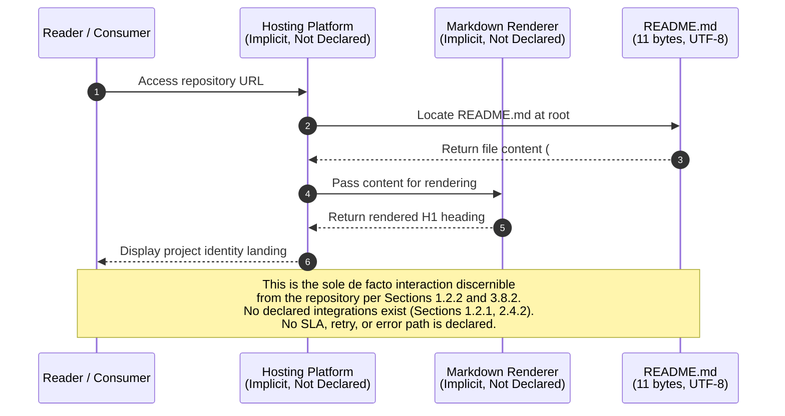

### 4.5.5 State Transition Diagram

A populated Section 4 would include one state-transition diagram per declared stateful component. Because Section 1.3.2 records that data persistence is out-of-scope at the current repository state, Section 3.6 records every storage dimension as "Not Declared," and Section 1.2.2 confirms the absence of any executable capability, no stateful runtime component exists to model. The empty-state diagram below records this condition by showing the single static "ReadmeCommitted" condition (the existence of `README.md` at the repository root) and the absence of any further transitions.

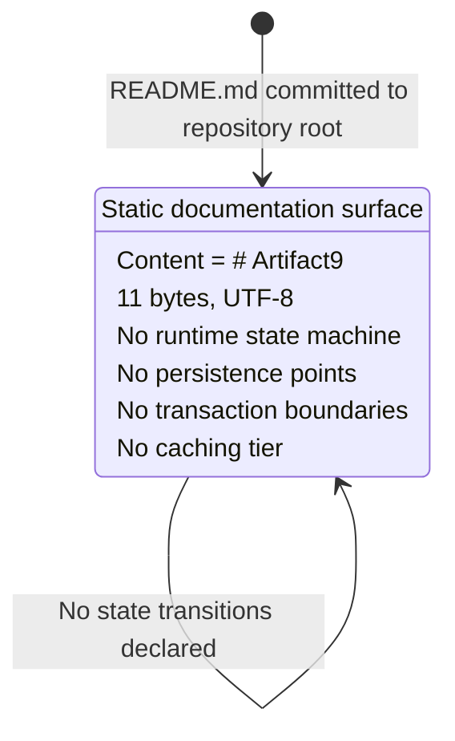

### 4.5.6 Swim-Lane Diagram Applicability

The Section 4 prompt requests swim lanes "for different actors/systems." Section 1.1.3 records no user roles, personas, sponsors, or operations owners. Section 1.2.2 records no system components beyond the single documentation file. Consequently, no actors and no systems exist to occupy swim lanes, and no swim-lane diagram can be authored in this revision. This condition will resolve once declarations meeting the Section 4.7.2 revision triggers are introduced into the repository.

---

## 4.6 TRACEABILITY AND CROSS-REFERENCE MAP

### 4.6.1 Section 4 Topic to Authoritative Source Map

Every assertion in Section 4 is traceable to either `README.md` or to a prior Section 1, Section 2, or Section 3 subsection, in accordance with the evidence-grounding standard inherited from constraints C-2.3 and C-3.5 and extended below as C-4.4.

| Section 4 Topic | Authoritative Cross-Reference |
|-----------------|-------------------------------|
| Inheritance of evidence-grounding standard | Section 1.1.2; Section 2.1.1; Section 3.1; C-2.3; C-3.5 |
| Repository state (1 file, 0 subfolders) | Section 1.3.3; Section 2.1.2; Section 3.8.1 |
| No business processes | Section 1.1.2; Section 1.2.2; Section 2.2.4 |
| No user journeys / personas | Section 1.1.3; Section 1.2.3 |
| No system interactions | Section 1.2.2 |
| No integrations (six categories) | Section 1.2.1; Section 2.4.2; Section 3.5 |
| No state / data persistence | Section 1.3.2; Section 3.6 |
| No caching / transaction boundaries | Section 3.6.2 |
| No timing / SLA / KPI | Section 1.2.3; Section 2.5.2 |
| No security / authorization | Section 2.5.4; Section 3.5.2 |
| No error / monitoring | Section 2.5.5; Section 3.5.3 |
| No CI/CD / deployment workflows | Section 1.2.2; Section 3.7.4 |
| No business rules / validation / compliance | Section 2.3.4 |
| Empty-state visualization convention | Section 1.2.2 (diagram); Section 2.4.1 (diagram); Section 3.9.2 (diagram) |
| Implicit README rendering flow (de facto) | Section 1.2.2; Section 3.8.2 |
| Two Observable Artifacts (A, B) | Section 1.3.1; Section 2.2.3 |

### 4.6.2 Section 4 Process-Element to Repository-Evidence Map

| Section 4 Process Element | Repository Evidence | Section Reference |
|---------------------------|---------------------|-------------------|
| Sole observable workflow (Reader → Hosting → Renderer → README) | `README.md` H1 heading rendered by an implicit hosting platform | Section 1.2.2; Section 3.8.2 |
| Decision diamond ("README.md located at root?") | Implicit hosting-platform lookup behavior; not a declared business rule | Section 1.2.2; Section 3.8.2 |
| Single static state ("ReadmeCommitted") | Existence of `README.md` at repository root, 11 bytes UTF-8 | Section 1.3.3; Section 3.8.1 |
| Project Identity Declaration (Artifact A) | `README.md` H1 heading content `# Artifact9` | Section 1.3.1; Section 2.2.3 |
| Root-Level README Surface (Artifact B) | `README.md` presence at repository root | Section 1.3.1; Section 2.2.3 |

---

## 4.7 SPECIFICATION CONSTRAINTS AND REVISION TRIGGERS

### 4.7.1 Section 4 Constraints

The following constraints govern Section 4 and extend the constraint series introduced by Section 2.7.2 (C-2.x) and Section 3.10.1 (C-3.x).

| ID | Constraint | Rationale |
|----|------------|-----------|
| C-4.1 | No specific business process, end-to-end user journey, system interaction, decision diamond, validation rule, authorization checkpoint, state machine, transaction boundary, retry mechanism, fallback process, error notification flow, or recovery procedure may be declared in this revision of Section 4. | The repository contains no source code, runtime, integration, or rule declaration referencing any such element. Declaration would constitute fabrication and would violate C-2.3 and C-3.5. |
| C-4.2 | No SLA, timing budget, performance metric, error budget, or KPI may be assigned to any process step in this revision. | Section 1.2.3 records that no KPIs, SLOs, SLAs, or error budgets have been defined; assignment would constitute fabrication. |
| C-4.3 | No swim lanes for actors or systems may be drawn in this revision. | Section 1.1.3 records zero declared user roles/personas; Section 1.2.2 records zero declared system components beyond `README.md`. No actors or systems exist to occupy lanes. |
| C-4.4 | All Section 4 content must remain traceable to either `README.md` or to a prior Section 1, Section 2, or Section 3 subsection. | Specification-wide evidence-grounding standard inherited from C-2.3 and C-3.5. |
| C-4.5 | All diagrams produced in this revision must apply the established empty-state visualization convention: dashed gray borders for "Not Declared" dimensions, solid light-yellow borders for the single observable artifact (`README.md`), and dashed light-blue borders for the implicit (not declared) renderer relationship. | Convention established by Section 2.4.1 (Feature Dependency Map) and Section 3.9.1 (Empty-State Visualization Convention). Adherence ensures cross-section visual consistency. |
| C-4.6 | The implicit Reader → Hosting Platform → `README.md` rendering flow may be rendered as the high-level system workflow and as the integration sequence diagram, but may not be characterized as a declared business process or declared integration. | Section 3.8.2 explicitly limits this observation to an implicit hosting-platform behavior and not a declared technology choice. Constraint C-3.4 establishes the same scoping for the Markdown documentation surface. |

### 4.7.2 Section 4 Revision Triggers

The following events should trigger a revision of this Section 4, following the precedent pattern of Section 2.7.3 and Section 3.10.2.

| Trigger | Expected Section 4 Revision |
|---------|------------------------------|
| First declaration of a user-facing feature or use case in the repository | Populate Section 4.2.1 (Core Business Processes) and Section 4.5.2 (Detailed Process Flows) with end-to-end user journey diagrams |
| Introduction of source files defining executable behavior | Populate Section 4.2.1 process-step inventory and Section 4.5.1 high-level system workflow with declared steps |
| Declaration of integration endpoints (API client, webhook, queue consumer, batch interface) | Populate Section 4.2.2 (Integration Workflows) and Section 4.5.4 (Integration Sequence Diagram) |
| Declaration of a database, datastore, or state machine | Populate Section 4.4.1 (State Management) and Section 4.5.5 (State Transition Diagram) |
| Declaration of error-handling, retry, or circuit-breaker logic | Populate Section 4.4.2 (Error Handling) and Section 4.5.3 (Error Handling Flowchart) |
| Declaration of business rules, data validation, or regulatory compliance checks | Populate Section 4.3.2 (Validation Rule Coverage) and annotate Section 4.5.1 / 4.5.2 decision diamonds with rule references |
| Declaration of SLAs, KPIs, timing budgets, or error budgets | Populate Section 4.3.1 timing/SLA row and annotate diagrams with timing constraints (lifting C-4.2) |
| Declaration of user roles, personas, or system components | Populate Section 4.5.6 (Swim-Lane Diagram) and lift C-4.3 |
| Declaration of authentication / authorization model | Populate Section 4.3.2 (Authorization Checkpoints) row and annotate diagrams with authorization gates |
| Declaration of caching tier or transactional resource | Populate Section 4.4.1 caching and transaction boundary rows |
| Declaration of monitoring, observability, or notification channels | Populate Section 4.4.2 notification flow row |

### 4.7.3 Version Tracking

| Specification Version | Section 4 State | Trigger for Next Revision |
|-----------------------|-----------------|---------------------------|
| v0 (current) | Baseline scaffold; zero processes, workflows, decisions, states, errors, integrations, or timing constraints declared; only the implicit Reader → README rendering flow is visualized | First introduction of any source file, integration endpoint, state declaration, business rule, validation rule, runtime component, or SLA / KPI definition in the repository |

---

## 4.8 REFERENCES

### 4.8.1 Repository Files Examined

- `README.md` — The sole file in the Artifact9 repository. Contains exactly one line: `# Artifact9` (an H1 Markdown heading). Authoritative source for the sole de facto observable workflow (the implicit Reader → Hosting Platform → renderer interaction) visualized in Sections 4.5.1 and 4.5.4. Establishes the single static "ReadmeCommitted" condition documented in Section 4.5.5.

### 4.8.2 Repository Folders Examined

- `/` (repository root, depth 0) — Confirmed to contain exactly 1 file (`README.md`) and 0 subfolders. Establishes the absence of source files, configuration manifests, integration definitions, runtime components, state machines, and error-handling artifacts that would otherwise populate Section 4 with declared process content.

### 4.8.3 Cross-Referenced Specification Sections

- **Section 1.1 Executive Summary** — Established the "pre-implementation / initial repository state" framing referenced throughout Section 4.1.
- **Section 1.2 System Overview** — Authoritative source for the empty enterprise-integration audit (Section 1.2.1), the no-executable-capabilities determination (Section 1.2.2), and the absence of KPIs / SLAs / objectives (Section 1.2.3) cited in Sections 4.2.1, 4.2.2, 4.3.1, and 4.7.1.
- **Section 1.3 Scope** — Source of the two Observable Artifacts (A: Project Identity Declaration; B: Root-Level README Surface), the In-Scope / Out-of-Scope tables, and the canonical Repository State Assessment cited in Section 4.1.2.
- **Section 2.1 AUTHORING PREMISE AND METHODOLOGY** — Source of the documentary integrity standard and baseline-scaffold authoring approach inherited into Section 4.1.
- **Section 2.2 FEATURE CATALOG** — Confirms zero declared features that would parent business processes (Section 4.2.1).
- **Section 2.3 FUNCTIONAL REQUIREMENTS** — Confirms zero declared business rules, validation rules, security requirements, and compliance requirements (Sections 4.3.2 and 4.5.1 annotations).
- **Section 2.4 FEATURE RELATIONSHIPS** — Source of the empty-state visualization convention applied to all Section 4 diagrams; confirms zero integration points (Section 4.2.2).
- **Section 2.5 IMPLEMENTATION CONSIDERATIONS** — Confirms zero performance dimensions (Section 4.7.1 C-4.2), zero security implications (Section 4.3.2), and zero maintenance requirements (Section 4.4.2).
- **Section 2.7 ASSUMPTIONS, CONSTRAINTS, AND REVISION TRIGGERS** — Source of the C-2.x constraint pattern, revision-trigger table pattern, and version-tracking pattern extended in Section 4.7.
- **Section 3.1 AUTHORING PREMISE AND EVIDENCE BOUNDARY** — Source of constraint C-3.5 evidence-grounding requirement extended as C-4.4.
- **Section 3.5 THIRD-PARTY SERVICES** — Confirms zero declared third-party services (Section 4.2.2) and zero declared monitoring tools (Section 4.4.2).
- **Section 3.6 DATABASES AND STORAGE** — Confirms zero declared databases, caching tiers, and transactional resources (Section 4.4.1).
- **Section 3.7 DEVELOPMENT AND DEPLOYMENT** — Confirms zero declared CI/CD or deployment workflows (Section 4.6.1).
- **Section 3.8 OBSERVABLE DE FACTO TECHNICAL CHARACTERISTICS** — Source of the implicit hosting-platform-renderer observation rendered as the sole de facto workflow in Sections 4.5.1 and 4.5.4.
- **Section 3.9 CURRENT-STATE TECHNOLOGY STACK DIAGRAM** — Source of the empty-state visualization convention (dashed gray for "Not Declared," solid light-yellow for `README.md`, dashed light-blue for implicit renderer) applied uniformly across Section 4 diagrams.
- **Section 3.10 SPECIFICATION CONSTRAINTS AND REVISION TRIGGERS** — Source of the C-3.x constraint pattern and revision-trigger pattern extended in Section 4.7.

# 5. System Architecture

## 5.1 AUTHORING PREMISE AND ARCHITECTURE DECLARATION BOUNDARY

### 5.1.1 Inheritance of the Evidence-Grounding Standard

This section is authored under the same documentary integrity standard established by Section 1.1.2, Section 2.1, Section 3.1, and Section 4.1, and codified by constraints **C-2.3**, **C-3.5**, and **C-4.4**. Each of those constraints requires that all specification content be traceable to either `README.md` or to a prior specification subsection. Section 1.2.2 (Major System Components) records the authoritative determination that "the repository structure consists of a single root-level documentation file. No modules, packages, services, layers, or runtime components are defined." Section 1.3.3 (Repository State Assessment) further confirms that the repository contains exactly one file (`README.md`), zero subfolders, zero lines of source code, and zero configuration or manifest files.

Consequently, this System Architecture section does **not** declare an architectural style, a component topology, an integration mesh, a deployment topology, an authentication framework, an authorization framework, a data flow graph, a caching tier, an error-handling pattern, a disaster-recovery procedure, or a monitoring stack. Authoring any such declaration in the absence of repository evidence would constitute fabrication. Instead, this section establishes a baseline scaffold that:

- Records each architectural dimension prescribed by the section prompt
- Documents the current "Not Declared" status of each dimension against the repository
- Cross-references the authoritative Section 1, 2, 3, and 4 subsections that confirm each absence
- Notes the single de facto interaction observable in the repository (the implicit Reader → Hosting Platform → `README.md` rendering flow)
- Specifies the revision triggers that will require this section to be repopulated as the repository advances

### 5.1.2 Implications for Default Architectural Patterns

Constraint **C-3.2** in Section 3.10.1 prohibits the adoption of the prompt's Default Technology Stack as a declared stack. By symmetric reasoning, this Section 5 does not adopt any default architectural style (monolith, microservices, serverless, event-driven, hexagonal, layered, n-tier, CQRS, event sourcing, or other), default communication pattern (REST, GraphQL, gRPC, publish/subscribe, request/reply, batch, file-transfer, or other), default persistence pattern (relational, document, key-value, graph, search, vector, time-series, or other), default security pattern (OAuth 2.0, OIDC, SAML, mTLS, JWT bearer, API key, or other), or default operability pattern (centralized logging, distributed tracing, RED/USE metrics, alerting, or other). Adopting any such default would:

1. Violate the inherited evidence-grounding standard (**C-2.3**, **C-3.5**, **C-4.4**)
2. Contradict the authoritative absence declarations of Sections 1.2.1, 1.2.2, 1.3.2, 2.5, 3.5, 3.6, 3.7, and 4.4
3. Introduce architectural commitments into the specification that have not been authorized by any artifact in the repository

This section therefore acknowledges these architectural and operability patterns as a reference candidate set for future declaration decisions but does not adopt any of them. The actual system architecture will be populated by future revisions of this section in response to the revision triggers documented in Section 5.6.2.

### 5.1.3 Section Organization

The remainder of Section 5 follows the structure prescribed by the section prompt:

| Subsection | Topic | Authoritative Cross-Reference |
|------------|-------|-------------------------------|
| 5.2 | High-Level Architecture | Section 1.2; Section 2.4; Section 3.5 |
| 5.3 | Component Details | Section 1.2.2; Section 2.2; Section 3.3 |
| 5.4 | Technical Decisions | Section 3.1.2; Section 3.10 |
| 5.5 | Cross-Cutting Concerns | Section 2.5; Section 3.5; Section 4.4 |
| 5.6 | Specification Constraints and Revision Triggers | Section 2.7.2; Section 3.10.1; Section 4.7 |

---

## 5.2 HIGH-LEVEL ARCHITECTURE

### 5.2.1 System Overview

#### Overall Architecture Style and Rationale

The Artifact9 repository does not declare an architectural style. Section 1.2.2 (Core Technical Approach) records each architectural dimension as undeclared, with explicit evidence statements.

| Architectural Dimension | Declared? | Authoritative Source |
|-------------------------|-----------|----------------------|
| Architectural Style | No | Section 1.2.2 |
| Primary Technology Stack | No | Section 1.2.2; Section 3.2; Section 3.3 |
| Runtime / Execution Model | No | Section 1.2.2 |
| Deployment Target / Infrastructure | No | Section 1.2.2; Section 3.5.4; Section 3.7 |

Because no architectural style has been chosen, no rationale can be attached to such a choice. A populated Section 5 would, at minimum, identify whether the system is a monolith, a set of microservices, a serverless composition, an event-driven mesh, a batch pipeline, or another style, and would justify that selection against business and non-functional requirements. Both inputs—the style and the justifying requirements—are absent in the current repository state. Section 1.2.3 confirms that no KPIs, SLOs, SLAs, error budgets, or operational thresholds are defined, eliminating the conventional non-functional inputs that would inform an architectural style decision.

#### Key Architectural Principles and Patterns

No architectural principles (such as separation of concerns, dependency inversion, immutability, idempotency, eventual consistency, single responsibility, or open/closed) and no architectural patterns (such as ports-and-adapters, layered architecture, CQRS, event sourcing, repository pattern, saga, or circuit breaker) have been declared. Section 3.3 records zero declared frameworks or libraries, which means no pattern is even implicitly carried in by a framework selection. Section 4.4 records every state-management dimension and every error-handling dimension as "Not Declared"—both dimensions that would conventionally manifest a pattern selection.

#### System Boundaries and Major Interfaces

Section 1.3.1 records the "System Boundaries" dimension as undeclared because "no system components or interfaces exist to bound." Section 1.2.2 records that the repository "exposes no executable capabilities. There are no application entry points, command-line interfaces, HTTP endpoints, message handlers, scheduled tasks, user interfaces, or library exports defined." The single de facto interface observable in the repository is the Markdown documentation surface of `README.md`, which is rendered implicitly by an undeclared hosting platform. Per constraint **C-3.4** of Section 3.10.1, this is scoped exclusively as a documentation surface and may **not** be characterized as a system interface, an API, or a service boundary.

### 5.2.2 Core Components Inventory

The core-components table prescribed by the section prompt is rendered below in its empty-state form. Because Section 1.2.2 records zero declared modules, packages, services, layers, or runtime components, and Section 2.2.4 records that the Functional Feature Inventory is empty, no entries can be authored at this revision.

| Component Name | Primary Responsibility | Key Dependencies | Integration Points |
|----------------|------------------------|------------------|---------------------|
| Not Declared | Not Declared | Not Declared | Not Declared |

A populated row in this table would, at minimum, name a declared runtime component, describe its single responsibility, enumerate its upstream and downstream dependencies, and identify the integration boundaries through which it interacts with other components. None of these four columns can be populated in the current repository state.

### 5.2.3 Data Flow Description

#### Primary Data Flows Between Components

Section 4.2.2 (Integration Workflows) records zero declared data flows. Because Section 1.2.2 confirms zero runtime components, there are no source or sink endpoints across which data could flow. The only de facto data movement observable in the repository is the single-direction transmission of the contents of `README.md` from the repository root to a Markdown renderer (see Section 4.5.4); this is a documentation-rendering operation rather than an application-level data flow.

#### Integration Patterns and Protocols

Section 1.2.1 (Integration with Existing Enterprise Landscape) records the authoritative integration audit—every category recorded as "No": External APIs / Web Services, Databases / Persistent Stores, Messaging / Event Streams, Identity / Access Management Providers, Third-Party SaaS Connections, and File / Batch Interfaces. Section 3.5 reconfirms this absence. Consequently, no integration pattern (synchronous request/response, publish/subscribe, request/reply, fire-and-forget, batch, file-transfer, streaming) and no transport protocol (HTTPS, gRPC, AMQP, Kafka protocol, SMTP, SFTP) is in use.

#### Data Transformation Points

A data transformation point requires at least one source schema, at least one target schema, and at least one transformation rule. Section 1.3.1 (Implementation Boundaries) records "Data Domains Included | No | No data models, schemas, or domains are referenced." Section 4.3 records zero declared validation rules. No transformation points can be enumerated.

#### Key Data Stores and Caches

Section 3.6.1 records every datastore-role dimension as "Not Declared," including Primary OLTP, Read Replica / Secondary, Analytical / OLAP, Document / NoSQL, Search / Indexing, Vector / Embeddings, and Time-Series. Section 3.6.2 records the caching tier as "Not Declared." Section 3.6.3 records every storage-service dimension as "No," including Object / Blob Storage, File / Network Storage, Backup and Restore Strategy, Data Retention Policy, Encryption at Rest, and Encryption in Transit.

### 5.2.4 External Integration Points

The external-integrations table prescribed by the section prompt is rendered below in its empty-state form. Each row enumerates one conventional integration category that was specifically audited and confirmed undeclared in Section 1.2.1 and reconfirmed in Section 3.5.

| System Name | Integration Type | Protocol / Format | SLA Requirements |
|-------------|------------------|-------------------|------------------|
| Not Declared | External API / Web Service | Not Declared | Not Declared |
| Not Declared | Database / Persistent Store | Not Declared | Not Declared |
| Not Declared | Messaging / Event Stream | Not Declared | Not Declared |
| Not Declared | Identity / Access Management Provider | Not Declared | Not Declared |
| Not Declared | Third-Party SaaS Connection | Not Declared | Not Declared |
| Not Declared | File / Batch Interface | Not Declared | Not Declared |

A populated row in this table would, at minimum, name a system, describe the integration type (synchronous request/response, asynchronous event, batch transfer, file exchange), declare the protocol and payload format (e.g., HTTPS+JSON, gRPC+Protobuf, AMQP+Avro, SFTP+CSV), and attach the SLA requirements (availability, latency, throughput, error budget). None of these dimensions can be populated for any integration at the current repository state. Per **C-5.4** (Section 5.6.1), no SLA may be assigned to any integration in this revision.

---

## 5.3 COMPONENT DETAILS

### 5.3.1 Per-Component Documentation Dimensions

A populated Section 5.3 would document, for each declared major component, its purpose and responsibilities, the technologies and frameworks it employs, its key interfaces and APIs, its data persistence requirements, and its scaling considerations. Because Section 1.2.2 records zero declared components, the per-component table cannot be populated. The dimension audit below records the current "Not Declared" status of each per-component documentation aspect.

| Documentation Dimension | Status in Current Revision | Authoritative Source |
|-------------------------|----------------------------|----------------------|
| Component Purposes and Responsibilities | Not Declared | Section 1.2.2; Section 2.2.4 |
| Technologies and Frameworks per Component | Not Declared | Section 3.2; Section 3.3 |
| Key Interfaces and APIs per Component | Not Declared | Section 1.2.2; Section 1.3.2 |
| Data Persistence Requirements per Component | Not Declared | Section 1.3.2; Section 3.6 |
| Scaling Considerations per Component | Not Declared | Section 2.5.3 |

### 5.3.2 Component Interaction Diagram

The component-interaction diagram prescribed by the section prompt is rendered below in its empty-state form, applying the visualization convention established by Section 2.4.1 and reinforced by Sections 3.9.1 and 4.5: dashed gray borders for "Not Declared" dimensions, solid light-yellow borders for the single observable artifact (`README.md`), and dashed light-blue borders for the implicit (not declared) renderer relationship.

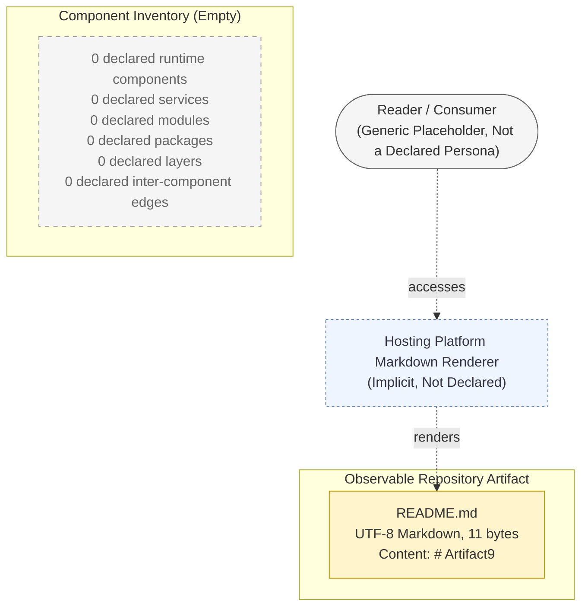

### 5.3.3 State Transition Diagram

Section 4.4.1 records every state-management dimension as "Not Declared" (State Transitions, Data Persistence Points, Caching Requirements, Transaction Boundaries, State Machines / Workflow Engines, Idempotency Keys / Correlation IDs). The empty-state diagram below confirms that the single observable repository condition—the static existence of `README.md` at the repository root—does not constitute a runtime state machine and exhibits no transitions.

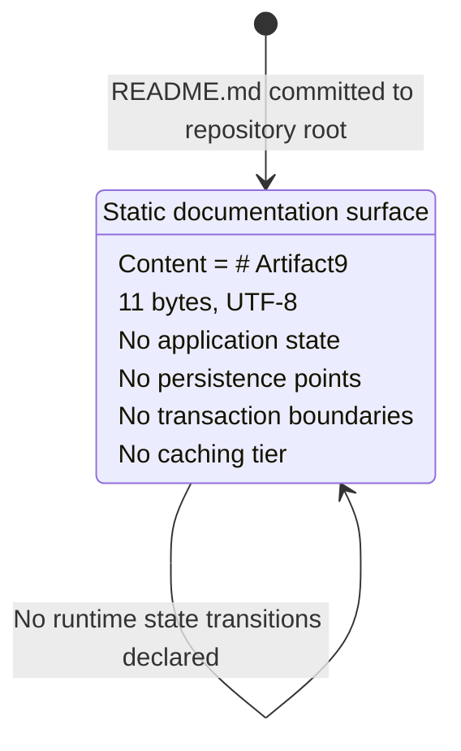

### 5.3.4 Sequence Diagram for the Sole Observable Interaction

Per constraint **C-4.6** in Section 4.7.1, the implicit Reader → Hosting Platform → `README.md` rendering flow may be rendered as the sole observable sequence interaction but may **not** be characterized as a declared business process or declared integration. The diagram below is presented in the architectural context to clarify that no application-level sequence interactions exist in the repository.

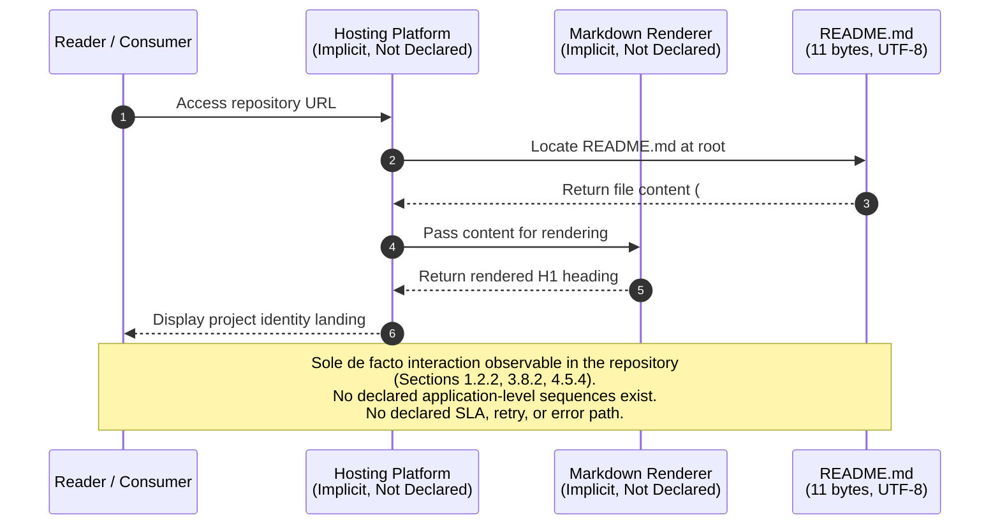

---

## 5.4 TECHNICAL DECISIONS

Each architectural decision conventionally captured in this subsection requires (a) a documented decision, (b) a documented rationale, and (c) documented tradeoffs. Because no decisions of these kinds have been recorded in the Artifact9 repository, this subsection enumerates the dimensions that would conventionally be addressed and records the current "Not Declared" status of each, with cross-references to the authoritative absence declarations.

### 5.4.1 Decision Dimensions Audit

| Decision Dimension | Decision Recorded? | Authoritative Cross-Reference |
|--------------------|--------------------|-------------------------------|
| Architecture Style (monolith, microservices, serverless, etc.) | No | Section 1.2.2 |
| Communication Pattern (REST, gRPC, messaging, batch, etc.) | No | Section 1.2.1 |
| Data Storage Solution (relational, document, key-value, etc.) | No | Section 3.6 |
| Caching Strategy (in-process, distributed, CDN edge, etc.) | No | Section 3.6.2 |
| Security Mechanism (OAuth, OIDC, SAML, mTLS, etc.) | No | Section 2.5.4; Section 3.5.2 |
| Default Technology Stack Adoption | No (explicitly forbidden by C-3.2) | Section 3.1.2 |
| Default Architectural Pattern Adoption | No (explicitly forbidden by C-5.2) | Section 5.1.2 |

### 5.4.2 Architecture Style Decision and Tradeoffs

No architecture style has been declared. Section 1.2.2 records the architectural-style dimension as undeclared. The tradeoff matrix below enumerates the candidate styles that future revisions of this specification will evaluate. None is currently adopted, and per **C-5.2** none may be adopted in this revision by default reasoning.

| Candidate Style | Adopted in This Revision? | Required Future Declaration |
|-----------------|---------------------------|------------------------------|
| Monolithic | No | Single deployable unit; unified runtime |
| Microservices | No | Service boundary catalog; service contracts |
| Serverless / FaaS | No | Function manifest; trigger definitions |
| Event-Driven | No | Event catalog; messaging infrastructure |
| Layered / N-Tier | No | Layer boundaries; cross-layer contracts |
| Hexagonal / Ports-and-Adapters | No | Port definitions; adapter implementations |
| Batch Pipeline | No | Pipeline orchestration; batch step catalog |

### 5.4.3 Communication Pattern Decision

No inter-component communication pattern has been declared. Section 1.2.1 records zero declared external integrations across all six categories. Section 1.2.2 records zero declared HTTP endpoints, message handlers, or scheduled tasks. Section 4.2.2 records zero integration workflows. Consequently, no synchronous-versus-asynchronous decision, no request/response-versus-publish/subscribe decision, no protocol selection (HTTPS, gRPC, AMQP, Kafka, MQTT), and no payload-format selection (JSON, Protobuf, Avro, XML) has been taken.

### 5.4.4 Data Storage Solution Decision

No data storage solution has been declared. Section 3.6.1 records every datastore-role dimension as "Not Declared." Section 1.3.1 records "Data Domains Included | No | No data models, schemas, or domains are referenced," meaning that even the data shape that would inform a storage decision has not been defined. No CAP-tradeoff position (consistency vs. availability under partition), no ACID-vs-BASE selection, and no normalization-vs-denormalization stance has been taken.

### 5.4.5 Caching Strategy Decision

No caching strategy has been declared. Section 3.6.2 records the caching tier as "Not Declared." Because Section 1.2.2 confirms zero application runtimes, the operational surface on which a cache would sit has not been defined. No cache placement (client, edge/CDN, gateway, application, database), no eviction policy (LRU, LFU, TTL, write-through, write-behind), and no cache-coherency strategy has been chosen.

### 5.4.6 Security Mechanism Decision

No security mechanism has been declared. Section 2.5.4 records every security dimension as "No" (Authentication Mechanism, Authorization Model, Data Encryption at Rest / in Transit, Auditing and Logging Controls). Section 3.5.2 records no authentication service. Section 1.2.1 records "Identity / Access Management Providers | No." No authentication protocol selection (OAuth 2.0, OIDC, SAML, mTLS, API key, basic auth, JWT bearer), no authorization-model selection (RBAC, ABAC, ReBAC, ACL), and no transport-security selection (TLS version, cipher suites, certificate authority) has been taken.

### 5.4.7 Architecture Decision Records (ADRs)

A populated Section 5.4 would catalog Architecture Decision Records, conventionally stored in a dedicated `docs/adr/` directory or equivalent location and following formats such as the Nygard ADR template (Context, Decision, Status, Consequences) or the MADR (Markdown Any Decision Records) format. The Artifact9 repository contains no such directory, no ADR files, and no decision-log artifacts of any kind. Per **C-5.5** (Section 5.6.1), no ADRs may be authored in this revision because authoring one would fabricate a decision history that does not exist. The empty-state ADR scaffold below records this condition.

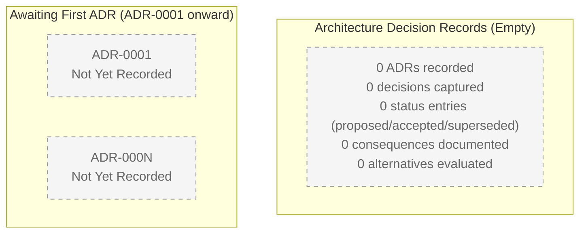

### 5.4.8 Architecture Decision Tree

A populated Section 5.4 would include a decision-tree diagram visualizing the architectural choices, their preconditions, and their downstream consequences. Because zero choices have been recorded, the decision tree is presented below in its empty-state form. The single branching condition—"Repository has any declared architectural input?"—resolves to "No" against the current repository state, halting the tree at its first node.

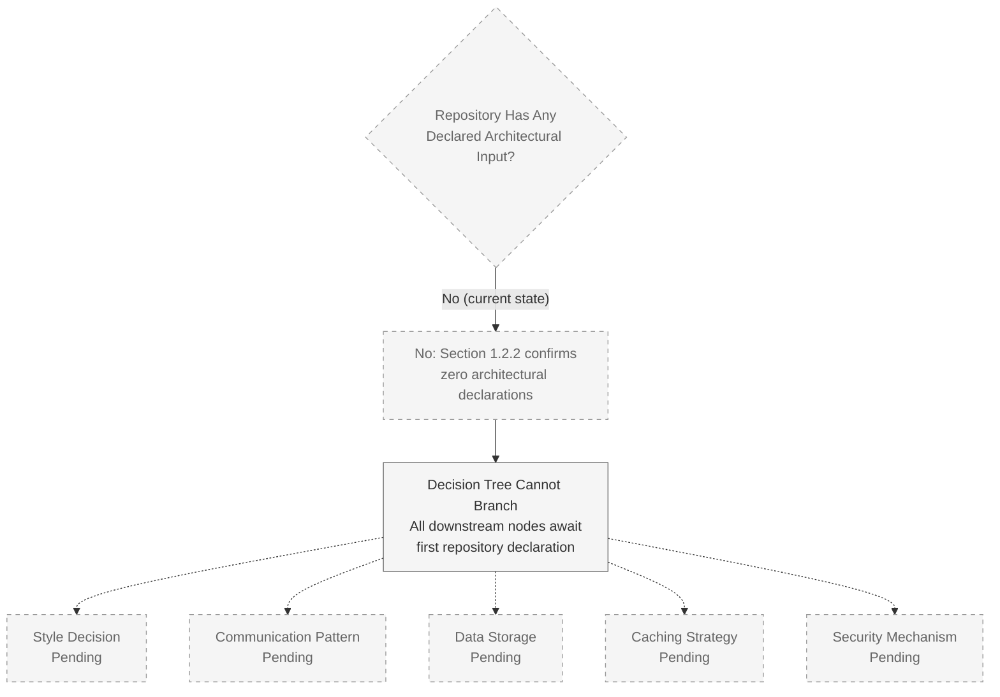

---

## 5.5 CROSS-CUTTING CONCERNS

Cross-cutting concerns conventionally span every component of a system and require explicit policy declarations. Because Section 1.2.2 confirms zero declared runtime components, the surfaces on which cross-cutting policies operate have not been defined. The audit table below enumerates each cross-cutting dimension prescribed by the section prompt and records its current "Not Declared" status with authoritative cross-references.

### 5.5.1 Cross-Cutting Concerns Audit

| Cross-Cutting Concern | Declared? | Authoritative Cross-Reference |
|-----------------------|-----------|-------------------------------|
| Monitoring and Observability | No | Section 3.5.3; Section 2.5.5 |
| Logging and Tracing | No | Section 2.5.4; Section 3.3 |
| Error Handling Patterns | No | Section 4.4.2 |
| Authentication Framework | No | Section 2.5.4; Section 3.5.2; Section 1.2.1 |
| Authorization Framework | No | Section 2.5.4; Section 4.3 |
| Performance Requirements and SLAs | No | Section 1.2.3; Section 2.5.2; C-4.2 |
| Disaster Recovery Procedures | No | Section 2.5.5; Section 3.6.3 |
| Encryption (At Rest / In Transit) | No | Section 2.5.4; Section 3.6.3 |

### 5.5.2 Monitoring and Observability Approach

Section 3.5.3 (Monitoring Tools) records that "no monitoring, observability, alerting, log-aggregation, or application-performance-management tools have been declared." Section 2.5.5 records "Monitoring / Observability Requirements | No." No telemetry collectors, no log shippers, no metrics endpoints, no traces, no dashboards, and no alert rules have been declared. The conventional dimensions of an observability strategy—metrics (RED / USE), logs (structured / unstructured), traces (distributed / sampling), events (audit / business), and alerts (thresholds / anomaly detection)—are uniformly absent.

### 5.5.3 Logging and Tracing Strategy

No logging or tracing strategy has been declared. Section 2.5.4 records "Auditing and Logging Controls | No." Section 3.3 records zero declared frameworks or libraries, meaning no logging library (such as SLF4J, Logback, Log4j, Winston, Pino, Bunyan, structlog, or zap) and no tracing library (such as OpenTelemetry, Jaeger client, Zipkin Brave, or Datadog tracer) has been introduced. No log format, no log destination, no retention policy, no trace-context propagation header convention, no sampling rate, no correlation-ID convention, and no log-redaction policy is defined.

### 5.5.4 Error Handling Patterns

Section 4.4.2 records every error-handling dimension as "Not Declared" (Retry Mechanisms, Fallback / Circuit-Breaker Processes, Error Notification Flows, Recovery Procedures, Dead-Letter Handling, Compensation / Saga Flows, Failure Mode Catalog). The architectural restatement of this absence is rendered below as an empty-state error-handling flow, following the pattern of Section 4.5.3.

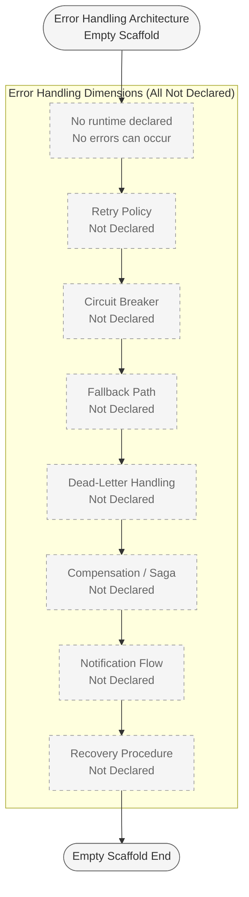

### 5.5.5 Authentication and Authorization Framework

Section 2.5.4 records "Authentication Mechanism | No" and "Authorization Model | No." Section 3.5.2 (Authentication Services) records that no identity-provider configuration, no token-issuance configuration, no single-sign-on metadata, and no role/permission model has been declared. Section 1.2.1 records "Identity / Access Management Providers | No." Section 4.3 records zero declared authorization checkpoints. No authentication protocol (OAuth 2.0, OIDC, SAML, mTLS, API key, basic auth, JWT bearer), no token format / lifetime / refresh policy, no session model, no authorization model (RBAC, ABAC, ReBAC, ACL), and no policy decision point (PDP) or policy enforcement point (PEP) has been declared.

### 5.5.6 Performance Requirements and SLAs

Per constraint **C-4.2** of Section 4.7.1, no SLA, timing budget, performance metric, error budget, or KPI may be assigned to any process step in this revision. Section 1.2.3 records that "no KPIs, service-level objectives, service-level agreements, error budgets, or operational thresholds are defined." Section 2.5.2 records every performance dimension as "No" (Throughput Targets, Latency / Response-Time Targets, Concurrency Targets, Resource-Utilization Budgets). Section 2.5.3 records every scalability dimension as "No" (Horizontal Scaling Strategy, Vertical Scaling Strategy, Workload Projections, Capacity Planning). Constraint **C-5.4** in Section 5.6.1 extends these prohibitions to Section 5.

### 5.5.7 Disaster Recovery Procedures

No disaster recovery procedures, backup strategies, or business-continuity plans have been declared. Section 3.6.3 records "Backup and Restore Strategy | No" and "Data Retention Policy | No." Section 2.5.5 records every maintenance dimension as "No" (Patch / Upgrade Cadence, Monitoring / Observability Requirements, Support / On-Call Model, Decommissioning Plan). No recovery time objective (RTO), no recovery point objective (RPO), no failover topology, no replication strategy, no backup schedule, and no restore-validation procedure has been declared.

### 5.5.8 Encryption (At Rest and In Transit)

Section 2.5.4 records "Data Encryption (At Rest / In Transit) | No." Section 3.6.3 records "Encryption at Rest | No (per Section 2.5.4)" and "Encryption in Transit | No (per Section 2.5.4)." No cryptographic algorithm, no key-management service, no certificate authority, no key-rotation policy, and no encryption boundary has been declared. Because Section 3.6 records zero declared datastores and Section 1.2.2 records zero declared HTTP endpoints, the conventional surfaces on which encryption policies operate (data files, database fields, network channels) have not been defined.

---

## 5.6 SPECIFICATION CONSTRAINTS AND REVISION TRIGGERS

### 5.6.1 Section 5 Constraints

The following constraints govern Section 5 and extend the constraint series introduced by Section 2.7.2 (C-2.x), Section 3.10.1 (C-3.x), and Section 4.7.1 (C-4.x).

| ID | Constraint | Rationale |
|----|------------|-----------|
| C-5.1 | No architectural style, component topology, integration mesh, deployment topology, communication pattern, data storage solution, caching strategy, or security mechanism may be declared in this revision of Section 5. | The repository contains no source code, runtime, integration, or configuration declaration referencing any such element. Declaration would constitute fabrication and would violate C-2.3, C-3.5, and C-4.4. |
| C-5.2 | No default architectural pattern referenced in Section 5.1.2 may be adopted as the declared architecture in this revision. | Adopting any default pattern (microservices, monolith, serverless, event-driven, hexagonal, layered, CQRS, etc.) would violate C-2.3, C-3.5, and C-4.4 by symmetric reasoning with C-3.2. |
| C-5.3 | No cross-cutting policy—monitoring, logging, tracing, error handling, authentication, authorization, encryption, disaster recovery—may be declared in this revision. | Section 2.5.4, Section 2.5.5, Section 3.5.3, and Section 4.4.2 each record zero declarations in these dimensions. Declaration would constitute fabrication. |
| C-5.4 | No SLA, RTO, RPO, error budget, or capacity target may be assigned to any component or integration in this revision. | C-4.2 prohibits such assignments; Section 1.2.3 confirms no KPIs/SLAs are defined. |
| C-5.5 | No Architecture Decision Records (ADRs) may be authored in this revision. | The repository contains no `docs/adr/` directory, no decision-log artifacts, and no decision history. Authoring an ADR would fabricate a decision history that does not exist. |
| C-5.6 | All Section 5 content must remain traceable to either `README.md` or to a prior Section 1, Section 2, Section 3, or Section 4 subsection. | Specification-wide evidence-grounding standard inherited from C-2.3, C-3.5, and C-4.4. |
| C-5.7 | All diagrams produced in this revision must apply the empty-state visualization convention established by Section 2.4.1, Section 3.9.1, and Section 4.5: dashed gray borders for "Not Declared" dimensions, solid light-yellow borders for the single observable artifact (`README.md`), and dashed light-blue borders for the implicit (not declared) renderer relationship. | Cross-section visual consistency requirement extended from C-4.5. |
| C-5.8 | The implicit Reader → Hosting Platform → `README.md` rendering flow may be referenced as the sole observable de facto interaction (per C-4.6) but may NOT be characterized as a declared architectural component, declared service, declared integration, or declared deployment topology. | C-3.4 and C-4.6 both establish that this observation is implicit hosting-platform behavior, not a declared technology or process choice. |

### 5.6.2 Section 5 Revision Triggers

The following events should trigger a revision of this Section 5, following the precedent pattern of Section 2.7.3, Section 3.10.2, and Section 4.7.2.

| Trigger | Expected Section 5 Revision |
|---------|------------------------------|
| First declaration of an architectural style (service boundary, layered architecture, FaaS function manifest, etc.) | Populate Section 5.2.1 (System Overview) and Section 5.4.2 (Architecture Style Decision) |
| Introduction of source files defining runtime components | Populate Section 5.2.2 (Core Components Inventory) and Section 5.3 (Component Details) |
| Declaration of integration endpoints (API client, webhook handler, queue consumer, batch interface) | Populate Section 5.2.4 (External Integration Points) and Section 5.4.3 (Communication Pattern Decision) |
| Declaration of a database, datastore, or caching tier | Populate Section 5.2.3 (Data Flow Description), Section 5.4.4 (Data Storage Solution), and Section 5.4.5 (Caching Strategy) |
| Declaration of an authentication / authorization model | Populate Section 5.4.6 (Security Mechanism Decision) and Section 5.5.5 (Authentication and Authorization Framework) |
| Declaration of a monitoring, observability, or APM stack | Populate Section 5.5.2 (Monitoring and Observability Approach) |
| Declaration of a logging or tracing infrastructure | Populate Section 5.5.3 (Logging and Tracing Strategy) |
| Declaration of error-handling, retry, or circuit-breaker logic | Populate Section 5.5.4 (Error Handling Patterns) |
| Declaration of SLAs, KPIs, timing budgets, or error budgets | Populate Section 5.5.6 (Performance Requirements and SLAs); lift C-5.4 |
| Declaration of disaster-recovery procedures (RTO, RPO, backups, failover) | Populate Section 5.5.7 (Disaster Recovery Procedures) |
| Declaration of encryption policies (at rest, in transit, key management) | Populate Section 5.5.8 (Encryption) |
| Authoring of an Architecture Decision Record (e.g., a `docs/adr/0001-*.md` entry) | Populate Section 5.4.7 (Architecture Decision Records); lift C-5.5 |

### 5.6.3 Version Tracking

| Specification Version | Section 5 State | Trigger for Next Revision |
|-----------------------|-----------------|---------------------------|
| v0 (current) | Baseline scaffold; zero architectural style, components, integrations, communication patterns, storage solutions, caching strategies, security mechanisms, monitoring/logging strategies, error-handling patterns, performance requirements, disaster-recovery procedures, encryption policies, or ADRs declared; only the implicit Reader → README rendering flow is referenced as the sole observable interaction | First introduction into the repository of any architectural style declaration, runtime component, integration endpoint, database, cache, authentication/authorization configuration, monitoring stack, error-handling logic, SLA/KPI declaration, disaster-recovery procedure, encryption policy, or ADR entry |

---

## 5.7 REFERENCES

### 5.7.1 Files Examined

- `README.md` — The sole file in the Artifact9 repository (11 bytes, UTF-8, single-line content `# Artifact9`). Examined to verify the absence of architectural declarations, component definitions, integration contracts, technology choices, communication patterns, persistence configurations, security mechanisms, observability strategies, error-handling logic, or any other architectural input. The file contains only the H1 project-identity declaration and surfaces no architecturally meaningful content.

### 5.7.2 Folders Examined

- `` (repository root, depth 0) — Enumerated to confirm first-order children. Contains exactly one file (`README.md`) and zero subfolders. No source directories, configuration directories, build directories, test directories, infrastructure-as-code directories, CI/CD directories, container/orchestration directories, or `docs/adr/` directory exist to traverse.

### 5.7.3 Specification Sections Referenced

- **Section 1.1 (Executive Summary)** — Project identity (Artifact9); pre-implementation status
- **Section 1.2.1 (Project Context)** — Authoritative integration audit; all six integration categories recorded as "No"
- **Section 1.2.2 (High-Level Description)** — Authoritative absence of executable capabilities, components, and core technical approach; original repository topology diagram
- **Section 1.2.3 (Success Criteria)** — Authoritative absence of KPIs, SLAs, SLOs, error budgets
- **Section 1.3.1 (In-Scope Elements)** — Observable Artifacts catalog; System Boundaries absence
- **Section 1.3.2 (Out-of-Scope Elements)** — Six conventionally out-of-scope categories including security controls and data persistence
- **Section 1.3.3 (Repository State Assessment)** — Authoritative file, folder, source-code, and configuration counts
- **Section 2.1 (Authoring Premise and Methodology)** — Documentary integrity standard establishment
- **Section 2.2.4 (Functional Feature Inventory)** — Empty inventory confirmation
- **Section 2.4.1 (Empty-State Visualization Convention)** — Mermaid styling baseline
- **Section 2.4.2 (Integration Points)** — Zero integration points reconfirmation
- **Section 2.5.1 (Technical Constraints)** — Markdown / UTF-8 documentation surface boundary
- **Section 2.5.2 (Performance Requirements)** — All performance dimensions "No"
- **Section 2.5.3 (Scalability Considerations)** — All scalability dimensions "No"
- **Section 2.5.4 (Security Implications)** — All security dimensions "No"
- **Section 2.5.5 (Maintenance Requirements)** — All maintenance dimensions "No"
- **Section 2.7.2 (Specification Constraints)** — C-2.x constraint series including C-2.3 evidence-grounding requirement
- **Section 2.7.3 (Revision Triggers)** — Trigger pattern precedent
- **Section 3.1.1 (Inheritance of the Evidence-Grounding Standard)** — Section 5 inheritance baseline
- **Section 3.1.2 (Implications for the Default Technology Stack)** — Critical boundary forbidding default-stack adoption
- **Section 3.2 (Programming Languages)** — Zero languages declared
- **Section 3.3 (Frameworks and Libraries)** — Zero frameworks/libraries declared
- **Section 3.5.1 (External APIs and Integrations)** — Reconfirmation of zero integrations
- **Section 3.5.2 (Authentication Services)** — Zero identity-provider / authentication services
- **Section 3.5.3 (Monitoring Tools)** — Zero monitoring tools declared
- **Section 3.5.4 (Cloud Services)** — Zero cloud-platform commitments
- **Section 3.6.1 (Primary and Secondary Databases)** — All datastore dimensions "Not Declared"
- **Section 3.6.2 (Caching Solutions)** — Caching tier "Not Declared"
- **Section 3.6.3 (Storage Services and Persistence Strategies)** — All storage dimensions "No"
- **Section 3.7 (Development and Deployment)** — Zero dev tools, build systems, containerization, CI/CD
- **Section 3.8.2 (Observable De Facto Technical Characteristics)** — Implicit-renderer scoping boundary
- **Section 3.9.1 (Empty-State Visualization Convention)** — Mermaid styling baseline
- **Section 3.10.1 (Section 3 Constraints)** — C-3.x constraint series including C-3.2, C-3.4, C-3.5
- **Section 3.10.2 (Section 3 Revision Triggers)** — Trigger pattern precedent
- **Section 4.1 (Authoring Premise and Process Declaration Boundary)** — Documentary integrity standard inheritance
- **Section 4.2.2 (Integration Workflows)** — Zero data flows
- **Section 4.3 (Flowchart Requirement Coverage)** — Zero validation rules / authorization checkpoints
- **Section 4.4.1 (State Management)** — All state-management dimensions "Not Declared"
- **Section 4.4.2 (Error Handling)** — All error-handling dimensions "Not Declared"
- **Section 4.5.1, 4.5.3, 4.5.4, 4.5.5 (Required Diagrams)** — Reusable Mermaid patterns for system workflow, error handling, integration sequence, and state transition
- **Section 4.7.1 (Section 4 Constraints)** — C-4.x constraint series including C-4.2 (SLA prohibition), C-4.4 (traceability), C-4.5 (visualization), C-4.6 (implicit-flow scoping)
- **Section 4.7.2 (Section 4 Revision Triggers)** — Trigger pattern precedent

# 6. SYSTEM COMPONENTS DESIGN

## 6.1 Core Services Architecture

#### SYSTEM ARCHITECTURE

## 6.1 CORE SERVICES ARCHITECTURE

### 6.1.1 Applicability Determination

**Core Services Architecture is not applicable for this system in its current revision.**

The Artifact9 repository has not declared a service-oriented, microservices, distributed, or component-decomposed architecture, nor has it declared a monolithic service that would itself constitute the single "core service" of the system. The repository's complete state—established authoritatively in Section 1.3.3—consists of a single 11-byte `README.md` file at the repository root containing only the H1 heading `# Artifact9`, with zero subfolders, zero source-code lines, zero configuration or manifest files, and zero test or quality-assurance artifacts.

This applicability determination follows directly from the controlling instruction in the section prompt, which explicitly authorizes the non-applicable branch when "the system does not require microservices, distributed architecture, or distinct service components." Artifact9 satisfies a stronger form of this condition: it has not declared *any* services—neither distributed nor monolithic—and therefore has no service architecture of any kind to document. Section 1.2.2 (High-Level Description) is authoritative on this point:

> "The repository exposes no executable capabilities. There are no application entry points, command-line interfaces, HTTP endpoints, message handlers, scheduled tasks, user interfaces, or library exports defined."
>
> "The repository structure consists of a single root-level documentation file. No modules, packages, services, layers, or runtime components are defined."

Because Section 6.1 must address three sub-areas (Service Components, Scalability Design, Resilience Patterns), and because each sub-area presupposes the existence of at least one declared service, the remainder of this section enumerates each prescribed sub-topic and records its current undeclared status with authoritative cross-references. This documentation pattern mirrors Section 5.5 (Cross-Cutting Concerns), which is the architectural sibling of this section.

#### 6.1.1.1 Summary of the Applicability Argument

| Applicability Premise | Required Input | Repository State |
|-----------------------|----------------|------------------|
| Service Components require ≥ 1 declared runtime component | At least one module, package, or service | Zero declared (Section 1.2.2) |
| Inter-Service Communication requires ≥ 2 services and ≥ 1 transport | At least two services and one protocol | Zero declared (Section 1.2.1; Section 5.2.3) |
| Scalability Design requires ≥ 1 workload model and ≥ 1 scaling dimension | At least one declared dimension | Zero declared (Section 2.5.3) |
| Resilience Patterns require ≥ 1 declared failure mode and recovery procedure | At least one declared mechanism | Zero declared (Section 4.4.2; Section 5.5.7) |

Because each premise fails in the current repository state, the corresponding architecture cannot be authored without fabricating elements not present in the codebase. Fabrication is prohibited by the constraint series **C-2.3** (Section 2.7.2), **C-3.5** (Section 3.10.1), **C-4.4** (Section 4.7.1), and **C-5.6** (Section 5.6.1), which together require all specification content to remain traceable to `README.md` or to a prior, evidence-grounded section.

#### 6.1.1.2 Relationship to the Architectural Style Decision

Section 5.2.1 (System Overview) records the Architectural Style as undeclared. Constraint **C-5.2** (Section 5.6.1) explicitly prohibits the adoption of any default architectural pattern—including microservices, monolith, serverless, event-driven, hexagonal, layered, or CQRS—as the declared architecture in the current revision. Because the Core Services Architecture section is downstream of an architectural-style decision, and no such decision has been recorded, Section 6.1 inherits the same non-applicability posture by symmetric reasoning with C-5.2.

---

### 6.1.2 Repository State Evidence

The applicability determination above rests on four pillars of evidence already established in prior sections. The table below consolidates these references for traceability.

#### 6.1.2.1 Repository Inventory (per Section 1.3.3)

| Repository Aspect | Observed State |
|-------------------|----------------|
| Total Files | 1 (`README.md`) |
| Total Subfolders | 0 |
| Total Lines of Source Code | 0 |
| Total Configuration / Manifest Files | 0 |

#### 6.1.2.2 Enterprise Integration Audit (per Section 1.2.1)

Every conventional integration category that a Core Services Architecture would orchestrate is recorded as undeclared:

| Integration Category | Declared in Repository? |
|----------------------|-------------------------|
| External APIs / Web Services | No |
| Databases / Persistent Stores | No |
| Messaging / Event Streams | No |
| Identity / Access Management Providers | No |
| Third-Party SaaS Connections | No |
| File / Batch Interfaces | No |

#### 6.1.2.3 Technical Approach Audit (per Section 1.2.2)

Every conventional technical-approach dimension required to instantiate a service is recorded as undeclared:

| Technical Dimension | Declared in Repository? |
|---------------------|-------------------------|
| Programming Language(s) | No |
| Framework(s) | No |
| Runtime / Execution Model | No |
| Deployment Target | No |

#### 6.1.2.4 KPI and SLA Audit (per Section 1.2.3)

Every conventional service-level dimension that would be assigned to a service is recorded as undefined:

| KPI Category | Currently Defined? |
|--------------|--------------------|
| Functional / Feature KPIs | No |
| Performance & Scalability KPIs | No |
| Availability & Reliability KPIs | No |
| User Adoption / Engagement KPIs | No |

---

### 6.1.3 Service Components Audit

A populated Section 6.1 would enumerate the system's services, describe their responsibilities and boundaries, document the communication patterns between them, and specify the service-discovery, load-balancing, circuit-breaker, retry, and fallback mechanisms that connect them. The conventional inputs for such enumeration are: at least one declared runtime component, at least one declared communication channel, at least one declared deployment target, and at least one declared resilience mechanism. None of these inputs are present in the Artifact9 repository.

#### 6.1.3.1 Service Components Dimension Audit

| Service Components Dimension | Declared? | Authoritative Cross-Reference |
|------------------------------|-----------|-------------------------------|
| Service Boundaries and Responsibilities | No | Section 1.2.2; Section 5.2.2 |
| Inter-Service Communication Patterns | No | Section 1.2.1; Section 5.2.3 |
| Service Discovery Mechanisms | No | Section 1.2.2; Section 3.7 |
| Load Balancing Strategy | No | Section 1.2.2; Section 3.5.4 |
| Circuit Breaker Patterns | No | Section 4.4.2 |
| Retry and Fallback Mechanisms | No | Section 4.4.2 |

#### 6.1.3.2 Service Boundaries and Responsibilities

Section 1.2.2 records that "no modules, packages, services, layers, or runtime components are defined" in the Artifact9 repository. Section 5.2.2 (Core Components Inventory) presents the component-inventory table in its empty-state form, with every cell recorded as "Not Declared." Because no runtime component has been declared, no responsibility can be assigned to one, and no boundary can be drawn around one. The conventional dimensions of a service boundary—bounded context, single responsibility, contract-first interface definition, owned data store, and team ownership—are uniformly absent.

#### 6.1.3.3 Inter-Service Communication Patterns

Section 1.2.1 records every enterprise integration category as undeclared, including External APIs/Web Services and Messaging/Event Streams. Section 5.2.3 (Data Flow Description) states: "Consequently, no integration pattern (synchronous request/response, publish/subscribe, request/reply, fire-and-forget, batch, file-transfer, streaming) and no transport protocol (HTTPS, gRPC, AMQP, Kafka protocol, SMTP, SFTP) is in use." Because zero services exist and zero communication channels are declared, there are no inter-service interactions to characterize. The conventional dimensions of an inter-service communication pattern—synchrony model, transport protocol, serialization format, idempotency semantics, ordering guarantees, delivery semantics (at-least-once / at-most-once / exactly-once), and back-pressure handling—are uniformly absent.

#### 6.1.3.4 Service Discovery Mechanisms

No service registry, no DNS-based discovery, no client-side discovery (Eureka, Consul, etcd), no server-side discovery (load balancer with health checks), no service mesh (Istio, Linkerd, Consul Connect), and no Kubernetes Service / Endpoint object has been declared. Section 3.7 records every development and deployment dimension as undeclared. Section 1.2.2 confirms no runtime, no entry points, and no deployment target exist. Because there are no services to register and no callers to resolve registrations, service discovery is structurally inapplicable.

#### 6.1.3.5 Load Balancing Strategy

No load balancer, no traffic-management policy, no algorithm (round-robin, least-connections, weighted, IP-hash, consistent-hash), no health-check definition, no SSL/TLS termination point, and no Layer-4 or Layer-7 routing configuration has been declared. Section 3.5.4 (Cloud and Infrastructure Services—referenced by Section 5.5.1) records no cloud services that would host or instantiate a load balancer. Section 3.7 records no containerization platform, no orchestrator, no service mesh, and no ingress controller. Because no service exists to receive traffic and no deployment target is declared to provision a load balancer, the load-balancing dimension is structurally inapplicable.

#### 6.1.3.6 Circuit Breaker Patterns

Section 4.4.2 (Error Handling) records "Fallback / Circuit-Breaker Processes | No" with the authoritative cross-reference "Section 1.2.2 (no runtime)." No circuit-breaker library (Hystrix, Resilience4j, Polly, gobreaker, opossum), no half-open / open / closed state-machine configuration, no failure threshold, no rollover window, no fall-back path, and no bulkhead isolation pattern has been declared. Section 4.4.2 closes with the categorical statement: "Because no runtime exists, no errors can occur, and consequently zero retry mechanisms, zero fallback processes, zero notification flows, and zero recovery procedures exist to flowchart."

#### 6.1.3.7 Retry and Fallback Mechanisms

Section 4.4.2 records "Retry Mechanisms | No" and "Fallback / Circuit-Breaker Processes | No." No retry policy (fixed-interval, exponential backoff, jittered, deadline-aware), no maximum-attempt limit, no idempotency key requirement, no fallback path (cached response, default value, degraded mode, queue-and-retry-later), no dead-letter queue (Section 4.4.2 records "Dead-Letter Handling | No"), and no compensation/saga flow (Section 4.4.2 records "Compensation / Saga Flows | No") has been declared.

#### 6.1.3.8 Service Interaction Diagram (Empty-State)

Per constraint **C-5.7** of Section 5.6.1, all diagrams in this revision must apply the empty-state visualization convention. The required Service Interaction Diagram is rendered below in empty-state form, following the conventions established by Section 1.2.2, Section 5.3, and Section 5.5.4.

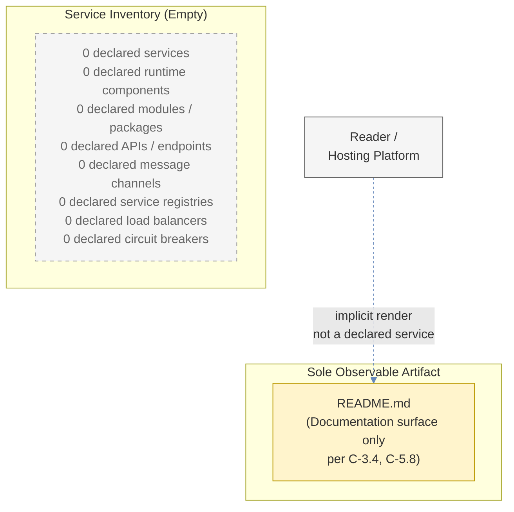

The diagram visualizes three facts: (1) the Service Inventory subgraph contains zero declared services across all dimensions audited; (2) the sole observable artifact in the repository is `README.md`, which is scoped exclusively as a documentation surface; and (3) the implicit Reader → README rendering flow is shown with a dashed light-blue edge because, per constraint **C-5.8** (Section 5.6.1), this observation may not be characterized as a declared service or service interaction.

---

### 6.1.4 Scalability Design Audit

A populated Section 6.1 would describe horizontal and vertical scaling approaches, auto-scaling triggers and rules, resource allocation strategies, performance optimization techniques, and capacity planning guidelines for each scalable service. The conventional inputs for such descriptions are: at least one declared workload model, at least one declared scaling dimension, at least one declared resource budget, and at least one declared capacity target. None of these inputs are present in the Artifact9 repository.

#### 6.1.4.1 Scalability Design Dimension Audit

| Scalability Design Dimension | Declared? | Authoritative Cross-Reference |
|------------------------------|-----------|-------------------------------|
| Horizontal Scaling Approach | No | Section 2.5.3 |
| Vertical Scaling Approach | No | Section 2.5.3 |
| Auto-Scaling Triggers and Rules | No | Section 2.5.3; Section 3.7 |
| Resource Allocation Strategy | No | Section 2.5.2; Section 3.7 |
| Performance Optimization Techniques | No | Section 2.5.2 |
| Capacity Planning Guidelines | No | Section 2.5.3; Section 1.2.3 |

#### 6.1.4.2 Horizontal and Vertical Scaling Approach

Section 2.5.3 (Scalability Considerations) records every scaling dimension as undeclared, with the leading statement: "Scalability considerations require a baseline workload model and growth projections, neither of which are present in the repository. No horizontal-scaling, vertical-scaling, partitioning, sharding, or capacity-planning information has been recorded." Specifically, "Horizontal Scaling Strategy | No" and "Vertical Scaling Strategy | No" are recorded. No replica count, no instance size, no stateless/stateful classification, no partition key, no sharding scheme, no read-replica strategy, and no CQRS read/write separation has been declared. Because no service exists, there is no unit to replicate horizontally and no unit to resize vertically.

#### 6.1.4.3 Auto-Scaling Triggers and Rules

No auto-scaling target (CPU%, memory%, request-rate, queue-depth, custom metric), no scaling threshold (scale-out / scale-in), no cool-down window, no minimum / maximum replica count, no scheduled scaling policy, and no predictive scaling configuration has been declared. Section 3.7 records no orchestrator (Kubernetes HPA/VPA/KEDA, AWS Auto Scaling Group, Azure Scale Set, GCP Instance Group, Nomad autoscaler) that would execute such rules. Because no runtime exists and no orchestration platform is declared, auto-scaling is structurally inapplicable.

#### 6.1.4.4 Resource Allocation Strategy

Section 2.5.2 (Performance Requirements) records "Resource-Utilization Budgets | No." No CPU request/limit, no memory request/limit, no ephemeral storage budget, no GPU allocation, no network bandwidth allocation, no priority class, no quality-of-service tier, and no namespace resource quota has been declared. Section 3.7 records no containerization platform that would enforce such allocations. Because no runtime exists and no infrastructure target is declared, resource allocation is structurally inapplicable.

#### 6.1.4.5 Performance Optimization Techniques

Section 2.5.2 records every performance dimension as undeclared (Throughput Targets, Latency/Response-Time Targets, Concurrency Targets, Resource-Utilization Budgets). No caching strategy (Section 3.6.2 confirms "no caching tier" is declared), no asynchronous processing pattern, no connection pooling configuration, no batch / bulk operation, no read-replica routing, no CDN edge caching, no query optimization, no index strategy (no datastore exists to index, per Section 3.6.1), and no compression policy has been declared. Per constraint **C-4.2** (Section 4.7.1) and **C-5.4** (Section 5.6.1), no performance target or budget may be assigned to any component in this revision.

#### 6.1.4.6 Capacity Planning Guidelines

Section 2.5.3 records "Workload Projections | No" and "Capacity Planning | No." Section 1.2.3 records that "no KPIs, service-level objectives, service-level agreements, error budgets, or operational thresholds are defined." No peak-load model, no growth-rate projection, no headroom factor, no seasonality model, no traffic-spike contingency, no cost-per-transaction target, and no instance-count forecast has been declared. Because zero baseline performance metrics exist (per Section 2.5.2) and zero workload projections exist (per Section 2.5.3), capacity planning has no inputs from which to derive guidelines.

#### 6.1.4.7 Scalability Architecture Diagram (Empty-State)

Per constraint **C-5.7**, the required Scalability Architecture diagram is rendered below in empty-state form.

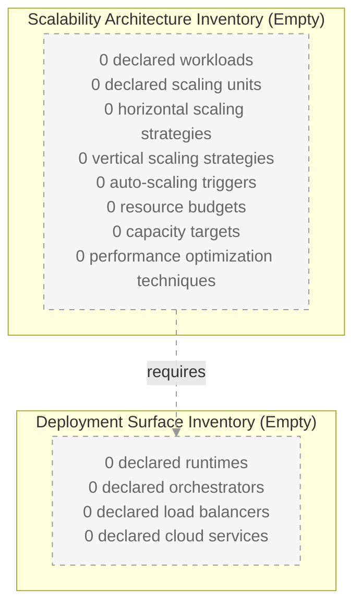

The diagram visualizes the dependency relationship between Scalability Architecture (which requires scaling units) and Deployment Surface (which would host those units): both subgraphs are empty in the current repository state. The dashed link itself emphasizes that the dependency relationship cannot be instantiated because both endpoints are undeclared.

---

### 6.1.5 Resilience Patterns Audit

A populated Section 6.1 would describe fault-tolerance mechanisms, disaster-recovery procedures, data-redundancy approaches, failover configurations, and service-degradation policies for each resilience-critical service. The conventional inputs for such descriptions are: at least one declared failure mode, at least one declared recovery objective (RTO/RPO), at least one declared redundancy topology, and at least one declared degradation mode. None of these inputs are present in the Artifact9 repository.

#### 6.1.5.1 Resilience Patterns Dimension Audit

| Resilience Patterns Dimension | Declared? | Authoritative Cross-Reference |
|-------------------------------|-----------|-------------------------------|
| Fault Tolerance Mechanisms | No | Section 4.4.2; Section 5.5.4 |
| Disaster Recovery Procedures | No | Section 5.5.7; Section 3.6.3 |
| Data Redundancy Approach | No | Section 3.6.1; Section 3.6.3 |
| Failover Configurations | No | Section 5.5.7; Section 3.7 |
| Service Degradation Policies | No | Section 4.4.2 |

#### 6.1.5.2 Fault Tolerance Mechanisms

Section 4.4.2 records every error-handling dimension as undeclared (Retry Mechanisms, Fallback/Circuit-Breaker Processes, Error Notification Flows, Recovery Procedures, Dead-Letter Handling, Compensation/Saga Flows, Failure Mode Catalog). Section 5.5.4 (Error Handling Patterns) reaffirms this absence and presents an empty-state error-handling flow. No bulkhead isolation, no timeout policy, no rate limiter, no shed-load mechanism, no graceful-degradation handler, no idempotency token, no exactly-once delivery semantics, and no compensating-transaction logic has been declared. Section 4.4.2 closes with the categorical statement: "Because no runtime exists, no errors can occur, and consequently zero retry mechanisms, zero fallback processes, zero notification flows, and zero recovery procedures exist to flowchart."

#### 6.1.5.3 Disaster Recovery Procedures

Section 5.5.7 (Disaster Recovery Procedures) is authoritative and is quoted in full for traceability: "No disaster recovery procedures, backup strategies, or business-continuity plans have been declared. Section 3.6.3 records 'Backup and Restore Strategy | No' and 'Data Retention Policy | No.' Section 2.5.5 records every maintenance dimension as 'No' (Patch / Upgrade Cadence, Monitoring / Observability Requirements, Support / On-Call Model, Decommissioning Plan). No recovery time objective (RTO), no recovery point objective (RPO), no failover topology, no replication strategy, no backup schedule, and no restore-validation procedure has been declared." Per constraint **C-5.4** (Section 5.6.1), no RTO or RPO may be assigned to any component in this revision.

#### 6.1.5.4 Data Redundancy Approach

Section 3.6.1 (Databases and Storage) records every datastore role as undeclared, including Primary OLTP, Read Replica/Secondary, Analytical/OLAP, Document/NoSQL, Search/Indexing, Vector/Embeddings, and Time-Series. Section 3.6.3 records every storage-service dimension as undeclared, including Object/Blob Storage, File/Network Storage, Backup and Restore Strategy, Data Retention Policy, Encryption at Rest, and Encryption in Transit. No replication topology (master-slave, master-master, multi-master, leader-follower, leaderless), no geo-replication policy, no synchronous-vs-asynchronous replication decision, no quorum configuration, no eventual-consistency window, and no conflict-resolution strategy has been declared. Because no datastore exists, there is no data to redundantly replicate.

#### 6.1.5.5 Failover Configurations

No active-active topology, no active-passive topology, no hot-standby configuration, no warm-standby configuration, no cold-standby configuration, no DNS-based failover, no load-balancer-based failover, no manual failover runbook, and no automated failover trigger has been declared. Section 3.7 records no containerization platform, no orchestrator, and no infrastructure-as-code repository that would express such a topology. Section 1.2.2 records no deployment target. Because no primary system exists, no failover target can be declared.

#### 6.1.5.6 Service Degradation Policies

No graceful degradation tier, no feature-flag system, no traffic-shedding policy, no read-only-mode switch, no static-response fallback, no maintenance-page mechanism, no "fail open" or "fail closed" default, and no priority-traffic preservation rule has been declared. Section 4.4.2 records "Fallback / Circuit-Breaker Processes | No," which is the conventional vehicle for service-degradation policy. Because no service exists to degrade, the dimension is structurally inapplicable.

#### 6.1.5.7 Resilience Pattern Implementations Diagram (Empty-State)

Per constraint **C-5.7**, the required Resilience Pattern Implementations diagram is rendered below in empty-state form, mirroring the convention established by Section 4.4.2.1 and Section 5.5.4.

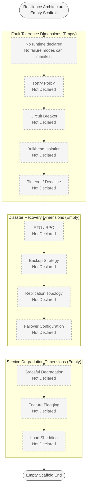

The diagram organizes the prescribed resilience dimensions into three groupings—Fault Tolerance, Disaster Recovery, and Service Degradation—and visualizes each as a dashed-gray "Not Declared" node. The leading node ("No runtime declared / No failure modes can manifest") establishes the root cause: because no runtime exists, no failure modes can manifest, and therefore no resilience pattern can be exercised.

---

### 6.1.6 Cross-Cutting Concerns Already Audited

The cross-cutting concerns that overlap between Section 5.5 and Section 6.1 are consolidated below for traceability. Section 5.5 (Cross-Cutting Concerns) provides the authoritative audit; Section 6.1 inherits these determinations because Service Components, Scalability Design, and Resilience Patterns are dimensions of the same cross-cutting concerns.

| Cross-Cutting Concern | Section 6.1 Subsection Affected | Authoritative Source |
|-----------------------|----------------------------------|----------------------|
| Monitoring and Observability | Auto-Scaling Triggers; Fault Tolerance | Section 5.5.2 |
| Logging and Tracing | Inter-Service Communication; Failure Notification | Section 5.5.3 |
| Error Handling Patterns | Circuit Breaker; Retry / Fallback | Section 5.5.4 |
| Performance Requirements and SLAs | Scalability Design; Capacity Planning | Section 5.5.6 |
| Disaster Recovery Procedures | Disaster Recovery; Failover Configurations | Section 5.5.7 |
| Encryption (At Rest / In Transit) | Data Redundancy (encrypted replication) | Section 5.5.8 |

---

### 6.1.7 Specification Constraints and Revision Triggers

#### 6.1.7.1 Section 6.1 Constraints (C-6.1.x Series)

The following constraints govern Section 6.1 and extend the constraint series introduced by Section 2.7.2 (C-2.x), Section 3.10.1 (C-3.x), Section 4.7.1 (C-4.x), and Section 5.6.1 (C-5.x).

| ID | Constraint | Rationale |
|----|------------|-----------|
| C-6.1.1 | No service component, service boundary, inter-service communication pattern, service-discovery mechanism, load-balancing strategy, circuit-breaker pattern, or retry/fallback mechanism may be declared in this revision of Section 6.1. | Section 1.2.2 records zero declared runtime components and zero executable capabilities. Section 4.4.2 records every error-handling dimension as undeclared. Declaration would constitute fabrication and would violate C-2.3, C-3.5, C-4.4, and C-5.6. |
| C-6.1.2 | No horizontal- or vertical-scaling approach, auto-scaling rule, resource-allocation strategy, performance-optimization technique, or capacity-planning guideline may be declared in this revision. | Section 2.5.2 records every performance dimension as undeclared. Section 2.5.3 records every scalability dimension as undeclared. C-5.4 prohibits assigning any SLA, RTO, RPO, error budget, or capacity target to any component. |
| C-6.1.3 | No fault-tolerance mechanism, disaster-recovery procedure, data-redundancy approach, failover configuration, or service-degradation policy may be declared in this revision. | Section 4.4.2 records every error-handling dimension as undeclared. Section 5.5.7 records every disaster-recovery dimension as undeclared. Declaration would constitute fabrication. |
| C-6.1.4 | The implicit Reader → Hosting Platform → `README.md` rendering flow may be referenced as the sole observable de facto interaction (per C-4.6 and C-5.8) but may NOT be characterized as a declared service, service component, service interaction, scalability unit, or resilience pattern. | Inherited by symmetric reasoning from C-3.4, C-4.6, and C-5.8. The rendering flow is implicit hosting-platform behavior, not a declared service. |
| C-6.1.5 | All diagrams produced in this revision must apply the empty-state visualization convention established by C-4.5 and C-5.7. | Cross-section visual consistency requirement; ensures Section 6.1 diagrams are visually distinguishable as scaffold-only artifacts. |
| C-6.1.6 | All Section 6.1 content must remain traceable to `README.md` or to a prior Section 1, Section 2, Section 3, Section 4, or Section 5 subsection. | Specification-wide evidence-grounding standard inherited from C-2.3, C-3.5, C-4.4, and C-5.6. |
| C-6.1.7 | No default service-architecture pattern (microservices, service mesh, hexagonal services, serverless functions, actor model, peer-to-peer, master-worker, etc.) may be adopted as the declared service architecture in this revision. | Adopting any default pattern would violate C-5.2 by symmetric reasoning and would fabricate an architectural style that the repository has not declared. |

#### 6.1.7.2 Section 6.1 Revision Triggers

The following events should trigger a revision of Section 6.1, extending the trigger pattern of Section 5.6.2.

| Trigger Event | Expected Section 6.1 Revision |
|---------------|-------------------------------|
| First introduction of source files defining one or more runtime services | Re-evaluate Section 6.1.1 applicability determination; populate Section 6.1.3 (Service Components Audit) with declared services |
| Declaration of inter-service communication channels (HTTP/gRPC client, queue consumer/producer, event handler) | Populate Section 6.1.3.3 (Inter-Service Communication Patterns) |
| Declaration of a service registry, service mesh, or DNS-based discovery configuration | Populate Section 6.1.3.4 (Service Discovery Mechanisms) |
| Declaration of a load balancer, ingress controller, or traffic-management policy | Populate Section 6.1.3.5 (Load Balancing Strategy) |
| Declaration of circuit-breaker, retry, or fallback logic in source code or framework configuration | Populate Section 6.1.3.6 and Section 6.1.3.7; lift the relevant clauses of C-6.1.1 |
| Declaration of horizontal- or vertical-scaling configuration (HPA, VPA, ASG, Scale Set, KEDA, etc.) | Populate Section 6.1.4 (Scalability Design Audit); lift the relevant clauses of C-6.1.2 |
| Declaration of auto-scaling triggers, resource quotas, or capacity targets | Populate Section 6.1.4.3 through Section 6.1.4.6; lift C-5.4 and C-6.1.2 |
| Declaration of disaster-recovery procedures (RTO, RPO, backups, replication, failover) | Populate Section 6.1.5.3 and Section 6.1.5.4; lift the relevant clauses of C-6.1.3 |
| Declaration of service-degradation, feature-flag, or load-shedding policies | Populate Section 6.1.5.6 (Service Degradation Policies) |
| Declaration of a SLA, KPI, or error budget for any service | Populate Section 6.1.4 performance/scalability tables; lift C-5.4 and C-6.1.2 |

#### 6.1.7.3 Version Tracking

| Specification Version | Section 6.1 State | Trigger for Next Revision |
|-----------------------|-------------------|---------------------------|
| v0 (current) | Baseline scaffold; "Core Services Architecture is not applicable" determination recorded; zero service components, zero communication patterns, zero discovery mechanisms, zero load-balancing strategies, zero circuit breakers, zero retry/fallback mechanisms, zero scaling approaches, zero auto-scaling rules, zero resource budgets, zero performance optimization techniques, zero capacity guidelines, zero fault-tolerance mechanisms, zero disaster-recovery procedures, zero redundancy approaches, zero failover configurations, and zero service-degradation policies declared. | First introduction of any runtime service, communication channel, discovery configuration, load balancer, circuit breaker, retry policy, scaling configuration, capacity target, fault-tolerance mechanism, disaster-recovery procedure, or service-degradation policy into the repository. |

---

### 6.1.8 References

#### 6.1.8.1 Files Examined

- `README.md` — The sole repository file; 11-byte UTF-8 Markdown document containing only the H1 heading `# Artifact9`. Confirms zero implementation, zero services, zero declared architecture.

#### 6.1.8.2 Folders Explored

- `/` (repository root, depth 0) — Confirmed to contain only `README.md` and a `.git` metadata directory; no subfolders, no source folders, no infrastructure folders.

#### 6.1.8.3 Technical Specification Sections Referenced

- **Section 1.2 System Overview** — Section 1.2.1 (enterprise integration audit: every category "No"); Section 1.2.2 (zero declared modules/packages/services/layers/runtime components, zero executable capabilities); Section 1.2.3 (zero KPIs, SLOs, SLAs, error budgets, operational thresholds).
- **Section 1.3 Scope** — Section 1.3.1 (in-scope inventory limited to project-identity declaration and root-level README surface); Section 1.3.2 (Source Code Execution, Build/Test/Deployment Operations, External System Integrations all out-of-scope); Section 1.3.3 (Repository State Assessment: 1 file, 0 subfolders, 0 source code lines, 0 configuration/manifest files).
- **Section 2.5 Implementation Considerations** — Section 2.5.2 (every performance dimension "No"); Section 2.5.3 (every scalability dimension "No"); Section 2.5.4 (every security dimension "No"); Section 2.5.5 (every maintenance dimension "No").
- **Section 2.7 Assumptions, Constraints, and Revision Triggers** — Origin of constraint **C-2.3** (specification-wide evidence-grounding standard).
- **Section 3.5 Third-Party Services** — Section 3.5.2 (no authentication services); Section 3.5.3 (no monitoring tools); Section 3.5.4 (no cloud or infrastructure services).
- **Section 3.6 Databases and Storage** — Section 3.6.1 (no datastores of any role); Section 3.6.2 (no caching tier); Section 3.6.3 (no storage services, no backup/restore strategy, no encryption).
- **Section 3.7 Development and Deployment** — Confirms no containerization, no CI/CD, no IaC, no orchestrators.
- **Section 3.10 Specification Constraints and Revision Triggers** — Origin of constraint **C-3.4** (rendering flow may not be characterized as a declared technology) and **C-3.5** (specification-wide evidence-grounding standard).
- **Section 4.4 Technical Implementation** — Section 4.4.2 (every error-handling dimension "Not Declared"; authoritative for Circuit Breaker, Retry, Fallback, Dead-Letter, Compensation/Saga, Failure Mode Catalog determinations).
- **Section 4.7 Specification Constraints and Revision Triggers** — Origin of constraint **C-4.2** (no SLA/timing budget/performance metric/error budget/KPI may be assigned), **C-4.4** (evidence-grounding), **C-4.5** (empty-state visualization convention), **C-4.6** (rendering flow scope).
- **Section 5.2 High-Level Architecture** — Section 5.2.1 (Architectural Style undeclared); Section 5.2.2 (Core Components Inventory empty); Section 5.2.3 (zero integration patterns and transport protocols); Section 5.2.4 (zero external integration points).
- **Section 5.5 Cross-Cutting Concerns** — Section 5.5.1 (Cross-Cutting Concerns Audit table); Section 5.5.4 (Error Handling Patterns empty-state diagram, mirrored in Section 6.1.5.7); Section 5.5.6 (Performance Requirements and SLAs); Section 5.5.7 (Disaster Recovery Procedures, quoted authoritatively in Section 6.1.5.3); Section 5.5.8 (Encryption).
- **Section 5.6 Specification Constraints and Revision Triggers** — Origin of constraints **C-5.1** through **C-5.8**, all of which Section 6.1 inherits or extends. The C-6.1.x constraint series defined in Section 6.1.7.1 is a direct extension of the C-5.x series.

## 6.2 Database Design

### 6.2.1 Applicability Determination

**Database Design is not applicable to this system in its current revision.**

The Artifact9 repository has not declared any database engine, datastore, persistence layer, caching tier, schema, entity, relationship, migration, replication topology, backup strategy, or data-retention policy. The repository's complete state—established authoritatively in Section 1.3.3—consists of a single 11-byte `README.md` file at the repository root containing only the H1 heading `# Artifact9`, with zero subfolders, zero source-code lines, zero configuration or manifest files, and zero test or quality-assurance artifacts. Because Database Design presupposes the existence of at least one declared datastore against which entities, indexes, partitions, and access patterns can be defined, the discipline has no inputs from which to derive design content in this revision.

This applicability determination follows directly from the controlling instruction in the section prompt, which explicitly authorizes the non-applicable branch when "the system does not require or direct database or persistent storage interactions are not clearly evident." Artifact9 satisfies a stronger form of this condition: Section 3.6.1 (Primary and Secondary Databases) records every datastore role—Primary OLTP, Read Replica/Secondary, Analytical/OLAP, Document/NoSQL, Search/Indexing, Vector/Embeddings, and Time-Series—as "Not Declared." Section 3.6.2 (Caching Solutions) records that no caching tier of any kind has been declared. Section 3.6.3 (Storage Services and Persistence Strategies) records every storage dimension—object/blob storage, file/network storage, backup/restore strategy, data-retention policy, encryption at rest, and encryption in transit—as "No."

Because Section 6.2 must address four sub-areas (Schema Design, Data Management, Compliance Considerations, Performance Optimization), and because each sub-area presupposes the existence of at least one declared datastore, the remainder of this section enumerates each prescribed sub-topic and records its current undeclared status with authoritative cross-references. This documentation pattern mirrors Section 6.1 (Core Services Architecture), which established the structural template for "not applicable" determinations under the same evidence-grounded authoring posture.

#### 6.2.1.1 Summary of the Applicability Argument

| Applicability Premise | Required Input | Repository State |
|-----------------------|----------------|------------------|
| Schema Design requires ≥ 1 declared datastore engine | At least one OLTP/OLAP/NoSQL/document/search/vector/time-series store | Zero declared (Section 3.6.1) |
| Data Management requires ≥ 1 declared schema or migration artifact | At least one schema file, ORM model, or migration script | Zero declared (Section 1.3.2; Section 3.6.1) |
| Compliance Considerations require ≥ 1 declared data domain and ≥ 1 security control | At least one data classification and one access/audit mechanism | Zero declared (Section 1.3.1; Section 2.5.4) |
| Performance Optimization requires ≥ 1 declared workload and ≥ 1 measurable performance target | At least one query, connection pool, or throughput target | Zero declared (Section 2.5.2; Section 3.6.1) |

Because each premise fails in the current repository state, the corresponding design cannot be authored without fabricating elements not present in the codebase. Fabrication is prohibited by the constraint series **C-2.3** (Section 2.7.2), **C-3.1** and **C-3.5** (Section 3.10.1), **C-4.4** (Section 4.7.1), **C-5.1**, **C-5.3**, and **C-5.6** (Section 5.6.1), and **C-6.1.6** (Section 6.1.7.1), which together require all specification content to remain traceable to `README.md` or to a prior, evidence-grounded section.

#### 6.2.1.2 Relationship to the Data Storage Solution Decision

Section 5.4 (Technical Decisions), specifically Section 5.4.4 (Data Storage Solution Decision), is the upstream section in which a data-storage selection would be recorded. That section has not been populated with any declared engine, persistence model, or storage tier. Constraint **C-5.1** (Section 5.6.1) explicitly prohibits the declaration of any "data storage solution" or "caching strategy" in the current revision. Because the Database Design section is downstream of the Data Storage Solution decision and no such decision has been recorded, Section 6.2 inherits the same non-applicability posture by symmetric reasoning with C-5.1.

The revision trigger pattern of Section 5.6.2 explicitly identifies the "Declaration of a database, datastore, or caching tier" as the event that would populate Section 5.4.4 (Data Storage Solution) and Section 5.4.5 (Caching Strategy). Section 6.2 will be revised in lockstep with these upstream populations.

---

### 6.2.2 Repository State Evidence

The applicability determination above rests on four pillars of evidence already established in prior sections. The table below consolidates these references for traceability.

#### 6.2.2.1 Repository Inventory (per Section 1.3.3)

| Repository Aspect | Observed State |
|-------------------|----------------|
| Total Files | 1 (`README.md`) |
| Total Subfolders | 0 |
| Total Lines of Source Code | 0 |
| Total Configuration / Manifest Files | 0 |

No `schema.sql`, no `models/`, no `entities/`, no `migrations/`, no `db/`, no `prisma/`, no `alembic/`, no `flyway/`, no `liquibase/`, no `knex/`, no `sequelize/`, no `typeorm/`, no `mongoose/`, no `sqlalchemy/`, no `gorm/`, no `diesel/`, no `ecto/`, no `activerecord/`, and no equivalent persistence-layer artifact exists at any path within the repository.

#### 6.2.2.2 Enterprise Integration Audit — Data Dimensions (per Section 1.2.1)

Every conventional data-integration category required to instantiate a database design is recorded as undeclared:

| Data Integration Category | Declared in Repository? |
|---------------------------|-------------------------|
| Databases / Persistent Stores | No |
| Messaging / Event Streams | No |
| File / Batch Interfaces | No |
| Third-Party SaaS Connections | No |

#### 6.2.2.3 Databases and Storage Audit (per Section 3.6)

Every datastore role and every storage dimension prescribed by the conventional database design discipline has been audited and recorded as undeclared:

| Datastore / Storage Dimension | Declared in Repository? |
|-------------------------------|-------------------------|
| Primary OLTP Datastore | Not Declared (Section 3.6.1) |
| Read Replica / Secondary | Not Declared (Section 3.6.1) |
| Analytical / OLAP Store | Not Declared (Section 3.6.1) |
| Document / NoSQL Store | Not Declared (Section 3.6.1) |
| Search / Indexing Store | Not Declared (Section 3.6.1) |
| Vector / Embeddings Store | Not Declared (Section 3.6.1) |
| Time-Series Store | Not Declared (Section 3.6.1) |
| In-Process / Distributed Cache | Not Declared (Section 3.6.2) |
| Object / Blob Storage Provider | No (Section 3.6.3) |
| File / Network Storage | No (Section 3.6.3) |
| Backup and Restore Strategy | No (Section 3.6.3) |
| Data Retention Policy | No (Section 3.6.3) |

---

### 6.2.3 Schema Design Audit

A populated Section 6.2 would define the entity-relationship model, declare data types and structures, document the indexing strategy, specify the partitioning or sharding scheme, describe the replication configuration, and design the backup architecture for each declared datastore. The conventional inputs for such definitions are: at least one declared database engine, at least one declared entity, at least one declared workload pattern, and at least one declared availability requirement. None of these inputs are present in the Artifact9 repository.

#### 6.2.3.1 Schema Design Dimension Audit

| Schema Design Dimension | Declared? | Authoritative Cross-Reference |
|--------------------------|-----------|-------------------------------|
| Entity Relationships | No | Section 1.3.1; Section 3.6.1 |
| Data Models and Structures | No | Section 1.3.2; Section 3.6.1 |
| Indexing Strategy | No | Section 3.6.1; Section 2.5.2 |
| Partitioning Approach | No | Section 2.5.3; Section 3.6.1 |
| Replication Configuration | No | Section 3.6.1; Section 5.5.7 |
| Backup Architecture | No | Section 3.6.3; Section 5.5.7 |

#### 6.2.3.2 Entity Relationships

Section 1.3.1 (Implementation Boundaries) records "Data Domains Included | No | No data models, schemas, or domains are referenced." Section 3.6.1 confirms that no datastore of any role has been declared. Because no domain model exists, no entities can be enumerated, no relationships (one-to-one, one-to-many, many-to-many, identifying, non-identifying) can be drawn, no cardinality constraints can be assigned, and no referential-integrity rules can be enforced. The conventional dimensions of an entity-relationship model—aggregate roots, value objects, owned entities, polymorphic associations, inheritance hierarchies, and bounded contexts—are uniformly absent.

#### 6.2.3.3 Data Models and Structures

Section 1.3.2 (Out-of-Scope Elements) records "Data Persistence and Retrieval | No data stores, schemas, or persistence layers exist." No relational schema (tables, columns, types, constraints), no document schema (JSON Schema, BSON structure, key namespacing), no key-value layout, no column-family design, no wide-column structure, no graph data model (nodes, edges, properties), no vector embedding dimensionality, and no time-series measurement structure has been declared. No surrogate-key strategy, no natural-key candidate, no composite-key configuration, and no type-conversion rule has been recorded.

#### 6.2.3.4 Indexing Strategy

No primary-key index, no secondary index, no composite index, no covering index, no partial / filtered index, no unique constraint, no full-text index, no spatial index, no GIN / GiST index, no hash index, no clustered index, no inverted index, and no vector-similarity index (HNSW, IVF, ScaNN) has been declared. Section 3.6.1 confirms that zero datastores exist on which an indexing strategy could be implemented. Section 2.5.2 (Performance Requirements) records every performance dimension as undeclared, meaning no query latency target, no throughput target, and no concurrency target exists to drive index-selection decisions.

#### 6.2.3.5 Partitioning Approach

Section 2.5.3 (Scalability Considerations) is authoritative: "Scalability considerations require a baseline workload model and growth projections, neither of which are present in the repository. No horizontal-scaling, vertical-scaling, partitioning, sharding, or capacity-planning information has been recorded." No partitioning key, no hash-partition scheme, no range-partition scheme, no list-partition scheme, no composite-partition scheme, no consistent-hashing ring, no tenant-isolation partition, no time-window partition rotation, no partition-pruning strategy, and no rebalancing procedure has been declared.

#### 6.2.3.6 Replication Configuration

No replication topology (single-leader, multi-leader, leaderless), no synchronous-versus-asynchronous replication decision, no semi-synchronous configuration, no replica count, no read-replica routing rule, no cross-region replication path, no quorum size, no eventual-consistency window, no conflict-resolution strategy (last-write-wins, CRDTs, application-defined), and no replication-lag SLO has been declared. Section 5.5.7 (Disaster Recovery Procedures) is authoritative: "no recovery time objective (RTO), no recovery point objective (RPO), no failover topology, no replication strategy, no backup schedule, and no restore-validation procedure has been declared." Per constraint **C-5.4** (Section 5.6.1), no RTO or RPO may be assigned in this revision.

#### 6.2.3.7 Backup Architecture

Section 3.6.3 records "Backup and Restore Strategy | No." No backup schedule (continuous, hourly, daily, weekly), no backup type (full, differential, incremental, snapshot, write-ahead-log shipping), no backup destination (local volume, cross-region object store, cross-account archive), no backup retention period, no backup-encryption requirement, no restore-validation procedure, no point-in-time recovery (PITR) window, and no recovery-runbook artifact has been declared. Because no datastore exists from which to take a backup, the dimension is structurally inapplicable in the current revision.

#### 6.2.3.8 Entity Relationship Diagram (Empty-State)

Per constraint **C-5.7** of Section 5.6.1 and constraint **C-6.1.5** of Section 6.1.7.1, all diagrams in this revision must apply the empty-state visualization convention. The required Database Schema (ERD) diagram is rendered below in empty-state form, following the conventions established by Section 5.2.2, Section 5.5.4, and Section 6.1.3.8.

```mermaid
flowchart TB
    subgraph EntityInventory["Entity Inventory (Empty)"]
        ZeroEntities["0 declared entities<br/>0 declared attributes<br/>0 declared primary keys<br/>0 declared foreign keys<br/>0 declared unique constraints<br/>0 declared check constraints<br/>0 declared indexes<br/>0 declared relationships"]
    end

    subgraph DatastoreInventory["Datastore Inventory (Empty)"]
        ZeroDatastore["0 declared OLTP stores<br/>0 declared OLAP stores<br/>0 declared NoSQL stores<br/>0 declared search indexes<br/>0 declared vector stores<br/>0 declared time-series stores<br/>0 declared caches<br/>0 declared object stores"]
    end

    subgraph ObservableArtifact["Sole Observable Artifact"]
        ReadmeNode["README.md<br/>(Documentation surface only<br/>per C-3.4, C-5.8)"]
    end

    ZeroEntities -.->|requires| ZeroDatastore

    classDef empty fill:#f5f5f5,stroke:#999,color:#666,stroke-dasharray: 5 5
    classDef artifact fill:#fff4cc,stroke:#bb9900,color:#333
    class ZeroEntities,ZeroDatastore empty
    class ReadmeNode artifact
    linkStyle 0 stroke:#999,stroke-dasharray: 5 5
```

The diagram visualizes three facts: (1) the Entity Inventory subgraph contains zero declared entities and zero declared constraints; (2) the Datastore Inventory subgraph contains zero declared datastores against which entities could be materialized; and (3) the sole observable artifact, `README.md`, is scoped exclusively as a documentation surface and contributes no schema content. The dashed link between the Entity Inventory and Datastore Inventory emphasizes that even the dependency relationship cannot be instantiated because both endpoints are undeclared.

---

### 6.2.4 Data Management Audit

A populated Section 6.2 would define migration procedures, declare a schema-versioning strategy, specify archival policies, document data storage and retrieval mechanisms, and articulate caching policies. The conventional inputs for such definitions are: at least one declared schema, at least one declared migration framework, at least one declared data lifecycle requirement, and at least one declared cache layer. None of these inputs are present in the Artifact9 repository.

#### 6.2.4.1 Data Management Dimension Audit

| Data Management Dimension | Declared? | Authoritative Cross-Reference |
|---------------------------|-----------|-------------------------------|
| Migration Procedures | No | Section 1.3.2; Section 3.6.1 |
| Versioning Strategy | No | Section 1.3.1; Section 3.6.1 |
| Archival Policies | No | Section 3.6.3 |
| Data Storage and Retrieval Mechanisms | No | Section 1.3.2; Section 3.6.1 |
| Caching Policies | No | Section 3.6.2 |

#### 6.2.4.2 Migration Procedures

No schema migration framework (Alembic, Flyway, Liquibase, Knex migrations, Sequelize migrations, Prisma Migrate, Diesel migrations, Ecto migrations, ActiveRecord migrations, Goose, Atlas, Sqitch), no migration file, no forward-migration script, no reverse / down-migration script, no migration history table, no migration-checksum policy, no zero-downtime migration pattern (expand-contract, dual-writes, backfill, shadow tables), and no migration orchestrator has been declared. Because no datastore exists, there is no schema to migrate.

#### 6.2.4.3 Versioning Strategy

No schema-versioning convention (sequential integers, timestamp-prefixed migrations, semantic versioning of contracts), no contract-versioning policy for stored procedures or views, no data-version column convention (e.g., optimistic-locking version field), no event-sourcing event-schema version, no Avro / Protobuf / Thrift schema registry, no compatibility mode (backward / forward / full), and no deprecation window has been declared. Because no schema exists, no version can be assigned to it.

#### 6.2.4.4 Archival Policies

Section 3.6.3 records "Data Retention Policy | No." No archival tier (cold storage, glacier-class storage, tape), no archival trigger (age, size, last-access), no archive format, no archive-restoration procedure, no legal-hold mechanism, no purge / hard-delete schedule, no tombstone retention window, and no log-compaction policy has been declared. Because no datastore exists, there is no data to archive.

#### 6.2.4.5 Data Storage and Retrieval Mechanisms

Section 1.3.2 records "Data Persistence and Retrieval | No data stores, schemas, or persistence layers exist." No persistence pattern (Active Record, Data Mapper, Repository, Unit of Work, CQRS read-side, event-sourced aggregate), no ORM / ODM declaration, no SQL dialect, no query DSL, no stored-procedure pattern, no materialized view, no read-through / write-through / write-behind cache pattern, and no streaming-CDC (Change Data Capture) pipeline has been declared.

#### 6.2.4.6 Caching Policies

Section 3.6.2 (Caching Solutions) is authoritative: "no caching tier (in-process cache, distributed cache, CDN edge cache, or HTTP response cache) has been declared. Because no application runtime exists (per Section 1.2.2), the surface area on which a cache could operate has not been defined." No cache invalidation policy (TTL, LRU, LFU, FIFO, manual / event-driven), no cache key-naming convention, no cache stampede prevention strategy (request coalescing, probabilistic early expiration), no cache warm-up procedure, no cache sizing, no cache-hit-ratio target, and no negative-cache rule has been declared.

#### 6.2.4.7 Data Flow Diagram (Empty-State)

Per constraint **C-5.7**, the required Data Flow Diagram is rendered below in empty-state form, mirroring the convention established by Section 5.2.3 and Section 5.5.4.

```mermaid
flowchart LR
    StartFlow([Data Flow Architecture<br/>Empty Scaffold])

    subgraph SourceInventory["Data Sources (Empty)"]
        NoSource["0 declared producers<br/>0 declared ingestion endpoints<br/>0 declared API clients<br/>0 declared batch loaders<br/>0 declared CDC streams"]
    end

    subgraph TransformInventory["Transformation Stages (Empty)"]
        NoTransform["0 declared pipelines<br/>0 declared validators<br/>0 declared enrichers<br/>0 declared aggregators<br/>0 declared serializers"]
    end

    subgraph SinkInventory["Data Sinks (Empty)"]
        NoSink["0 declared datastores<br/>0 declared archives<br/>0 declared caches<br/>0 declared egress channels<br/>0 declared search indexes"]
    end

    EndFlow([Empty Scaffold End])

    StartFlow --> NoSource
    NoSource -.-> NoTransform
    NoTransform -.-> NoSink
    NoSink --> EndFlow

    classDef empty fill:#f5f5f5,stroke:#999,color:#666,stroke-dasharray: 5 5
    classDef endpoint fill:#f5f5f5,stroke:#666,color:#333
    class NoSource,NoTransform,NoSink empty
    class StartFlow,EndFlow endpoint
    linkStyle 1,2 stroke:#999,stroke-dasharray: 5 5
```

The diagram organizes the conventional data-flow taxonomy into three groupings—Sources, Transformations, and Sinks—and visualizes each as a dashed-gray "Not Declared" node. Section 5.2.3 is authoritative on the underlying absence: "Zero declared data flows... no source or sink endpoints across which data could flow."

---

### 6.2.5 Compliance Considerations Audit

A populated Section 6.2 would define data-retention rules, document backup and fault-tolerance policies, specify privacy controls, articulate audit mechanisms, and configure access controls for each declared data domain. The conventional inputs for such definitions are: at least one declared data classification, at least one declared regulatory framework, at least one declared access-control model, and at least one declared audit-logging policy. None of these inputs are present in the Artifact9 repository.

#### 6.2.5.1 Compliance Dimension Audit

| Compliance Dimension | Declared? | Authoritative Cross-Reference |
|----------------------|-----------|-------------------------------|
| Data Retention Rules | No | Section 3.6.3 |
| Backup and Fault Tolerance Policies | No | Section 3.6.3; Section 5.5.7 |
| Privacy Controls | No | Section 1.3.2; Section 2.5.4 |
| Audit Mechanisms | No | Section 2.5.4 |
| Access Controls | No | Section 2.5.4; Section 1.2.1 |

#### 6.2.5.2 Data Retention Rules

Section 3.6.3 records "Data Retention Policy | No." No retention horizon (e.g., 30 days, 7 years, indefinite), no jurisdiction-specific retention obligation (GDPR Article 5(1)(e), HIPAA, SOX, PCI-DSS, CCPA, FERPA), no data-subject-deletion procedure (Right to be Forgotten), no anonymization / pseudonymization rule, no tombstone-versus-hard-delete decision, and no audit-log retention period has been declared.

#### 6.2.5.3 Backup and Fault Tolerance Policies

Section 3.6.3 records "Backup and Restore Strategy | No." Section 5.5.7 records every disaster-recovery dimension as undeclared: "No disaster recovery procedures, backup strategies, or business-continuity plans have been declared." No backup-validation schedule, no quarterly / annual restore drill, no 3-2-1 backup rule, no immutable / WORM backup tier, no cross-region replication of backups, no ransomware-isolation policy, and no fault-tolerance posture (active-active, active-passive, pilot-light, warm-standby) has been declared.

#### 6.2.5.4 Privacy Controls

Section 1.3.2 records that "Authentication, Authorization, or Security Controls" are out-of-scope because "no identity, access, or security configurations exist." Section 2.5.4 records "Data Encryption (At Rest / In Transit) | No." No data classification taxonomy (public, internal, confidential, restricted), no PII catalog, no PHI catalog, no data-residency requirement, no encryption-at-rest algorithm (AES-256, ChaCha20), no key-management service, no field-level encryption configuration, no tokenization service, no masking / redaction rule, and no privacy-impact-assessment artifact has been declared.

#### 6.2.5.5 Audit Mechanisms

Section 2.5.4 records "Auditing and Logging Controls | No." No audit-log schema, no immutable audit-log store (append-only ledger, WORM disk, blockchain anchor), no audit-event taxonomy (CRUD events, login events, privilege-elevation events, schema changes), no audit-log retention period, no audit-log access-control policy, no audit-log integrity verification (HMAC, hash-chaining), and no SIEM forwarding configuration has been declared.

#### 6.2.5.6 Access Controls

Section 2.5.4 records "Authorization Model | No." Section 1.2.1 records "Identity / Access Management Providers | No." No database-level access-control model (per-user grants, per-role grants, row-level security, column-level security, dynamic data masking), no authentication mechanism for the datastore (password, IAM, mTLS, Kerberos, AAD), no connection-string secrets management, no least-privilege role inventory, no service-account governance, and no break-glass procedure has been declared.

---

### 6.2.6 Performance Optimization Audit

A populated Section 6.2 would define query optimization patterns, declare a caching strategy, configure connection pooling, specify read/write splitting rules, and describe a batch processing approach for each declared workload. The conventional inputs for such definitions are: at least one declared query, at least one declared performance budget, at least one declared connection model, and at least one declared workload classification. None of these inputs are present in the Artifact9 repository.

#### 6.2.6.1 Performance Optimization Dimension Audit

| Performance Optimization Dimension | Declared? | Authoritative Cross-Reference |
|------------------------------------|-----------|-------------------------------|
| Query Optimization Patterns | No | Section 3.6.1; Section 2.5.2 |
| Caching Strategy | No | Section 3.6.2 |
| Connection Pooling | No | Section 1.2.2; Section 3.6.1 |
| Read/Write Splitting | No | Section 3.6.1 |
| Batch Processing Approach | No | Section 1.2.1; Section 4.4.2 |

#### 6.2.6.2 Query Optimization Patterns

No SQL query, no NoSQL query, no graph traversal, no full-text search query, no vector-similarity query, no aggregation pipeline, no stored procedure, no materialized view, no explain-plan baseline, no slow-query log, no query-cache configuration, no prepared-statement strategy, no statement-timeout, and no plan-hinting policy has been declared. Section 2.5.2 records every performance dimension as undeclared, meaning no latency budget or throughput target exists to drive query-tuning decisions. Per constraints **C-4.2** (Section 4.7.1) and **C-5.4** (Section 5.6.1), no performance target may be assigned in this revision.

#### 6.2.6.3 Caching Strategy

Section 3.6.2 records that no caching tier of any kind has been declared. No cache type (in-process, distributed, side-car, near-cache), no cache provider (Redis, Memcached, Hazelcast, Infinispan, in-process LRU, Caffeine, Guava Cache), no cache topology (single-node, clustered, replicated, partitioned), no cache pattern (cache-aside, read-through, write-through, write-behind, refresh-ahead), no cache-invalidation event source (CDC, message broker, application notification), and no cache-coherence protocol has been declared.

#### 6.2.6.4 Connection Pooling

No connection pool (HikariCP, c3p0, DBCP, pgBouncer, PgPool-II, ProxySQL, RDS Proxy, Azure SQL Connection Pool), no minimum / maximum pool size, no idle-timeout, no connection-validation query, no leak-detection threshold, no transaction-isolation default, no pool-name convention, and no per-service pool quota has been declared. Section 1.2.2 records that no application runtime exists; therefore there is no client process from which connections to pool, and Section 3.6.1 records that no database exists to which a pool would attach.

#### 6.2.6.5 Read/Write Splitting

Section 3.6.1 records "Read Replica / Secondary | Not Declared." No primary endpoint, no replica endpoint, no application-level routing rule (annotation-driven, DSN-driven, AOP-driven), no proxy-level routing rule (ProxySQL, MaxScale, RDS Proxy), no stale-read tolerance per query, no read-after-write consistency boundary, no session-affinity policy, and no fallback-to-primary rule on replica lag has been declared.

#### 6.2.6.6 Batch Processing Approach

Section 1.2.1 records "File / Batch Interfaces | No." Section 4.4.2 records that no asynchronous processing, no queue, and no scheduled-task surface has been declared. No batch-window definition, no batch-size tuning, no checkpoint / restart point, no idempotency strategy for re-runs, no bulk-insert pattern (COPY, multi-row INSERT, LOAD DATA, BulkCopy API), no ETL / ELT pipeline, no stream-vs-batch decision, no Spark / Flink / Beam declaration, and no scheduler (cron, Airflow, Dagster, Prefect) has been declared.

#### 6.2.6.7 Replication Architecture Diagram (Empty-State)

Per constraint **C-5.7**, the required Replication Architecture diagram is rendered below in empty-state form, mirroring the convention established by Section 6.1.5.7 (Resilience Pattern Implementations Diagram).

```mermaid
flowchart TB
    StartRep([Replication Architecture<br/>Empty Scaffold])

    subgraph PrimaryTier["Primary Tier (Empty)"]
        NoPrimary["0 declared primary nodes<br/>0 declared write endpoints<br/>0 declared leader election rules<br/>0 declared write quorums"]
    end

    subgraph ChannelTier["Replication Channels (Empty)"]
        NoChannel["0 declared synchronous channels<br/>0 declared asynchronous channels<br/>0 declared semi-sync channels<br/>0 declared logical replication slots<br/>0 declared streaming replication links"]
    end

    subgraph ReplicaTier["Replica Tier (Empty)"]
        NoReplica["0 declared read replicas<br/>0 declared hot standbys<br/>0 declared warm standbys<br/>0 declared cross-region replicas<br/>0 declared cascading replicas"]
    end

    subgraph FailoverTier["Failover & Backup Tier (Empty)"]
        NoFailover["0 declared failover triggers<br/>0 declared RTO targets<br/>0 declared RPO targets<br/>0 declared backup schedules<br/>0 declared restore-validation drills"]
    end

    EndRep([Empty Scaffold End])

    StartRep --> NoPrimary
    NoPrimary -.->|requires| NoChannel
    NoChannel -.->|feeds| NoReplica
    NoReplica -.->|governed by| NoFailover
    NoFailover --> EndRep

    classDef empty fill:#f5f5f5,stroke:#999,color:#666,stroke-dasharray: 5 5
    classDef endpoint fill:#f5f5f5,stroke:#666,color:#333
    class NoPrimary,NoChannel,NoReplica,NoFailover empty
    class StartRep,EndRep endpoint
    linkStyle 1,2,3 stroke:#999,stroke-dasharray: 5 5
```

The diagram organizes the conventional replication topology into four tiers—Primary, Channels, Replicas, and Failover/Backup—and visualizes each as a dashed-gray "Not Declared" node. The dashed links emphasize that the prerequisite chain (a primary must exist to feed a channel; a channel must exist to materialize a replica; a failover policy must govern the replicas) cannot be instantiated when every link in the chain is undeclared. Section 5.5.7 is authoritative on the absence of every component shown.

---

### 6.2.7 Cross-Cutting Concerns Already Audited

The cross-cutting concerns that overlap between Section 5.5, Section 6.1, and Section 6.2 are consolidated below for traceability. Section 5.5 (Cross-Cutting Concerns) and Section 6.1 (Core Services Architecture) provide the authoritative audits; Section 6.2 inherits these determinations because Schema Design, Data Management, Compliance Considerations, and Performance Optimization are downstream of the same cross-cutting concerns.

| Cross-Cutting Concern | Section 6.2 Subsection Affected | Authoritative Source |
|-----------------------|----------------------------------|----------------------|
| Encryption (At Rest / In Transit) | 6.2.5.4 Privacy Controls | Section 5.5.8 |
| Disaster Recovery Procedures | 6.2.3.7 Backup; 6.2.5.3 Fault Tolerance | Section 5.5.7 |
| Logging and Tracing | 6.2.5.5 Audit Mechanisms | Section 5.5.3 |
| Authentication and Authorization | 6.2.5.6 Access Controls | Section 5.5.5 |
| Performance Requirements and SLAs | 6.2.6 Performance Optimization | Section 5.5.6 |
| Monitoring and Observability | 6.2.4.6 Caching Policies; 6.2.6.5 Read/Write Splitting | Section 5.5.2 |
| Error Handling Patterns | 6.2.6.6 Batch Processing | Section 5.5.4 |
| Data Redundancy | 6.2.3.6 Replication; 6.2.6.7 Replication Diagram | Section 6.1.5.4 |

---

### 6.2.8 Specification Constraints and Revision Triggers

#### 6.2.8.1 Section 6.2 Constraints (C-6.2.x Series)

The following constraints govern Section 6.2 and extend the constraint series introduced by Section 2.7.2 (C-2.x), Section 3.10.1 (C-3.x), Section 4.7.1 (C-4.x), Section 5.6.1 (C-5.x), and Section 6.1.7.1 (C-6.1.x).

| ID | Constraint | Rationale |
|----|------------|-----------|
| C-6.2.1 | No database engine, datastore, schema, entity, attribute, relationship, index, constraint, or persistence-layer abstraction may be declared in this revision of Section 6.2. | Section 3.6.1 records every datastore role as "Not Declared." Section 1.3.1 records "Data Domains Included | No." Declaration would constitute fabrication and would violate C-3.1, C-5.1, and C-6.1.6. |
| C-6.2.2 | No partitioning scheme, sharding key, replication topology, or backup architecture may be declared in this revision. | Section 3.6.3 records "Backup and Restore Strategy | No." Section 5.5.7 records every disaster-recovery dimension as "Not Declared." Section 2.5.3 records every scalability dimension as "No." |
| C-6.2.3 | No migration framework, schema-versioning policy, archival rule, data-retrieval mechanism, or caching strategy may be declared in this revision. | Section 3.6.2 records "no caching tier... has been declared." Section 3.6.3 records "Data Retention Policy | No." Section 1.3.2 records "Data Persistence and Retrieval" as out-of-scope. |
| C-6.2.4 | No data-retention rule, privacy control, audit mechanism, or access-control model may be declared in this revision of the data layer. | Section 2.5.4 records every security dimension as "No." Section 1.2.1 records "Identity / Access Management Providers | No." Violates C-5.3 if declared. |
| C-6.2.5 | No query-optimization pattern, connection pool, read/write split, or batch-processing pipeline may be declared in this revision. | Section 1.2.2 confirms no runtime exists; there is no client process from which to open or pool connections. Section 3.6.1 confirms no database exists to query, route, or batch-load. |
| C-6.2.6 | All Section 6.2 diagrams must apply the empty-state visualization convention established by C-4.5, C-5.7, and C-6.1.5. | Cross-section visual consistency requirement; ensures Section 6.2 diagrams are visually distinguishable as scaffold-only artifacts. |
| C-6.2.7 | All Section 6.2 content must remain traceable to `README.md` or to a prior Section 1, Section 2, Section 3, Section 4, Section 5, or Section 6.1 subsection. | Specification-wide evidence-grounding standard inherited from C-2.3, C-3.5, C-4.4, C-5.6, and C-6.1.6. |
| C-6.2.8 | No default database technology (PostgreSQL, MySQL, MariaDB, MongoDB, Cassandra, DynamoDB, Redis, Elasticsearch, etc.) may be adopted as the declared datastore in this revision. | Adopting any default datastore would violate C-3.1 (no database may be declared) and C-5.2 (no default pattern may be adopted) by symmetric reasoning. |

#### 6.2.8.2 Section 6.2 Revision Triggers

The following events should trigger a revision of Section 6.2, extending the trigger pattern of Section 5.6.2 and Section 6.1.7.2.

| Trigger Event | Expected Section 6.2 Revision |
|---------------|-------------------------------|
| Declaration of a database connection string, ORM configuration, or datastore manifest entry | Re-evaluate Section 6.2.1 applicability determination; populate Section 6.2.3 (Schema Design Audit) with the declared engine; lift C-6.2.1 |
| Introduction of schema migration files (Alembic, Flyway, Liquibase, Prisma Migrate, Knex, etc.) | Populate Section 6.2.4.2 (Migration Procedures) and Section 6.2.4.3 (Versioning Strategy); lift C-6.2.3 |
| Declaration of indexes, primary keys, foreign keys, or unique constraints in schema files | Populate Section 6.2.3.4 (Indexing Strategy) and Section 6.2.3.2 (Entity Relationships) |
| Declaration of a partitioning, sharding, or tenant-isolation scheme | Populate Section 6.2.3.5 (Partitioning Approach); lift the relevant clauses of C-6.2.2 |
| Declaration of a replication topology, read-replica configuration, or failover policy | Populate Section 6.2.3.6 (Replication Configuration) and Section 6.2.6.5 (Read/Write Splitting); lift the relevant clauses of C-6.2.2 |
| Declaration of a backup, snapshot, PITR, or restore-runbook artifact | Populate Section 6.2.3.7 (Backup Architecture) and Section 6.2.5.3 (Backup and Fault Tolerance) |
| Declaration of a caching tier (Redis, Memcached, in-process LRU, CDN response cache) | Populate Section 6.2.4.6 (Caching Policies) and Section 6.2.6.3 (Caching Strategy); lift the relevant clauses of C-6.2.3 and C-6.2.5 |
| Declaration of a data-retention, archival, or right-to-be-forgotten policy | Populate Section 6.2.4.4 (Archival Policies) and Section 6.2.5.2 (Data Retention Rules); lift the relevant clauses of C-6.2.4 |
| Declaration of encryption-at-rest, key-management, or field-level encryption configuration | Populate Section 6.2.5.4 (Privacy Controls) |
| Declaration of database-level audit logging, row-level security, or column-level security | Populate Section 6.2.5.5 (Audit Mechanisms) and Section 6.2.5.6 (Access Controls); lift the relevant clauses of C-6.2.4 |
| Declaration of a connection pool, pgBouncer / RDS Proxy configuration, or pool-size tuning | Populate Section 6.2.6.4 (Connection Pooling); lift the relevant clauses of C-6.2.5 |
| Declaration of slow-query logs, explain-plan baselines, or query-hint policies | Populate Section 6.2.6.2 (Query Optimization Patterns) |
| Declaration of an ETL / ELT pipeline, bulk loader, or batch-job scheduler | Populate Section 6.2.6.6 (Batch Processing Approach) |

#### 6.2.8.3 Version Tracking

| Specification Version | Section 6.2 State | Trigger for Next Revision |
|-----------------------|-------------------|---------------------------|
| v0 (current) | Baseline scaffold; "Database Design is not applicable" determination recorded; zero datastores, zero schemas, zero entities, zero relationships, zero indexes, zero constraints, zero partitions, zero replication topologies, zero backup architectures, zero migration frameworks, zero versioning strategies, zero archival policies, zero retrieval mechanisms, zero caching policies, zero retention rules, zero privacy controls, zero audit mechanisms, zero access controls, zero query-optimization patterns, zero connection pools, zero read/write splits, and zero batch-processing pipelines declared. | First introduction into the repository of any database connection, schema file, migration script, ORM configuration, caching tier, retention policy, audit-logging mechanism, encryption configuration, connection pool, replication topology, backup schedule, or batch-processing pipeline. |

---

### 6.2.9 References

#### 6.2.9.1 Files Examined

- `README.md` — The sole repository file; 11-byte UTF-8 Markdown document containing only the H1 heading `# Artifact9`. Confirms zero implementation, zero datastores, zero schemas, zero migrations, zero persistence layer, and zero caching tier.

#### 6.2.9.2 Folders Explored

- `/` (repository root, depth 0) — Confirmed to contain only `README.md`; no `db/`, no `migrations/`, no `models/`, no `entities/`, no `schema/`, no `prisma/`, no `alembic/`, no `flyway/`, no `liquibase/`, no source folders, no infrastructure folders.

#### 6.2.9.3 Technical Specification Sections Referenced

- **Section 1.2 System Overview** — Section 1.2.1 (enterprise integration audit: "Databases / Persistent Stores | No," "Messaging / Event Streams | No," "File / Batch Interfaces | No," "Third-Party SaaS Connections | No"); Section 1.2.2 (zero declared modules / packages / services / runtime components; no application runtime exists from which to open database connections); Section 1.2.3 (zero KPIs, SLOs, SLAs, error budgets, operational thresholds).
- **Section 1.3 Scope** — Section 1.3.1 ("Data Domains Included | No | No data models, schemas, or domains are referenced"); Section 1.3.2 ("Data Persistence and Retrieval | No data stores, schemas, or persistence layers exist"); Section 1.3.3 (Repository State Assessment: 1 file, 0 subfolders, 0 source code lines, 0 configuration/manifest files).
- **Section 2.5 Implementation Considerations** — Section 2.5.2 (every performance dimension "No"); Section 2.5.3 ("No horizontal-scaling, vertical-scaling, partitioning, sharding, or capacity-planning information has been recorded"); Section 2.5.4 ("Authentication Mechanism | No," "Authorization Model | No," "Data Encryption (At Rest / In Transit) | No," "Auditing and Logging Controls | No"); Section 2.5.5 (every maintenance dimension "No").
- **Section 2.7 Assumptions, Constraints, and Revision Triggers** — Origin of constraint **C-2.3** (specification-wide evidence-grounding standard).
- **Section 3.6 Databases and Storage** — **Primary authoritative reference for Section 6.2.** Section 3.6.1 (every datastore role "Not Declared"); Section 3.6.2 ("no caching tier... has been declared"); Section 3.6.3 (every storage dimension "No," including Backup and Restore Strategy, Data Retention Policy, Encryption at Rest, Encryption in Transit).
- **Section 3.10 Specification Constraints and Revision Triggers** — Origin of constraint **C-3.1** ("no database... may be declared"), **C-3.3** (no version numbers may be assigned), **C-3.5** (evidence-grounding).
- **Section 4.4 Technical Implementation** — Section 4.4.2 (every error-handling dimension "Not Declared"; authoritative for absence of dead-letter / compensation / retry behaviors that would otherwise integrate with data layer).
- **Section 4.7 Specification Constraints and Revision Triggers** — Origin of constraint **C-4.2** (no performance budget may be assigned), **C-4.4** (evidence-grounding), **C-4.5** (empty-state visualization convention).
- **Section 5.2 High-Level Architecture** — Section 5.2.3 ("Zero declared data flows... no source or sink endpoints across which data could flow"); Section 5.4.4 (Data Storage Solution Decision; currently empty).
- **Section 5.5 Cross-Cutting Concerns** — Section 5.5.3 (Logging and Tracing); Section 5.5.5 (Authentication and Authorization); Section 5.5.6 (Performance Requirements and SLAs); Section 5.5.7 (Disaster Recovery Procedures, including no RTO, no RPO, no failover topology, no replication strategy, no backup schedule); Section 5.5.8 (Encryption at Rest and In Transit).
- **Section 5.6 Specification Constraints and Revision Triggers** — Origin of constraints **C-5.1** ("no data storage solution, caching strategy"), **C-5.3** ("no cross-cutting policy... encryption, disaster recovery"), **C-5.4** ("no SLA, RTO, RPO"), **C-5.6** (evidence-grounding), **C-5.7** (empty-state visualization), **C-5.8** (rendering-flow scope).
- **Section 6.1 Core Services Architecture** — Authoritative precedent for the "not applicable" determination pattern, the applicability-argument summary table, the per-dimension audit tables, the empty-state diagram convention, and the C-6.x constraint-series extension model. Section 6.1.5.4 (Data Redundancy Approach) provides the cross-reference for replication absence.

## 6.3 Integration Architecture

### 6.3.1 Applicability Determination

**Integration Architecture is not applicable for this system in its current revision.**

The Artifact9 repository has not declared any external system integration, API endpoint, message queue, event stream, batch interface, file-transfer channel, webhook handler, API gateway, third-party SDK, identity-provider connection, or service contract. The repository's complete state—established authoritatively in Section 1.3.3—consists of a single 11-byte `README.md` file at the repository root containing only the H1 heading `# Artifact9`, with zero subfolders, zero source-code lines, zero configuration or manifest files, and zero test or quality-assurance artifacts. Because Integration Architecture presupposes the existence of at least one declared integration endpoint, at least one declared transport protocol, and at least one declared message contract, the discipline has no inputs from which to derive design content in this revision.

This applicability determination follows directly from the controlling instruction in the section prompt, which explicitly authorizes the non-applicable branch when "the system does not require integration with external systems or services." Artifact9 satisfies a stronger form of this condition: every one of the six conventional integration categories has been independently audited—first in Section 1.2.1 (Integration with Existing Enterprise Landscape), then in Section 2.4.2 (Integration Points), then in Section 3.5 (Third-Party Services), and again in Section 4.2.2 (Integration Workflows)—and all four audits agree that zero integrations are declared in the repository.

Section 1.2.2 (High-Level Description) is authoritative on the root cause of this absence:

> "The repository exposes no executable capabilities. There are no application entry points, command-line interfaces, HTTP endpoints, message handlers, scheduled tasks, user interfaces, or library exports defined."
>
> "The repository structure consists of a single root-level documentation file. No modules, packages, services, layers, or runtime components are defined."

Section 5.2.3 (Data Flow Description) is authoritative on the corollary absence of protocols and patterns:

> "Consequently, no integration pattern (synchronous request/response, publish/subscribe, request/reply, fire-and-forget, batch, file-transfer, streaming) and no transport protocol (HTTPS, gRPC, AMQP, Kafka protocol, SMTP, SFTP) is in use."

Section 5.4.3 (Communication Pattern Decision) is authoritative on the absence of selection decisions:

> "No inter-component communication pattern has been declared... no synchronous-versus-asynchronous decision, no request/response-versus-publish/subscribe decision, no protocol selection (HTTPS, gRPC, AMQP, Kafka, MQTT), and no payload-format selection (JSON, Protobuf, Avro, XML) has been taken."

Because Section 6.3 must address three sub-areas (API Design, Message Processing, External Systems), and because each sub-area presupposes the existence of at least one declared integration endpoint, the remainder of this section enumerates each prescribed sub-topic and records its current undeclared status with authoritative cross-references. This documentation pattern mirrors Section 6.1 (Core Services Architecture) and Section 6.2 (Database Design), which established the structural template for "not applicable" determinations under the same evidence-grounded authoring posture.

#### 6.3.1.1 Summary of the Applicability Argument

| Applicability Premise | Required Input | Repository State |
|-----------------------|----------------|------------------|
| API Design requires ≥ 1 declared endpoint and ≥ 1 declared protocol | At least one HTTP/gRPC/GraphQL/SOAP/WebSocket endpoint and one transport selection | Zero declared (Section 1.2.2; Section 5.2.3) |
| Message Processing requires ≥ 1 declared event source, queue, or stream | At least one publisher, subscriber, queue, topic, or stream processor | Zero declared (Section 1.2.1; Section 4.2.2.1) |
| External Systems require ≥ 1 declared third-party endpoint, SDK, or contract | At least one external API client, webhook, or service contract | Zero declared (Section 3.5.1; Section 5.2.4) |
| API Gateway Configuration requires ≥ 1 declared gateway and ≥ 1 declared route | At least one Kong/AWS API Gateway/Apigee/Tyk/Envoy declaration | Zero declared (Section 1.2.2; Section 3.5.4) |

Because each premise fails in the current repository state, the corresponding architecture cannot be authored without fabricating elements not present in the codebase. Fabrication is prohibited by the constraint series **C-2.3** (Section 2.7.2), **C-3.1** and **C-3.5** (Section 3.10.1), **C-4.4** and **C-4.6** (Section 4.7.1), **C-5.1**, **C-5.3**, **C-5.6**, and **C-5.8** (Section 5.6.1), **C-6.1.6** (Section 6.1.7.1), and **C-6.2.7** (Section 6.2.8.1), which together require all specification content to remain traceable to `README.md` or to a prior, evidence-grounded section.

#### 6.3.1.2 Relationship to the Communication Pattern Decision

Section 5.4 (Technical Decisions), specifically Section 5.4.3 (Communication Pattern Decision), is the upstream section in which integration protocol, payload-format, and synchrony-model decisions would be recorded. That section has not been populated with any declared pattern. Constraint **C-5.1** (Section 5.6.1) explicitly prohibits the declaration of any "integration mesh… [or] communication pattern" in the current revision. Because the Integration Architecture section is downstream of the Communication Pattern Decision and no such decision has been recorded, Section 6.3 inherits the same non-applicability posture by symmetric reasoning with C-5.1.

The revision trigger pattern of Section 5.6.2 explicitly identifies the "Declaration of integration endpoints (API client, webhook handler, queue consumer, batch interface)" as the event that would populate Section 5.2.4 (External Integration Points) and Section 5.4.3 (Communication Pattern Decision). Section 6.3 will be revised in lockstep with these upstream populations.

#### 6.3.1.3 Relationship to Out-of-Scope Declarations

Section 1.3.2 (Out-of-Scope Elements) lists "External System Integrations" among the categories explicitly out-of-scope at the current repository state. Section 1.3.1 (Implementation Boundaries) records "System Boundaries" as undeclared because "no system components or interfaces exist to bound." These authoritative scope statements reinforce that Section 6.3 is the architectural restatement of an integration void already established in upstream sections.

---

### 6.3.2 Repository State Evidence

The applicability determination above rests on five pillars of evidence already established in prior sections. The table below consolidates these references for traceability.

#### 6.3.2.1 Repository Inventory (per Section 1.3.3)

| Repository Aspect | Observed State |
|-------------------|----------------|
| Total Files | 1 (`README.md`) |
| Total Subfolders | 0 |
| Total Lines of Source Code | 0 |
| Total Configuration / Manifest Files | 0 |

No `api/`, no `controllers/`, no `routes/`, no `handlers/`, no `endpoints/`, no `webhooks/`, no `integrations/`, no `clients/`, no `sdks/`, no `gateway/`, no `proto/`, no `openapi.yaml`, no `swagger.json`, no `asyncapi.yaml`, no `graphql/`, no `schema.graphql`, no `messages/`, no `events/`, no `queues/`, no `topics/`, no `consumers/`, no `producers/`, no `kafka/`, no `rabbitmq/`, no `sqs/`, no `pubsub/`, no `eventbridge/`, no `kinesis/`, no `flink/`, no `nats/`, no `mqtt/`, no `cloudevents/`, no `protobuf/`, no `avro/`, no `thrift/`, no `wsdl/`, no `xsd/`, no `edi/`, no `sftp/`, no `ftp/`, and no equivalent integration artifact exists at any path within the repository.

#### 6.3.2.2 Enterprise Integration Audit (per Section 1.2.1)

The Section 1.2.1 enterprise-integration audit records every conventional integration category as undeclared. This is the first of four independent audits that all reach the same determination.

| Integration Category | Declared in Repository? |
|----------------------|-------------------------|
| External APIs / Web Services | No |
| Databases / Persistent Stores | No |
| Messaging / Event Streams | No |
| Identity / Access Management Providers | No |
| Third-Party SaaS Connections | No |
| File / Batch Interfaces | No |

#### 6.3.2.3 Feature-Level Integration Audit (per Section 2.4.2)

The Section 2.4.2 feature-level integration audit independently confirms the same result with the categorical statement: "No integration points exist to document."

| Integration Category | Declared in Repository? |
|----------------------|---------------------------|
| External APIs / Web Services | No |
| Databases / Persistent Stores | No |
| Messaging / Event Streams | No |
| Identity / Access Management Providers | No |
| Third-Party SaaS Connections | No |
| File / Batch Interfaces | No |

#### 6.3.2.4 Third-Party Services Audit (per Section 3.5)

The Section 3.5.1 audit independently confirms zero external APIs, third-party SaaS connections, file/batch interfaces, and messaging/event streams. Section 3.5.2 confirms no authentication services. Section 3.5.3 confirms no monitoring/observability services. Section 3.5.4 confirms no cloud-platform commitment of any kind—and therefore no managed API gateway, no managed message broker, no managed event bus, and no managed integration platform.

| Third-Party Dimension | Declared? | Authoritative Source |
|-----------------------|-----------|----------------------|
| External APIs / Web Services | No | Section 3.5.1 |
| Authentication Services | No | Section 3.5.2 |
| Monitoring / Observability Services | No | Section 3.5.3 |
| Cloud Services (Compute / Storage / Network / IAM) | No | Section 3.5.4 |

#### 6.3.2.5 Integration Workflow Audit (per Section 4.2.2)

The Section 4.2.2.1 integration-workflow audit records every integration-workflow dimension as undeclared, and closes with the categorical statement: "Because zero integrations are declared, zero data flows, zero API interactions, zero event-processing flows, and zero batch-processing sequences exist to sequence-diagram."

| Integration Workflow Dimension | Declared in Repository? |
|--------------------------------|-------------------------|
| Data Flow Between Systems | No |
| API Interactions (REST / GraphQL / gRPC / SOAP) | No |
| Event Processing Flows (Pub/Sub, Queue, Stream) | No |
| Batch Processing Sequences (Scheduled, ETL) | No |
| Webhook Handlers | No |
| Message Contracts / Schemas | No |
| Transport Protocols | No |

#### 6.3.2.6 External Integration Points (per Section 5.2.4)

The Section 5.2.4 external-integration-points table is rendered below in the form already established in Section 5.2.4. Each row enumerates one conventional integration category audited and confirmed undeclared in Section 1.2.1 and reconfirmed in Section 3.5.

| System Name | Integration Type | Protocol / Format | SLA Requirements |
|-------------|------------------|-------------------|------------------|
| Not Declared | External API / Web Service | Not Declared | Not Declared |
| Not Declared | Database / Persistent Store | Not Declared | Not Declared |
| Not Declared | Messaging / Event Stream | Not Declared | Not Declared |
| Not Declared | Identity / Access Management Provider | Not Declared | Not Declared |
| Not Declared | Third-Party SaaS Connection | Not Declared | Not Declared |
| Not Declared | File / Batch Interface | Not Declared | Not Declared |

Per **C-5.4** (Section 5.6.1), no SLA may be assigned to any integration in this revision.

---

### 6.3.3 API Design Audit

A populated Section 6.3 would document each declared API endpoint with its protocol specification, authentication method, authorization framework, rate-limiting strategy, versioning approach, and documentation standard. The conventional inputs for such documentation are: at least one declared HTTP/gRPC/GraphQL/SOAP/WebSocket endpoint, at least one declared transport protocol, at least one declared authentication mechanism, and at least one declared API specification document (OpenAPI, Swagger, AsyncAPI, GraphQL SDL, gRPC `.proto`). None of these inputs are present in the Artifact9 repository.

#### 6.3.3.1 API Design Dimension Audit

| API Design Dimension | Declared? | Authoritative Cross-Reference |
|----------------------|-----------|-------------------------------|
| Protocol Specifications | No | Section 1.2.2; Section 5.2.3; Section 5.4.3 |
| Authentication Methods | No | Section 2.5.4; Section 3.5.2; Section 5.5.5 |
| Authorization Framework | No | Section 2.5.4; Section 5.5.5; Section 4.3 |
| Rate Limiting Strategy | No | Section 2.5.2; Section 4.4.2 |
| Versioning Approach | No | Section 1.2.2; Section 3.10.1 (C-3.3) |
| Documentation Standards | No | Section 1.2.2; Section 3.7 |

#### 6.3.3.2 Protocol Specifications

Section 1.2.2 records that the repository declares no "HTTP endpoints, message handlers, [or] scheduled tasks." Section 5.2.3 records that no transport protocol (HTTPS, gRPC, AMQP, Kafka protocol, SMTP, SFTP) is in use. Section 5.4.3 records that no protocol selection (HTTPS, gRPC, AMQP, Kafka, MQTT) and no payload-format selection (JSON, Protobuf, Avro, XML) has been taken. The conventional dimensions of an API protocol specification—transport (HTTPS / HTTP/2 / HTTP/3 / WebSocket / gRPC / SSE), serialization (JSON / Protobuf / Avro / MessagePack / XML / Thrift), encoding (UTF-8 / binary), content-negotiation rule (Accept header, version header, URL path), idempotency semantics (idempotent vs. non-idempotent verb usage), and verb taxonomy (GET / POST / PUT / PATCH / DELETE / HEAD / OPTIONS)—are uniformly absent.

#### 6.3.3.3 Authentication Methods

Section 2.5.4 records "Authentication Mechanism | No." Section 3.5.2 records that no identity-provider configuration, no token-issuance configuration, and no single-sign-on metadata has been declared. Section 1.2.1 records "Identity / Access Management Providers | No." Section 5.5.5 reaffirms that no authentication protocol (OAuth 2.0, OIDC, SAML, mTLS, API key, basic auth, JWT bearer), no token format / lifetime / refresh policy, and no session model has been declared. Because no API endpoint exists to protect, no authentication boundary exists to define, and no caller identity exists to assert.

#### 6.3.3.4 Authorization Framework

Section 2.5.4 records "Authorization Model | No." Section 5.5.5 records that no authorization model (RBAC, ABAC, ReBAC, ACL) and no policy decision point (PDP) or policy enforcement point (PEP) has been declared. Section 4.3 records zero declared authorization checkpoints. No scope catalog (OAuth scopes), no permission taxonomy, no role hierarchy, no attribute schema, no relationship-graph model, no policy language (Rego, Cedar, XACML), and no decision-cache strategy has been declared.

#### 6.3.3.5 Rate Limiting Strategy

No rate-limiting strategy has been declared. Section 2.5.2 (Performance Requirements) records every performance dimension as undeclared, including Throughput Targets and Concurrency Targets—the conventional inputs to rate-limit selection. Section 4.4.2 records every error-handling dimension as undeclared, including back-pressure handling. No rate-limit algorithm (token-bucket, leaky-bucket, fixed-window, sliding-window, GCRA), no rate-limit dimension (per-IP, per-API-key, per-user, per-tenant, per-endpoint), no quota tier (free, standard, premium, enterprise), no burst allowance, no penalty / throttle response (HTTP 429, exponential backoff hint, Retry-After header), no quota-exhaustion strategy, and no rate-limit-bypass policy for trusted clients has been declared. Per constraints **C-4.2** (Section 4.7.1) and **C-5.4** (Section 5.6.1), no throughput SLA, concurrency target, or quota value may be assigned in this revision.

#### 6.3.3.6 Versioning Approach

No API versioning approach has been declared. Section 1.2.2 confirms zero declared APIs to version. Constraint **C-3.3** (Section 3.10.1) prohibits version-number assignment in the current revision. No version-placement convention (URL path `/v1/`, custom header `X-API-Version`, Accept header `application/vnd.example.v1+json`, query parameter `?api-version=`), no version-numbering scheme (SemVer for APIs, date-based versioning, integer sequence), no deprecation policy, no sunset header policy (RFC 8594), no overlap window between versions, no breaking-change classification, and no contract-evolution policy (additive-only, backward-compatible, forward-compatible) has been declared.

#### 6.3.3.7 Documentation Standards

No API documentation standard has been declared. Section 1.2.2 confirms zero declared APIs to document. Section 3.7 records every development-tooling dimension as undeclared. No OpenAPI 3.x specification, no Swagger 2.0 specification, no AsyncAPI specification, no GraphQL Schema Definition Language (SDL) artifact, no gRPC `.proto` file, no SOAP WSDL, no JSON Schema artifact, no Postman collection, no HAR file, no API reference site (Redoc, Swagger UI, Stoplight, ReadMe.com), no SDK-generation pipeline, no Spectral linting configuration, and no API-changelog convention has been declared.

#### 6.3.3.8 API Architecture Diagram (Empty-State)

Per constraints **C-5.7** (Section 5.6.1), **C-6.1.5** (Section 6.1.7.1), and **C-6.2.6** (Section 6.2.8.1), all diagrams in this revision must apply the empty-state visualization convention. The required API Architecture diagram is rendered below in empty-state form, following the conventions established by Section 5.2.2, Section 5.5.4, Section 6.1.3.8, and Section 6.2.3.8.

```mermaid
flowchart TB
    subgraph APIInventory["API Inventory (Empty)"]
        ZeroAPIs["0 declared endpoints<br/>0 declared HTTP routes<br/>0 declared gRPC services<br/>0 declared GraphQL resolvers<br/>0 declared WebSocket channels<br/>0 declared webhook handlers<br/>0 declared SOAP operations<br/>0 declared OpenAPI / AsyncAPI specs"]
    end

    subgraph ProtocolInventory["Protocol & Format Inventory (Empty)"]
        ZeroProtocols["0 declared transports (HTTPS / gRPC / WS)<br/>0 declared serializations (JSON / Protobuf / Avro / XML)<br/>0 declared content negotiation rules<br/>0 declared idempotency semantics<br/>0 declared verb taxonomies"]
    end

    subgraph SecurityInventory["API Security Inventory (Empty)"]
        ZeroAuth["0 declared authentication mechanisms<br/>0 declared authorization models<br/>0 declared scope / permission taxonomies<br/>0 declared rate-limit policies<br/>0 declared quota tiers"]
    end

    subgraph DocsInventory["API Documentation Inventory (Empty)"]
        ZeroDocs["0 declared OpenAPI documents<br/>0 declared GraphQL SDL files<br/>0 declared gRPC .proto files<br/>0 declared AsyncAPI documents<br/>0 declared versioning policies"]
    end

    subgraph ObservableArtifact["Sole Observable Artifact"]
        ReadmeNode["README.md<br/>(Documentation surface only<br/>per C-3.4, C-5.8)"]
    end

    Reader["Reader /<br/>Hosting Platform"]
    Reader -.->|implicit render<br/>not a declared API call| ReadmeNode

    ZeroAPIs -.->|requires| ZeroProtocols
    ZeroAPIs -.->|protected by| ZeroAuth
    ZeroAPIs -.->|described by| ZeroDocs

    classDef empty fill:#f5f5f5,stroke:#999,color:#666,stroke-dasharray: 5 5
    classDef artifact fill:#fff4cc,stroke:#bb9900,color:#333
    classDef endpoint fill:#f5f5f5,stroke:#666,color:#333
    class ZeroAPIs,ZeroProtocols,ZeroAuth,ZeroDocs empty
    class ReadmeNode artifact
    class Reader endpoint
    linkStyle 0 stroke:#6688bb,stroke-dasharray: 3 3
    linkStyle 1,2,3 stroke:#999,stroke-dasharray: 5 5
```

The diagram visualizes four facts: (1) every conventional API inventory dimension is empty; (2) every conventional protocol and serialization dimension is empty; (3) every conventional API security dimension is empty; and (4) the sole observable artifact (`README.md`) is scoped exclusively as a documentation surface, and the implicit Reader → README rendering edge (dashed light-blue) may NOT be characterized as a declared API call per **C-5.8** (Section 5.6.1) and **C-6.3.4** below.

---

### 6.3.4 Message Processing Audit

A populated Section 6.3 would document each declared message channel with its event processing pattern, message queue architecture, stream processing design, batch processing flow, and error handling strategy. The conventional inputs for such documentation are: at least one declared event source or sink, at least one declared queue/topic/stream, at least one declared message broker or stream processor, at least one declared scheduler or trigger, and at least one declared error-handling policy. None of these inputs are present in the Artifact9 repository.

#### 6.3.4.1 Message Processing Dimension Audit

| Message Processing Dimension | Declared? | Authoritative Cross-Reference |
|------------------------------|-----------|-------------------------------|
| Event Processing Patterns | No | Section 1.2.1 (Messaging = No); Section 5.4.3 |
| Message Queue Architecture | No | Section 1.2.1; Section 5.2.3 |
| Stream Processing Design | No | Section 5.2.3; Section 6.2.6.6 |
| Batch Processing Flows | No | Section 1.2.1 (File/Batch = No); Section 4.2.2; Section 6.2.6.6 |
| Error Handling Strategy | No | Section 4.4.2; Section 5.5.4 |

#### 6.3.4.2 Event Processing Patterns

Section 1.2.1 records "Messaging / Event Streams | No." Section 5.4.3 records that no synchronous-versus-asynchronous decision, no request/response-versus-publish/subscribe decision, and no protocol selection (AMQP, Kafka, MQTT) has been taken. No event-driven architecture (EDA) style, no choreography pattern, no orchestration pattern, no event-carried-state-transfer pattern, no event-notification pattern, no event-sourcing pattern, no CQRS event log, no domain-event taxonomy, no integration-event taxonomy, no CloudEvents schema, no fanout pattern, no scatter-gather pattern, no claim-check pattern, and no idempotent-consumer pattern has been declared.

#### 6.3.4.3 Message Queue Architecture

No message queue, no message broker, and no point-to-point messaging channel has been declared. The conventional inventory of message-broker technologies—RabbitMQ, ActiveMQ, Apache Kafka, AWS SQS, AWS SNS, GCP Pub/Sub, Azure Service Bus, Azure Event Grid, NATS, Pulsar, IBM MQ, Redis Streams, ZeroMQ, NSQ, Amazon MQ, Solace—is uniformly absent from Section 3.3 (Frameworks and Libraries) and Section 3.5.4 (Cloud Services), and no broker connection string, no queue manifest, no topic declaration, no subscription configuration, no exchange binding, no routing key, no partition strategy, no replication factor, no acknowledgment mode (auto-ack, manual-ack, at-least-once, at-most-once, exactly-once), no message-ordering guarantee, no message-retention window, no message-size limit, no batching policy, and no consumer group has been declared.

#### 6.3.4.4 Stream Processing Design

No stream processor and no stream-processing framework has been declared. Section 5.2.3 records zero declared data flows. Section 6.2.6.6 records that no "stream-vs-batch decision, no Spark / Flink / Beam declaration" has been recorded. The conventional inventory of stream-processing technologies—Apache Kafka Streams, Apache Flink, Apache Spark Streaming, Apache Beam, Apache Storm, Apache Samza, Faust, Kafka KSQL, AWS Kinesis Data Streams, AWS Kinesis Data Analytics, GCP Dataflow, Azure Stream Analytics—is uniformly absent. No windowing semantic (tumbling, hopping, sliding, session), no watermarking strategy, no late-arrival policy, no exactly-once-processing guarantee, no state-store backend, no checkpoint interval, no parallelism degree, and no stream-table-join pattern has been declared.

#### 6.3.4.5 Batch Processing Flows

Section 1.2.1 records "File / Batch Interfaces | No." Section 4.2.2.1 records "Batch Processing Sequences (Scheduled, ETL) | No" with the authoritative cross-reference "Section 1.2.1 (File/Batch = No)." Section 6.2.6.6 records that no "ETL / ELT pipeline, no stream-vs-batch decision… and no scheduler (cron, Airflow, Dagster, Prefect) has been declared." No batch-job definition, no batch window, no batch-size tuning, no checkpoint/restart point, no idempotency strategy for re-runs, no bulk-loader configuration, no batch-trigger schedule (cron expression, time-window, event-driven), no batch-orchestration DAG, no batch-step dependency graph, no SLA for batch completion, and no skip-on-failure policy has been declared.

#### 6.3.4.6 Error Handling Strategy

Section 4.4.2 records every error-handling dimension as undeclared (Retry Mechanisms, Fallback/Circuit-Breaker Processes, Error Notification Flows, Recovery Procedures, Dead-Letter Handling, Compensation/Saga Flows, Failure Mode Catalog). Section 5.5.4 reaffirms this absence with an empty-state error-handling visualization. Section 4.4.2 closes with the categorical statement: "Because no runtime exists, no errors can occur, and consequently zero retry mechanisms, zero fallback processes, zero notification flows, and zero recovery procedures exist to flowchart." No retry policy (fixed-interval, exponential backoff, jittered, deadline-aware), no dead-letter queue (DLQ) routing rule, no parking-lot queue, no poison-message handler, no compensation saga, no outbox/inbox pattern, no transactional-messaging boundary, no idempotency-token store, no message-deduplication window, and no replay mechanism has been declared.

#### 6.3.4.7 Message Flow Diagram (Empty-State)

Per constraints **C-5.7**, **C-6.1.5**, and **C-6.2.6**, the required Message Flow Diagram is rendered below in empty-state form, mirroring the convention established by Section 5.5.4 (Error Handling Patterns), Section 6.1.5.7 (Resilience Patterns), and Section 6.2.4.7 (Data Flow Diagram).

```mermaid
flowchart LR
    StartMsg([Message Flow Architecture<br/>Empty Scaffold])

    subgraph ProducerTier["Producer Tier (Empty)"]
        NoProducer["0 declared event producers<br/>0 declared publishers<br/>0 declared command emitters<br/>0 declared CDC sources<br/>0 declared webhook callers"]
    end

    subgraph ChannelTier["Channel Tier (Empty)"]
        NoQueue["0 declared queues (RabbitMQ / SQS / etc.)<br/>0 declared topics (Kafka / Pub/Sub / etc.)<br/>0 declared streams (Kinesis / Flink / etc.)<br/>0 declared exchanges / bindings<br/>0 declared partitions / shards"]
    end

    subgraph ConsumerTier["Consumer Tier (Empty)"]
        NoConsumer["0 declared event consumers<br/>0 declared subscribers<br/>0 declared stream processors<br/>0 declared batch workers<br/>0 declared consumer groups"]
    end

    subgraph ErrorTier["Error Handling Tier (Empty)"]
        NoDLQ["0 declared dead-letter queues<br/>0 declared retry policies<br/>0 declared poison-message handlers<br/>0 declared compensation sagas<br/>0 declared outbox / inbox patterns"]
    end

    EndMsg([Empty Scaffold End])

    StartMsg --> NoProducer
    NoProducer -.->|publishes to| NoQueue
    NoQueue -.->|delivered to| NoConsumer
    NoConsumer -.->|on failure routes to| NoDLQ
    NoDLQ --> EndMsg

    classDef empty fill:#f5f5f5,stroke:#999,color:#666,stroke-dasharray: 5 5
    classDef endpoint fill:#f5f5f5,stroke:#666,color:#333
    class NoProducer,NoQueue,NoConsumer,NoDLQ empty
    class StartMsg,EndMsg endpoint
    linkStyle 1,2,3 stroke:#999,stroke-dasharray: 5 5
```

The diagram organizes the conventional message-flow taxonomy into four tiers—Producers, Channels, Consumers, and Error Handling—and visualizes each as a dashed-gray "Not Declared" node. The dashed links emphasize that the prerequisite chain (a producer must exist to publish; a channel must exist to deliver; a consumer must exist to process; an error path must exist to handle failures) cannot be instantiated when every link in the chain is undeclared. Section 4.4.2 and Section 5.5.4 are authoritative on the absence of every component shown.

---

### 6.3.5 External Systems Audit

A populated Section 6.3 would document each declared third-party integration pattern, legacy system interface, API gateway configuration, and external service contract. The conventional inputs for such documentation are: at least one declared external API client, at least one declared legacy-protocol adapter, at least one declared API gateway, at least one declared service contract (OpenAPI document, AsyncAPI document, Pact contract, Avro schema registered with a schema registry), and at least one declared external dependency in a package manifest. None of these inputs are present in the Artifact9 repository.

#### 6.3.5.1 External Systems Dimension Audit

| External Systems Dimension | Declared? | Authoritative Cross-Reference |
|----------------------------|-----------|-------------------------------|
| Third-Party Integration Patterns | No | Section 3.5.1; Section 1.2.1 |
| Legacy System Interfaces | No | Section 1.2.1 (Current System Limitations) |
| API Gateway Configuration | No | Section 1.2.2; Section 3.5.4 |
| External Service Contracts | No | Section 3.5.1; Section 5.2.4 |

#### 6.3.5.2 Third-Party Integration Patterns

Section 3.5.1 records "External APIs / Web Services | No" and "Third-Party SaaS Connections | No." Section 1.2.1 records the same. No client SDK has been declared (no `node_modules/@aws-sdk/*`, no `boto3`, no `google-cloud-*`, no `azure-*`, no `@stripe/*`, no `twilio-*`, no `sendgrid-*`, no `okta-*`, no `auth0-*`, no `datadog-*`, no `newrelic-*`, no `sentry-*`, no `segment-*`, no equivalent package in any ecosystem—because Section 3.4 records zero direct or transitive dependencies of any kind). No anti-corruption layer, no facade pattern, no adapter pattern, no published-interface contract, no shared-kernel boundary, no conformist pattern, no separate-ways pattern, no bidirectional sync, no master-data-management spoke, no enterprise service bus (ESB) connector, no iPaaS (Integration Platform as a Service) channel, and no reverse-ETL pipeline has been declared.

#### 6.3.5.3 Legacy System Interfaces

Section 1.2.1 (Current System Limitations) records that "No predecessor system, legacy platform, migration target, or replacement scope is referenced in the repository." No SOAP service consumer, no XML-RPC client, no EDI (X12, EDIFACT) parser, no fixed-width-file reader, no COBOL copybook binding, no mainframe-bridge connector, no IBM MQ adapter, no AS2 connector, no FTP/SFTP poller, no CSV-drop watcher, no email-attachment processor, no legacy-RDBMS replication slot consumer, no CDC tail-reader (e.g., Debezium), no screen-scraper, and no JDBC/ODBC bridge has been declared. Because no legacy system is identified upstream, no interface to it can be designed downstream.

#### 6.3.5.4 API Gateway Configuration

Section 1.2.2 records that the repository declares "No container, IaC, or pipeline definitions." Section 3.5.4 records that no cloud-platform commitment of any kind has been declared, and therefore no managed API gateway, no managed reverse proxy, no managed ingress controller has been declared. The conventional inventory of API gateway technologies—Kong, AWS API Gateway, Azure API Management, GCP Apigee, GCP API Gateway, Tyk, KrakenD, Express Gateway, Ambassador (Emissary-Ingress), Traefik, NGINX (as gateway), Envoy, HAProxy (as gateway), Zuul, Gloo Edge, WSO2 API Manager, MuleSoft Anypoint, IBM API Connect, Axway Amplify—is uniformly absent. No gateway route, no upstream-service binding, no rate-limit plugin, no authentication plugin, no transformation plugin (request/response rewriting, header injection, query-parameter manipulation), no canary-routing rule, no traffic-splitting configuration, no JWT-validation policy, no CORS policy, no IP-allowlist, no API-key validation, and no consumer/credential model has been declared.

#### 6.3.5.5 External Service Contracts

Section 3.5.1 records that "No client SDKs, no webhook handlers, no OAuth provider configurations, and no API gateway definitions are present in the repository." No service contract artifact (OpenAPI document, AsyncAPI document, GraphQL SDL, gRPC `.proto`, Avro schema, Protobuf schema, JSON Schema, XSD, WSDL, Thrift IDL, FlatBuffers schema, Cap'n Proto schema, Pact contract, Spring Cloud Contract, Postman collection), no schema registry (Confluent Schema Registry, AWS Glue Schema Registry, Azure Schema Registry, Apicurio), no consumer-driven contract test, no provider-side contract verification job, no SLA contract, no DPA (Data Processing Agreement), no vendor security questionnaire artifact, and no commercial usage agreement has been declared.

#### 6.3.5.6 Integration Flow Diagram (Empty-State)

Per constraints **C-5.7**, **C-6.1.5**, and **C-6.2.6**, the required Integration Flow Diagram is rendered below in empty-state form, mirroring the convention established by Section 4.2.2.2 (Empty-State Integration Workflow Visualization), Section 5.2.4 (External Integration Points), and Section 6.1.3.8 (Service Interaction Diagram).

```mermaid
flowchart TB
    subgraph SystemBoundary["Artifact9 System Boundary (Empty)"]
        ZeroComponents["0 declared services<br/>0 declared runtime components<br/>0 declared API endpoints<br/>0 declared message handlers<br/>0 declared adapters"]
    end

    subgraph GatewayLayer["API Gateway Layer (Empty)"]
        ZeroGateway["0 declared gateways<br/>(Kong / AWS APIGW / Apigee / Tyk / Envoy)<br/>0 declared routes<br/>0 declared rate-limit plugins<br/>0 declared auth plugins"]
    end

    subgraph ExternalSystems["External Systems Inventory (Empty)"]
        ZeroAPIs["External APIs<br/>Not Declared"]
        ZeroSaaS["Third-Party SaaS<br/>Not Declared"]
        ZeroIAM["Identity Providers<br/>Not Declared"]
        ZeroLegacy["Legacy Systems<br/>Not Declared"]
        ZeroBatch["File / Batch Partners<br/>Not Declared"]
        ZeroMessaging["Messaging / Event Brokers<br/>Not Declared"]
    end

    subgraph ContractInventory["Service Contract Inventory (Empty)"]
        ZeroContracts["0 OpenAPI / Swagger documents<br/>0 AsyncAPI documents<br/>0 GraphQL SDL files<br/>0 gRPC .proto files<br/>0 Avro / Protobuf schemas<br/>0 Pact contracts"]
    end

    subgraph ObservableArtifact["Sole Observable Artifact"]
        ReadmeNode["README.md<br/>(Documentation surface only<br/>per C-3.4, C-5.8, C-6.3.4)"]
    end

    Reader["Reader /<br/>Hosting Platform"]
    Reader -.->|implicit render<br/>NOT a declared integration| ReadmeNode

    ZeroComponents -.->|would expose via| ZeroGateway
    ZeroGateway -.->|would route to| ZeroAPIs
    ZeroGateway -.->|would route to| ZeroSaaS
    ZeroGateway -.->|would route to| ZeroIAM
    ZeroGateway -.->|would route to| ZeroLegacy
    ZeroGateway -.->|would route to| ZeroBatch
    ZeroGateway -.->|would route to| ZeroMessaging
    ZeroComponents -.->|would be governed by| ZeroContracts

    classDef empty fill:#f5f5f5,stroke:#999,color:#666,stroke-dasharray: 5 5
    classDef artifact fill:#fff4cc,stroke:#bb9900,color:#333
    classDef endpoint fill:#f5f5f5,stroke:#666,color:#333
    class ZeroComponents,ZeroGateway,ZeroAPIs,ZeroSaaS,ZeroIAM,ZeroLegacy,ZeroBatch,ZeroMessaging,ZeroContracts empty
    class ReadmeNode artifact
    class Reader endpoint
    linkStyle 0 stroke:#6688bb,stroke-dasharray: 3 3
    linkStyle 1,2,3,4,5,6,7,8 stroke:#999,stroke-dasharray: 5 5
```

The diagram visualizes the conventional integration topology with five tiers: the Artifact9 System Boundary, an intermediate API Gateway Layer, the External Systems inventory (segmented by the six integration categories of Section 1.2.1), the Service Contract inventory, and the sole observable artifact. Every dashed-gray subgraph represents an empty inventory; every dashed-gray link represents a relationship that would exist if both endpoints were declared. The dashed light-blue Reader → README edge is the only observable interaction and is explicitly labelled "NOT a declared integration" per constraint **C-6.3.4** below (extending **C-5.8** and **C-6.1.4**).

#### 6.3.5.7 Sole Observable Sequence Interaction

Section 4.5.4 (Integration Sequence Diagram) has already established the sole sequence interaction discernible from the repository: the implicit Reader → Hosting Platform → Renderer → `README.md` rendering exchange. This sequence is reproduced below for cross-section completeness and is annotated to make explicit that it is NOT a declared integration. Per constraint **C-4.6** (Section 4.7.1) and **C-5.8** (Section 5.6.1), it may be referenced as the sole observable interaction but may not be characterized as a declared integration, declared API call, declared message exchange, or declared third-party service contract.

```mermaid
sequenceDiagram
    autonumber
    participant Reader as Reader / Consumer
    participant Platform as Hosting Platform<br/>(Implicit, Not Declared)
    participant Renderer as Markdown Renderer<br/>(Implicit, Not Declared)
    participant Readme as README.md<br/>(11 bytes, UTF-8)

    Reader->>Platform: Access repository URL
    Platform->>Readme: Locate README.md at root
    Readme-->>Platform: Return file content (# Artifact9)
    Platform->>Renderer: Pass content for rendering
    Renderer-->>Platform: Return rendered H1 heading
    Platform-->>Reader: Display project identity landing

    Note over Reader,Readme: This is the sole de facto interaction discernible<br/>from the repository per Sections 1.2.2 and 3.8.2.<br/>It is NOT a declared integration (Sections 1.2.1, 2.4.2, 3.5.1, 4.2.2.1).<br/>No SLA, retry, or error path is declared.<br/>Per C-6.3.4, this exchange may not be characterized as integration.
```

---

### 6.3.6 Cross-Cutting Concerns Already Audited

The cross-cutting concerns that overlap between Section 5.5, Section 6.1, Section 6.2, and Section 6.3 are consolidated below for traceability. Section 5.5 (Cross-Cutting Concerns) provides the authoritative audit; Section 6.3 inherits these determinations because API Design, Message Processing, and External Systems are downstream of the same cross-cutting concerns.

| Cross-Cutting Concern | Section 6.3 Subsection Affected | Authoritative Source |
|-----------------------|----------------------------------|----------------------|
| Authentication Framework | 6.3.3.3 Authentication Methods | Section 5.5.5 |
| Authorization Framework | 6.3.3.4 Authorization Framework | Section 5.5.5 |
| Encryption (At Rest / In Transit) | 6.3.3.2 Protocol Specifications (TLS) | Section 5.5.8 |
| Performance Requirements and SLAs | 6.3.3.5 Rate Limiting Strategy | Section 5.5.6 |
| Error Handling Patterns | 6.3.4.6 Error Handling Strategy | Section 5.5.4 |
| Monitoring and Observability | 6.3.4.7 Message Flow (DLQ telemetry) | Section 5.5.2 |
| Logging and Tracing | 6.3.5.5 External Service Contracts (audit trail) | Section 5.5.3 |
| Disaster Recovery Procedures | 6.3.4.3 Message Queue Architecture (broker DR) | Section 5.5.7 |

---

### 6.3.7 Specification Constraints and Revision Triggers

#### 6.3.7.1 Section 6.3 Constraints (C-6.3.x Series)

The following constraints govern Section 6.3 and extend the constraint series introduced by Section 2.7.2 (C-2.x), Section 3.10.1 (C-3.x), Section 4.7.1 (C-4.x), Section 5.6.1 (C-5.x), Section 6.1.7.1 (C-6.1.x), and Section 6.2.8.1 (C-6.2.x).

| ID | Constraint | Rationale |
|----|------------|-----------|
| C-6.3.1 | No API protocol specification, authentication method, authorization framework, rate-limiting strategy, versioning approach, or API documentation standard may be declared in this revision of Section 6.3. | Section 1.2.2 records zero declared HTTP endpoints, message handlers, or scheduled tasks. Section 5.2.3 records that no transport protocol is in use. Section 5.4.3 records that no protocol selection has been taken. Section 2.5.4 records every security dimension as "No." Declaration would constitute fabrication and would violate C-2.3, C-3.5, C-4.4, C-5.6, and C-6.1.6. |
| C-6.3.2 | No event processing pattern, message queue architecture, stream processing design, batch processing flow, or message-error-handling strategy may be declared in this revision. | Section 1.2.1 records "Messaging / Event Streams | No" and "File / Batch Interfaces | No." Section 4.4.2 records every error-handling dimension as undeclared. Section 6.2.6.6 records that no batch-processing or stream-processing technology has been declared. |
| C-6.3.3 | No third-party integration pattern, legacy system interface, API gateway configuration, or external service contract may be declared in this revision. | Section 3.5.1 records every third-party-service category as "No." Section 1.2.1 (Current System Limitations) records that no predecessor or legacy system is referenced. Section 3.5.4 records no cloud-platform commitment that would host a managed gateway. |
| C-6.3.4 | The implicit Reader → Hosting Platform → `README.md` rendering flow may be referenced as the sole observable de facto interaction (per C-4.6, C-5.8, and C-6.1.4) but may NOT be characterized as a declared integration, declared API call, declared message exchange, declared event flow, declared batch transfer, declared service contract, or declared third-party connection. | Inherited by symmetric reasoning from C-3.4, C-4.6, C-5.8, C-6.1.4, and C-6.2.7. The rendering flow is implicit hosting-platform behavior, not a declared integration. |
| C-6.3.5 | All diagrams produced in this revision must apply the empty-state visualization convention established by C-4.5, C-5.7, C-6.1.5, and C-6.2.6. | Cross-section visual consistency requirement; ensures Section 6.3 diagrams are visually distinguishable as scaffold-only artifacts. |
| C-6.3.6 | All Section 6.3 content must remain traceable to `README.md` or to a prior Section 1, Section 2, Section 3, Section 4, Section 5, Section 6.1, or Section 6.2 subsection. | Specification-wide evidence-grounding standard inherited from C-2.3, C-3.5, C-4.4, C-5.6, C-6.1.6, and C-6.2.7. |
| C-6.3.7 | No default integration pattern (REST, gRPC, GraphQL, SOAP, Kafka, RabbitMQ, AWS SQS, webhook, file-drop, ETL, etc.) may be adopted as the declared integration architecture in this revision. | Adopting any default pattern would violate C-3.1 (no technology may be declared), C-5.1 (no integration mesh / communication pattern), and C-5.2 (no default architectural pattern) by symmetric reasoning. |
| C-6.3.8 | No SLA, rate-limit quota, throughput target, latency budget, availability percentage, or error budget may be assigned to any API, message channel, batch job, or external integration in this revision. | Inherited from C-4.2 (no SLA assignment), C-5.4 (no SLA/RTO/RPO/error budget), and reinforced by Section 1.2.3 (no KPIs / SLAs defined). |

#### 6.3.7.2 Section 6.3 Revision Triggers

The following events should trigger a revision of Section 6.3, extending the trigger pattern of Section 4.7.2, Section 5.6.2, Section 6.1.7.2, and Section 6.2.8.2.

| Trigger Event | Expected Section 6.3 Revision |
|---------------|-------------------------------|
| Declaration of an HTTP endpoint, REST controller, gRPC service, GraphQL resolver, or WebSocket handler | Re-evaluate Section 6.3.1 applicability determination; populate Section 6.3.3.2 (Protocol Specifications); lift the relevant clauses of C-6.3.1 |
| Declaration of OAuth/OIDC/SAML/mTLS/JWT/API-key authentication on any endpoint | Populate Section 6.3.3.3 (Authentication Methods); lift the relevant clauses of C-6.3.1 |
| Declaration of an RBAC/ABAC/ReBAC/ACL authorization model | Populate Section 6.3.3.4 (Authorization Framework); lift the relevant clauses of C-6.3.1 |
| Declaration of a rate-limit policy, quota configuration, or throttling rule | Populate Section 6.3.3.5 (Rate Limiting Strategy); lift the relevant clauses of C-6.3.1 and C-6.3.8 |
| Declaration of an API versioning policy (URL path, header, query parameter) | Populate Section 6.3.3.6 (Versioning Approach); lift the relevant clauses of C-6.3.1 |
| Introduction of an OpenAPI/Swagger/AsyncAPI/GraphQL SDL/gRPC `.proto` document | Populate Section 6.3.3.7 (Documentation Standards) and Section 6.3.5.5 (External Service Contracts) |
| Declaration of a message queue, topic, pub/sub channel, or event broker connection | Populate Section 6.3.4.2 (Event Processing Patterns) and Section 6.3.4.3 (Message Queue Architecture); lift the relevant clauses of C-6.3.2 |
| Declaration of a stream processor (Kafka Streams, Flink, Spark Streaming, Beam, Kinesis Analytics) | Populate Section 6.3.4.4 (Stream Processing Design); lift the relevant clauses of C-6.3.2 |
| Declaration of a batch job, ETL/ELT pipeline, scheduler (cron, Airflow, Dagster), or bulk-file interface | Populate Section 6.3.4.5 (Batch Processing Flows); lift the relevant clauses of C-6.3.2 |
| Declaration of a dead-letter queue, retry policy, compensation saga, or outbox/inbox pattern | Populate Section 6.3.4.6 (Error Handling Strategy); lift the relevant clauses of C-6.3.2 |
| Declaration of an external API client, SaaS SDK, or third-party connector | Populate Section 6.3.5.2 (Third-Party Integration Patterns); lift the relevant clauses of C-6.3.3 |
| Declaration of a legacy-system adapter (SOAP, EDI, FTP, mainframe bridge, CDC tail-reader) | Populate Section 6.3.5.3 (Legacy System Interfaces); lift the relevant clauses of C-6.3.3 |
| Declaration of an API gateway (Kong, AWS API Gateway, Apigee, Tyk, Envoy, Traefik, NGINX as gateway) | Populate Section 6.3.5.4 (API Gateway Configuration); lift the relevant clauses of C-6.3.3 |
| Declaration of a webhook handler or webhook caller endpoint | Populate Section 6.3.3.2, Section 6.3.5.2, and Section 6.3.5.5 |
| Declaration of a service contract (Pact, Spring Cloud Contract, schema-registry registration) | Populate Section 6.3.5.5 (External Service Contracts) |
| Declaration of an SLA, KPI, or error budget for any integration or API | Populate Section 6.3.3.5 and Section 6.3.6 tables; lift C-5.4 and C-6.3.8 |

#### 6.3.7.3 Version Tracking

| Specification Version | Section 6.3 State | Trigger for Next Revision |
|-----------------------|-------------------|---------------------------|
| v0 (current) | Baseline scaffold; "Integration Architecture is not applicable" determination recorded; zero APIs, zero protocols, zero authentication methods, zero authorization frameworks, zero rate-limit policies, zero versioning approaches, zero documentation standards, zero event processing patterns, zero message queues, zero stream processors, zero batch flows, zero error-handling strategies, zero third-party integrations, zero legacy interfaces, zero API gateways, and zero service contracts declared. | First introduction into the repository of any API endpoint, message broker connection, event handler, batch pipeline, scheduler, API gateway configuration, OpenAPI/AsyncAPI/GraphQL document, third-party SDK, webhook, or external service contract. |

---

### 6.3.8 References

#### 6.3.8.1 Files Examined

- `README.md` — The sole repository file; 11-byte UTF-8 Markdown document containing only the H1 heading `# Artifact9`. Confirms zero declared APIs, zero message channels, zero batch flows, zero gateways, zero third-party integrations, and zero service contracts.

#### 6.3.8.2 Folders Explored

- `/` (repository root, depth 0) — Confirmed to contain only `README.md` plus a `.git` metadata directory (excluded from specification scope); no `api/`, no `controllers/`, no `routes/`, no `handlers/`, no `endpoints/`, no `webhooks/`, no `integrations/`, no `clients/`, no `sdks/`, no `gateway/`, no `proto/`, no `openapi/`, no `asyncapi/`, no `graphql/`, no `messages/`, no `events/`, no `queues/`, no `topics/`, no `consumers/`, no `producers/`, no source folders of any kind.

#### 6.3.8.3 Technical Specification Sections Referenced

- **Section 1.2 System Overview** — Section 1.2.1 (enterprise integration audit: "External APIs / Web Services | No," "Databases / Persistent Stores | No," "Messaging / Event Streams | No," "Identity / Access Management Providers | No," "Third-Party SaaS Connections | No," "File / Batch Interfaces | No"; "Current System Limitations" records no predecessor or legacy system); Section 1.2.2 (zero declared HTTP endpoints, message handlers, scheduled tasks, library exports; zero modules/packages/services/layers/runtime components); Section 1.2.3 (zero KPIs, SLOs, SLAs, error budgets, operational thresholds).
- **Section 1.3 Scope** — Section 1.3.1 (System Boundaries undeclared); Section 1.3.2 (External System Integrations out-of-scope; Build/Test/Deployment Operations out-of-scope); Section 1.3.3 (Repository State Assessment: 1 file, 0 subfolders, 0 source code lines, 0 configuration/manifest files).
- **Section 2.4 Feature Relationships** — Section 2.4.2 (feature-level integration audit: every category "No"; "No integration points exist to document"); Section 2.4.3 (no shared components, no common services, no cross-cutting concerns).
- **Section 2.5 Implementation Considerations** — Section 2.5.2 (every performance dimension "No" including Throughput, Latency, Concurrency, Resource Utilization—inputs that would drive rate-limit selection); Section 2.5.4 (every security dimension "No": Authentication Mechanism, Authorization Model, Data Encryption, Auditing and Logging Controls); Section 2.5.5 (every maintenance dimension "No").
- **Section 2.7 Assumptions, Constraints, and Revision Triggers** — Origin of constraint **C-2.3** (specification-wide evidence-grounding standard).
- **Section 3.3 Frameworks and Libraries** — Zero declared frameworks or libraries; no HTTP framework, no messaging client, no gateway library, no SDK present.
- **Section 3.4 Open Source Dependencies** — Zero direct or transitive dependencies; no package manifests/lockfiles; no third-party client packages.
- **Section 3.5 Third-Party Services** — **Primary authoritative reference for Section 6.3 External Systems.** Section 3.5.1 (External APIs/SaaS/Batch/Messaging all "No"); Section 3.5.2 (no authentication services); Section 3.5.3 (no monitoring tools); Section 3.5.4 (no cloud-platform commitment; no managed gateway, broker, or integration platform).
- **Section 3.6 Databases and Storage** — Confirms no database-tier integration target; Section 6.2 Database Design provides the architectural restatement.
- **Section 3.7 Development and Deployment** — Confirms no CI/CD, no containerization, no IaC; no infrastructure surface on which to provision gateways or brokers.
- **Section 3.10 Specification Constraints and Revision Triggers** — Origin of constraint **C-3.1** (no technology may be declared), **C-3.3** (no version numbers may be assigned), **C-3.4** (rendering flow may not be characterized as a declared technology), **C-3.5** (evidence-grounding).
- **Section 4.2 System Workflows** — Section 4.2.2.1 (Integration Workflow Inventory: every dimension "No"; categorical statement "zero data flows, zero API interactions, zero event-processing flows, and zero batch-processing sequences exist to sequence-diagram"); Section 4.2.2.2 (Empty-State Integration Workflow Visualization—mirrored by Section 6.3.5.6).
- **Section 4.4 Technical Implementation** — Section 4.4.2 (every error-handling dimension "Not Declared"; authoritative for absence of retry, fallback, circuit-breaker, dead-letter handling, compensation/saga, notification flow, recovery procedure, and failure-mode catalog).
- **Section 4.5 Required Diagrams** — Section 4.5.1 (High-Level System Workflow Diagram establishing the implicit Reader → Hosting Platform → README rendering flow); Section 4.5.4 (Integration Sequence Diagram—reproduced in Section 6.3.5.7 with the explicit C-6.3.4 annotation).
- **Section 4.7 Specification Constraints and Revision Triggers** — Origin of constraint **C-4.2** (no SLA/timing budget/performance metric/error budget/KPI may be assigned), **C-4.4** (evidence-grounding), **C-4.5** (empty-state visualization convention), **C-4.6** (rendering flow scope).
- **Section 5.2 High-Level Architecture** — Section 5.2.1 (Architectural Style undeclared); Section 5.2.2 (Core Components Inventory empty); Section 5.2.3 (zero integration patterns; "no integration pattern (synchronous request/response, publish/subscribe, request/reply, fire-and-forget, batch, file-transfer, streaming) and no transport protocol (HTTPS, gRPC, AMQP, Kafka protocol, SMTP, SFTP) is in use"); Section 5.2.4 (Empty-State External Integration Points table, reproduced in Section 6.3.2.6).
- **Section 5.4 Technical Decisions** — Section 5.4.3 (Communication Pattern Decision; authoritative: "no synchronous-versus-asynchronous decision, no request/response-versus-publish/subscribe decision, no protocol selection… and no payload-format selection… has been taken"); Section 5.4.6 (Security Mechanism Decision: no authentication / authorization / transport-security selection).
- **Section 5.5 Cross-Cutting Concerns** — Section 5.5.4 (Error Handling Patterns empty-state diagram—mirrored by Section 6.3.4.7); Section 5.5.5 (Authentication and Authorization Framework—source for Section 6.3.3.3 and Section 6.3.3.4); Section 5.5.6 (Performance Requirements and SLAs—source for Section 6.3.3.5 rate-limiting constraint); Section 5.5.7 (Disaster Recovery Procedures—source for Section 6.3.4.3 broker DR); Section 5.5.8 (Encryption At Rest / In Transit—source for Section 6.3.3.2 TLS reference).
- **Section 5.6 Specification Constraints and Revision Triggers** — Origin of constraints **C-5.1** (no integration mesh / communication pattern / security mechanism), **C-5.3** (no cross-cutting policy), **C-5.4** (no SLA/RTO/RPO), **C-5.6** (evidence-grounding), **C-5.7** (empty-state visualization), **C-5.8** (rendering-flow scope).
- **Section 6.1 Core Services Architecture** — **Primary precedent for the "not applicable" determination template.** Section 6.1.3.3 (Inter-Service Communication Patterns—authoritative on absence of synchrony model, transport protocol, serialization format, idempotency semantics, ordering guarantees, delivery semantics, back-pressure handling); Section 6.1.3.8 (Service Interaction Diagram—mirrored stylistically by Section 6.3.5.6); Section 6.1.7.1 (C-6.1.x constraint series extended by C-6.3.x).
- **Section 6.2 Database Design** — **Secondary precedent for the "not applicable" determination template.** Section 6.2.6.6 (Batch Processing Approach—authoritative on absence of ETL/ELT pipelines, stream-vs-batch decisions, Spark/Flink/Beam declarations, scheduler declarations); Section 6.2.8.1 (C-6.2.x constraint series extended by C-6.3.x).

## 6.4 Security Architecture

### 6.4.1 Applicability Determination

**Detailed Security Architecture is not applicable for this system in its current revision.**

The Artifact9 repository has not declared any identity management mechanism, authentication protocol, multi-factor authentication factor, session model, token policy, password policy, authorization model, role taxonomy, permission catalog, policy enforcement point, audit logging mechanism, encryption algorithm, key management service, data masking rule, secure communication channel, or compliance control. The repository's complete state—established authoritatively in Section 1.3.3—consists of a single 11-byte `README.md` file at the repository root containing only the H1 heading `# Artifact9`, with zero subfolders, zero source-code lines, zero configuration or manifest files, and zero test or quality-assurance artifacts. Because Security Architecture presupposes the existence of at least one declared identity, one declared resource, and one declared trust boundary against which security controls can be applied, the discipline has no inputs from which to derive design content in this revision.

This applicability determination follows directly from the controlling instruction in the section prompt, which explicitly authorizes the non-applicable branch when "the system does not require specific security considerations beyond standard practices." Artifact9 satisfies a stronger form of this condition: every one of the conventional security dimensions has been independently audited and confirmed undeclared—first in Section 1.2.1 (Identity / Access Management Providers = No), then in Section 1.3.2 (Authentication, Authorization, or Security Controls explicitly out-of-scope), then in Section 2.5.4 (every security dimension = No), then in Section 3.5.2 (no authentication services), then in Section 3.5.4 (no Secrets / Key Management cloud services, no Identity / IAM cloud services), then in Section 3.6.3 (no Encryption at Rest, no Encryption in Transit), then in Section 3.7.4 (no Secrets Management Integration), then in Section 4.3.2 (no Authorization Checkpoints, no Identity / Authentication Model, no Regulatory Compliance Checks), then in Section 5.4.6 (Security Mechanism Decision = none taken), and finally in Section 5.5.5 and Section 5.5.8 (Authentication, Authorization, and Encryption cross-cutting policies all undeclared).

Section 5.4.6 (Security Mechanism Decision) is authoritative on the absence of every selection decision that would seed Section 6.4:

> "No security mechanism has been declared. Section 2.5.4 records every security dimension as 'No' (Authentication Mechanism, Authorization Model, Data Encryption at Rest / in Transit, Auditing and Logging Controls). Section 3.5.2 records no authentication service. Section 1.2.1 records 'Identity / Access Management Providers | No.' No authentication protocol selection (OAuth 2.0, OIDC, SAML, mTLS, API key, basic auth, JWT bearer), no authorization-model selection (RBAC, ABAC, ReBAC, ACL), and no transport-security selection (TLS version, cipher suites, certificate authority) has been taken."

Section 5.5.5 (Authentication and Authorization Framework) is authoritative on the absence of every framework dimension:

> "No authentication protocol (OAuth 2.0, OIDC, SAML, mTLS, API key, basic auth, JWT bearer), no token format / lifetime / refresh policy, no session model, no authorization model (RBAC, ABAC, ReBAC, ACL), and no policy decision point (PDP) or policy enforcement point (PEP) has been declared."

Section 5.5.8 (Encryption at Rest and In Transit) is authoritative on the absence of every encryption dimension:

> "No cryptographic algorithm, no key-management service, no certificate authority, no key-rotation policy, and no encryption boundary has been declared. Because Section 3.6 records zero declared datastores and Section 1.2.2 records zero declared HTTP endpoints, the conventional surfaces on which encryption policies operate (data files, database fields, network channels) have not been defined."

Because Section 6.4 must address three sub-areas (Authentication Framework, Authorization System, Data Protection), and because each sub-area presupposes the existence of at least one declared identity, resource, or trust boundary, the remainder of this section enumerates each prescribed sub-topic and records its current undeclared status with authoritative cross-references. This documentation pattern mirrors Section 6.1 (Core Services Architecture), Section 6.2 (Database Design), and Section 6.3 (Integration Architecture), which established the structural template for "not applicable" determinations under the same evidence-grounded authoring posture.

#### 6.4.1.1 Summary of the Applicability Argument

| Applicability Premise | Required Input | Repository State |
|-----------------------|----------------|------------------|
| Authentication Framework requires ≥ 1 declared identity and ≥ 1 declared credential type | At least one user/service identity, one credential, and one verification protocol | Zero declared (Section 1.2.1; Section 2.5.4; Section 5.5.5) |
| Authorization System requires ≥ 1 declared protected resource and ≥ 1 declared access rule | At least one resource, one role/attribute/relationship, and one policy | Zero declared (Section 2.5.4; Section 4.3.2; Section 5.5.5) |
| Data Protection requires ≥ 1 declared data classification and ≥ 1 declared encryption surface | At least one data domain, one storage or transport surface, one key | Zero declared (Section 2.5.4; Section 3.6.3; Section 5.5.8) |
| Compliance Controls require ≥ 1 declared regulatory framework and ≥ 1 declared audit mechanism | At least one regulation, one audit log, one evidence-collection workflow | Zero declared (Section 2.5.4; Section 4.3.2; Section 6.2.5) |

Because each premise fails in the current repository state, the corresponding architecture cannot be authored without fabricating elements not present in the codebase. Fabrication is prohibited by the constraint series **C-2.3** (Section 2.7.2), **C-3.1** and **C-3.5** (Section 3.10.1), **C-4.4** and **C-4.6** (Section 4.7.1), **C-5.1**, **C-5.3**, **C-5.6**, and **C-5.8** (Section 5.6.1), **C-6.1.6** (Section 6.1.7.1), **C-6.2.7** (Section 6.2.8.1), and **C-6.3.6** (Section 6.3.7.1), which together require all specification content to remain traceable to `README.md` or to a prior, evidence-grounded section.

#### 6.4.1.2 Relationship to the Security Mechanism Decision

Section 5.4 (Technical Decisions), specifically Section 5.4.6 (Security Mechanism Decision), is the upstream section in which authentication protocol, authorization model, and transport-security selections would be recorded. That section has not been populated with any declared mechanism. Constraint **C-5.1** (Section 5.6.1) explicitly prohibits the declaration of any "security mechanism" in the current revision. Constraint **C-5.3** (Section 5.6.1) extends this prohibition to the cross-cutting policy layer: "No cross-cutting policy—monitoring, logging, tracing, error handling, **authentication, authorization, encryption**, disaster recovery—may be declared in this revision." Because the Security Architecture section is downstream of the Security Mechanism Decision and no such decision has been recorded, Section 6.4 inherits the same non-applicability posture by symmetric reasoning with C-5.1 and C-5.3.

The revision-trigger pattern of Section 5.6.2 explicitly identifies "Declaration of an authentication / authorization model" and "Declaration of encryption policies (at rest, in transit, key management)" as the events that would populate Section 5.4.6 (Security Mechanism Decision), Section 5.5.5 (Authentication and Authorization Framework), and Section 5.5.8 (Encryption). Section 6.4 will be revised in lockstep with these upstream populations.

#### 6.4.1.3 Relationship to Out-of-Scope Declarations

Section 1.3.2 (Out-of-Scope Elements) lists **"Authentication, Authorization, or Security Controls"** among the categories explicitly out-of-scope at the current repository state, with the rationale: "no identity, access, or security configurations exist." Section 1.3.1 (Implementation Boundaries) reinforces that no system boundary, data domain, or persona exists against which security boundaries could be drawn. These authoritative scope statements reinforce that Section 6.4 is the architectural restatement of a security void already established in upstream sections.

---

### 6.4.2 Repository State Evidence

The applicability determination above rests on five pillars of evidence already established in prior sections. The tables below consolidate these references for traceability.

#### 6.4.2.1 Repository Inventory (per Section 1.3.3)

| Repository Aspect | Observed State |
|-------------------|----------------|
| Total Files | 1 (`README.md`) |
| Total Subfolders | 0 |
| Total Lines of Source Code | 0 |
| Total Configuration / Manifest Files | 0 |

No `auth/`, no `authn/`, no `authz/`, no `security/`, no `crypto/`, no `keys/`, no `secrets/`, no `certificates/`, no `tls/`, no `ssl/`, no `oauth/`, no `oidc/`, no `saml/`, no `jwt/`, no `mfa/`, no `iam/`, no `rbac/`, no `policies/`, no `permissions/`, no `roles/`, no `audit/`, no `compliance/`, no `.well-known/`, no `SECURITY.md`, no `CODEOWNERS`, no branch-protection configuration, no `.github/`, no `gitlab-ci` security stages, no SAST/DAST/SCA configuration, and no equivalent security artifact exists at any path within the repository.

#### 6.4.2.2 Security Implications Audit (per Section 2.5.4)

Section 2.5.4 (Security Implications) is the **primary authoritative source** for Section 6.4 and records every conventional security dimension as undeclared:

| Security Dimension | Currently Declared? |
|---------------------|---------------------|
| Authentication Mechanism | No |
| Authorization Model | No |
| Data Encryption (At Rest / In Transit) | No |
| Auditing and Logging Controls | No |

Section 2.5.4 closes with the contextual rationale: "Section 1.3.2 lists 'Authentication, Authorization, or Security Controls' as out-of-scope at the current repository state, on the basis that 'no identity, access, or security configurations exist.'"

#### 6.4.2.3 Enterprise Identity and Integration Audit (per Section 1.2.1)

The Section 1.2.1 enterprise-integration audit records the identity-management category as undeclared. This is consistent across every downstream audit:

| Integration Category | Declared in Repository? |
|----------------------|-------------------------|
| Identity / Access Management Providers | No |
| External APIs / Web Services (auth-protected) | No |
| Third-Party SaaS Connections (identity-federated) | No |
| Messaging / Event Streams (auth-protected) | No |

#### 6.4.2.4 Third-Party Security and Cloud Services Audit (per Section 3.5)

Section 3.5.2 (Authentication Services) records that "no identity-provider configuration, no token-issuance configuration, no single-sign-on metadata, and no role/permission model has been declared." Section 3.5.4 (Cloud Services) records that no security-relevant managed cloud service has been declared:

| Cloud / Third-Party Security Category | Declared in Repository? | Authoritative Source |
|---------------------------------------|-------------------------|----------------------|
| Authentication Services (IdP, SSO, OAuth provider) | No | Section 3.5.2 |
| Secrets / Key Management (KMS, HSM, Vault) | No | Section 3.5.4 |
| Identity (IAM) Cloud Services | No | Section 3.5.4 |
| Monitoring / Audit-Log Aggregation Services | No | Section 3.5.3 |

#### 6.4.2.5 Storage and Pipeline Security Audit (per Section 3.6, Section 3.7)

Section 3.6.3 (Storage Services) and Section 3.7.4 (CI/CD Requirements) collectively record every infrastructure-layer security control as undeclared:

| Infrastructure Security Control | Declared in Repository? | Authoritative Source |
|---------------------------------|-------------------------|----------------------|
| Encryption at Rest | No | Section 3.6.3; Section 2.5.4 |
| Encryption in Transit | No | Section 3.6.3; Section 2.5.4 |
| Secrets Management Integration | No | Section 3.7.4 |
| Backup-Encryption Requirement | No | Section 3.6.3; Section 6.2.5.3 |

#### 6.4.2.6 Validation Rule Coverage Audit (per Section 4.3.2)

Section 4.3.2 (Validation Rule Coverage) independently confirms every security-relevant validation dimension as undeclared:

| Validation / Compliance Dimension | Declared? | Authoritative Cross-Reference |
|-----------------------------------|-----------|-------------------------------|
| Identity / Authentication Model | No | Section 2.5.4; Section 3.5.2 |
| Authorization Checkpoints | No | Section 2.5.4; Section 1.2.1 |
| Regulatory Compliance Checks | No | Section 2.3.4; Section 1.1.3 |
| Input Validation / Sanitization Rules | No | Section 4.3.2 |

---

### 6.4.3 Authentication Framework Audit

A populated Section 6.4 would document each declared identity-management mechanism, the multi-factor authentication factors enforced, the session-management model, the token-handling lifecycle, and the password policy applied to credential storage. The conventional inputs for such documentation are: at least one declared identity provider, at least one declared authentication protocol, at least one declared credential store, at least one declared session model, and at least one declared token issuer. None of these inputs are present in the Artifact9 repository.

#### 6.4.3.1 Authentication Framework Dimension Audit

| Authentication Dimension | Declared? | Authoritative Cross-Reference |
|--------------------------|-----------|-------------------------------|
| Identity Management | No | Section 1.2.1; Section 3.5.2; Section 5.5.5 |
| Multi-Factor Authentication | No | Section 2.5.4; Section 5.5.5 |
| Session Management | No | Section 5.5.5 |
| Token Handling | No | Section 5.5.5; Section 5.4.6 |
| Password Policies | No | Section 2.5.4; Section 5.5.5 |

#### 6.4.3.2 Identity Management

Section 1.2.1 records "Identity / Access Management Providers | No." Section 3.5.2 records that "no identity-provider configuration, no token-issuance configuration, no single-sign-on metadata, and no role/permission model has been declared." Section 5.5.5 reaffirms that no authentication protocol (OAuth 2.0, OIDC, SAML, mTLS, API key, basic auth, JWT bearer) has been declared. The conventional inventory of identity providers and identity-management technologies—Auth0, Okta, Azure Active Directory (Entra ID), AWS Cognito, Google Identity Platform, Keycloak, Ping Identity, ForgeRock, OneLogin, JumpCloud, Duo Security, IBM Verify, Oracle Identity Cloud, Stytch, Clerk, Supabase Auth, Firebase Authentication, WorkOS, Frontegg—is uniformly absent. No identity-store schema (LDAP, Active Directory, SCIM-provisioned directory, custom user table), no identity-federation trust (SAML metadata, OIDC discovery document, WS-Federation trust), no identity-lifecycle workflow (registration, verification, deactivation, reactivation, deletion), no service-account governance, no machine-identity model (workload identity, SPIFFE/SPIRE), and no guest-identity provisioning has been declared.

#### 6.4.3.3 Multi-Factor Authentication

Section 2.5.4 records "Authentication Mechanism | No," which precludes any multi-factor configuration because MFA is a refinement of an underlying authentication mechanism that does not exist. Section 5.5.5 records the same. No MFA factor class (something-you-know, something-you-have, something-you-are, somewhere-you-are, something-you-do), no specific factor implementation (TOTP via authenticator app, HOTP, SMS one-time password, email one-time password, push notification, FIDO2 / WebAuthn passkey, hardware security key, biometric verification, smart card, PIV/CAC), no step-up authentication policy, no adaptive / risk-based authentication rule, no MFA-enrollment workflow, no MFA-recovery procedure (backup codes, recovery email, administrator override), and no MFA-bypass policy for trusted devices has been declared. Per constraint **C-5.3** (Section 5.6.1), no authentication policy may be declared in this revision.

#### 6.4.3.4 Session Management

Section 5.5.5 records that no "session model" has been declared. No session-creation event, no session-storage tier (server-side memory, distributed cache, signed cookie, encrypted cookie, database-backed session table), no session-identifier format (opaque random token, signed JWT, cryptographically-random nonce), no session-lifetime policy (absolute timeout, sliding/idle timeout, hard cap), no session-revocation mechanism (logout endpoint, administrator force-revoke, password-change revocation), no concurrent-session limit, no session-fixation defense (rotate-on-elevation), no session-binding rule (IP-address binding, device-fingerprint binding, TLS-channel binding), no cross-site-request-forgery (CSRF) token issuance policy, no SameSite cookie attribute policy, no Secure / HttpOnly cookie flag policy, and no cookie-prefix convention (`__Host-`, `__Secure-`) has been declared. Because Section 1.2.2 records zero declared HTTP endpoints and zero declared runtime components, the conventional surface on which a session would be established does not exist.

#### 6.4.3.5 Token Handling

Section 5.5.5 records that no "token format / lifetime / refresh policy" has been declared. Section 5.4.6 reaffirms that "no transport-security selection (TLS version, cipher suites, certificate authority) has been taken." No token format (JWT, JWE, PASETO, opaque bearer, reference token, macaroon), no token-signing algorithm (HS256, RS256, ES256, EdDSA), no token-encryption algorithm (A128GCM, A256GCM), no token-claim catalog (subject, audience, issuer, expiration, not-before, issued-at, JWT-ID, custom claims), no token-lifetime policy (access-token TTL, refresh-token TTL, ID-token TTL), no token-refresh strategy (refresh-token rotation, sliding refresh, sender-constrained tokens), no token-revocation endpoint (RFC 7009), no token-introspection endpoint (RFC 7662), no JWKS-publication URI, no key-rotation cadence for signing keys, no proof-of-possession mechanism (DPoP, mTLS-bound tokens, holder-of-key SAML assertions), and no token-audit-trail policy has been declared.

#### 6.4.3.6 Password Policies

Section 2.5.4 records every security dimension as "No," which encompasses the absence of any credential-policy framework. Section 5.5.5 reaffirms that no authentication mechanism is declared. No password complexity rule (length minima, character-class requirements, NIST 800-63B alignment, banned-password lists, breached-password lookup via Have I Been Pwned API), no password-storage scheme (Argon2id, scrypt, bcrypt, PBKDF2 with declared work factor and salt length), no password-history retention, no password-rotation cadence (deprecated by NIST 800-63B but historically common), no password-reset workflow (email-link, security-question, identity-proofing), no account-lockout policy (failed-attempt threshold, lockout duration, lockout-reset event), no credential-stuffing defense (rate limiting, CAPTCHA, device fingerprinting), no passwordless alternative (magic link, passkey, social login), and no privileged-credential vault has been declared.

#### 6.4.3.7 Authentication Flow Diagram (Empty-State)

Per constraints **C-5.7** (Section 5.6.1), **C-6.1.5** (Section 6.1.7.1), **C-6.2.6** (Section 6.2.8.1), and **C-6.3.5** (Section 6.3.7.1), all diagrams in this revision must apply the empty-state visualization convention. The required Authentication Flow diagram is rendered below in empty-state form, following the conventions established by Section 5.5.4, Section 6.1.3.8, Section 6.2.3.8, Section 6.2.4.7, Section 6.2.6.7, Section 6.3.3.8, and Section 6.3.4.7.

```mermaid
flowchart TB
    StartAuth([Authentication Flow Architecture<br/>Empty Scaffold])

    subgraph IdentityTier["Identity Provider Tier (Empty)"]
        NoIdP["0 declared identity providers<br/>(Auth0 / Okta / Entra ID / Cognito / Keycloak / ...)<br/>0 declared federation trusts<br/>0 declared identity stores<br/>0 declared user / service / workload identities"]
    end

    subgraph ProtocolTier["Authentication Protocol Tier (Empty)"]
        NoProtocol["0 declared OAuth 2.0 flows<br/>0 declared OIDC flows<br/>0 declared SAML assertions<br/>0 declared mTLS configurations<br/>0 declared API key schemes<br/>0 declared basic auth realms<br/>0 declared JWT bearer flows"]
    end

    subgraph CredentialTier["Credential & MFA Tier (Empty)"]
        NoCredential["0 declared password policies<br/>0 declared password-hashing schemes<br/>0 declared MFA factors (TOTP / WebAuthn / SMS / push)<br/>0 declared passwordless mechanisms<br/>0 declared account-lockout rules"]
    end

    subgraph SessionTier["Session & Token Tier (Empty)"]
        NoSession["0 declared session stores<br/>0 declared session-lifetime policies<br/>0 declared token formats (JWT / PASETO / opaque)<br/>0 declared token signing algorithms<br/>0 declared refresh / revocation policies<br/>0 declared JWKS endpoints"]
    end

    subgraph ObservableArtifact["Sole Observable Artifact"]
        ReadmeNode["README.md<br/>(Documentation surface only<br/>per C-3.4, C-5.8, C-6.4.4)"]
    end

    Reader["Reader /<br/>Hosting Platform"]
    Reader -.->|implicit render<br/>NOT a declared auth flow| ReadmeNode

    StartAuth --> NoIdP
    NoIdP -.->|would assert via| NoProtocol
    NoProtocol -.->|would verify| NoCredential
    NoCredential -.->|would establish| NoSession

    EndAuth([Empty Scaffold End])
    NoSession --> EndAuth

    classDef empty fill:#f5f5f5,stroke:#999,color:#666,stroke-dasharray: 5 5
    classDef artifact fill:#fff4cc,stroke:#bb9900,color:#333
    classDef endpoint fill:#f5f5f5,stroke:#666,color:#333
    class NoIdP,NoProtocol,NoCredential,NoSession empty
    class ReadmeNode artifact
    class StartAuth,EndAuth,Reader endpoint
    linkStyle 0 stroke:#6688bb,stroke-dasharray: 3 3
    linkStyle 2,3,4 stroke:#999,stroke-dasharray: 5 5
```

The diagram organizes the conventional authentication-flow taxonomy into four tiers—Identity Provider, Authentication Protocol, Credential & MFA, and Session & Token—and visualizes each as a dashed-gray "Not Declared" node. The dashed links emphasize that the prerequisite chain (an identity provider must exist to assert; a protocol must exist to verify; a credential or factor must exist to challenge; a session or token must exist to establish a security context) cannot be instantiated when every link in the chain is undeclared. The sole observable artifact (`README.md`) is scoped exclusively as a documentation surface, and the dashed light-blue Reader → README rendering edge is explicitly labelled "NOT a declared auth flow" per constraint **C-6.4.4** below.

---

### 6.4.4 Authorization System Audit

A populated Section 6.4 would document each declared authorization model, the permission taxonomy enforced, the resource-authorization rules applied at each policy enforcement point, and the audit-logging schema used to record authorization decisions. The conventional inputs for such documentation are: at least one declared protected resource, at least one declared role or attribute, at least one declared policy, at least one declared PDP/PEP, and at least one declared audit-log destination. None of these inputs are present in the Artifact9 repository.

#### 6.4.4.1 Authorization System Dimension Audit

| Authorization Dimension | Declared? | Authoritative Cross-Reference |
|-------------------------|-----------|-------------------------------|
| Role-Based Access Control | No | Section 2.5.4; Section 5.5.5 |
| Permission Management | No | Section 5.5.5; Section 3.5.2 |
| Resource Authorization | No | Section 4.3.2; Section 1.2.2 |
| Policy Enforcement Points | No | Section 5.5.5 |
| Audit Logging | No | Section 2.5.4; Section 5.5.3 |

#### 6.4.4.2 Role-Based Access Control

Section 2.5.4 records "Authorization Model | No." Section 5.5.5 records that no "authorization model (RBAC, ABAC, ReBAC, ACL)" has been declared. Section 3.5.2 records that no "role/permission model" has been declared at the identity-provider layer. No role catalog (administrator, operator, auditor, viewer, end-user, machine-identity), no role-hierarchy graph (role-inheritance, role-composition, hierarchical RBAC, constrained RBAC), no role-assignment policy (direct grant, group membership, just-in-time elevation, attribute-driven role binding), no role-activation rule (session-bound role, time-bound role, location-bound role), no separation-of-duties (SoD) matrix, no mutually-exclusive role set, no cardinality constraint, and no privileged-role review cadence has been declared. The conventional alternative authorization paradigms—attribute-based access control (ABAC), relationship-based access control (ReBAC, exemplified by Google Zanzibar / OpenFGA / SpiceDB), and access-control lists (ACL)—are equally undeclared.

#### 6.4.4.3 Permission Management

Section 5.5.5 records that no permission model has been declared. No permission taxonomy (resource-verb pairs such as `documents:read`, `users:write`, `policies:approve`), no scope catalog (OAuth scopes such as `openid`, `profile`, `email`, custom scopes), no operation classification (read, write, execute, administer, delegate), no permission-grant workflow (request, approve, provision, revoke, attest), no permission-inheritance rule, no permission-expiration policy, no permission-bundling pattern (composite scopes, permission templates, role-bundles), no consent-management mechanism (OAuth user consent screen, granular consent, consent receipt), no permission-recertification cadence, and no orphan-permission cleanup procedure has been declared.

#### 6.4.4.4 Resource Authorization

Section 4.3.2 records "Authorization Checkpoints | No" with authoritative cross-references to Section 2.5.4 (Authorization Model = No) and Section 1.2.1 (no IAM). Section 1.2.2 confirms zero declared runtime components, HTTP endpoints, message handlers, or library exports against which resource-level authorization could be enforced. No resource catalog (URLs, gRPC services, GraphQL types, message channels, database tables, object-storage buckets, file paths), no resource-identifier convention (URI templates, fully-qualified resource names, hierarchical resource paths), no resource-ownership model (per-user ownership, per-tenant ownership, shared ownership), no row-level security predicate, no field-level / column-level authorization rule, no row-version concurrency-control policy, no resource-tag-based authorization (AWS resource tags + IAM policy conditions), no multi-tenant isolation enforcement (tenant-ID propagation, namespace partitioning, cell-based architecture), and no cross-tenant access-grant mechanism has been declared.

#### 6.4.4.5 Policy Enforcement Points

Section 5.5.5 records that no "policy decision point (PDP) or policy enforcement point (PEP)" has been declared. No policy-language adoption (Rego/OPA, Cedar/AWS Verified Permissions, XACML, Casbin model files, Oso policies, AuthZed schemas, OpenFGA models), no PDP topology (centralized PDP, sidecar PDP, embedded library, distributed PDP with bundle distribution), no policy-bundle publication mechanism (OPA bundle service, policy-CDN, signed policy artifacts), no PEP placement (API gateway plugin, service-mesh filter, application middleware, database proxy, message-broker interceptor), no decision-caching strategy (per-request, per-session, per-policy-version), no policy-evaluation telemetry (decision logs, denial reasons, decision latencies), no policy-test suite, no policy-CI integration (Conftest, Regal, OPA evaluation tests), and no policy-version-control workflow has been declared.

#### 6.4.4.6 Audit Logging

Section 2.5.4 records "Auditing and Logging Controls | No." Section 5.5.3 (Logging and Tracing Strategy) reaffirms: "No logging or tracing strategy has been declared… No log format, no log destination, no retention policy, no trace-context propagation header convention, no sampling rate, no correlation-ID convention, and no log-redaction policy is defined." No audit-event taxonomy (authentication-success, authentication-failure, authorization-grant, authorization-deny, privilege-elevation, privilege-revocation, configuration-change, data-access, data-export, schema-change, key-rotation, policy-update), no immutable audit-log store (append-only ledger, WORM disk, blockchain anchor, AWS CloudTrail, Azure Activity Log, GCP Cloud Audit Logs), no audit-log retention period, no audit-log access-control policy, no audit-log integrity verification (HMAC chains, hash-chaining, transparent logs, Sigstore Rekor), no SIEM-forwarding configuration (Splunk HEC, Elastic Beats, Datadog Logs, Sumo Logic, IBM QRadar, Microsoft Sentinel, Chronicle), and no audit-log review workflow has been declared.

#### 6.4.4.7 Authorization Flow Diagram (Empty-State)

Per constraints **C-5.7**, **C-6.1.5**, **C-6.2.6**, and **C-6.3.5**, the required Authorization Flow diagram is rendered below in empty-state form, mirroring the convention established by Section 5.5.4, Section 6.1.3.8, Section 6.2.3.8, and Section 6.3.3.8.

```mermaid
flowchart LR
    StartAuthz([Authorization Flow Architecture<br/>Empty Scaffold])

    subgraph SubjectTier["Subject Tier (Empty)"]
        NoSubject["0 declared users<br/>0 declared service accounts<br/>0 declared workload identities<br/>0 declared roles<br/>0 declared attributes<br/>0 declared relationships"]
    end

    subgraph PEPTier["Policy Enforcement Point Tier (Empty)"]
        NoPEP["0 declared PEPs<br/>(gateway / mesh / middleware / proxy)<br/>0 declared request interceptors<br/>0 declared decision-cache layers"]
    end

    subgraph PDPTier["Policy Decision Point Tier (Empty)"]
        NoPDP["0 declared PDPs<br/>(OPA / Cedar / XACML / Casbin / Oso / OpenFGA)<br/>0 declared policy bundles<br/>0 declared policy languages<br/>0 declared decision-caching rules"]
    end

    subgraph ResourceTier["Protected Resource Tier (Empty)"]
        NoResource["0 declared API endpoints<br/>0 declared message channels<br/>0 declared database resources<br/>0 declared object-storage buckets<br/>0 declared tenant-isolation boundaries"]
    end

    subgraph AuditTier["Audit Logging Tier (Empty)"]
        NoAudit["0 declared audit-event taxonomies<br/>0 declared immutable audit-log stores<br/>0 declared SIEM integrations<br/>0 declared log-retention policies<br/>0 declared integrity-verification mechanisms"]
    end

    EndAuthz([Empty Scaffold End])

    StartAuthz --> NoSubject
    NoSubject -.->|presents claims to| NoPEP
    NoPEP -.->|requests decision from| NoPDP
    NoPDP -.->|allows / denies| NoResource
    NoPEP -.->|emits decision event to| NoAudit
    NoAudit --> EndAuthz

    classDef empty fill:#f5f5f5,stroke:#999,color:#666,stroke-dasharray: 5 5
    classDef endpoint fill:#f5f5f5,stroke:#666,color:#333
    class NoSubject,NoPEP,NoPDP,NoResource,NoAudit empty
    class StartAuthz,EndAuthz endpoint
    linkStyle 1,2,3,4 stroke:#999,stroke-dasharray: 5 5
```

The diagram organizes the conventional authorization-flow taxonomy into five tiers—Subject, Policy Enforcement Point (PEP), Policy Decision Point (PDP), Protected Resource, and Audit Logging—and visualizes each as a dashed-gray "Not Declared" node. The dashed links emphasize that the canonical XACML-style request flow (subject → PEP → PDP → resource, with the PEP emitting an audit event) cannot be instantiated when every link in the chain is undeclared. Section 5.5.5, Section 5.5.3, and Section 2.5.4 are jointly authoritative on the absence of every component shown.

---

### 6.4.5 Data Protection Audit

A populated Section 6.4 would document each declared encryption standard, the key-management lifecycle, the data-masking rules applied to sensitive fields, the secure-communication channels enforced between components, and the compliance controls satisfied by the system. The conventional inputs for such documentation are: at least one declared data classification, at least one declared encryption surface, at least one declared key, at least one declared transport channel, and at least one declared regulatory framework. None of these inputs are present in the Artifact9 repository.

#### 6.4.5.1 Data Protection Dimension Audit

| Data Protection Dimension | Declared? | Authoritative Cross-Reference |
|---------------------------|-----------|-------------------------------|
| Encryption Standards | No | Section 2.5.4; Section 5.5.8 |
| Key Management | No | Section 5.5.8; Section 3.5.4 |
| Data Masking Rules | No | Section 6.2.5.4; Section 1.3.2 |
| Secure Communication | No | Section 5.5.8; Section 5.4.6 |
| Compliance Controls | No | Section 4.3.2; Section 6.2.5 |

#### 6.4.5.2 Encryption Standards

Section 2.5.4 records "Data Encryption (At Rest / In Transit) | No." Section 5.5.8 is authoritative and is quoted in full for traceability: "No cryptographic algorithm, no key-management service, no certificate authority, no key-rotation policy, and no encryption boundary has been declared. Because Section 3.6 records zero declared datastores and Section 1.2.2 records zero declared HTTP endpoints, the conventional surfaces on which encryption policies operate (data files, database fields, network channels) have not been defined." No symmetric-encryption algorithm (AES-128-GCM, AES-256-GCM, AES-256-CBC, ChaCha20-Poly1305, XSalsa20), no asymmetric-encryption algorithm (RSA-2048, RSA-4096, ECC P-256, ECC P-384, Ed25519, X25519), no hashing algorithm (SHA-256, SHA-384, SHA-512, SHA-3, BLAKE2, BLAKE3), no message-authentication-code algorithm (HMAC-SHA-256, KMAC, Poly1305), no key-derivation function (HKDF, PBKDF2, scrypt, Argon2id), no envelope-encryption pattern, no field-level-encryption rule, no format-preserving-encryption scheme, no homomorphic-encryption usage, no zero-knowledge-proof usage, and no post-quantum cryptography roadmap has been declared.

#### 6.4.5.3 Key Management

Section 5.5.8 records that no "key-management service" and no "key-rotation policy" has been declared. Section 3.5.4 records that no Secrets / Key Management cloud service has been declared. The conventional inventory of key-management technologies—AWS KMS, AWS CloudHSM, Azure Key Vault, Azure Managed HSM, GCP Cloud KMS, GCP Cloud HSM, HashiCorp Vault, HashiCorp Vault HSM, Thales CipherTrust, Entrust nShield, Yubico YubiHSM, AWS Secrets Manager, Azure Key Vault Secrets, GCP Secret Manager, Doppler, 1Password Secrets Automation, Akeyless, Conjur, Sealed Secrets, SOPS, age—is uniformly absent. No key hierarchy (root key / data-encryption key / key-encryption key), no key-generation procedure (HSM-backed, software-generated, key-ceremony), no key-rotation cadence (annual, quarterly, on-compromise), no key-versioning convention, no key-revocation procedure, no key-escrow policy, no key-backup procedure, no key-import/export workflow (BYOK, HYOK), no key-usage audit, no IAM policy for key access, no cross-account / cross-region key replication, and no key-deletion grace period has been declared.

#### 6.4.5.4 Data Masking Rules

Section 6.2.5.4 (Privacy Controls) records: "No data classification taxonomy (public, internal, confidential, restricted), no PII catalog, no PHI catalog, no data-residency requirement, no encryption-at-rest algorithm (AES-256, ChaCha20), no key-management service, no field-level encryption configuration, no tokenization service, no masking / redaction rule, and no privacy-impact-assessment artifact has been declared." Section 1.3.2 records "Authentication, Authorization, or Security Controls" as out-of-scope. No data-classification labels, no masking algorithm (full-mask, partial-mask, format-preserving-mask, deterministic-token, randomized-token), no masking-trigger rule (role-based, query-context-based, environment-based), no dynamic-data-masking policy, no static-data-masking pipeline (e.g., for non-production environment provisioning), no test-data-synthesis procedure, no anonymization technique (k-anonymity, l-diversity, t-closeness, differential privacy), no pseudonymization-key custody, and no re-identification-risk assessment has been declared.

#### 6.4.5.5 Secure Communication

Section 5.5.8 records that no "certificate authority" has been declared. Section 5.4.6 records that "no transport-security selection (TLS version, cipher suites, certificate authority) has been taken." Section 1.2.2 records zero declared HTTP endpoints, message handlers, or runtime components against which a transport-security policy could be applied. No TLS version (TLS 1.2, TLS 1.3), no cipher-suite policy (Mozilla Modern / Intermediate / Old profiles, IANA cipher lists), no certificate-authority selection (public CA, private CA, self-signed for development, ACME-issued, organizational PKI), no certificate-lifecycle automation (cert-manager, Let's Encrypt / ACME, AWS Certificate Manager, Azure Key Vault Certificates, GCP Certificate Manager, Smallstep), no mTLS mutual-authentication policy (service mesh sidecar, SPIFFE/SPIRE workload identity, mTLS-bound JWT), no HSTS policy, no certificate-pinning policy, no Certificate-Transparency monitoring, no DNSSEC / DANE / DoT / DoH posture, no VPN topology (site-to-site, point-to-site, mesh VPN, Tailscale / WireGuard), no zero-trust network access (ZTNA) policy, and no network-segmentation configuration (security groups, NACLs, NSGs, firewall rules, VPC peering, PrivateLink, Private Service Connect) has been declared.

#### 6.4.5.6 Compliance Controls

Section 4.3.2 records "Regulatory Compliance Checks | No" with authoritative cross-references to Section 2.3.4 (Compliance = No) and Section 1.1.3 (no compliance stakeholders). Section 6.2.5 records every compliance dimension as undeclared (Data Retention Rules, Backup and Fault Tolerance Policies, Privacy Controls, Audit Mechanisms, Access Controls). No regulatory framework adoption (GDPR, CCPA / CPRA, HIPAA, PCI-DSS, SOX, SOC 2 Type I / II, ISO/IEC 27001, ISO/IEC 27017, ISO/IEC 27018, NIST CSF, NIST 800-53, NIST 800-171, CMMC, FedRAMP, ITAR, EAR, FERPA, GLBA, COPPA, LGPD, PDPA, POPIA, NIS2, DORA), no security-framework alignment (OWASP ASVS, OWASP SAMM, BSIMM, CIS Controls, MITRE ATT&CK mapping), no data-protection-impact-assessment (DPIA), no transfer-impact-assessment (TIA) for cross-border data flows, no Standard Contractual Clauses (SCCs), no Binding Corporate Rules (BCRs), no DPA (Data Processing Agreement) inventory, no vendor security questionnaire, no breach-notification workflow (72-hour GDPR notification, state-level breach laws), no security awareness training program, no third-party-risk-management program, and no continuous-compliance monitoring stack (Drata, Vanta, Secureframe, Tugboat Logic) has been declared. Per **C-3.1** (Section 3.10.1) and the new **C-6.4.7** introduced below, no default compliance framework may be adopted in this revision.

#### 6.4.5.7 Security Zone Diagram (Empty-State)

Per constraints **C-5.7**, **C-6.1.5**, **C-6.2.6**, and **C-6.3.5**, the required Security Zone diagram is rendered below in empty-state form, mirroring the convention established by Section 6.1.3.8, Section 6.2.3.8, and Section 6.3.5.6.

```mermaid
flowchart TB
    subgraph TrustBoundaries["Trust Boundaries (Empty)"]
        NoZones["0 declared trust zones (untrusted / DMZ / internal / restricted)<br/>0 declared network segments<br/>0 declared VPCs / VNets / subnets<br/>0 declared firewall rules / security groups<br/>0 declared service-mesh authentication boundaries"]
    end

    subgraph CryptoSurfaces["Cryptographic Surfaces (Empty)"]
        NoCrypto["0 declared encryption-at-rest surfaces<br/>0 declared encryption-in-transit channels<br/>0 declared key-management services<br/>0 declared certificate authorities<br/>0 declared HSMs / TPMs / secure enclaves"]
    end

    subgraph IdentitySurfaces["Identity & Policy Surfaces (Empty)"]
        NoIdentity["0 declared identity providers<br/>0 declared authentication boundaries<br/>0 declared authorization PDPs / PEPs<br/>0 declared audit-log sinks<br/>0 declared compliance frameworks"]
    end

    subgraph DataSurfaces["Data Classification Surfaces (Empty)"]
        NoData["0 declared data classifications<br/>0 declared PII / PHI catalogs<br/>0 declared masking / tokenization rules<br/>0 declared data-residency boundaries<br/>0 declared retention / purge policies"]
    end

    subgraph ObservableArtifact["Sole Observable Artifact (Documentation Surface)"]
        ReadmeNode["README.md<br/>(11 bytes; H1 heading only;<br/>NOT a declared trust zone<br/>per C-3.4, C-5.8, C-6.4.4)"]
    end

    Reader["Reader /<br/>Hosting Platform<br/>(implicit, not declared)"]
    Reader -.->|implicit render path<br/>NOT a declared security boundary| ReadmeNode

    TrustBoundaries -.->|would contain| CryptoSurfaces
    TrustBoundaries -.->|would enforce| IdentitySurfaces
    TrustBoundaries -.->|would classify| DataSurfaces

    classDef empty fill:#f5f5f5,stroke:#999,color:#666,stroke-dasharray: 5 5
    classDef artifact fill:#fff4cc,stroke:#bb9900,color:#333
    classDef endpoint fill:#f5f5f5,stroke:#666,color:#333
    class NoZones,NoCrypto,NoIdentity,NoData empty
    class ReadmeNode artifact
    class Reader endpoint
    linkStyle 0 stroke:#6688bb,stroke-dasharray: 3 3
    linkStyle 1,2,3 stroke:#999,stroke-dasharray: 5 5
```

The diagram visualizes five facts: (1) no trust boundary, network segment, or firewall rule has been declared; (2) no cryptographic surface, key-management service, or certificate authority has been declared; (3) no identity provider, authorization PDP/PEP, audit-log sink, or compliance framework has been declared; (4) no data classification, masking rule, or retention policy has been declared; and (5) the sole observable artifact (`README.md`) is scoped exclusively as a documentation surface, and the implicit Reader → README rendering edge (dashed light-blue) is explicitly labelled "NOT a declared security boundary" per constraint **C-6.4.4** below (which extends C-3.4, C-5.8, C-6.1.4, C-6.2.7, and C-6.3.4).

---

### 6.4.6 Standard Security Practices and the Implicit Hosting-Platform Surface

The section prompt instructs that when the system does not require specific security considerations beyond standard practices, the section must "explain which standard security practices will be followed instead." This subsection enumerates the implicit, de facto hosting-platform behaviors that may apply to the sole observable artifact (`README.md`), explicitly distinguishing them from declared security controls of Artifact9.

#### 6.4.6.1 Implicit Hosting-Platform Behaviors (Not Declared Controls)

The following observations characterize de facto behaviors typically provided by public code-hosting platforms when a repository is published. Per constraints **C-3.4** (Section 3.10.1), **C-4.6** (Section 4.7.1), **C-5.8** (Section 5.6.1), **C-6.1.4** (Section 6.1.7.1), **C-6.2.7** (Section 6.2.8.1), **C-6.3.4** (Section 6.3.7.1), and **C-6.4.4** (introduced below), these may be referenced but may **not** be characterized as declared security controls of Artifact9 in this revision.

| De Facto Behavior | Provider | Repository-Declared? | Notes |
|--------------------|----------|----------------------|-------|
| HTTPS serving of `README.md` content | Hosting platform (implicit) | No | No TLS version, CA, or cipher policy is declared in the repository |
| Repository visibility (public / private / internal) | Hosting platform (implicit) | No | No `CODEOWNERS`, no branch-protection file, no visibility manifest is declared |
| Git object integrity (SHA-1 / SHA-256 content addressing) | Git protocol | No | Inherent to git; not an Artifact9-declared control |
| Platform-managed access tokens (push / pull) | Hosting platform (implicit) | No | No token-issuance, scope, or rotation policy is declared in the repository |

#### 6.4.6.2 Boundary Between Implicit Behavior and Declared Control

The implicit Reader → Hosting Platform → `README.md` rendering exchange documented in Section 4.5.4, Section 5.2, Section 6.1.3.8, Section 6.2.3.8, Section 6.3.3.8, and Section 6.3.5.6 is the **only** observable de facto interaction discernible from the repository. Its security characteristics are inherited entirely from whichever hosting platform serves the repository and are therefore outside the specification scope of Artifact9 itself.

A future revision of Artifact9 that introduces any of the following would shift one or more of these de facto behaviors into the declared-control category, requiring this section to be repopulated:

- A `SECURITY.md` policy file declaring the security-reporting contact and disclosure timeline
- A `.well-known/security.txt` file declaring the security-contact and policy URLs (RFC 9116)
- A `CODEOWNERS` file declaring reviewer requirements
- A branch-protection configuration (e.g., GitHub branch-protection rules, GitLab push rules)
- A signed-commits enforcement policy (GPG / SSH / S/MIME commit signing)
- A repository visibility / access-control declaration

Until any of these artifacts is introduced, the security posture of Artifact9 remains "no declared security controls; implicit hosting-platform behavior only."

#### 6.4.6.3 Security Control Matrix (Empty-State)

The conventional security-control matrix is presented below in empty-state form. Each row represents a control category, and every row records the current "Not Declared" status with the authoritative cross-reference for that determination.

| Control Category | Standard Reference | Repository Status | Cross-Reference |
|------------------|--------------------|-------------------|------------------|
| Identification & Authentication | NIST 800-63B; ISO 27001 A.9.2 | Not Declared | Section 2.5.4; Section 5.5.5 |
| Access Control | NIST 800-53 AC family; ISO 27001 A.9 | Not Declared | Section 2.5.4; Section 4.3.2 |
| Audit & Accountability | NIST 800-53 AU family; ISO 27001 A.12.4 | Not Declared | Section 2.5.4; Section 5.5.3 |
| System & Communications Protection | NIST 800-53 SC family; ISO 27001 A.13 | Not Declared | Section 5.5.8; Section 5.4.6 |
| Cryptographic Protection | NIST 800-53 SC-12, SC-13; FIPS 140-3 | Not Declared | Section 5.5.8 |
| Configuration Management | NIST 800-53 CM family; ISO 27001 A.12.1 | Not Declared | Section 3.7 |
| Incident Response | NIST 800-53 IR family; ISO 27001 A.16 | Not Declared | Section 4.4.2; Section 5.5.4 |
| Risk Assessment | NIST 800-53 RA family; ISO 27001 A.6.1.2 | Not Declared | Section 2.5; C-6.4.8 |

The reference column above cites recognized control catalogs **for orientation only** and does **not** constitute adoption of any framework. Per **C-6.4.7** below, no default security or compliance framework may be adopted as the declared compliance posture in this revision.

#### 6.4.6.4 Compliance Requirements (Empty-State)

The conventional compliance-requirements table is presented below in empty-state form. Each row enumerates a compliance framework that a future revision might adopt, and every row records the current "Not Declared" status.

| Compliance Framework | Declared? | Evidence |
|----------------------|-----------|----------|
| GDPR / UK GDPR / LGPD / CCPA-CPRA | No | Section 4.3.2; Section 6.2.5.2 |
| HIPAA / HITECH | No | Section 4.3.2; Section 6.2.5.4 |
| PCI-DSS | No | Section 4.3.2; Section 6.2.5.4 |
| SOC 2 Type I / II | No | Section 2.5.4; Section 5.5.3 |
| ISO/IEC 27001 / 27017 / 27018 | No | Section 2.5.4 |
| NIST CSF / NIST 800-53 / NIST 800-171 | No | Section 2.5.4 |
| FedRAMP / CMMC | No | Section 3.5.4 (no cloud platform) |
| FERPA / GLBA / COPPA | No | Section 1.1.3 |
| SOX | No | Section 1.1.3; Section 6.2.5.5 |

---

### 6.4.7 Cross-Cutting Concerns Already Audited

The cross-cutting concerns that overlap between Section 5.5, Section 6.1, Section 6.2, Section 6.3, and Section 6.4 are consolidated below for traceability. Section 5.5 (Cross-Cutting Concerns) and Section 2.5.4 (Security Implications) provide the authoritative audits; Section 6.4 inherits these determinations because Authentication Framework, Authorization System, and Data Protection are downstream of the same cross-cutting concerns.

| Cross-Cutting Concern | Section 6.4 Subsection Affected | Authoritative Source |
|-----------------------|----------------------------------|----------------------|
| Authentication Framework | 6.4.3 Authentication Framework Audit | Section 5.5.5 |
| Authorization Framework | 6.4.4 Authorization System Audit | Section 5.5.5; Section 4.3.2 |
| Encryption (At Rest / In Transit) | 6.4.5.2 Encryption Standards; 6.4.5.5 Secure Communication | Section 5.5.8 |
| Logging and Tracing (Audit Trail) | 6.4.4.6 Audit Logging | Section 5.5.3 |
| Disaster Recovery (Key & Secret Recovery) | 6.4.5.3 Key Management | Section 5.5.7 |
| Database Compliance Controls | 6.4.5.6 Compliance Controls | Section 6.2.5 |
| API Authentication Methods | 6.4.3 Authentication Framework | Section 6.3.3.3 |
| API Authorization Framework | 6.4.4 Authorization System | Section 6.3.3.4 |

---

### 6.4.8 Specification Constraints and Revision Triggers

#### 6.4.8.1 Section 6.4 Constraints (C-6.4.x Series)

The following constraints govern Section 6.4 and extend the constraint series introduced by Section 2.7.2 (C-2.x), Section 3.10.1 (C-3.x), Section 4.7.1 (C-4.x), Section 5.6.1 (C-5.x), Section 6.1.7.1 (C-6.1.x), Section 6.2.8.1 (C-6.2.x), and Section 6.3.7.1 (C-6.3.x).

| ID | Constraint | Rationale |
|----|------------|-----------|
| C-6.4.1 | No identity-management mechanism, multi-factor authentication factor, session model, token-handling policy, or password policy may be declared in this revision of Section 6.4. | Section 1.2.1 records "Identity / Access Management Providers | No." Section 2.5.4 records "Authentication Mechanism | No." Section 3.5.2 records no identity-provider configuration. Section 5.5.5 records that no authentication protocol, token format, lifetime, refresh policy, or session model has been declared. Declaration would violate C-2.3, C-3.5, C-4.4, C-5.3, C-5.6, C-6.1.6, C-6.2.7, and C-6.3.6. |
| C-6.4.2 | No authorization model (RBAC, ABAC, ReBAC, ACL), permission taxonomy, resource-authorization rule, policy decision point, policy enforcement point, or audit-logging mechanism may be declared in this revision. | Section 2.5.4 records "Authorization Model | No" and "Auditing and Logging Controls | No." Section 4.3.2 records "Authorization Checkpoints | No." Section 5.5.5 records that no authorization model and no PDP/PEP has been declared. Section 5.5.3 records that no logging strategy is defined. |
| C-6.4.3 | No encryption algorithm, key-management service, data-masking rule, secure-communication channel, certificate authority, or compliance control may be declared in this revision. | Section 2.5.4 records "Data Encryption (At Rest / In Transit) | No." Section 3.6.3 records "Encryption at Rest | No" and "Encryption in Transit | No." Section 3.5.4 records that no Secrets / Key Management cloud service has been declared. Section 5.5.8 records that no cryptographic algorithm, no key-management service, no certificate authority, and no key-rotation policy has been declared. Section 5.4.6 records that no transport-security selection has been taken. |
| C-6.4.4 | The implicit Reader → Hosting Platform → `README.md` rendering flow may be referenced as the sole observable de facto interaction (per C-4.6, C-5.8, C-6.1.4, C-6.2.7, and C-6.3.4) but may NOT be characterized as a declared security boundary, declared authentication boundary, declared trust zone, declared cryptographic surface, declared compliance scope, or declared audit-event source. | Inherited by symmetric reasoning from C-3.4, C-4.6, C-5.8, C-6.1.4, C-6.2.7, and C-6.3.4. The rendering flow is implicit hosting-platform behavior, not a declared security control of Artifact9. |
| C-6.4.5 | All diagrams produced in this revision must apply the empty-state visualization convention established by C-4.5, C-5.7, C-6.1.5, C-6.2.6, and C-6.3.5. | Cross-section visual consistency requirement; ensures Section 6.4 diagrams are visually distinguishable as scaffold-only artifacts. |
| C-6.4.6 | All Section 6.4 content must remain traceable to `README.md` or to a prior Section 1, Section 2, Section 3, Section 4, Section 5, Section 6.1, Section 6.2, or Section 6.3 subsection. | Specification-wide evidence-grounding standard inherited from C-2.3, C-3.5, C-4.4, C-5.6, C-6.1.6, C-6.2.7, and C-6.3.6. |
| C-6.4.7 | No default security or compliance framework (NIST CSF, NIST 800-53, NIST 800-171, ISO/IEC 27001, ISO/IEC 27017, ISO/IEC 27018, SOC 2, PCI-DSS, HIPAA, GDPR, CCPA, FedRAMP, CMMC, OWASP ASVS, OWASP SAMM, BSIMM, CIS Controls, MITRE ATT&CK, etc.) may be adopted as the declared compliance posture in this revision. References to such frameworks in this section are illustrative orientation only. | Adopting any default framework would violate C-3.1 (no specific technology / framework may be declared), C-5.2 (no default pattern may be adopted), and C-6.3.7 (no default integration pattern) by symmetric reasoning. |
| C-6.4.8 | No risk rating, threat model output, vulnerability severity score, security service-level objective, or security key performance indicator may be assigned to any component in this revision. | Inherited from C-4.2 (no SLA/timing budget/performance metric/error budget/KPI may be assigned), C-5.4 (no SLA, RTO, RPO, error budget, or capacity target), and Section 1.2.3 (no KPIs / SLAs defined). Threat-model outputs presuppose a declared system surface that does not exist (Section 1.2.2). |

#### 6.4.8.2 Section 6.4 Revision Triggers

The following events should trigger a revision of Section 6.4, extending the trigger pattern of Section 4.7.2, Section 5.6.2, Section 6.1.7.2, Section 6.2.8.2, and Section 6.3.7.2.

| Trigger Event | Expected Section 6.4 Revision |
|---------------|-------------------------------|
| First declaration of an identity-provider configuration (Auth0, Okta, Entra ID, Cognito, Keycloak, custom) | Re-evaluate Section 6.4.1 applicability determination; populate Section 6.4.3.2 (Identity Management); lift the relevant clauses of C-6.4.1 |
| Introduction of an authentication protocol (OAuth 2.0, OIDC, SAML, mTLS, JWT bearer, API key, basic auth) | Populate Section 6.4.3 (Authentication Framework) and Section 6.3.3.3 (Authentication Methods); lift the relevant clauses of C-6.4.1 |
| Declaration of a multi-factor authentication factor (TOTP, WebAuthn / passkey, SMS / email OTP, push, hardware key) | Populate Section 6.4.3.3 (Multi-Factor Authentication); lift the relevant clauses of C-6.4.1 |
| Declaration of session-management code or cookie / session-store configuration | Populate Section 6.4.3.4 (Session Management); lift the relevant clauses of C-6.4.1 |
| Declaration of a token format / lifetime / signing-key / refresh policy | Populate Section 6.4.3.5 (Token Handling); lift the relevant clauses of C-6.4.1 |
| Declaration of a password policy or credential-storage scheme (Argon2id, scrypt, bcrypt) | Populate Section 6.4.3.6 (Password Policies); lift the relevant clauses of C-6.4.1 |
| Declaration of an authorization model (RBAC, ABAC, ReBAC, ACL) or role / permission catalog | Populate Section 6.4.4.2 (RBAC) and Section 6.4.4.3 (Permission Management); lift the relevant clauses of C-6.4.2 |
| Declaration of a policy decision / enforcement point (OPA, Cedar, XACML, Casbin, Oso, OpenFGA) | Populate Section 6.4.4.5 (Policy Enforcement Points); lift the relevant clauses of C-6.4.2 |
| Declaration of an audit-logging mechanism, SIEM forwarder, or immutable audit-log store | Populate Section 6.4.4.6 (Audit Logging); lift the relevant clauses of C-6.4.2 |
| Declaration of an encryption-at-rest algorithm or encryption-in-transit configuration | Populate Section 6.4.5.2 (Encryption Standards); lift the relevant clauses of C-6.4.3 |
| Declaration of a key-management service (AWS KMS, Azure Key Vault, GCP KMS, HashiCorp Vault, HSM) | Populate Section 6.4.5.3 (Key Management); lift the relevant clauses of C-6.4.3 |
| Declaration of a data-masking, tokenization, anonymization, or pseudonymization rule | Populate Section 6.4.5.4 (Data Masking Rules); lift the relevant clauses of C-6.4.3 |
| Declaration of a TLS / mTLS / certificate-authority / certificate-manager configuration | Populate Section 6.4.5.5 (Secure Communication); lift the relevant clauses of C-6.4.3 |
| Declaration of a compliance framework alignment (GDPR, HIPAA, PCI-DSS, SOC 2, ISO 27001, NIST CSF, FedRAMP, etc.) | Populate Section 6.4.5.6 (Compliance Controls); lift the relevant clauses of C-6.4.3 and C-6.4.7 |
| Introduction of a `SECURITY.md`, `.well-known/security.txt`, or `CODEOWNERS` file | Populate Section 6.4.6.2; reclassify the relevant hosting-platform behavior as a declared control |
| Declaration of a SAST / DAST / SCA tool, secret scanner, or security CI stage | Populate Section 6.4.6 (Standard Security Practices) and Section 3.7.4 (CI/CD Requirements) |
| Declaration of a threat model, risk register, or security service-level objective | Populate Section 6.4.8.1 (relax C-6.4.8); cross-reference Section 5.5.6 |

#### 6.4.8.3 Version Tracking

| Specification Version | Section 6.4 State | Trigger for Next Revision |
|-----------------------|-------------------|---------------------------|
| v0 (current) | Baseline scaffold; "Detailed Security Architecture is not applicable" determination recorded; zero identity providers, zero authentication protocols, zero MFA factors, zero session models, zero token policies, zero password policies, zero authorization models, zero permission taxonomies, zero resource-authorization rules, zero PDPs / PEPs, zero audit-logging mechanisms, zero encryption algorithms, zero key-management services, zero masking rules, zero TLS configurations, zero certificate authorities, and zero compliance framework adoptions declared. | First introduction into the repository of any identity-provider configuration, authentication protocol, MFA factor, session-management code, token policy, password policy, authorization model, permission catalog, PDP / PEP, audit-logging mechanism, encryption configuration, key-management integration, masking rule, TLS / certificate configuration, compliance framework adoption, `SECURITY.md` policy, secret scanner, or SAST / DAST / SCA tool. |

---

### 6.4.9 References

#### 6.4.9.1 Files Examined

- `README.md` — The sole repository file; 11-byte UTF-8 Markdown document containing only the H1 heading `# Artifact9`. Confirms zero declared identity providers, zero authentication protocols, zero MFA factors, zero session models, zero token policies, zero password policies, zero authorization models, zero permission catalogs, zero PDPs / PEPs, zero audit-logging mechanisms, zero encryption algorithms, zero key-management services, zero masking rules, zero TLS configurations, and zero compliance framework adoptions.

#### 6.4.9.2 Folders Explored

- `/` (repository root, depth 0) — Confirmed to contain only `README.md` plus a `.git/` metadata directory (excluded from specification scope); no `auth/`, no `authn/`, no `authz/`, no `security/`, no `crypto/`, no `keys/`, no `secrets/`, no `certificates/`, no `tls/`, no `ssl/`, no `oauth/`, no `oidc/`, no `saml/`, no `jwt/`, no `mfa/`, no `iam/`, no `rbac/`, no `policies/`, no `permissions/`, no `roles/`, no `audit/`, no `compliance/`, no `.well-known/`, no `SECURITY.md`, no `CODEOWNERS`, no `.github/`, no security-tooling configuration, and no source folders of any kind.

#### 6.4.9.3 Technical Specification Sections Referenced

- **Section 1.1 Executive Summary** — Section 1.1.3 (no compliance stakeholders identified; pre-implementation state).
- **Section 1.2 System Overview** — Section 1.2.1 (Enterprise Integration Audit: "Identity / Access Management Providers | No"; every other integration category "No"); Section 1.2.2 (zero declared HTTP endpoints, message handlers, scheduled tasks, runtime components, or library exports against which security controls could operate); Section 1.2.3 (zero KPIs, SLOs, SLAs, error budgets, operational thresholds).
- **Section 1.3 Scope** — Section 1.3.1 (Implementation Boundaries: no system boundaries or personas declared); Section 1.3.2 (Out-of-Scope Elements: "Authentication, Authorization, or Security Controls" explicitly listed as out-of-scope with rationale "no identity, access, or security configurations exist"); Section 1.3.3 (Repository State Assessment: 1 file, 0 subfolders, 0 source code lines, 0 configuration/manifest files).
- **Section 2.3 Functional Requirements** — Section 2.3.4 (Compliance dimension recorded as undeclared).
- **Section 2.5 Implementation Considerations** — **Primary authoritative source.** Section 2.5.4 (every security dimension recorded as "No": Authentication Mechanism, Authorization Model, Data Encryption at Rest / In Transit, Auditing and Logging Controls); Section 2.5.5 (every maintenance dimension "No," including Monitoring / Observability Requirements and Support / On-Call Model).
- **Section 2.7 Assumptions, Constraints, and Revision Triggers** — Origin of constraint **C-2.3** (specification-wide evidence-grounding standard).
- **Section 3.5 Third-Party Services** — Section 3.5.2 (Authentication Services: "no identity-provider configuration, no token-issuance configuration, no single-sign-on metadata, and no role/permission model has been declared"); Section 3.5.3 (no monitoring / log-aggregation services that would receive audit events); Section 3.5.4 (Cloud Services: no Secrets / Key Management, no Identity / IAM cloud service declared).
- **Section 3.6 Databases and Storage** — Section 3.6.3 (Storage Services and Persistence Strategies: "Encryption at Rest | No," "Encryption in Transit | No," "Backup and Restore Strategy | No," "Data Retention Policy | No").
- **Section 3.7 Development and Deployment** — Section 3.7.4 (CI/CD Requirements: "Secrets Management Integration | No").
- **Section 3.10 Specification Constraints and Revision Triggers** — Origin of constraint **C-3.1** (no specific technology / framework / library / service may be declared), **C-3.4** (rendering flow may not be characterized as a declared technology), **C-3.5** (specification-wide evidence-grounding standard).
- **Section 4.3 Flowchart Requirement Coverage** — Section 4.3.2 (Validation Rule Coverage: "Authorization Checkpoints | No," "Identity / Authentication Model | No," "Regulatory Compliance Checks | No").
- **Section 4.5 Required Diagrams** — Section 4.5.4 (Integration Sequence Diagram: establishes the implicit Reader → Hosting Platform → README rendering exchange referenced in Section 6.4.6 and Section 6.4.5.7).
- **Section 4.7 Specification Constraints and Revision Triggers** — Origin of constraint **C-4.2** (no SLA / timing budget / performance metric / error budget / KPI may be assigned—applied to security KPIs by C-6.4.8), **C-4.4** (evidence-grounding), **C-4.5** (empty-state visualization convention), **C-4.6** (rendering flow scope).
- **Section 5.4 Technical Decisions** — Section 5.4.6 (Security Mechanism Decision: authoritative statement that "no authentication protocol selection (OAuth 2.0, OIDC, SAML, mTLS, API key, basic auth, JWT bearer), no authorization-model selection (RBAC, ABAC, ReBAC, ACL), and no transport-security selection (TLS version, cipher suites, certificate authority) has been taken").
- **Section 5.5 Cross-Cutting Concerns** — **Primary authoritative source.** Section 5.5.1 (Cross-Cutting Concerns Audit table); Section 5.5.3 (Logging and Tracing Strategy: "no log format, no log destination, no retention policy, no trace-context propagation header convention, no sampling rate, no correlation-ID convention, and no log-redaction policy is defined"); Section 5.5.5 (Authentication and Authorization Framework: quoted authoritatively in Section 6.4.1; source for Section 6.4.3 and Section 6.4.4); Section 5.5.6 (Performance Requirements and SLAs: cross-reference for C-6.4.8 prohibition on security KPIs); Section 5.5.7 (Disaster Recovery Procedures: cross-reference for Section 6.4.5.3 key-recovery absence); Section 5.5.8 (Encryption at Rest and In Transit: quoted authoritatively in Section 6.4.1 and Section 6.4.5.2).
- **Section 5.6 Specification Constraints and Revision Triggers** — Origin of constraints **C-5.1** (no security mechanism may be declared), **C-5.2** (no default architectural pattern may be adopted—extended to security frameworks by C-6.4.7), **C-5.3** (no cross-cutting policy—including authentication, authorization, encryption—may be declared), **C-5.4** (no SLA / RTO / RPO / error budget / capacity target may be assigned), **C-5.6** (evidence-grounding), **C-5.7** (empty-state visualization), **C-5.8** (rendering-flow scope).
- **Section 6.1 Core Services Architecture** — **Primary precedent for the "not applicable" determination template.** Section 6.1.7.1 (C-6.1.x constraint series extended by C-6.4.x); Section 6.1.3.8 (Service Interaction Diagram—stylistic precedent for Section 6.4.3.7 and Section 6.4.5.7).
- **Section 6.2 Database Design** — **Secondary precedent.** Section 6.2.5 (Compliance Considerations Audit) directly overlaps with Section 6.4.5.6 (Compliance Controls); Section 6.2.5.4 (Privacy Controls) is the authoritative source for the absence of data classification, PII / PHI catalogs, encryption-at-rest algorithms, key-management services, field-level encryption, tokenization, and masking / redaction rules; Section 6.2.5.5 (Audit Mechanisms) and Section 6.2.5.6 (Access Controls) overlap with Section 6.4.4.6 (Audit Logging) and Section 6.4.4 (Authorization System); Section 6.2.8.1 (C-6.2.x constraint series extended by C-6.4.x).
- **Section 6.3 Integration Architecture** — **Tertiary precedent.** Section 6.3.3.3 (Authentication Methods) and Section 6.3.3.4 (Authorization Framework) directly overlap with Section 6.4.3 and Section 6.4.4; Section 6.3.7.1 (C-6.3.x constraint series extended by C-6.4.x); Section 6.3.5.6 (Integration Flow Diagram—stylistic precedent for Section 6.4.5.7 Security Zone Diagram).

## 6.5 Monitoring and Observability

### 6.5.1 Applicability Determination

**Detailed Monitoring Architecture is not applicable for this system in its current revision.**

The Artifact9 repository has not declared any metrics-collection mechanism, log-aggregation pipeline, distributed-tracing instrumentation, alert-management rule, dashboard definition, health-check endpoint, performance metric, business metric, service-level objective, service-level agreement, capacity-tracking model, alert-routing chain, escalation procedure, runbook, post-mortem process, or improvement-tracking workflow. The repository's complete state—established authoritatively in Section 1.3.3—consists of a single 11-byte `README.md` file at the repository root containing only the H1 heading `# Artifact9`, with zero subfolders, zero source-code lines, zero configuration or manifest files, and zero test or quality-assurance artifacts. Because Monitoring and Observability presupposes the existence of at least one declared runtime, one declared metric source, one declared log emitter, one declared trace span, and one declared operational threshold against which alerts can fire, the discipline has no inputs from which to derive design content in this revision.

This applicability determination follows directly from the controlling instruction in the section prompt, which explicitly authorizes the non-applicable branch when "the system does not require specific monitoring beyond basic health checks." Artifact9 satisfies a stronger form of this condition: the repository exposes no executable capability against which even a basic health check could be defined. Section 1.2.2 records that "the repository exposes no executable capabilities. There are no application entry points, command-line interfaces, HTTP endpoints, message handlers, scheduled tasks, user interfaces, or library exports defined."

Section 3.5.3 (Monitoring Tools) is the primary authoritative source on the absence of every monitoring-stack dimension and is quoted in full for traceability:

> "No monitoring, observability, alerting, log-aggregation, or application-performance-management tools have been declared. Section 2.5.5 records 'Monitoring / Observability Requirements | No.' No telemetry collectors, no log shippers, no metrics endpoints, and no dashboard definitions exist."

Section 5.5.2 (Monitoring and Observability Approach) provides the architectural restatement of the same determination:

> "No telemetry collectors, no log shippers, no metrics endpoints, no traces, no dashboards, and no alert rules have been declared. The conventional dimensions of an observability strategy—metrics (RED / USE), logs (structured / unstructured), traces (distributed / sampling), events (audit / business), and alerts (thresholds / anomaly detection)—are uniformly absent."

Section 5.5.3 (Logging and Tracing Strategy) is authoritative on the absence of every logging and tracing dimension:

> "No logging or tracing strategy has been declared. Section 2.5.4 records 'Auditing and Logging Controls | No.' Section 3.3 records zero declared frameworks or libraries, meaning no logging library (such as SLF4J, Logback, Log4j, Winston, Pino, Bunyan, structlog, or zap) and no tracing library (such as OpenTelemetry, Jaeger client, Zipkin Brave, or Datadog tracer) has been introduced. No log format, no log destination, no retention policy, no trace-context propagation header convention, no sampling rate, no correlation-ID convention, and no log-redaction policy is defined."

Because Section 6.5 must address three sub-areas (Monitoring Infrastructure, Observability Patterns, Incident Response), and because each sub-area presupposes the existence of at least one declared runtime, one declared metric or log emitter, and one declared operational threshold or notification channel, the remainder of this section enumerates each prescribed sub-topic and records its current undeclared status with authoritative cross-references. This documentation pattern mirrors Section 6.1 (Core Services Architecture), Section 6.2 (Database Design), Section 6.3 (Integration Architecture), and Section 6.4 (Security Architecture), which established the structural template for "not applicable" determinations under the same evidence-grounded authoring posture.

#### 6.5.1.1 Summary of the Applicability Argument

| Applicability Premise | Required Input | Repository State |
|-----------------------|----------------|------------------|
| Monitoring Infrastructure requires ≥ 1 declared metric source and ≥ 1 declared telemetry sink | At least one runtime, one metric emitter, one collector endpoint | Zero declared (Section 1.2.2; Section 3.5.3; Section 5.5.2) |
| Observability Patterns require ≥ 1 declared health-check endpoint and ≥ 1 declared operational threshold | At least one runtime endpoint, one performance budget, one KPI | Zero declared (Section 1.2.2; Section 1.2.3; Section 2.5.2) |
| Incident Response requires ≥ 1 declared failure mode and ≥ 1 declared notification channel | At least one runtime, one failure-mode entry, one on-call recipient | Zero declared (Section 4.4.2; Section 2.5.5; Section 5.5.4) |
| SLA Monitoring requires ≥ 1 declared service-level objective and ≥ 1 declared error budget | At least one SLO, one error budget, one measurement window | Zero declared (Section 1.2.3; Section 5.5.6; C-4.2; C-5.4) |

Because each premise fails in the current repository state, the corresponding architecture cannot be authored without fabricating elements not present in the codebase. Fabrication is prohibited by the constraint series **C-2.3** (Section 2.7.2), **C-3.1** and **C-3.5** (Section 3.10.1), **C-4.2**, **C-4.4**, and **C-4.6** (Section 4.7.1), **C-5.1**, **C-5.3**, **C-5.4**, **C-5.6**, and **C-5.8** (Section 5.6.1), **C-6.1.6** (Section 6.1.7.1), **C-6.2.7** (Section 6.2.8.1), **C-6.3.6** (Section 6.3.7.1), and **C-6.4.6** (Section 6.4.8.1), which together require all specification content to remain traceable to `README.md` or to a prior, evidence-grounded section.

#### 6.5.1.2 Relationship to the Monitoring and Observability Decision

Section 5.5.2 (Monitoring and Observability Approach) is the upstream cross-cutting section in which a declared observability stack, telemetry pipeline, alert-management configuration, or dashboard inventory would be recorded. That section has not been populated with any declared mechanism. Constraint **C-5.3** (Section 5.6.1) explicitly prohibits the declaration of any "cross-cutting policy—**monitoring, logging, tracing**, error handling, authentication, authorization, encryption, disaster recovery" in the current revision. Constraint **C-5.4** (Section 5.6.1) prohibits the assignment of any "SLA, RTO, RPO, error budget, or capacity target … to any component or integration in this revision." Because the Monitoring and Observability section is downstream of the Monitoring and Observability Approach and no such approach has been recorded, Section 6.5 inherits the same non-applicability posture by symmetric reasoning with C-5.3 and C-5.4.

The revision-trigger pattern of Section 5.6.2 explicitly identifies "Declaration of a monitoring, observability, or APM stack," "Declaration of a logging or tracing infrastructure," and "Declaration of SLAs, KPIs, timing budgets, or error budgets" as the events that would populate Section 5.5.2 (Monitoring and Observability Approach), Section 5.5.3 (Logging and Tracing Strategy), and Section 5.5.6 (Performance Requirements and SLAs). Section 6.5 will be revised in lockstep with these upstream populations.

#### 6.5.1.3 Relationship to Out-of-Scope Declarations

Section 1.3.2 (Out-of-Scope Elements) lists "Source Code Execution," "Build, Test, or Deployment Operations," "External System Integrations," "Data Persistence and Retrieval," "User Interface / API Surfaces," and "Authentication, Authorization, or Security Controls" among the categories explicitly out-of-scope at the current repository state. Because every conventional emitter of metrics, logs, and traces falls into one of these categories—application code emitting metrics, batch pipelines emitting job-state logs, integrations emitting span events, datastore engines emitting query traces, and API gateways emitting request logs—the entire telemetry surface is implicitly out-of-scope at the current repository state. Section 1.3.1 (Implementation Boundaries) reinforces that no system boundary, data domain, or persona exists against which an observability boundary could be drawn. These authoritative scope statements reinforce that Section 6.5 is the architectural restatement of an observability void already established in upstream sections.

---

### 6.5.2 Repository State Evidence

The applicability determination above rests on five pillars of evidence already established in prior sections. The tables below consolidate these references for traceability.

#### 6.5.2.1 Repository Inventory (per Section 1.3.3)

| Repository Aspect | Observed State |
|-------------------|----------------|
| Total Files | 1 (`README.md`) |
| Total Subfolders | 0 |
| Total Lines of Source Code | 0 |
| Total Configuration / Manifest Files | 0 |

No `monitoring/`, no `observability/`, no `metrics/`, no `logging/`, no `logs/`, no `tracing/`, no `traces/`, no `telemetry/`, no `alerts/`, no `alerting/`, no `alertmanager/`, no `dashboards/`, no `grafana/`, no `prometheus/`, no `otel/`, no `opentelemetry/`, no `runbooks/`, no `playbooks/`, no `oncall/`, no `pagerduty/`, no `opsgenie/`, no `incident/`, no `postmortems/`, no `slo/`, no `sli/`, no `sla/`, no `healthchecks/`, no `health/`, no `status/`, and no `.well-known/` configuration exists at any path within the repository.

#### 6.5.2.2 Enterprise Integration Audit (per Section 1.2.1)

Section 1.2.1 records every conventional emitter of telemetry as undeclared, which means that no integration source exists from which metrics, logs, or traces could be collected:

| Integration Category | Declared in Repository? |
|----------------------|-------------------------|
| External APIs / Web Services (request-log emitters) | No |
| Databases / Persistent Stores (query-trace emitters) | No |
| Messaging / Event Streams (consumer-lag emitters) | No |
| Third-Party SaaS Connections (webhook-callback emitters) | No |

#### 6.5.2.3 Third-Party Monitoring Services Audit (per Section 3.5)

Section 3.5.3 (Monitoring Tools) is the **primary authoritative source** for Section 6.5 and records every monitoring-stack dimension as undeclared. Section 3.5.4 (Cloud Services) records that no managed monitoring service has been declared:

| Monitoring / Observability Service Category | Declared in Repository? | Authoritative Source |
|---------------------------------------------|-------------------------|----------------------|
| Application Performance Monitoring (APM) | No | Section 3.5.3 |
| Log Aggregation / SIEM Services | No | Section 3.5.3 |
| Metrics Collection / Time-Series Stores | No | Section 3.5.3 |
| Distributed Tracing Backends | No | Section 3.5.3 |
| Alerting / On-Call Platforms | No | Section 3.5.3; Section 4.4.2 |
| Dashboard / Visualization Services | No | Section 3.5.3 |
| Managed Cloud Monitoring (CloudWatch / Stackdriver / Azure Monitor) | No | Section 3.5.4 |

#### 6.5.2.4 Maintenance Requirements Audit (per Section 2.5.5)

Section 2.5.5 (Maintenance Requirements) is the **secondary authoritative source** for Section 6.5 and records every maintenance dimension as undeclared:

| Maintenance Dimension | Currently Declared? |
|-----------------------|---------------------|
| Patch / Upgrade Cadence | No |
| Monitoring / Observability Requirements | No |
| Support / On-Call Model | No |
| Decommissioning Plan | No |

Section 2.5.5 closes with the contextual rationale: "Because no production system, runtime, or operational artifact exists in the Artifact9 repository, no maintenance requirements can currently be attached to any feature."

#### 6.5.2.5 Performance, Scalability, and KPI Audit (per Sections 1.2.3, 2.5.2, 2.5.3)

Section 1.2.3 (Key Performance Indicators) is authoritative on the absence of every KPI / SLA / SLO dimension: "No KPIs, service-level objectives, service-level agreements, error budgets, or operational thresholds are defined." Section 2.5.2 records every performance dimension as undeclared, and Section 2.5.3 records every scalability dimension as undeclared:

| Performance / Scalability / KPI Dimension | Declared in Repository? | Authoritative Source |
|-------------------------------------------|-------------------------|----------------------|
| Throughput Targets | No | Section 2.5.2 |
| Latency / Response-Time Targets | No | Section 2.5.2 |
| Concurrency Targets | No | Section 2.5.2 |
| Resource-Utilization Budgets | No | Section 2.5.2 |
| Horizontal Scaling Strategy | No | Section 2.5.3 |
| Capacity Planning | No | Section 2.5.3 |
| Availability & Reliability KPIs | No | Section 1.2.3 |
| Functional / Feature KPIs | No | Section 1.2.3 |

#### 6.5.2.6 Error Handling and Notification Audit (per Section 4.4.2)

Section 4.4.2 (Error Handling) is authoritative on the absence of every error-notification dimension, which collectively constitute the input surface for incident-response workflows:

| Error / Notification Dimension | Declared in Repository? | Authoritative Source |
|---------------------------------|-------------------------|----------------------|
| Error Notification Flows | No | Section 3.5.3 (no monitoring tools) |
| Retry Mechanisms | No | Section 2.5.5 |
| Recovery Procedures | No | Section 2.5.5 |
| Failure Mode Catalog | No | Section 1.2.2; Section 2.5.5 |

Section 4.4.2 closes with the contextual rationale: "Because no runtime exists, no errors can occur, and consequently zero retry mechanisms, zero fallback processes, zero notification flows, and zero recovery procedures exist to flowchart."

---

### 6.5.3 Monitoring Infrastructure Audit

A populated Section 6.5 would document each declared metrics-collection pipeline, log-aggregation backend, distributed-tracing framework, alert-management ruleset, and dashboard inventory. The conventional inputs for such documentation are: at least one declared runtime emitting telemetry, at least one declared scrape or shipping endpoint, at least one declared time-series or log-store backend, at least one declared alert rule, and at least one declared dashboard. None of these inputs are present in the Artifact9 repository.

#### 6.5.3.1 Monitoring Infrastructure Dimension Audit

| Monitoring Infrastructure Dimension | Declared? | Authoritative Cross-Reference |
|--------------------------------------|-----------|-------------------------------|
| Metrics Collection | No | Section 3.5.3; Section 5.5.2 |
| Log Aggregation | No | Section 3.5.3; Section 5.5.3; Section 2.5.4 |
| Distributed Tracing | No | Section 5.5.3; Section 3.3 |
| Alert Management | No | Section 3.5.3; Section 4.4.2 |
| Dashboard Design | No | Section 3.5.3; Section 5.5.2 |

#### 6.5.3.2 Metrics Collection

Section 3.5.3 records that no metrics-collection infrastructure has been declared: "No telemetry collectors, no log shippers, no metrics endpoints, and no dashboard definitions exist." Section 5.5.2 reaffirms this determination at the cross-cutting layer. The conventional inventory of metrics-collection technologies—Prometheus, Grafana Mimir, Cortex, Thanos, VictoriaMetrics, InfluxDB, OpenTSDB, Graphite, M3DB, TimescaleDB, Datadog Metrics, New Relic Metrics, AWS CloudWatch Metrics, Azure Monitor Metrics, GCP Cloud Monitoring (Stackdriver), Wavefront, Dynatrace, AppDynamics, Splunk Observability (SignalFx), Honeycomb, Lightstep, Chronosphere—is uniformly absent. No metric type catalog (counter, gauge, histogram, summary, distribution), no metric-naming convention, no metric-cardinality budget, no exemplar-linking convention, no aggregation rule (recording rule, downsampling rule, rollup rule), no scrape-interval configuration, no remote-write endpoint, no push-gateway, no metrics-exposition format (Prometheus text exposition, OpenMetrics, StatsD, Graphite plaintext), no histogram-bucket strategy (native histograms, classic histograms, t-digest, HDR histogram), no RED-method instrumentation (Rate / Errors / Duration), no USE-method instrumentation (Utilization / Saturation / Errors), and no SLI computation rule has been declared. Per constraint **C-5.3** (Section 5.6.1), no monitoring policy may be declared in this revision.

#### 6.5.3.3 Log Aggregation

Section 5.5.3 (Logging and Tracing Strategy) is authoritative: "No logging or tracing strategy has been declared … No log format, no log destination, no retention policy, no trace-context propagation header convention, no sampling rate, no correlation-ID convention, and no log-redaction policy is defined." Section 2.5.4 records "Auditing and Logging Controls | No." Section 3.3 records that "no logging library (such as SLF4J, Logback, Log4j, Winston, Pino, Bunyan, structlog, or zap) … has been introduced." The conventional inventory of log-aggregation backends—Elasticsearch / ELK / Elastic Stack, OpenSearch, Grafana Loki, Splunk, Sumo Logic, Datadog Logs, New Relic Logs, AWS CloudWatch Logs, Azure Log Analytics, GCP Cloud Logging, IBM QRadar, Microsoft Sentinel, Chronicle, Logz.io, Better Stack, Papertrail, Graylog—and the conventional inventory of log shippers / forwarders / processors—Fluent Bit, Fluentd, Logstash, Vector, rsyslog, syslog-ng, Filebeat, Promtail, OpenTelemetry Collector—are uniformly absent. No log format (JSON, logfmt, plain text, ECS, OTel Logs Data Model), no log severity taxonomy (TRACE / DEBUG / INFO / WARN / ERROR / FATAL), no structured-field convention, no PII-redaction policy, no log-rotation policy, no shipping protocol (HTTP, Syslog, GELF, Kafka, gRPC OTLP), no buffering / backpressure strategy, no log-retention tier (hot / warm / cold / archive), no cost-control rule, and no correlation-identifier propagation has been declared.

#### 6.5.3.4 Distributed Tracing

Section 5.5.3 records that no tracing strategy and no tracing library has been declared. The conventional inventory of distributed-tracing technologies—OpenTelemetry (OTel) SDKs and Collector, Jaeger, Zipkin, Tempo, AWS X-Ray, GCP Cloud Trace, Azure Application Insights, Datadog APM, New Relic APM, Honeycomb, Lightstep, Dynatrace, AppDynamics, Instana, SkyWalking, Elastic APM, Sentry Performance, Wavefront Tracing—is uniformly absent. No trace-context propagation header (W3C `traceparent` / `tracestate`, B3 single-header, B3 multi-header, Jaeger `uber-trace-id`, AWS X-Ray `X-Amzn-Trace-Id`), no span model (synchronous, asynchronous, follows-from, child-of), no sampling strategy (head-based probabilistic, tail-based, rate-limited, adaptive, debug-keep), no span-attribute taxonomy, no resource-attribute taxonomy, no semantic-convention adoption (OpenTelemetry semantic conventions for HTTP / database / messaging / RPC), no baggage convention, no trace-exemplar linkage to metrics, no service-graph visualization, and no trace-retention period has been declared.

#### 6.5.3.5 Alert Management

Section 3.5.3 records that "no alert rules have been declared." Section 4.4.2 records "Error Notification Flows | No" with the authoritative cross-reference to Section 3.5.3 (no monitoring tools). The conventional inventory of alert-management technologies—Prometheus Alertmanager, Grafana OnCall, Grafana Alerting, PagerDuty, Opsgenie, VictorOps / Splunk On-Call, Squadcast, FireHydrant, Incident.io, Better Stack, Rootly, AlertOps, xMatters, ServiceNow Major Incident Management, Microsoft Teams alerts, Slack alerts, webhook receivers—is uniformly absent. No alert-rule expression (PromQL alert rule, Datadog monitor query, CloudWatch Metric Alarm, Azure Monitor alert), no threshold definition (static, dynamic, anomaly-detection, forecast-based), no evaluation window, no `for` clause (sustained-condition window), no alert severity taxonomy (P1 / P2 / P3 / P4 or SEV0 / SEV1 / SEV2 / SEV3), no alert label / routing key, no inhibition rule, no silencing rule, no maintenance-window calendar, no alert-deduplication strategy, no alert-grouping policy, no escalation policy, no on-call schedule, no notification channel (email, SMS, push, voice, Slack, Microsoft Teams, webhook), and no acknowledgement / resolution workflow has been declared.

#### 6.5.3.6 Dashboard Design

Section 3.5.3 records that "no dashboard definitions exist." Section 5.5.2 reaffirms that no dashboards have been declared. The conventional inventory of dashboard / visualization technologies—Grafana, Kibana, Datadog Dashboards, New Relic One, CloudWatch Dashboards, Azure Monitor Workbooks, GCP Cloud Monitoring Dashboards, Looker Studio, Tableau, Apache Superset, Metabase, Redash, Splunk Dashboard Studio, Honeycomb Boards, Lightstep Notebooks—is uniformly absent. No dashboard taxonomy (overview / drill-down / service-specific / SLO / executive / customer-facing status page), no panel type catalog (time-series graph, stat / single-stat, gauge, heatmap, histogram, table, bar chart, pie chart, geomap, logs panel, traces panel), no template-variable convention, no annotation source, no dashboard-as-code framework (Grafonnet, jsonnet, grafana-dash-gen, Datadog Terraform provider, Pulumi observability modules), no dashboard-versioning workflow, no dashboard-ownership tag, no dashboard-review cadence, and no public status-page configuration (Statuspage.io, Better Stack Status, Instatus, Atlassian Statuspage) has been declared.

#### 6.5.3.7 Monitoring Architecture Diagram (Empty-State)

Per constraints **C-4.5** (Section 4.7.1), **C-5.7** (Section 5.6.1), **C-6.1.5** (Section 6.1.7.1), **C-6.2.6** (Section 6.2.8.1), **C-6.3.5** (Section 6.3.7.1), and **C-6.4.5** (Section 6.4.8.1), all diagrams in this revision must apply the empty-state visualization convention. The required Monitoring Architecture diagram is rendered below in empty-state form.

```mermaid
flowchart TB
    StartMon([Monitoring Architecture<br/>Empty Scaffold])

    subgraph SourceTier["Telemetry Source Tier (Empty)"]
        NoSources["0 declared runtimes / services<br/>0 declared HTTP endpoints<br/>0 declared message handlers<br/>0 declared databases / queues<br/>0 declared instrumented libraries<br/>0 declared sidecar agents"]
    end

    subgraph CollectionTier["Collection / Shipping Tier (Empty)"]
        NoCollectors["0 declared metrics scrapers<br/>(Prometheus / OTel Collector / Telegraf)<br/>0 declared log shippers<br/>(Fluent Bit / Vector / Filebeat / Promtail)<br/>0 declared trace exporters<br/>(OTLP / Jaeger / Zipkin / X-Ray)"]
    end

    subgraph BackendTier["Storage / Backend Tier (Empty)"]
        NoBackends["0 declared time-series stores<br/>(Prometheus / Mimir / VictoriaMetrics / InfluxDB)<br/>0 declared log stores<br/>(Loki / Elasticsearch / OpenSearch / Splunk)<br/>0 declared trace stores<br/>(Tempo / Jaeger / X-Ray / Cloud Trace)"]
    end

    subgraph AlertingTier["Alert Management Tier (Empty)"]
        NoAlerting["0 declared alert rules<br/>0 declared evaluation windows<br/>0 declared severity labels<br/>0 declared routing keys<br/>0 declared on-call schedules<br/>0 declared notification channels"]
    end

    subgraph PresentationTier["Dashboard / Visualization Tier (Empty)"]
        NoDashboards["0 declared dashboards<br/>0 declared panels / widgets<br/>0 declared template variables<br/>0 declared annotation sources<br/>0 declared status pages"]
    end

    subgraph ObservableArtifact["Sole Observable Artifact"]
        ReadmeNode["README.md<br/>(Documentation surface only<br/>per C-3.4, C-5.8, C-6.5.4)"]
    end

    Reader["Reader /<br/>Hosting Platform"]
    Reader -.->|implicit render path<br/>NOT a declared metric / log / trace| ReadmeNode

    EndMon([Empty Scaffold End])

    StartMon --> NoSources
    NoSources -.->|would emit to| NoCollectors
    NoCollectors -.->|would forward to| NoBackends
    NoBackends -.->|would evaluate via| NoAlerting
    NoBackends -.->|would visualize via| NoDashboards
    NoAlerting --> EndMon
    NoDashboards --> EndMon

    classDef empty fill:#f5f5f5,stroke:#999,color:#666,stroke-dasharray: 5 5
    classDef artifact fill:#fff4cc,stroke:#bb9900,color:#333
    classDef endpoint fill:#f5f5f5,stroke:#666,color:#333
    class NoSources,NoCollectors,NoBackends,NoAlerting,NoDashboards empty
    class ReadmeNode artifact
    class StartMon,EndMon,Reader endpoint
    linkStyle 0 stroke:#6688bb,stroke-dasharray: 3 3
    linkStyle 2,3,4,5 stroke:#999,stroke-dasharray: 5 5
```

The diagram organizes the conventional monitoring-stack taxonomy into five tiers—Telemetry Source, Collection / Shipping, Storage / Backend, Alert Management, and Dashboard / Visualization—and visualizes each as a dashed-gray "Not Declared" node. The dashed links emphasize that the canonical telemetry pipeline (source → collector → backend → alert / dashboard) cannot be instantiated when every link in the chain is undeclared. The sole observable artifact (`README.md`) is scoped exclusively as a documentation surface, and the dashed light-blue Reader → README rendering edge is explicitly labelled "NOT a declared metric / log / trace" per constraint **C-6.5.4** below.

---

### 6.5.4 Observability Patterns Audit

A populated Section 6.5 would document each declared health-check endpoint, performance metric, business metric, service-level objective, and capacity-tracking model. The conventional inputs for such documentation are: at least one declared runtime endpoint, at least one declared performance budget, at least one declared business KPI, at least one declared SLO, and at least one declared capacity-projection model. None of these inputs are present in the Artifact9 repository.

#### 6.5.4.1 Observability Patterns Dimension Audit

| Observability Pattern | Declared? | Authoritative Cross-Reference |
|------------------------|-----------|-------------------------------|
| Health Checks | No | Section 1.2.2; Section 3.5.3 |
| Performance Metrics | No | Section 2.5.2; Section 5.5.6 |
| Business Metrics | No | Section 1.2.3; Section 2.3 |
| SLA Monitoring | No | Section 1.2.3; Section 5.5.6 |
| Capacity Tracking | No | Section 2.5.3; Section 5.5.6 |

#### 6.5.4.2 Health Checks

Section 1.2.2 records that "the repository exposes no executable capabilities. There are no application entry points, command-line interfaces, HTTP endpoints, message handlers, scheduled tasks, user interfaces, or library exports defined." Section 3.5.3 records that no health-check service or monitoring stack has been declared. The conventional inventory of health-check libraries and conventions—Spring Boot Actuator (`/actuator/health`), ASP.NET Core HealthChecks, NestJS Terminus, Hapi Health, micrometer, Kubernetes liveness / readiness / startup probes, Docker `HEALTHCHECK`, AWS ELB / ALB / NLB health-check paths, GCP Load Balancer health checks, Azure Application Gateway health probes, Consul health checks, etcd health endpoint, Envoy admin health, gRPC Health Checking Protocol (`grpc.health.v1.Health`)—is uniformly absent. No probe taxonomy (shallow / deep / synthetic), no probe endpoint path (`/healthz`, `/health`, `/livez`, `/readyz`, `/startupz`, `/status`, `/ping`, `/up`), no probe failure threshold, no probe interval, no probe timeout, no probe response schema, no probe dependency cascade (database reachable / cache reachable / downstream API reachable), no synthetic-monitoring script, and no canary-check workflow has been declared.

#### 6.5.4.3 Performance Metrics

Section 2.5.2 records every performance dimension as "No" (Throughput Targets, Latency / Response-Time Targets, Concurrency Targets, Resource-Utilization Budgets). Section 5.5.6 reaffirms that "no SLA, timing budget, performance metric, error budget, or KPI may be assigned" under constraint **C-4.2** (Section 4.7.1). No throughput metric (requests per second, transactions per second, events per second, messages per second), no latency metric (p50, p75, p90, p95, p99, p999, max), no concurrency metric (active connections, in-flight requests, worker utilization, queue depth), no resource-utilization metric (CPU%, memory bytes, disk IOPS, network bytes, file-descriptor count, thread count), no garbage-collection metric (collection count, pause duration, heap usage), no JIT metric, no event-loop-lag metric, no database-connection-pool metric, no cache-hit-rate metric, and no error-rate metric (4xx rate, 5xx rate, panic count, exception count) has been declared.

#### 6.5.4.4 Business Metrics

Section 1.2.3 records that no KPIs have been defined: "No KPIs, service-level objectives, service-level agreements, error budgets, or operational thresholds are defined." Section 2.3 records zero declared functional requirements against which business events could be measured. No business-event taxonomy (signup, login, conversion, purchase, churn, activation, refund, cancellation), no funnel-stage metric (top-of-funnel impressions, mid-funnel engagement, bottom-of-funnel conversion), no cohort metric (DAU, WAU, MAU, retention curve, LTV, CAC), no operational-business metric (orders processed, tickets resolved, transactions cleared, batches completed, files ingested, records reconciled), no product-analytics integration (Amplitude, Mixpanel, PostHog, Heap, Pendo, FullStory, LogRocket, Segment, Snowplow, Rudderstack), no event-schema registry, no dimensional-attribution model, and no business-KPI dashboard has been declared.

#### 6.5.4.5 SLA Monitoring

Per constraint **C-4.2** (Section 4.7.1), "no SLA, timing budget, performance metric, error budget, or KPI may be assigned to any process step in this revision." Per constraint **C-5.4** (Section 5.6.1), "no SLA, RTO, RPO, error budget, or capacity target may be assigned to any component or integration in this revision." Section 1.2.3 confirms that no SLAs, SLOs, or error budgets are defined. Section 5.5.6 (Performance Requirements and SLAs) is authoritative on this absence. No service-level indicator (SLI) definition (availability ratio, latency-success ratio, freshness ratio, correctness ratio, durability ratio), no service-level objective (SLO) target (e.g., 99.9% success over 30-day rolling window), no error-budget computation rule, no burn-rate alert (fast-burn, slow-burn, multi-window multi-burn), no SLO-violation runbook, no error-budget-policy (deployment freeze trigger, scope-reduction trigger), no customer-facing SLA contract, no penalty / credit clause, no Apdex score, no uptime-measurement methodology (synthetic vs real-user), and no SLO-reporting cadence has been declared. The SLA Requirements Matrix presented later in Section 6.5.6.4 records this absence in tabular form.

#### 6.5.4.6 Capacity Tracking

Section 2.5.3 records every scalability dimension as "No" (Horizontal Scaling Strategy, Vertical Scaling Strategy, Workload Projections, Capacity Planning). Section 5.5.6 reaffirms that no capacity target has been assigned per constraint **C-5.4**. No baseline-workload model (peak RPS, peak concurrent users, peak event volume), no growth-rate projection (linear, exponential, seasonal), no headroom factor (1.5x, 2x, 3x burst capacity), no capacity-utilization trigger (e.g., 70% CPU sustained → scale-out), no horizontal-scaling policy (cluster autoscaler, HPA, KEDA, target-tracking scaling), no vertical-scaling policy (right-sizing automation, VPA), no quota and limit configuration (rate-limits, concurrency-caps, request-budgets), no cost-attribution model (FinOps, showback, chargeback), no cost-anomaly-detection rule, no capacity-review cadence, no headroom dashboard, and no saturation-leading-indicator metric has been declared.

#### 6.5.4.7 Dashboard Layout Diagram (Empty-State)

Per the same diagram-convention constraints cited in Section 6.5.3.7, the required Dashboard Layout diagram is rendered below in empty-state form.

```mermaid
flowchart TB
    StartDash([Dashboard Layout<br/>Empty Scaffold])

    subgraph OverviewRow["Overview / Service-Health Row (Empty)"]
        NoOverview["0 declared service-health panels<br/>0 declared availability panels<br/>0 declared traffic / RPS panels<br/>0 declared error-rate panels"]
    end

    subgraph SLORow["SLO / Error-Budget Row (Empty)"]
        NoSLO["0 declared SLI definitions<br/>0 declared SLO targets<br/>0 declared error-budget panels<br/>0 declared burn-rate alerts"]
    end

    subgraph PerformanceRow["Performance / Latency Row (Empty)"]
        NoPerf["0 declared p50 / p95 / p99 panels<br/>0 declared throughput panels<br/>0 declared queue-depth panels<br/>0 declared saturation panels"]
    end

    subgraph BusinessRow["Business / Product Metrics Row (Empty)"]
        NoBiz["0 declared funnel panels<br/>0 declared conversion panels<br/>0 declared cohort / retention panels<br/>0 declared revenue / cost panels"]
    end

    subgraph CapacityRow["Capacity / Forecast Row (Empty)"]
        NoCap["0 declared utilization panels<br/>0 declared headroom panels<br/>0 declared growth-trend panels<br/>0 declared cost-attribution panels"]
    end

    subgraph ObservableArtifact["Sole Observable Artifact"]
        ReadmeNode["README.md<br/>(Documentation surface only<br/>NOT a dashboard data source)"]
    end

    EndDash([Empty Scaffold End])

    StartDash --> NoOverview
    NoOverview -.-> NoSLO
    NoSLO -.-> NoPerf
    NoPerf -.-> NoBiz
    NoBiz -.-> NoCap
    NoCap --> EndDash
    ReadmeNode -.->|sole observable artifact<br/>NOT a panel data source| StartDash

    classDef empty fill:#f5f5f5,stroke:#999,color:#666,stroke-dasharray: 5 5
    classDef artifact fill:#fff4cc,stroke:#bb9900,color:#333
    classDef endpoint fill:#f5f5f5,stroke:#666,color:#333
    class NoOverview,NoSLO,NoPerf,NoBiz,NoCap empty
    class ReadmeNode artifact
    class StartDash,EndDash endpoint
    linkStyle 1,2,3,4 stroke:#999,stroke-dasharray: 5 5
    linkStyle 6 stroke:#6688bb,stroke-dasharray: 3 3
```

The diagram organizes the conventional service-dashboard layout into five rows—Overview / Service-Health, SLO / Error-Budget, Performance / Latency, Business / Product Metrics, and Capacity / Forecast—and visualizes each row as a dashed-gray "Not Declared" node. The dashed links between rows emphasize that the canonical "golden-signals" dashboard composition cannot be instantiated when every panel is undeclared. The sole observable artifact (`README.md`) is scoped exclusively as a documentation surface and is not, and cannot be, a panel data source.

---

### 6.5.5 Incident Response Audit

A populated Section 6.5 would document each declared alert-routing chain, escalation procedure, runbook, post-mortem process, and improvement-tracking workflow. The conventional inputs for such documentation are: at least one declared alert source, at least one declared on-call rotation, at least one declared incident-severity policy, at least one declared post-mortem template, and at least one declared improvement-action backlog. None of these inputs are present in the Artifact9 repository.

#### 6.5.5.1 Incident Response Dimension Audit

| Incident Response Dimension | Declared? | Authoritative Cross-Reference |
|------------------------------|-----------|-------------------------------|
| Alert Routing | No | Section 3.5.3; Section 4.4.2 |
| Escalation Procedures | No | Section 2.5.5; Section 5.5.7 |
| Runbooks | No | Section 2.5.5; Section 4.4.2 |
| Post-Mortem Processes | No | Section 4.4.2; Section 5.5.4 |
| Improvement Tracking | No | Section 1.2.3; Section 2.5.5 |

#### 6.5.5.2 Alert Routing

Section 3.5.3 records that no alerting platform has been declared. Section 4.4.2 records "Error Notification Flows | No" with the authoritative cross-reference to Section 3.5.3 (no monitoring tools). Section 5.5.4 (Error Handling Patterns) records that no notification flow has been declared. No alert-source catalog, no alert-deduplication key, no alert-grouping policy (by service, by alertname, by severity, by cluster), no alert-routing tree (matcher-based routing, label-based routing, time-based routing), no notification-channel inventory (email, SMS, voice, push, Slack, Microsoft Teams, Discord, webhook, ServiceNow, Jira), no notification-template, no notification-rate-limit, no quiet-hours policy, no follow-the-sun routing, no auto-resolve policy, and no alert-fatigue mitigation rule (paging-policy review, alert-quality SLO, noisy-alert tagging) has been declared.

#### 6.5.5.3 Escalation Procedures

Section 2.5.5 records "Support / On-Call Model | No." Section 5.5.7 (Disaster Recovery Procedures) records that no disaster-recovery procedure, RTO, or RPO has been declared. The conventional inventory of escalation-management technologies—PagerDuty Schedules and Escalation Policies, Opsgenie Schedules and Escalations, VictorOps Rotations, Squadcast Squads and Escalations, Grafana OnCall Schedules, ServiceNow On-Call, xMatters Groups—is uniformly absent. No on-call rotation (primary, secondary, manager, executive), no rotation cadence (weekly handoff, daily handoff, follow-the-sun), no escalation timeout (e.g., 5 min → secondary, 15 min → manager), no severity-driven escalation matrix (P1 immediate page, P2 next-business-day, P3 ticket-only), no override workflow (planned absence, vacation, swap), no SRE-team / app-team boundary, no business-hours vs after-hours policy, no holiday calendar, no executive-page criteria, and no customer-escalation channel has been declared.

#### 6.5.5.4 Runbooks

Section 2.5.5 records that no operational model has been declared and the Decommissioning Plan dimension is "No." Section 4.4.2 records that no recovery procedure has been declared. The conventional inventory of runbook-management practices—Markdown runbooks in a `runbooks/` directory, Confluence runbook spaces, Notion runbook databases, PagerDuty Incident Workflows, FireHydrant Runbooks, Rootly Workflows, Incident.io Workflows, Atlassian Compass playbooks, automated-remediation scripts (StackStorm, Rundeck, AWS Systems Manager Automation, Azure Automation Runbooks, GCP Workflows)—is uniformly absent. No runbook catalog (per-service runbooks, per-alert runbooks, per-failure-mode runbooks), no runbook-authoring template (preamble, symptoms, diagnosis, mitigation, rollback, escalation contacts), no runbook-versioning workflow, no runbook-test cadence (game-day exercises, chaos-engineering experiments, dependency-failure drills), no GitOps-style runbook deployment, no automated-remediation hook, no human-in-the-loop confirmation workflow, and no runbook-effectiveness metric (mean-time-to-mitigation, runbook-applicability ratio) has been declared.

#### 6.5.5.5 Post-Mortem Processes

Section 4.4.2 records "Failure Mode Catalog | No" with the authoritative rationale "Because no runtime exists, no errors can occur, and consequently zero retry mechanisms, zero fallback processes, zero notification flows, and zero recovery procedures exist to flowchart." Section 5.5.4 reaffirms every error-handling dimension as undeclared. No post-mortem template (blameless template, five-whys template, fishbone / Ishikawa template, contributing-factor matrix), no post-mortem severity threshold (mandatory for SEV1 / SEV2, optional for SEV3), no post-mortem authoring workflow (incident commander appoints, scribe drafts, peer review, executive review), no post-mortem-publication scope (internal-only, customer-facing, public), no post-mortem timeline (initial draft within 48 h, final within 7 d), no learning-review meeting (Learning Review, Action Item Review), no incident-management tool (Jeli, FireHydrant Retro, Rootly Retro, Incident.io Insights, Blameless), and no incident-data warehouse (incidents, durations, contributing factors, action items) has been declared.

#### 6.5.5.6 Improvement Tracking

Section 1.2.3 records that no KPIs, error budgets, or operational thresholds are defined—which together would form the baseline against which improvement could be measured. Section 2.5.5 records every maintenance dimension as undeclared, including Decommissioning Plan, which is a downstream improvement-tracking artifact. No action-item backlog (Jira project, Linear cycle, GitHub Issues label, Asana board), no action-item SLA (e.g., owner-assigned within 5 d, due-date within 30 d), no recurrence-detection mechanism (same-cause repeat-incident detection), no MTTR / MTTD / MTBF tracking, no incident-rate trend, no error-budget burn-down report, no SRE-maturity review (DORA metrics, Accelerate metrics, SRE maturity model), no quarterly operational review (QBR), no chaos-engineering improvement loop, no observability-coverage scorecard, and no learning-organization framework (After Action Review, Plus / Delta retrospective) has been declared.

#### 6.5.5.7 Alert Flow Diagram (Empty-State)

Per the diagram-convention constraints cited in Section 6.5.3.7, the required Alert Flow diagram is rendered below in empty-state form.

```mermaid
flowchart LR
    StartAlert([Alert Flow Architecture<br/>Empty Scaffold])

    subgraph DetectionTier["Detection Tier (Empty)"]
        NoDetection["0 declared metric thresholds<br/>0 declared log-based alerts<br/>0 declared trace-anomaly alerts<br/>0 declared synthetic-check failures<br/>0 declared SLO burn-rate triggers"]
    end

    subgraph RoutingTier["Routing & Deduplication Tier (Empty)"]
        NoRouting["0 declared alertmanagers<br/>0 declared deduplication keys<br/>0 declared grouping policies<br/>0 declared silence / inhibition rules<br/>0 declared severity labels"]
    end

    subgraph NotificationTier["Notification Channel Tier (Empty)"]
        NoChannels["0 declared email channels<br/>0 declared SMS / voice channels<br/>0 declared chat (Slack / Teams) channels<br/>0 declared push channels<br/>0 declared webhook receivers"]
    end

    subgraph EscalationTier["Escalation & On-Call Tier (Empty)"]
        NoEscalation["0 declared on-call schedules<br/>0 declared escalation policies<br/>0 declared rotation cadences<br/>0 declared override workflows<br/>0 declared executive-paging criteria"]
    end

    subgraph RemediationTier["Remediation & Post-Mortem Tier (Empty)"]
        NoRemediation["0 declared runbooks<br/>0 declared automated remediations<br/>0 declared post-mortem templates<br/>0 declared action-item backlogs<br/>0 declared MTTR / MTTD trackers"]
    end

    EndAlert([Empty Scaffold End])

    StartAlert --> NoDetection
    NoDetection -.->|would route via| NoRouting
    NoRouting -.->|would notify via| NoChannels
    NoChannels -.->|would page| NoEscalation
    NoEscalation -.->|would execute| NoRemediation
    NoRemediation --> EndAlert

    classDef empty fill:#f5f5f5,stroke:#999,color:#666,stroke-dasharray: 5 5
    classDef endpoint fill:#f5f5f5,stroke:#666,color:#333
    class NoDetection,NoRouting,NoChannels,NoEscalation,NoRemediation empty
    class StartAlert,EndAlert endpoint
    linkStyle 1,2,3,4 stroke:#999,stroke-dasharray: 5 5
```

The diagram organizes the conventional alert-flow taxonomy into five tiers—Detection, Routing & Deduplication, Notification Channel, Escalation & On-Call, and Remediation & Post-Mortem—and visualizes each as a dashed-gray "Not Declared" node. The dashed links emphasize that the canonical alert pipeline (detection → routing → notification → escalation → remediation) cannot be instantiated when every link in the chain is undeclared. Section 3.5.3, Section 4.4.2, Section 2.5.5, and Section 5.5.4 are jointly authoritative on the absence of every component shown.

---

### 6.5.6 Standard Monitoring Practices and the Implicit Hosting-Platform Surface

The section prompt instructs that when the system does not require specific monitoring beyond basic health checks, the section must "explain which basic monitoring practices will be followed instead." This subsection enumerates the implicit, de facto hosting-platform behaviors that may apply to the sole observable artifact (`README.md`), explicitly distinguishing them from declared monitoring or observability controls of Artifact9.

#### 6.5.6.1 Implicit Hosting-Platform Behaviors (Not Declared Controls)

The following observations characterize de facto behaviors typically provided by public code-hosting platforms when a repository is published. Per constraints **C-3.4** (Section 3.10.1), **C-4.6** (Section 4.7.1), **C-5.8** (Section 5.6.1), **C-6.1.4** (Section 6.1.7.1), **C-6.2.7** (Section 6.2.8.1), **C-6.3.4** (Section 6.3.7.1), **C-6.4.4** (Section 6.4.8.1), and **C-6.5.4** (introduced below), these may be referenced but may **not** be characterized as declared monitoring or observability controls of Artifact9 in this revision.

| De Facto Behavior | Provider | Repository-Declared? | Notes |
|--------------------|----------|----------------------|-------|
| Repository view / clone telemetry | Hosting platform (implicit) | No | No analytics endpoint or aggregation rule is declared in the repository |
| Git commit activity audit (log of pushes / merges) | Hosting platform / Git protocol | No | No audit-log forwarding configuration is declared |
| Hosting-platform uptime / availability | Hosting-platform SLA (implicit) | No | No Artifact9-declared availability SLO exists; behavior inherited entirely from hosting platform |
| `README.md` rendering latency | Hosting platform CDN (implicit) | No | No Artifact9-declared latency target exists |

#### 6.5.6.2 Boundary Between Implicit Behavior and Declared Control

The implicit Reader → Hosting Platform → `README.md` rendering exchange documented in Section 4.5.4, Section 5.2, Section 6.1.3.8, Section 6.2.3.8, Section 6.3.3.8, Section 6.3.5.6, and Section 6.4.5.7 is the **only** observable de facto interaction discernible from the repository. Its observability characteristics are inherited entirely from whichever hosting platform serves the repository and are therefore outside the specification scope of Artifact9 itself.

A future revision of Artifact9 that introduces any of the following would shift one or more of these de facto behaviors into the declared-control category, requiring this section to be repopulated:

- A `monitoring/` or `observability/` directory containing telemetry configurations
- A Prometheus / OpenMetrics scrape configuration or scrape-target manifest
- An OpenTelemetry Collector configuration (`otel-collector-config.yaml`)
- A Grafana dashboard JSON (`dashboards/*.json`) or Grafana-as-code manifest
- A logging-pipeline manifest (Fluent Bit / Vector / Fluentd configuration)
- An alert-rule file (`prometheus-rules.yaml`, Datadog monitor JSON, CloudWatch alarm IaC)
- A health-check endpoint declaration in application source code
- A `runbooks/` directory or `STATUSPAGE.md` artifact
- A status-page configuration (Statuspage.io, Better Stack Status, Atlassian Statuspage)
- A `.well-known/health` or `.well-known/openmetrics` directory

Until any of these artifacts is introduced, the observability posture of Artifact9 remains "no declared telemetry, no declared alerts, no declared dashboards, no declared SLOs; implicit hosting-platform behavior only."

#### 6.5.6.3 Alert Threshold Matrix (Empty-State)

The conventional alert-threshold matrix is presented below in empty-state form. Each row represents a canonical alerting dimension, and every row records the current "Not Declared" status with the authoritative cross-reference for that determination. Per **C-4.2** (Section 4.7.1) and **C-5.4** (Section 5.6.1), no threshold may be assigned in this revision.

| Alert Dimension | Threshold Value | Status | Cross-Reference |
|------------------|-----------------|--------|------------------|
| Availability (uptime ratio) | Not Declared | No SLO defined | Section 1.2.3; Section 5.5.6 |
| Error rate (5xx / panic / exception) | Not Declared | No error budget defined | Section 2.5.2; Section 4.4.2 |
| Latency p95 / p99 | Not Declared | No latency target defined | Section 2.5.2 |
| Throughput floor / ceiling | Not Declared | No throughput target defined | Section 2.5.2 |
| Concurrency / queue depth | Not Declared | No concurrency target defined | Section 2.5.2 |
| CPU / memory utilization | Not Declared | No resource-utilization budget defined | Section 2.5.2 |
| SLO burn rate (fast / slow) | Not Declared | No SLO defined | Section 1.2.3; C-5.4 |
| Synthetic-check failure | Not Declared | No synthetic check defined | Section 1.2.2; Section 3.5.3 |
| Log-volume anomaly | Not Declared | No log pipeline defined | Section 5.5.3 |
| Trace-error rate | Not Declared | No tracing defined | Section 5.5.3 |

The reference column above cites authoritative sources for each "Not Declared" determination. Per **C-6.5.7** introduced below, no default threshold framework may be adopted as the declared alerting posture in this revision.

#### 6.5.6.4 SLA Requirements Matrix (Empty-State)

The conventional SLA-requirements matrix is presented below in empty-state form. Each row enumerates a service-level dimension that a future revision might declare, and every row records the current "Not Declared" status. Per **C-4.2** and **C-5.4**, no SLA, SLO, or error budget may be assigned in this revision.

| SLA / SLO Dimension | Target | Status | Cross-Reference |
|----------------------|--------|--------|------------------|
| Availability SLO | Not Declared | No SLO defined | Section 1.2.3; Section 5.5.6 |
| Latency SLO (p95) | Not Declared | No latency budget | Section 2.5.2; C-4.2 |
| Latency SLO (p99) | Not Declared | No latency budget | Section 2.5.2; C-4.2 |
| Error-Rate SLO | Not Declared | No error budget | Section 1.2.3; C-5.4 |
| Freshness / Lag SLO | Not Declared | No data pipeline | Section 1.2.1 |
| Durability SLO | Not Declared | No datastore declared | Section 3.6 |
| Correctness SLO | Not Declared | No functional KPI | Section 1.2.3; Section 2.3 |
| Customer-Facing SLA | Not Declared | No external commitment | Section 1.2.3; Section 1.1.3 |
| RTO (Recovery Time Objective) | Not Declared | No DR procedure | Section 5.5.7; Section 2.5.5 |
| RPO (Recovery Point Objective) | Not Declared | No backup strategy | Section 5.5.7; Section 3.6.3 |

The dimensions enumerated above are presented **for orientation only** and do **not** constitute adoption of any SRE maturity model or SLO framework. Per **C-6.5.7** below, no default SLO framework may be adopted as the declared service-level posture in this revision.

---

### 6.5.7 Cross-Cutting Concerns Already Audited

The cross-cutting concerns that overlap between Section 5.5, Section 6.1, Section 6.2, Section 6.3, Section 6.4, and Section 6.5 are consolidated below for traceability. Section 5.5 (Cross-Cutting Concerns) and Section 2.5.5 (Maintenance Requirements) provide the authoritative audits; Section 6.5 inherits these determinations because Monitoring Infrastructure, Observability Patterns, and Incident Response are downstream of the same cross-cutting concerns.

| Cross-Cutting Concern | Section 6.5 Subsection Affected | Authoritative Source |
|-----------------------|----------------------------------|----------------------|
| Monitoring and Observability Approach | 6.5.3 Monitoring Infrastructure Audit | Section 5.5.2 |
| Logging and Tracing Strategy | 6.5.3.3 Log Aggregation; 6.5.3.4 Distributed Tracing | Section 5.5.3 |
| Auditing and Logging Controls | 6.5.3.3 Log Aggregation | Section 2.5.4 |
| Error Handling Patterns | 6.5.5.2 Alert Routing; 6.5.5.5 Post-Mortem Processes | Section 5.5.4; Section 4.4.2 |
| Performance Requirements and SLAs | 6.5.4.3 Performance Metrics; 6.5.4.5 SLA Monitoring | Section 5.5.6 |
| Disaster Recovery Procedures | 6.5.5.3 Escalation Procedures; 6.5.5.4 Runbooks | Section 5.5.7 |
| Maintenance Requirements (On-Call) | 6.5.5.3 Escalation Procedures | Section 2.5.5 |
| Audit Logging (Authorization Decisions) | 6.5.3.3 Log Aggregation | Section 6.4.4.6 |

---

### 6.5.8 Specification Constraints and Revision Triggers

#### 6.5.8.1 Section 6.5 Constraints (C-6.5.x Series)

The following constraints govern Section 6.5 and extend the constraint series introduced by Section 2.7.2 (C-2.x), Section 3.10.1 (C-3.x), Section 4.7.1 (C-4.x), Section 5.6.1 (C-5.x), Section 6.1.7.1 (C-6.1.x), Section 6.2.8.1 (C-6.2.x), Section 6.3.7.1 (C-6.3.x), and Section 6.4.8.1 (C-6.4.x).

| ID | Constraint | Rationale |
|----|------------|-----------|
| C-6.5.1 | No metrics-collection pipeline, log-aggregation backend, distributed-tracing instrumentation, alert-management rule, or dashboard definition may be declared in this revision of Section 6.5. | Section 3.5.3 records that "no monitoring, observability, alerting, log-aggregation, or application-performance-management tools have been declared." Section 2.5.5 records "Monitoring / Observability Requirements | No." Section 5.5.2 reaffirms zero declarations across every observability dimension. Declaration would violate C-2.3, C-3.5, C-4.4, C-5.3, C-5.6, C-6.1.6, C-6.2.7, C-6.3.6, and C-6.4.6. |
| C-6.5.2 | No health-check endpoint, performance metric, business metric, service-level indicator, service-level objective, service-level agreement, error budget, or capacity-tracking model may be declared in this revision. | Section 1.2.2 records zero declared HTTP endpoints, message handlers, or runtime components. Section 1.2.3 records "No KPIs, service-level objectives, service-level agreements, error budgets, or operational thresholds are defined." Section 2.5.2 records every performance dimension as "No." Section 2.5.3 records every scalability dimension as "No." Inherited from C-4.2 and C-5.4. |
| C-6.5.3 | No alert-routing chain, escalation procedure, on-call rotation, runbook, post-mortem template, action-item backlog, or improvement-tracking mechanism may be declared in this revision. | Section 3.5.3 records that no alerting platform has been declared. Section 4.4.2 records "Error Notification Flows | No." Section 2.5.5 records "Support / On-Call Model | No." Section 5.5.4 reaffirms every error-handling dimension as undeclared. |
| C-6.5.4 | The implicit Reader → Hosting Platform → `README.md` rendering flow may be referenced as the sole observable de facto interaction (per C-4.6, C-5.8, C-6.1.4, C-6.2.7, C-6.3.4, and C-6.4.4) but may NOT be characterized as a declared metric source, declared log source, declared trace span, declared health-check endpoint, declared dashboard panel, declared alert source, declared SLI / SLO / SLA, or declared incident-response trigger. | Inherited by symmetric reasoning from C-3.4, C-4.6, C-5.8, C-6.1.4, C-6.2.7, C-6.3.4, and C-6.4.4. The rendering flow is implicit hosting-platform behavior, not a declared observability control of Artifact9. |
| C-6.5.5 | All diagrams produced in this revision must apply the empty-state visualization convention established by C-4.5, C-5.7, C-6.1.5, C-6.2.6, C-6.3.5, and C-6.4.5. | Cross-section visual consistency requirement; ensures Section 6.5 diagrams are visually distinguishable as scaffold-only artifacts. |
| C-6.5.6 | All Section 6.5 content must remain traceable to `README.md` or to a prior Section 1, Section 2, Section 3, Section 4, Section 5, Section 6.1, Section 6.2, Section 6.3, or Section 6.4 subsection. | Specification-wide evidence-grounding standard inherited from C-2.3, C-3.5, C-4.4, C-5.6, C-6.1.6, C-6.2.7, C-6.3.6, and C-6.4.6. |
| C-6.5.7 | No default monitoring framework, observability methodology, or SRE-maturity model (RED method, USE method, Four Golden Signals, MELT, OpenTelemetry semantic conventions, Google SRE Workbook practices, DORA metrics, Accelerate metrics, OWASP Observability, OpenSLO, SLOconf-published standards, etc.) may be adopted as the declared observability posture in this revision. References to such frameworks in this section are illustrative orientation only. | Adopting any default framework would violate C-3.1 (no specific technology / framework may be declared), C-5.2 (no default pattern may be adopted), C-6.3.7 (no default integration pattern), and C-6.4.7 (no default security framework) by symmetric reasoning. |
| C-6.5.8 | No alert threshold, SLO target, error-budget burn rate, MTTR / MTTD / MTBF target, capacity headroom factor, growth-rate projection, or operational KPI may be assigned to any component in this revision. | Inherited from C-4.2 (no SLA / timing budget / performance metric / error budget / KPI may be assigned), C-5.4 (no SLA, RTO, RPO, error budget, or capacity target), and Section 1.2.3 (no KPIs / SLAs defined). Threshold and target assignment presupposes a declared system surface that does not exist (Section 1.2.2). |

#### 6.5.8.2 Section 6.5 Revision Triggers

The following events should trigger a revision of Section 6.5, extending the trigger pattern of Section 4.7.2, Section 5.6.2, Section 6.1.7.2, Section 6.2.8.2, Section 6.3.7.2, and Section 6.4.8.2.

| Trigger Event | Expected Section 6.5 Revision |
|---------------|-------------------------------|
| First declaration of a metrics-collection pipeline (Prometheus scrape config, OpenTelemetry Collector, Datadog Agent, CloudWatch Embedded Metric Format, StatsD client) | Re-evaluate Section 6.5.1 applicability determination; populate Section 6.5.3.2 (Metrics Collection); lift the relevant clauses of C-6.5.1 |
| Introduction of a logging library (SLF4J, Logback, Log4j, Winston, Pino, Bunyan, structlog, zap, zerolog, serilog) or log-shipping configuration (Fluent Bit, Vector, Filebeat, Promtail) | Populate Section 6.5.3.3 (Log Aggregation) and Section 5.5.3 (Logging and Tracing Strategy); lift the relevant clauses of C-6.5.1 |
| Declaration of a distributed-tracing library (OpenTelemetry SDK, Jaeger client, Zipkin Brave, Datadog tracer) or trace-context propagation convention | Populate Section 6.5.3.4 (Distributed Tracing) and Section 5.5.3; lift the relevant clauses of C-6.5.1 |
| Declaration of an alert-rule file (`prometheus-rules.yaml`, Datadog monitor JSON, CloudWatch alarm IaC, Grafana alert) | Populate Section 6.5.3.5 (Alert Management) and Section 6.5.5.2 (Alert Routing); lift the relevant clauses of C-6.5.1 and C-6.5.3 |
| Declaration of a dashboard manifest (Grafana JSON, Datadog dashboard, CloudWatch dashboard, Azure Workbook) | Populate Section 6.5.3.6 (Dashboard Design) and Section 6.5.4.7 (Dashboard Layout); lift the relevant clauses of C-6.5.1 |
| Declaration of a health-check endpoint (`/healthz`, `/livez`, `/readyz`, `/status`, gRPC Health Checking Protocol implementation) | Populate Section 6.5.4.2 (Health Checks); lift the relevant clauses of C-6.5.2 |
| Declaration of a performance metric (latency target, throughput target, concurrency target, resource-utilization budget) | Populate Section 6.5.4.3 (Performance Metrics) and Section 5.5.6; lift the relevant clauses of C-6.5.2 and C-6.5.8 |
| Declaration of a business KPI, funnel metric, or product-analytics event schema | Populate Section 6.5.4.4 (Business Metrics) and Section 1.2.3; lift the relevant clauses of C-6.5.2 |
| Declaration of a service-level indicator, service-level objective, error budget, or customer-facing SLA | Populate Section 6.5.4.5 (SLA Monitoring) and Section 5.5.6; lift the relevant clauses of C-6.5.2 and C-6.5.8 |
| Declaration of a capacity-planning model, workload-projection model, or autoscaling policy | Populate Section 6.5.4.6 (Capacity Tracking) and Section 2.5.3; lift the relevant clauses of C-6.5.2 |
| Declaration of an on-call rotation, escalation policy, or paging tool integration (PagerDuty, Opsgenie, Squadcast, Grafana OnCall) | Populate Section 6.5.5.2 (Alert Routing) and Section 6.5.5.3 (Escalation Procedures); lift the relevant clauses of C-6.5.3 |
| Introduction of a `runbooks/` directory, automated-remediation script, or chaos-engineering experiment definition | Populate Section 6.5.5.4 (Runbooks); lift the relevant clauses of C-6.5.3 |
| Introduction of a post-mortem template, incident-management workflow, or learning-review cadence | Populate Section 6.5.5.5 (Post-Mortem Processes); lift the relevant clauses of C-6.5.3 |
| Declaration of an action-item backlog, MTTR / MTTD tracker, or DORA-metrics dashboard | Populate Section 6.5.5.6 (Improvement Tracking); lift the relevant clauses of C-6.5.3 |
| Introduction of a managed cloud-monitoring service (AWS CloudWatch, Azure Monitor, GCP Cloud Monitoring, Datadog, New Relic, Splunk Observability) | Populate Section 6.5.3 (Monitoring Infrastructure) and Section 3.5.4 (Cloud Services); lift the relevant clauses of C-6.5.1 |
| Introduction of a public status page (Statuspage.io, Better Stack Status, Instatus, Atlassian Statuspage) | Populate Section 6.5.3.6 (Dashboard Design) and Section 6.5.6.1; reclassify the relevant hosting-platform behavior as a declared control |

#### 6.5.8.3 Version Tracking

| Specification Version | Section 6.5 State | Trigger for Next Revision |
|-----------------------|-------------------|---------------------------|
| v0 (current) | Baseline scaffold; "Detailed Monitoring Architecture is not applicable" determination recorded; zero metrics collectors, zero log shippers, zero tracing libraries, zero alert rules, zero dashboards, zero health-check endpoints, zero performance metrics, zero business metrics, zero SLIs / SLOs / SLAs, zero error budgets, zero capacity models, zero alert-routing chains, zero escalation policies, zero on-call rotations, zero runbooks, zero post-mortem templates, and zero improvement-tracking workflows declared. | First introduction into the repository of any metrics-collection pipeline, log-shipping configuration, tracing library, alert-rule file, dashboard manifest, health-check endpoint, performance metric, business KPI, SLO / SLA declaration, capacity model, on-call rotation, runbook, post-mortem template, action-item backlog, managed cloud-monitoring service integration, or public status page. |

---

### 6.5.9 References

#### 6.5.9.1 Files Examined

- `README.md` — The sole repository file; 11-byte UTF-8 Markdown document containing only the H1 heading `# Artifact9`. Confirms zero declared metrics collectors, zero log shippers, zero tracing libraries, zero alert rules, zero dashboards, zero health-check endpoints, zero performance metrics, zero business metrics, zero SLIs / SLOs / SLAs, zero error budgets, zero capacity models, zero alert-routing chains, zero escalation policies, zero on-call rotations, zero runbooks, zero post-mortem templates, and zero improvement-tracking workflows.

#### 6.5.9.2 Folders Explored

- `/` (repository root, depth 0) — Confirmed to contain only `README.md` plus a `.git/` metadata directory (excluded from specification scope); no `monitoring/`, no `observability/`, no `metrics/`, no `logging/`, no `logs/`, no `tracing/`, no `traces/`, no `telemetry/`, no `alerts/`, no `alerting/`, no `alertmanager/`, no `dashboards/`, no `grafana/`, no `prometheus/`, no `otel/`, no `opentelemetry/`, no `runbooks/`, no `playbooks/`, no `oncall/`, no `pagerduty/`, no `opsgenie/`, no `incident/`, no `postmortems/`, no `slo/`, no `sli/`, no `sla/`, no `healthchecks/`, no `health/`, no `status/`, no `.well-known/`, no `.github/` workflow definitions, and no source folders of any kind.

#### 6.5.9.3 Technical Specification Sections Referenced

- **Section 1.1 Executive Summary** — Section 1.1.3 (no compliance / operational stakeholders identified; pre-implementation state).
- **Section 1.2 System Overview** — Section 1.2.1 (Enterprise Integration Audit: zero integration touchpoints, meaning zero telemetry-emitting integrations); Section 1.2.2 (zero declared HTTP endpoints, message handlers, scheduled tasks, runtime components, or library exports against which health checks, metrics, logs, or traces could be defined); Section 1.2.3 (zero KPIs, SLOs, SLAs, error budgets, operational thresholds).
- **Section 1.3 Scope** — Section 1.3.1 (Implementation Boundaries: no system boundaries or personas declared); Section 1.3.2 (Out-of-Scope Elements: "Source Code Execution," "Build, Test, or Deployment Operations," "External System Integrations," "Data Persistence and Retrieval," "User Interface / API Surfaces," and "Authentication, Authorization, or Security Controls" all out-of-scope—covering every conventional emitter of telemetry); Section 1.3.3 (Repository State Assessment: 1 file, 0 subfolders, 0 source-code lines, 0 configuration / manifest files).
- **Section 2.3 Functional Requirements** — Section 2.3 records zero declared functional requirements against which business metrics could be measured.
- **Section 2.5 Implementation Considerations** — **Secondary authoritative source.** Section 2.5.2 (every performance dimension recorded as "No": Throughput Targets, Latency / Response-Time Targets, Concurrency Targets, Resource-Utilization Budgets); Section 2.5.3 (every scalability dimension recorded as "No": Horizontal Scaling Strategy, Vertical Scaling Strategy, Workload Projections, Capacity Planning); Section 2.5.4 (Auditing and Logging Controls "No"); Section 2.5.5 (every maintenance dimension "No": Patch / Upgrade Cadence, Monitoring / Observability Requirements, Support / On-Call Model, Decommissioning Plan).
- **Section 2.7 Assumptions, Constraints, and Revision Triggers** — Origin of constraint **C-2.3** (specification-wide evidence-grounding standard).
- **Section 3.3 Frameworks and Libraries** — Records zero declared logging or tracing libraries (referenced by Section 5.5.3).
- **Section 3.5 Third-Party Services** — **Primary authoritative source.** Section 3.5.1 (zero declared external APIs / integrations from which to collect telemetry); Section 3.5.3 (Monitoring Tools: "no monitoring, observability, alerting, log-aggregation, or application-performance-management tools have been declared… No telemetry collectors, no log shippers, no metrics endpoints, and no dashboard definitions exist"); Section 3.5.4 (Cloud Services: no managed monitoring service declared, no managed log-analytics service declared).
- **Section 3.10 Specification Constraints and Revision Triggers** — Origin of constraint **C-3.1** (no specific technology / framework / library / service may be declared), **C-3.4** (rendering flow may not be characterized as a declared technology), **C-3.5** (specification-wide evidence-grounding standard); origin of revision trigger "Declaration of an observability stack" which populates Section 3.5.3.
- **Section 4.4 Technical Implementation** — Section 4.4.2 (Error Handling: "Error Notification Flows | No | Section 3.5.3 (no monitoring tools)"; "Failure Mode Catalog | No"; "Because no runtime exists, no errors can occur, and consequently zero retry mechanisms, zero fallback processes, zero notification flows, and zero recovery procedures exist to flowchart").
- **Section 4.5 Required Diagrams** — Section 4.5.4 (Integration Sequence Diagram: establishes the implicit Reader → Hosting Platform → README rendering exchange referenced in Section 6.5.6.2 and the empty-state diagrams of Section 6.5.3.7).
- **Section 4.7 Specification Constraints and Revision Triggers** — Origin of constraint **C-4.2** (no SLA / timing budget / performance metric / error budget / KPI may be assigned—applied to monitoring thresholds by C-6.5.2 and C-6.5.8), **C-4.4** (evidence-grounding), **C-4.5** (empty-state visualization convention), **C-4.6** (rendering-flow scope); origin of revision trigger "Declaration of monitoring, observability, or notification channels."
- **Section 5.5 Cross-Cutting Concerns** — **Primary authoritative source.** Section 5.5.1 (Cross-Cutting Concerns Audit table; "Monitoring and Observability | No"); Section 5.5.2 (Monitoring and Observability Approach—the architectural parent of Section 6.5; quoted authoritatively in Section 6.5.1); Section 5.5.3 (Logging and Tracing Strategy—quoted authoritatively in Section 6.5.1 and Section 6.5.3.3); Section 5.5.4 (Error Handling Patterns—source for Section 6.5.5.5); Section 5.5.6 (Performance Requirements and SLAs—cross-reference for C-6.5.2 and C-6.5.8); Section 5.5.7 (Disaster Recovery Procedures—cross-reference for Section 6.5.5.3 and Section 6.5.5.4).
- **Section 5.6 Specification Constraints and Revision Triggers** — Origin of constraints **C-5.1** (no architectural-mechanism declaration), **C-5.2** (no default architectural pattern may be adopted—extended to observability frameworks by C-6.5.7), **C-5.3** (no cross-cutting policy—including monitoring, logging, tracing—may be declared), **C-5.4** (no SLA / RTO / RPO / error budget / capacity target may be assigned), **C-5.6** (evidence-grounding), **C-5.7** (empty-state visualization), **C-5.8** (rendering-flow scope); origin of revision triggers for monitoring/observability/APM stack, logging/tracing infrastructure, and SLA/KPI declarations.
- **Section 6.1 Core Services Architecture** — **Primary precedent for the "not applicable" determination template.** Section 6.1.7.1 (C-6.1.x constraint series extended by C-6.5.x); Section 6.1.3.8 (Service Interaction Diagram—stylistic precedent for the empty-state Mermaid diagrams of Section 6.5.3.7, 6.5.4.7, and 6.5.5.7).
- **Section 6.2 Database Design** — **Secondary precedent.** Section 6.2.8.1 (C-6.2.x constraint series extended by C-6.5.x).
- **Section 6.3 Integration Architecture** — **Tertiary precedent.** Section 6.3.7.1 (C-6.3.x constraint series extended by C-6.5.x); Section 6.3.5.6 (Integration Flow Diagram—stylistic precedent for the empty-state diagrams of Section 6.5).
- **Section 6.4 Security Architecture** — **Most directly applicable structural template.** Uses the section prompt's "not applicable" branch (just as 6.5 does); includes Section 6.4.6 (Standard Security Practices) subsection (parallel to Section 6.5.6 "Standard Monitoring Practices"); enumerates control matrix using NIST / ISO references "for orientation only" (parallel to Section 6.5.6.3 and 6.5.6.4 enumerating thresholds and SLAs "for orientation only"); Section 6.4.4.6 (Audit Logging) directly overlaps with Section 6.5.3.3 (Log Aggregation); Section 6.4.8.1 introduces C-6.4.x including C-6.4.7 (no default framework adoption) and C-6.4.8 (no risk-rating / SLO / KPI assignment), extended by C-6.5.7 and C-6.5.8.

## 6.6 Testing Strategy

### 6.6.1 Applicability Determination

**Detailed Testing Strategy is not applicable for this system in its current revision.**

The Artifact9 repository has not declared any unit-testing framework, integration-testing approach, end-to-end testing tool, mocking library, fixture pattern, test runner, code-coverage tool, test-report aggregator, performance-testing harness, cross-browser testing platform, contract-testing framework, BDD specification, quality-gate definition, or CI/CD test stage. The repository's complete state—established authoritatively in Section 1.3.3—consists of a single 11-byte `README.md` file at the repository root containing only the H1 heading `# Artifact9`, with zero subfolders, zero source-code lines, zero configuration or manifest files, and zero test or quality-assurance artifacts. Because Testing Strategy presupposes the existence of at least one declared system under test, one declared assertion, one declared test runner, and one declared quality target against which results can be evaluated, the discipline has no inputs from which to derive design content in this revision.

This applicability determination follows directly from the controlling instruction in the section prompt, which explicitly authorizes the non-applicable branch when "the system is a simple library, tool, or does not require comprehensive testing." Artifact9 satisfies a stronger form of this condition: the repository exposes no executable capability against which even a single unit test could be authored. Section 1.2.2 records that "the repository exposes no executable capabilities. There are no application entry points, command-line interfaces, HTTP endpoints, message handlers, scheduled tasks, user interfaces, or library exports defined."

Section 1.3.2 (Out-of-Scope Elements) explicitly lists **"Build, Test, or Deployment Operations"** among the categories excluded from the current repository scope, with the authoritative rationale "no build, test, or pipeline definitions exist." This single sentence is the primary upstream authority for the present applicability determination and is directly inherited by every subsection of Section 6.6.

Section 3.3.1 (Currently Declared Frameworks) is authoritative on the absence of any testing framework and is referenced in full for traceability:

> "Testing Framework | Not Declared | — | Not Applicable | Not Applicable | Section 1.3.3"

Section 3.7.4 (CI/CD Requirements) is authoritative on the absence of any test-automation pipeline and is referenced in full for traceability:

> "Quality Gates (lint / test / scan) | No | Section 1.3.2"

Section 3.4.1 (Package Manifests and Lockfiles) is authoritative on the absence of any test-library dependency: zero direct dependencies and zero transitive dependencies have been resolved across all nine examined ecosystems (npm, PyPI, Maven/Gradle, NuGet, Cargo, Go Modules, RubyGems, Composer, Swift PM/CocoaPods), which precludes the presence of any test framework, mocking library, fixture generator, coverage tool, or test reporter.

Because Section 6.6 must address three primary sub-areas (Unit Testing, Integration Testing, End-to-End Testing) plus two cross-cutting sub-areas (Test Automation, Quality Metrics), and because each sub-area presupposes the existence of at least one declared system under test, one declared test artifact, and one declared quality threshold, the remainder of this section enumerates each prescribed sub-topic and records its current undeclared status with authoritative cross-references. This documentation pattern mirrors Section 6.1 (Core Services Architecture), Section 6.2 (Database Design), Section 6.3 (Integration Architecture), Section 6.4 (Security Architecture), and Section 6.5 (Monitoring and Observability), which jointly established the structural template for "not applicable" determinations under the same evidence-grounded authoring posture.

#### 6.6.1.1 Summary of the Applicability Argument

| Applicability Premise | Required Input | Repository State |
|-----------------------|----------------|------------------|
| Unit Testing requires ≥ 1 declared unit of code and ≥ 1 declared test framework | At least one source file, one test runner, one assertion library | Zero declared (Section 1.3.3; Section 3.3.1; Section 3.4.1) |
| Integration Testing requires ≥ 1 declared component boundary and ≥ 1 declared integration | At least one service, one API, one datastore, one external dependency | Zero declared (Section 1.2.1; Section 1.2.2; Section 3.5; Section 3.6) |
| End-to-End Testing requires ≥ 1 declared user-facing flow and ≥ 1 declared runtime | At least one UI surface or API endpoint, one runtime environment | Zero declared (Section 1.2.2; Section 1.3.1; Section 3.7) |
| Test Automation requires ≥ 1 declared CI/CD pipeline and ≥ 1 declared test artifact | At least one workflow file, one test command, one trigger | Zero declared (Section 3.7.4; Section 1.3.2) |
| Quality Metrics require ≥ 1 declared SLO, threshold, or KPI | At least one coverage target, success-rate threshold, or quality gate | Zero declared (Section 1.2.3; Section 2.5.2; C-4.2; C-5.4) |

Because each premise fails in the current repository state, the corresponding strategy cannot be authored without fabricating elements not present in the codebase. Fabrication is prohibited by the constraint series **C-2.3** (Section 2.7.2), **C-3.1**, **C-3.2**, **C-3.3**, and **C-3.5** (Section 3.10.1), **C-4.2**, **C-4.4**, and **C-4.6** (Section 4.7.1), **C-5.1**, **C-5.3**, **C-5.4**, **C-5.6**, and **C-5.8** (Section 5.6.1), **C-6.1.6** (Section 6.1.7.1), **C-6.2.7** (Section 6.2.8.1), **C-6.3.6** (Section 6.3.7.1), **C-6.4.6** (Section 6.4.8.1), and **C-6.5.6** (Section 6.5.8.1), which together require all specification content to remain traceable to `README.md` or to a prior, evidence-grounded section.

#### 6.6.1.2 Relationship to Upstream Build / Test / Deploy Out-of-Scope Declaration

Section 1.3.2 is the controlling upstream authority for Section 6.6. The out-of-scope determination "Build, Test, or Deployment Operations" with rationale "no build, test, or pipeline definitions exist" applies directly. Constraint **C-5.3** (Section 5.6.1) extends this prohibition to the cross-cutting policy layer: no cross-cutting policy (including those that govern test execution, telemetry of test runs, or notification of test failures) may be declared in this revision. The revision-trigger pattern of Section 5.6.2 explicitly identifies "Declaration of a build system, test framework, or CI/CD pipeline" as a triggering event that would populate Section 3.3, Section 3.7, and—by inheritance—Section 6.6.

#### 6.6.1.3 Relationship to the Framework, Build, and CI/CD Audits

Section 6.6 is downstream of three independent audits that have already established the absence of every prerequisite for test authoring:

| Upstream Audit | Authoritative Determination | Impact on Section 6.6 |
|----------------|------------------------------|-----------------------|
| Section 3.3.1 (Currently Declared Frameworks) | "Testing Framework | Not Declared" | Precludes Section 6.6.3 (Unit Testing) population |
| Section 3.4.1 (Package Manifests and Lockfiles) | 0 direct and 0 transitive dependencies across 9 ecosystems | Precludes any test library or runner from being available |
| Section 3.7.4 (CI/CD Requirements) | All eight CI/CD dimensions "No" | Precludes Section 6.6.6 (Test Automation) population |

The combined absence of a test framework (Section 3.3), test dependencies (Section 3.4), and test-execution infrastructure (Section 3.7) renders every prescribed Section 6.6 sub-topic empty by symmetric reasoning with C-3.1 (no specific technology may be declared), C-3.2 (no Default Technology Stack may be adopted), and C-5.3 (no cross-cutting policy may be declared).

---

### 6.6.2 Repository State Evidence

The applicability determination above rests on five pillars of evidence already established in prior sections. The tables below consolidate these references for traceability.

#### 6.6.2.1 Repository Inventory (per Section 1.3.3)

| Repository Aspect | Observed State |
|-------------------|----------------|
| Total Files | 1 (`README.md`) |
| Total Subfolders | 0 |
| Total Lines of Source Code | 0 |
| Total Test or Quality-Assurance Artifacts | 0 |

No `tests/`, no `test/`, no `__tests__/`, no `spec/`, no `specs/`, no `e2e/`, no `integration/`, no `unit/`, no `acceptance/`, no `functional/`, no `system/`, no `cypress/`, no `playwright/`, no `selenium/`, no `wdio/`, no `nightwatch/`, no `testcafe/`, no `puppeteer/`, no `appium/`, no `detox/`, no `espresso/`, no `xcuitest/`, no `fixtures/`, no `factories/`, no `mocks/`, no `stubs/`, no `pacts/`, no `coverage/`, no `reports/`, no `test-results/`, no `allure-results/`, no `screenshots/`, no `videos/`, no `recordings/`, no `wiremock/`, no `mountebank/`, no `mockoon/`, no `prism/`, no `karate/`, no `gauge/`, no `cucumber/`, no `behave/`, no `specflow/`, no `jbehave/`, no `chai/`, no `jest/`, no `mocha/`, no `vitest/`, no `pytest/`, no `unittest/`, no `junit/`, no `testng/`, no `rspec/`, no `minitest/`, no `nunit/`, no `xunit/`, no `googletest/`, no `catch2/`, no `boost-test/`, no `tox/`, no `nox/`, no `qa/`, no `quality/`, no `lint/`, no `linters/`, no `static-analysis/`, no `sast/`, no `dast/`, no `sca/`, no `.github/workflows/`, no `.gitlab/`, no `.circleci/`, no `.drone/`, no `.buildkite/`, no `jenkins/`, no `azure-pipelines/`, no `bitbucket-pipelines/`, and no equivalent test-related artifact exists at any path within the repository.

#### 6.6.2.2 Testing Framework Audit (per Section 3.3)

Section 3.3.1 (Currently Declared Frameworks) is the **primary authoritative source** for Section 6.6 and records the testing-framework dimension as undeclared. Section 3.3.2 records that no version constraints, compatibility matrices, or minimum-version baselines have been recorded for any framework. Section 3.3.3 records that the Default Technology Stack referenced in Section 3.1.2 is not adopted, foreclosing the option of selecting an "industry-default" testing framework as a stand-in.

| Framework Category | Declared in Repository? | Authoritative Source |
|--------------------|-------------------------|----------------------|
| Testing Framework (unit / integration / E2E) | No | Section 3.3.1 |
| Logging / Observability Framework (for test logs) | No | Section 3.3.1; Section 2.5.5 |
| Data Access / ORM (for test database access) | No | Section 3.3.1 |
| Web / API Framework (for HTTP test endpoints) | No | Section 3.3.1 |

#### 6.6.2.3 Build System and CI/CD Audit (per Section 3.7)

Section 3.7.2 (Build System) records every build-system dimension as undeclared (Build Tool / Orchestrator, Task Runner, Artifact / Package Output, Build Reproducibility Strategy). Section 3.7.4 (CI/CD Requirements) records every CI/CD dimension as undeclared and is the **secondary authoritative source** for Section 6.6.6 (Test Automation):

| CI/CD Dimension Relevant to Testing | Declared? | Authoritative Source |
|--------------------------------------|-----------|----------------------|
| CI Workflow Definitions | No | Section 3.7.4 |
| Quality Gates (lint / test / scan) | No | Section 3.7.4; Section 1.3.2 |
| Deployment Environments (dev / staging / prod) | No | Section 3.7.4 |
| Secrets Management Integration (for test credentials) | No | Section 3.7.4; Section 2.5.4 |

Section 3.7.1 (Development Tools) records every development-tool dimension as undeclared, including Linting / Static Analysis, Code Formatting, and Pre-Commit / Git Hooks—all of which are conventional companion tools to a testing strategy.

#### 6.6.2.4 Open Source Dependency Audit (per Section 3.4)

Section 3.4.1 (Package Manifests and Lockfiles) records zero direct dependencies and zero transitive dependencies across all examined ecosystems. The implication for Section 6.6 is that no test framework, no mocking library, no assertion library, no fixture generator, no coverage tool, and no test reporter is present in the repository's dependency closure:

| Test-Related Dependency Class | Ecosystem Coverage Audited | Declared in Repository? |
|-------------------------------|-----------------------------|-------------------------|
| Test Runner / Framework | npm, PyPI, Maven/Gradle, NuGet, Cargo, Go Modules, RubyGems, Composer, Swift PM | No |
| Mocking / Stubbing Library | Same nine ecosystems | No |
| Fixture / Factory Library | Same nine ecosystems | No |
| Coverage / Reporting Tool | Same nine ecosystems | No |

Section 3.4.2 records that no public-registry endpoint, no private-registry endpoint, no version-pinning strategy, no vulnerability-scanning posture, no license-compliance process, and no Software Bill of Materials production has been declared—foreclosing any future test-dependency introduction by procedural means until those policies are themselves declared.

#### 6.6.2.5 Functional Requirements and KPI Audit (per Sections 1.2.3, 2.3, 2.5.2)

Section 1.2.3 (Key Performance Indicators) records that "No KPIs, service-level objectives, service-level agreements, error budgets, or operational thresholds are defined." Section 2.3 records zero declared functional requirements against which acceptance tests could be authored. Section 2.5.2 records every performance dimension as undeclared:

| Test-Target Input | Declared in Repository? | Authoritative Source |
|-------------------|-------------------------|----------------------|
| Functional Requirements (F-XXX identifiers) | No | Section 2.3; Section 2.7.2 |
| Performance KPIs / Latency Targets | No | Section 1.2.3; Section 2.5.2 |
| Availability / Reliability Targets | No | Section 1.2.3 |
| User Adoption / Engagement Metrics | No | Section 1.2.3 |

Per **C-2.1** (Section 2.7.2), no F-XXX feature identifiers may be assigned in this revision. The absence of functional requirements means there are no acceptance criteria from which test cases could be derived.

---

### 6.6.3 Unit Testing Audit

A populated Section 6.6 would document each declared unit-testing framework, the test-organization layout, the mocking strategy, the code-coverage policy, the test-naming convention, and the test-data management approach. The conventional inputs for such documentation are: at least one declared source-code unit, at least one declared test runner, at least one declared assertion library, at least one declared mocking facility, and at least one declared coverage tool. None of these inputs are present in the Artifact9 repository.

#### 6.6.3.1 Unit Testing Dimension Audit

| Unit Testing Dimension | Declared? | Authoritative Cross-Reference |
|------------------------|-----------|-------------------------------|
| Testing Frameworks and Tools | No | Section 3.3.1; Section 3.4.1 |
| Test Organization Structure | No | Section 1.3.3 (0 subfolders) |
| Mocking Strategy | No | Section 3.4.1; Section 3.3.1 |
| Code Coverage Requirements | No | Section 1.2.3; C-4.2; C-5.4 |
| Test Naming Conventions | No | Section 1.3.3 (0 test files) |
| Test Data Management | No | Section 1.3.3 (0 fixtures) |

#### 6.6.3.2 Testing Frameworks and Tools

Section 3.3.1 records "Testing Framework | Not Declared | — | Not Applicable | Not Applicable | Section 1.3.3." The conventional inventory of unit-testing frameworks—JUnit 4, JUnit 5 (Jupiter), TestNG, Spock, Mockito, AssertJ, Hamcrest, Truth, EasyMock, JMockit (Java); xUnit.net, NUnit, MSTest, Moq, NSubstitute, FakeItEasy, FluentAssertions, Shouldly (.NET); pytest, unittest, nose2, hypothesis, ward, pytest-mock, freezegun, responses, faker (Python); Jest, Mocha, Vitest, Jasmine, AVA, Tap, Tape, QUnit, Karma, Chai, Sinon, testdouble.js, nock, msw, Testing Library, Enzyme (JavaScript / TypeScript); RSpec, Minitest, test-unit, FactoryBot, VCR, WebMock, Mocha (Ruby); `testing` (Go standard library), Testify, GoMock, Ginkgo, Gomega, miniredis, httptest (Go); Rust `#[test]`, `cargo test`, mockall, mockito, proptest, criterion (Rust); Catch2, GoogleTest, GoogleMock, Boost.Test, doctest, CppUnit (C / C++); PHPUnit, Pest, Codeception, Mockery, Prophecy (PHP); ScalaTest, Specs2, MUnit, ZIO Test (Scala); Kotest, MockK (Kotlin); XCTest, Quick, Nimble (Swift); Test::More, Test::Deep, Test2::V0 (Perl); ExUnit, Mox, Bypass (Elixir)—is uniformly absent. No assertion style (xUnit assertions, BDD `expect`/`should`, Hamcrest matchers, fluent assertions, property-based / fuzz assertions), no test-runner configuration, no parallel-execution setting, no test-isolation policy, and no JVM-fork / process-isolation rule has been declared.

#### 6.6.3.3 Test Organization Structure

Section 1.3.3 records "Total Subfolders | 0," which forecloses any conventional test-organization layout. The conventional inventory of test-organization patterns—mirrored directory layout (`src/foo/Bar.java` → `test/foo/BarTest.java`), co-located tests (`Bar.test.ts` next to `Bar.ts`), `__tests__/` subdirectory pattern (React / Jest convention), `tests/unit/`, `tests/integration/`, `tests/e2e/`, `tests/acceptance/` segregation (Python / Django convention), `spec/` directory (RSpec / Jasmine convention), package-private tests in the same package (Go convention), `src/test/java/`, `src/test/kotlin/`, `src/test/scala/` (Maven / Gradle convention), `tests/` at module root (Rust convention), `*_test.go` co-location with `_test` suffix (Go convention)—is uniformly absent. No test-discovery configuration (`pytest.ini` collection rules, `jest.config.js` `testMatch` / `testPathIgnorePatterns`, Mocha `--recursive` glob, Maven Surefire `**/*Test.java`, Gradle `test { include / exclude }`, Cargo `[test]` target, Go build tag filter), no test-suite composition rule, no test-tagging or labeling taxonomy (`@Tag`, `@Category`, pytest markers, Mocha `--grep`), and no test-priority / smoke-suite designation has been declared.

#### 6.6.3.4 Mocking Strategy

Section 3.4.1 records zero direct and zero transitive dependencies across all nine examined ecosystems. The conventional inventory of mocking, stubbing, and test-double technologies—Mockito, EasyMock, PowerMock, JMockit, Spock mocking (Java); Moq, NSubstitute, FakeItEasy, AutoFixture (.NET); unittest.mock, MagicMock, pytest-mock, mocker, responses, freezegun, faker, factory_boy (Python); Jest mocks, jest.fn / jest.spyOn, sinon, testdouble, msw, nock, fetch-mock, axios-mock-adapter, ts-mockito (JavaScript / TypeScript); WebMock, VCR, RSpec mocks, Mocha::Mock (Ruby); gomock, testify/mock, counterfeiter, httptest.NewServer (Go); mockall, mockito (Rust crate), wiremock-rs (Rust); GoogleMock, FakeIt, trompeloeil (C++); Prophecy, Mockery, php-mock (PHP); MockK (Kotlin); Mox, Bypass (Elixir); WireMock, MockServer, Mountebank, Mockoon, Hoverfly, Prism, Pact, msw, mock-server (cross-language HTTP mocking)—is uniformly absent. No test-double taxonomy (dummy, stub, spy, mock, fake, per Meszaros), no mock-lifecycle policy (per-test / per-class / per-suite), no verification mode (`verify(...).times(n)`, ordered / unordered), no spy-vs-mock policy, no partial-mock policy, no static-method-mock policy, no constructor-mock policy, no clock / time-source abstraction, no random-source abstraction, no filesystem / network abstraction, no service-virtualization configuration, no record-and-replay cassette (VCR / Polly.js), and no contract-test stub generation has been declared.

#### 6.6.3.5 Code Coverage Requirements

Per constraint **C-4.2** (Section 4.7.1), "no SLA, timing budget, performance metric, error budget, or KPI may be assigned to any process step in this revision." Per constraint **C-5.4** (Section 5.6.1), "no SLA, RTO, RPO, error budget, or capacity target may be assigned to any component or integration in this revision." Per **C-6.5.8** (Section 6.5.8.1), no operational KPI may be assigned. By symmetric reasoning, the new constraint **C-6.6.8** introduced below prohibits the assignment of any coverage threshold, test success rate, or quality-gate metric. Section 1.2.3 confirms that no KPIs / SLAs are defined.

The conventional inventory of code-coverage technologies—JaCoCo, Cobertura, JCov, OpenClover (Java / JVM); coverlet, dotCover, NCover, OpenCover (.NET); coverage.py, pytest-cov, Coverage.py with branch-coverage, codecov.io, Coveralls (Python); Istanbul / nyc, c8, jest --coverage, vitest --coverage, V8 native coverage (JavaScript / TypeScript); SimpleCov (Ruby); `go test -cover`, `gocov`, `gocover-cobertura` (Go); `cargo-tarpaulin`, `grcov`, `cargo-llvm-cov` (Rust); gcov, lcov, llvm-cov, OpenCppCoverage (C / C++); PHPUnit code coverage, Pest coverage, Xdebug, PCOV (PHP); slather, xcov (Swift); SonarQube / SonarCloud coverage analysis (cross-language)—is uniformly absent. No coverage type policy (line, branch, function, statement, condition, MC/DC), no coverage threshold (e.g., 80% line, 70% branch), no per-package or per-module threshold, no critical-path-coverage rule, no uncovered-code exemption mechanism, no `// coverage:ignore` annotation policy, no diff-coverage policy (e.g., 90% on new code), no coverage-report format (Cobertura XML, JaCoCo XML, lcov, JSON), no coverage-upload destination (Codecov, Coveralls, SonarCloud, internal dashboards), and no coverage-trend baseline has been declared.

#### 6.6.3.6 Test Naming Conventions

Section 1.3.3 records zero test files, which forecloses any conventional naming pattern. The conventional inventory of test-naming conventions—`*Test.java`, `*Tests.java`, `*IT.java`, `*ITCase.java` (Java / Maven Surefire / Failsafe); `*Test.cs`, `*Tests.cs`, `*Spec.cs` (.NET); `test_*.py`, `*_test.py`, `Test*.py`, `*Test*.py` (Python / pytest collection rules); `*.test.js`, `*.test.ts`, `*.spec.js`, `*.spec.ts` (Jest / Jasmine convention); `*_spec.rb`, `*_test.rb` (Ruby / RSpec / Minitest); `*_test.go` (Go required suffix); `*_test.exs` (Elixir / ExUnit); `*-test.rs`, integration-test files in `tests/` (Rust); `*Spec.scala`, `*Test.scala` (Scala / ScalaTest); test-method naming patterns (`should_doX_when_Y`, `givenX_whenY_thenZ`, `MethodName_StateUnderTest_ExpectedBehavior`, `test_<feature>_<condition>`)—is uniformly absent. No file-naming pattern, no class-naming pattern, no method-naming pattern, no display-name / human-readable-description policy (`@DisplayName`, pytest docstrings, RSpec `describe`/`it`), no parameterized-test naming template (`{0}`, `{argumentsWithNames}`), and no test-tagging convention (`@Tag("integration")`, `@pytest.mark.slow`) has been declared.

#### 6.6.3.7 Test Data Management

Section 1.3.3 records zero subfolders, foreclosing any `fixtures/`, `factories/`, `seed/`, or `testdata/` directory. The conventional inventory of test-data management technologies—FactoryBot, Faker, Forgery (Ruby); factory_boy, Faker, Mimesis, Hypothesis (Python); Bogus, AutoFixture, NBuilder (.NET); fishery, faker.js, casual, chance, fast-check (JavaScript / TypeScript); Java Faker, jFairy, podam, easy-random (Java); gofakeit, go-randomdata (Go); fake-rs, fake, proptest (Rust); FakerPHP / Faker (PHP); VCR, WebMock, betamax (HTTP response cassettes); approval-tests, snapshot-tests (Jest snapshots, Verify.NET, ApprovalTests.cpp), test-containers (Testcontainers for Java / Python / .NET / Go / Node.js), embedded databases (H2, HSQLDB, SQLite in-memory, Derby, EmbeddedKafka, EmbeddedRedis, redis-mock, mongodb-memory-server)—is uniformly absent. No fixture-loading strategy (per-test, per-class, per-suite, shared-across-suite), no fixture-format (YAML, JSON, SQL DDL/DML, factory code), no fixture-immutability policy, no test-data-builder pattern, no Object Mother pattern, no Test Data Builder pattern, no property-based-testing generator catalog, no shrinking-strategy declaration, no snapshot-baseline directory, no snapshot-versioning rule, no test-data-anonymization / synthetic-data-generation pipeline, no production-data-cloning policy, and no PII-masking-for-test rule has been declared.

#### 6.6.3.8 Unit Test Execution Flow Diagram (Empty-State)

Per constraints **C-4.5** (Section 4.7.1), **C-5.7** (Section 5.6.1), **C-6.1.5** (Section 6.1.7.1), **C-6.2.6** (Section 6.2.8.1), **C-6.3.5** (Section 6.3.7.1), **C-6.4.5** (Section 6.4.8.1), and **C-6.5.5** (Section 6.5.8.1), all diagrams in this revision must apply the empty-state visualization convention. The required Unit Test Execution Flow diagram is rendered below in empty-state form.

```mermaid
flowchart TB
    StartUnit([Unit Test Execution Flow<br/>Empty Scaffold])

    subgraph DiscoveryTier["Test Discovery Tier (Empty)"]
        NoDiscovery["0 declared test files<br/>0 declared test classes / suites<br/>0 declared collection rules<br/>0 declared test-tag filters<br/>0 declared parameterized inputs"]
    end

    subgraph FrameworkTier["Test Framework / Runner Tier (Empty)"]
        NoFramework["0 declared test runners<br/>(JUnit / pytest / Jest / Vitest / Go test / RSpec)<br/>0 declared assertion libraries<br/>0 declared parallel-execution modes<br/>0 declared timeout policies"]
    end

    subgraph FixtureTier["Fixture / Mocking Tier (Empty)"]
        NoFixture["0 declared fixtures / factories<br/>0 declared mocking libraries<br/>0 declared stubs / spies / fakes<br/>0 declared snapshot baselines<br/>0 declared seed-data generators"]
    end

    subgraph ExecutionTier["Test Execution Tier (Empty)"]
        NoExec["0 declared systems under test<br/>0 declared test commands<br/>0 declared execution sandboxes<br/>0 declared isolation policies<br/>0 declared clock / random abstractions"]
    end

    subgraph ReportingTier["Result Reporting Tier (Empty)"]
        NoReport["0 declared report formats<br/>(JUnit XML / TAP / JSON / Allure)<br/>0 declared coverage reports<br/>0 declared coverage thresholds<br/>0 declared CI-upload destinations"]
    end

    subgraph ObservableArtifact["Sole Observable Artifact"]
        ReadmeNode["README.md<br/>(Documentation surface only<br/>per C-3.4, C-5.8, C-6.6.4)"]
    end

    Reader["Reader /<br/>Hosting Platform"]
    Reader -.->|implicit render path<br/>NOT a declared test execution| ReadmeNode

    EndUnit([Empty Scaffold End])

    StartUnit --> NoDiscovery
    NoDiscovery -.->|would feed into| NoFramework
    NoFramework -.->|would resolve via| NoFixture
    NoFixture -.->|would exercise| NoExec
    NoExec -.->|would emit to| NoReport
    NoReport --> EndUnit

    classDef empty fill:#f5f5f5,stroke:#999,color:#666,stroke-dasharray: 5 5
    classDef artifact fill:#fff4cc,stroke:#bb9900,color:#333
    classDef endpoint fill:#f5f5f5,stroke:#666,color:#333
    class NoDiscovery,NoFramework,NoFixture,NoExec,NoReport empty
    class ReadmeNode artifact
    class StartUnit,EndUnit,Reader endpoint
    linkStyle 0 stroke:#6688bb,stroke-dasharray: 3 3
    linkStyle 2,3,4,5 stroke:#999,stroke-dasharray: 5 5
```

The diagram organizes the conventional unit-test-execution taxonomy into five tiers—Test Discovery, Test Framework / Runner, Fixture / Mocking, Test Execution, and Result Reporting—and visualizes each as a dashed-gray "Not Declared" node. The dashed links emphasize that the canonical unit-test pipeline (discovery → framework → fixtures → execution → reporting) cannot be instantiated when every link in the chain is undeclared. The sole observable artifact (`README.md`) is scoped exclusively as a documentation surface, and the dashed light-blue Reader → README rendering edge is explicitly labelled "NOT a declared test execution" per constraint **C-6.6.4** below.

---

### 6.6.4 Integration Testing Audit

A populated Section 6.6 would document each declared service-integration test approach, API testing strategy, database integration testing pattern, external-service mocking facility, and test-environment management policy. The conventional inputs for such documentation are: at least one declared service or module boundary, at least one declared API contract, at least one declared datastore, at least one declared external dependency, and at least one declared test environment. None of these inputs are present in the Artifact9 repository.

#### 6.6.4.1 Integration Testing Dimension Audit

| Integration Testing Dimension | Declared? | Authoritative Cross-Reference |
|-------------------------------|-----------|-------------------------------|
| Service Integration Test Approach | No | Section 1.2.1; Section 1.2.2; Section 6.1 |
| API Testing Strategy | No | Section 1.2.2; Section 6.3 |
| Database Integration Testing | No | Section 3.6; Section 6.2 |
| External Service Mocking | No | Section 3.5; Section 6.3 |
| Test Environment Management | No | Section 3.7.4 (no dev/staging/prod) |

#### 6.6.4.2 Service Integration Test Approach

Section 1.2.1 (Project Context) records every enterprise-integration category as "No." Section 1.2.2 records zero declared runtime components, modules, packages, services, or layers. Section 6.1 (Core Services Architecture) determined that "Detailed Core Services Architecture is not applicable" because no service exists to integrate. The conventional inventory of service-integration-test technologies—Spring Boot Test (`@SpringBootTest`, `@TestRestTemplate`, `@WebMvcTest`, `@DataJpaTest`), Micronaut Test, Quarkus Test, Helidon Test (Java); ASP.NET Core TestServer, WebApplicationFactory (.NET); pytest with `httpx.AsyncClient`, FastAPI TestClient, Flask test client, Django test client (Python); Supertest, light-my-request, fastify.inject, NestJS Testing module (Node.js); Rails request specs, Rack::Test, Capybara (Ruby); `httptest.NewServer`, `gnomock` (Go); Testcontainers (Java, Python, Node.js, .NET, Go, Rust), Docker Compose-based integration harnesses, Kind / k3d / minikube test clusters, Tilt-based integration loops, Skaffold integration profiles, LocalStack, Moto, Azurite, fake-gcs-server—is uniformly absent. No service-boundary catalog, no synchronous-integration test policy (HTTP / gRPC / GraphQL), no asynchronous-integration test policy (Kafka / RabbitMQ / NATS / SQS / Pub-Sub / Event Hubs), no contract-test policy (Pact, Spring Cloud Contract, Karate, schemathesis), no consumer-driven-contracts workflow, no service-virtualization configuration, no chaos-injection harness (Chaos Toolkit, Litmus, Chaos Mesh, Gremlin), and no integration-test data-seeding pipeline has been declared.

#### 6.6.4.3 API Testing Strategy

Section 1.2.2 records zero declared HTTP endpoints. Section 6.3 (Integration Architecture) determined that "Detailed Integration Architecture is not applicable" because zero APIs, message queues, or external services exist. The conventional inventory of API-testing technologies—Postman / Newman, Insomnia, Bruno, REST Assured, Hurl, HTTPie test, REST-Sharp, Refit (.NET), Karate DSL, Schemathesis, Dredd (against OpenAPI), Tavern (against YAML test definitions), Bash + cURL / xh, gRPCurl, grpcui, Polyglot grpc-tools, GraphQL Inspector, Apollo client testing, graphql-tester, supertest-graphql, Pact (consumer-driven contracts), Spring Cloud Contract, contract-as-code in OpenAPI / AsyncAPI specs, Hoverfly (record / replay), MockServer, WireMock, Prism, Stoplight Prism—is uniformly absent. No request / response schema (OpenAPI 3.x, AsyncAPI, gRPC Protocol Buffers, GraphQL SDL), no contract-test schema repository, no consumer-side stub generation, no provider-side verification workflow, no API-versioning test (backward-compatibility, breaking-change detection via openapi-diff, openapi-spec-validator, breaking, Buf), no rate-limit / throttling test, no authentication / authorization test scaffolding, no negative-path test catalog (4xx / 5xx scenarios), no idempotency-key test pattern, no pagination-traversal test, and no fuzz / property-based API test (Schemathesis hypothesis-driven, ZAP API fuzzer) has been declared.

#### 6.6.4.4 Database Integration Testing

Section 3.6 (Databases and Storage) records every datastore role as "Not Declared." Section 6.2 (Database Design) determined that "Detailed Database Design is not applicable" because no schema, no entity model, no datastore engine, and no migration tool has been declared. The conventional inventory of database-integration-testing technologies—Testcontainers JDBC / Postgres / MySQL / MariaDB / Oracle / SQL Server / MongoDB / Cassandra / Redis / Elasticsearch / Kafka modules, embedded H2, HSQLDB, Derby, SQLite in-memory, Embedded Postgres (otj-pg-embedded, ankane/pg-embed), Embedded Mongo (de.flapdoodle.embed.mongo), miniredis, fakeredis, mongodb-memory-server, sqlite3 `:memory:` mode (Python / Node.js), pytest-postgresql, pytest-mongo, pytest-mysql, pg-mem, mock-knex, msw + database fixtures, DbUnit, dbcleaner, database_cleaner (Ruby), pytest-django with `--reuse-db` and `transactional_db`, Django test-database isolation, Rails `transactional_fixtures`, Phoenix Ecto SQL Sandbox, FlyWay / Liquibase test-schema bootstrap, Knex.js migrations in test, Atlas / Bytebase migration test harnesses—is uniformly absent. No transactional-test-isolation policy (per-test rollback, per-test savepoint, per-class fixture reset), no schema-migration-on-startup policy, no reference-data-seeding policy, no row-cleanup strategy (TRUNCATE / DELETE / database-cleaner), no database-state-snapshot tool, no read-replica simulation, no multi-tenant-isolation test, no time-travel / point-in-time test, no migration-rollback test, no migration-forward-compatibility test, and no production-data-anonymization-for-test pipeline has been declared.

#### 6.6.4.5 External Service Mocking

Section 3.5 (Third-Party Services) records every third-party-service category as "No" (Authentication Services, External APIs, Monitoring Tools, Cloud Services). Section 6.3.5 (Integration Flow) recorded zero external integrations. The conventional inventory of external-service-mocking technologies—WireMock (Java / standalone JAR), MockServer (Java / Node.js / Docker), Mountebank (Node.js / Docker), Mockoon (desktop / Docker / CLI), Prism (Stoplight, against OpenAPI), Hoverfly (Go-based proxy / virtualizer), msw / Mock Service Worker (browser / Node.js), nock (Node.js HTTP interceptor), polly.js (browser / Node.js record-replay), VCR (Ruby record-replay), vcrpy (Python record-replay), Betamax (Python / Ruby), pook (Python), responses (Python `requests`-specific), requests-mock (Python), aioresponses (Python aiohttp), Pact stub server, Pact broker, fake-gcs-server, LocalStack (AWS service emulator), Azurite (Azure Storage emulator), GCP Pub-Sub emulator, DynamoDB Local, Kinesis Local, Stripe Mock, Twilio Mock, GitHub API mock—is uniformly absent. No mock-server topology (in-process / sidecar / standalone / cloud-hosted), no mock-recording cassette directory, no mock-versioning policy, no mock-drift-detection workflow (provider verification, contract regeneration), no chaos / latency-injection rule, no failure-injection rule (HTTP 500 / 503 / timeout / connection-refused), no payload-fixture catalog, no schema-validation rule on mock responses, and no mock-server health-check has been declared.

#### 6.6.4.6 Test Environment Management

Section 3.7.4 records that no Deployment Environments (dev / staging / prod) have been declared. Section 1.2.2 records zero declared runtime components. The conventional inventory of test-environment-management technologies—Docker Compose for integration test stacks, Testcontainers programmatic orchestration, Kubernetes ephemeral namespaces (kubectl-ns, vcluster, kind, k3d, minikube), Tilt and Skaffold dev-loops for integration tests, Terraform / OpenTofu / Pulumi / Bicep ephemeral environments, Crossplane environments, environment-per-PR patterns (Vercel preview deployments, Netlify deploy previews, Render preview environments, Heroku Review Apps, AWS Amplify preview environments, Azure Static Web Apps preview environments, GitHub Codespaces, Gitpod, GitHub Container-based dev environments), test-data-management platforms (Tonic.ai, Delphix, Gretel, Mostly AI), service-mesh test policies (Istio fault-injection, Linkerd retry budgets) for integration test traffic shaping—is uniformly absent. No environment-provisioning automation, no environment-teardown automation, no environment-isolation policy (per-PR / per-developer / shared), no environment-naming convention, no environment-data-bootstrap policy, no environment-credentials-management policy (vault integration, sealed secrets, .env files, environment-specific secrets per-pipeline), no environment-cost-attribution model, no environment-uptime SLO, and no environment-cleanup-on-stale-PR policy has been declared.

#### 6.6.4.7 Test Environment Architecture Diagram (Empty-State)

Per the diagram-convention constraints cited in Section 6.6.3.8, the required Test Environment Architecture diagram is rendered below in empty-state form.

```mermaid
flowchart TB
    StartEnv([Test Environment Architecture<br/>Empty Scaffold])

    subgraph DevTier["Developer Workstation Tier (Empty)"]
        NoDev["0 declared local dev environments<br/>0 declared devcontainer manifests<br/>0 declared local test commands<br/>0 declared pre-commit hooks<br/>0 declared IDE test integrations"]
    end

    subgraph CITier["CI Runner Tier (Empty)"]
        NoCI["0 declared CI workflows<br/>(GitHub Actions / GitLab CI / Jenkins / CircleCI)<br/>0 declared runner images<br/>0 declared resource budgets<br/>0 declared parallel-execution shards"]
    end

    subgraph UnitEnvTier["Unit Test Environment (Empty)"]
        NoUnit["0 declared test isolation modes<br/>0 declared in-memory fakes<br/>0 declared mock clocks / random sources<br/>0 declared module sandboxes"]
    end

    subgraph IntEnvTier["Integration Test Environment (Empty)"]
        NoInt["0 declared Testcontainers / Docker Compose<br/>0 declared embedded databases<br/>0 declared LocalStack / Azurite / GCS-mock<br/>0 declared service stubs (WireMock / Mountebank)<br/>0 declared message brokers"]
    end

    subgraph E2EEnvTier["E2E / Staging Environment (Empty)"]
        NoE2E["0 declared staging clusters<br/>0 declared ephemeral preview environments<br/>0 declared browser farms<br/>0 declared mobile device farms<br/>0 declared synthetic-monitoring probes"]
    end

    subgraph DataTier["Test Data / Secrets Tier (Empty)"]
        NoData["0 declared seed data<br/>0 declared fixture libraries<br/>0 declared synthetic-data generators<br/>0 declared test-credentials vaults<br/>0 declared PII-masking pipelines"]
    end

    subgraph ObservableArtifact["Sole Observable Artifact"]
        ReadmeNode["README.md<br/>(Documentation surface only<br/>NOT a declared test environment)"]
    end

    Reader["Reader /<br/>Hosting Platform"]
    Reader -.->|implicit render path<br/>NOT a declared environment| ReadmeNode

    EndEnv([Empty Scaffold End])

    StartEnv --> NoDev
    NoDev -.->|would push to| NoCI
    NoCI -.->|would invoke| NoUnit
    NoCI -.->|would invoke| NoInt
    NoCI -.->|would deploy to| NoE2E
    NoUnit -.->|would consume| NoData
    NoInt -.->|would consume| NoData
    NoE2E -.->|would consume| NoData
    NoE2E --> EndEnv

    classDef empty fill:#f5f5f5,stroke:#999,color:#666,stroke-dasharray: 5 5
    classDef artifact fill:#fff4cc,stroke:#bb9900,color:#333
    classDef endpoint fill:#f5f5f5,stroke:#666,color:#333
    class NoDev,NoCI,NoUnit,NoInt,NoE2E,NoData empty
    class ReadmeNode artifact
    class StartEnv,EndEnv,Reader endpoint
    linkStyle 0 stroke:#6688bb,stroke-dasharray: 3 3
    linkStyle 2,3,4,5,6,7,8 stroke:#999,stroke-dasharray: 5 5
```

The diagram organizes the conventional test-environment taxonomy into six tiers—Developer Workstation, CI Runner, Unit Test Environment, Integration Test Environment, E2E / Staging Environment, and Test Data / Secrets—and visualizes each as a dashed-gray "Not Declared" node. The dashed links emphasize that the canonical test-environment promotion pipeline (developer → CI → unit-env / integration-env / E2E-env, all consuming test data) cannot be instantiated when every node in the topology is undeclared. Section 3.7.4 and Section 1.2.2 are jointly authoritative on the absence of every environment shown.

---

### 6.6.5 End-to-End Testing Audit

A populated Section 6.6 would document each declared E2E scenario, UI-automation framework, test-data setup / teardown workflow, performance-testing harness, and cross-browser testing strategy. The conventional inputs for such documentation are: at least one declared user-facing flow, at least one declared UI surface or API endpoint, at least one declared deployment target, at least one declared performance budget, and at least one declared browser / device matrix. None of these inputs are present in the Artifact9 repository.

#### 6.6.5.1 E2E Testing Dimension Audit

| End-to-End Testing Dimension | Declared? | Authoritative Cross-Reference |
|-------------------------------|-----------|-------------------------------|
| E2E Test Scenarios | No | Section 4.2; Section 2.3 |
| UI Automation Approach | No | Section 1.2.2 (no UI) |
| Test Data Setup / Teardown | No | Section 1.3.1 (no data domain) |
| Performance Testing Requirements | No | Section 2.5.2; C-4.2; C-5.4 |
| Cross-Browser Testing Strategy | No | Section 1.2.2 (no web frontend) |

#### 6.6.5.2 E2E Test Scenarios

Section 4.2 (System Workflows) records zero declared business processes. Section 2.3 records zero declared functional requirements. Section 1.2.2 records zero declared user interfaces, command-line interfaces, or library exports. The conventional inventory of E2E-test-scenario authoring patterns—user-journey scripts (`given / when / then` style), Gherkin `.feature` files (Cucumber, behave, SpecFlow, Behat, JBehave), Karate DSL feature files, Robot Framework `.robot` files, Codeception Cept / Cest / Test files, story-based scenarios in JIRA Xray / TestRail / qTest / Zephyr, smoke-test catalogs, regression-test catalogs, acceptance-criteria-derived scenarios (per F-XXX functional-requirement traceability), critical-path scenarios for SLA validation, happy-path / sad-path scenario taxonomies—is uniformly absent. No scenario-priority taxonomy (P0 / P1 / P2 / P3), no scenario-tagging convention (`@smoke`, `@regression`, `@critical`, `@flaky`), no scenario-traceability matrix (test ↔ requirement), no scenario-coverage report, and no scenario-review cadence has been declared. Per **C-2.1** (Section 2.7.2), no F-XXX functional-requirement identifiers may be assigned, foreclosing the conventional source from which acceptance scenarios are derived.

#### 6.6.5.3 UI Automation Approach

Section 1.2.2 records "There are no application entry points, command-line interfaces, HTTP endpoints, message handlers, scheduled tasks, **user interfaces**, or library exports defined." The conventional inventory of UI-automation technologies—Selenium WebDriver (Java / Python / .NET / Node.js / Ruby), Selenium Grid, Cypress, Playwright, Puppeteer, WebDriverIO, TestCafe, Nightwatch.js, CodeceptJS, Protractor (deprecated), TestProject, Katalon Studio, Ranorex, Tricentis Tosca, Sahi Pro, LeapWork, Eggplant, mabl, Testim, Testsigma, Functionize (web automation); Appium (mobile cross-platform), Espresso (Android native), XCUITest (iOS native), Detox (React Native), Maestro (mobile flow-as-code), Calabash, EarlGrey 2.0, KIF, Robotium, UI Automator (mobile automation); WinAppDriver, FlaUI, Coded UI Tests (deprecated), WhiteFramework (Windows desktop automation); pyatom, PyAutoGUI, SikuliX, AutoIt, AutoHotkey (image / pixel-based automation); Squish, TestComplete (cross-platform desktop)—is uniformly absent. No browser-automation framework, no headless-mode policy, no test-recording / replay convention, no Page Object Model adoption, no Screenplay Pattern adoption, no element-locator strategy (CSS, XPath, ARIA, role-based, test-id attribute), no waiting-strategy declaration (implicit / explicit / fluent waits), no visual-regression-testing tool (Percy, Chromatic, Applitools Eyes, BackstopJS, Loki, jest-image-snapshot, Argos, Lost Pixel), no accessibility-testing tool (axe-core, Pa11y, Lighthouse, WAVE, jest-axe, cypress-axe, playwright/axe-playwright), and no internationalization-testing matrix has been declared.

#### 6.6.5.4 Test Data Setup / Teardown

Section 1.3.1 (Implementation Boundaries) records "Data Domains Included | No." Section 6.2 (Database Design) determined that no data model, schema, or persistence layer exists. Section 6.2.5.4 (Privacy Controls) records that no data classification, PII catalog, or PHI catalog has been declared. The conventional inventory of E2E test-data-setup / teardown technologies—database-seeding scripts (SQL DML / migration-style / Flyway / Liquibase / Alembic / Knex.js / Sequelize CLI / Rails db:seed / Django fixtures), API-driven seed flows, GraphQL-mutation-driven seed flows, fixture-loading libraries (factory_boy, FactoryBot, fishery, AutoFixture, Bogus), test-database snapshot-and-restore (pg_dump / pg_restore in CI, db-snapshot patterns), per-test transactional rollback, per-test database recreation, ephemeral-environment-per-test-run, scenario-tagged data fixtures (Cucumber `Background:`, `@before`, `@after`, `@before_scenario`), Cypress `cy.task` for seeding via Node, Playwright `globalSetup` / `globalTeardown`, Jest `globalSetup` / `globalTeardown`, pytest `conftest.py` fixtures, Behave `environment.py` hooks—is uniformly absent. No setup / teardown lifecycle policy (per-scenario, per-feature, per-tag, per-suite, per-run), no seed-data versioning policy, no idempotent-seed convention, no test-data-leak detection rule, no orphaned-data-cleanup workflow, no data-rollback-on-failure policy, and no test-data-as-code repository has been declared.

#### 6.6.5.5 Performance Testing Requirements

Per **C-4.2** (Section 4.7.1) and **C-5.4** (Section 5.6.1), no SLA, timing budget, performance metric, error budget, or capacity target may be assigned to any component or integration in this revision. Per **C-6.5.8** (Section 6.5.8.1), no operational KPI may be assigned. By symmetric reasoning, the new constraint **C-6.6.8** introduced below prohibits the assignment of any performance test threshold. Section 1.2.3 confirms that no KPIs / SLAs are defined. Section 2.5.2 records every performance dimension as "No." Section 5.5.6 (Performance Requirements and SLAs) is authoritative on this absence.

The conventional inventory of performance-testing technologies—Apache JMeter, Apache Bench (ab), k6 (Grafana Labs), Gatling, Locust, Artillery, Tsung, Vegeta, wrk, wrk2, hey, fortio, autocannon, Siege, NBomber, BenchmarkDotNet, ASP.NET Benchmark, JMH (Java Microbenchmark Harness), Criterion (Rust), Google Benchmark (C++), pytest-benchmark, benchmark.js, BlazeMeter, LoadRunner, NeoLoad, OctoPerf, LoadView, StormForge, Loader.io, RedLine13, Flood.io, AWS Distributed Load Testing, Azure Load Testing, GCP Load Testing—is uniformly absent. No load-test profile (smoke, average, stress, spike, soak, breakpoint), no virtual-user model (VU count, ramp-up time, hold duration, ramp-down time), no think-time distribution, no pacing strategy, no SLA assertion expression, no throughput target, no latency-percentile target (p50 / p95 / p99 / p999), no error-rate ceiling, no saturation-point identification rule, no scalability-test methodology (single-VU / many-VU / scale-out), no chaos-during-load policy, no production-traffic-replay tool (GoReplay, tcpcopy, ngrok-replay), and no continuous-performance-testing CI gate has been declared.

#### 6.6.5.6 Cross-Browser Testing Strategy

Section 1.2.2 records that no web frontend, no user interface, and no client-side code has been declared. The conventional inventory of cross-browser-testing platforms—BrowserStack, Sauce Labs, LambdaTest, CrossBrowserTesting, Perfecto, TestingBot, HeadSpin, Kobiton, AWS Device Farm, Firebase Test Lab, Xamarin Test Cloud (retired), Microsoft Edge cross-browser-testing tools, Playwright cross-browser matrix (Chromium / Firefox / WebKit), Selenium Grid (multi-node), Cypress with Cypress Cloud (parallel grids), Karma multi-browser, Web Driver Universal, Maestro Cloud (mobile), bitbar, MagicPod, Mobitru—is uniformly absent. No browser-and-version support matrix (latest-1, latest-2, evergreen, ESR), no operating-system matrix (Windows 10 / 11, macOS Ventura / Sonoma / Sequoia, Ubuntu 22.04 / 24.04, Android 12 / 13 / 14, iOS 16 / 17 / 18), no mobile-device matrix (iPhone / Pixel / Galaxy generations), no viewport-size matrix (desktop / tablet / mobile breakpoints), no responsive-design test rule, no progressive-enhancement test rule, no feature-detection vs browser-detection policy, no polyfill / transpilation matrix, no shadow-DOM / Web-Components test approach, and no a11y-cross-browser parity test has been declared.

#### 6.6.5.7 Test Data Flow Diagram (Empty-State)

Per the diagram-convention constraints cited in Section 6.6.3.8, the required Test Data Flow diagram is rendered below in empty-state form.

```mermaid
flowchart LR
    StartFlow([Test Data Flow<br/>Empty Scaffold])

    subgraph SourceTier["Test Data Source Tier (Empty)"]
        NoSource["0 declared seed-data files<br/>0 declared fixture libraries<br/>0 declared synthetic-data generators<br/>0 declared production-clone pipelines<br/>0 declared faker / Bogus / factory_boy usage"]
    end

    subgraph FixtureTier["Fixture / Factory Tier (Empty)"]
        NoFactory["0 declared factories<br/>0 declared object mothers<br/>0 declared test-data builders<br/>0 declared snapshot baselines<br/>0 declared parameterized-input matrices"]
    end

    subgraph SUTTier["System-Under-Test Tier (Empty)"]
        NoSUT["0 declared functions / classes<br/>0 declared services<br/>0 declared HTTP / gRPC endpoints<br/>0 declared message handlers<br/>0 declared UI components"]
    end

    subgraph AssertionTier["Assertion / Verification Tier (Empty)"]
        NoAssert["0 declared assertion libraries<br/>0 declared expectation styles<br/>0 declared snapshot matchers<br/>0 declared schema validators<br/>0 declared visual / a11y matchers"]
    end

    subgraph ResultTier["Test Result Sink Tier (Empty)"]
        NoResult["0 declared report formats<br/>(JUnit XML / TAP / JSON / Allure / Cucumber JSON)<br/>0 declared coverage outputs<br/>0 declared CI annotations<br/>0 declared trend dashboards<br/>0 declared flakiness trackers"]
    end

    subgraph CleanupTier["Teardown / Cleanup Tier (Empty)"]
        NoCleanup["0 declared rollback policies<br/>0 declared truncate / drop policies<br/>0 declared environment-reset hooks<br/>0 declared orphaned-data sweeps"]
    end

    subgraph ObservableArtifact["Sole Observable Artifact"]
        ReadmeNode["README.md<br/>(Documentation surface only<br/>NOT a test data source)"]
    end

    EndFlow([Empty Scaffold End])

    StartFlow --> NoSource
    NoSource -.->|would hydrate| NoFactory
    NoFactory -.->|would inject into| NoSUT
    NoSUT -.->|would produce outputs verified by| NoAssert
    NoAssert -.->|would emit to| NoResult
    NoSUT -.->|would be reset by| NoCleanup
    NoResult --> EndFlow
    NoCleanup --> EndFlow
    ReadmeNode -.->|sole observable artifact<br/>NOT a test input| StartFlow

    classDef empty fill:#f5f5f5,stroke:#999,color:#666,stroke-dasharray: 5 5
    classDef artifact fill:#fff4cc,stroke:#bb9900,color:#333
    classDef endpoint fill:#f5f5f5,stroke:#666,color:#333
    class NoSource,NoFactory,NoSUT,NoAssert,NoResult,NoCleanup empty
    class ReadmeNode artifact
    class StartFlow,EndFlow endpoint
    linkStyle 1,2,3,4,5 stroke:#999,stroke-dasharray: 5 5
    linkStyle 8 stroke:#6688bb,stroke-dasharray: 3 3
```

The diagram organizes the conventional test-data-flow taxonomy into six tiers—Test Data Source, Fixture / Factory, System-Under-Test, Assertion / Verification, Test Result Sink, and Teardown / Cleanup—and visualizes each as a dashed-gray "Not Declared" node. The dashed links emphasize that the canonical test-data lifecycle (source → fixture → SUT → assertion → result, with parallel teardown) cannot be instantiated when every stage is undeclared. The sole observable artifact (`README.md`) is scoped exclusively as a documentation surface and is not, and cannot be, a test input source.

---

### 6.6.6 Test Automation and Quality Metrics

A populated Section 6.6 would document each declared CI/CD test integration, automated test trigger, parallel-execution configuration, test-reporting destination, failed-test handling policy, flaky-test management workflow, code-coverage target, test-success-rate threshold, performance-test threshold, quality-gate definition, and documentation requirement. The conventional inputs for such documentation are: at least one declared CI/CD pipeline, at least one declared test artifact, at least one declared test trigger, at least one declared coverage tool, and at least one declared quality gate. None of these inputs are present in the Artifact9 repository.

#### 6.6.6.1 Test Automation Dimension Audit

| Test Automation Dimension | Declared? | Authoritative Cross-Reference |
|---------------------------|-----------|-------------------------------|
| CI/CD Integration | No | Section 3.7.4 |
| Automated Test Triggers | No | Section 3.7.4 |
| Parallel Test Execution | No | Section 3.7.4 |
| Test Reporting Requirements | No | Section 3.7.4; Section 6.5 |
| Failed Test Handling | No | Section 4.4.2 |
| Flaky Test Management | No | Section 4.4.2; Section 6.5 |

#### 6.6.6.2 CI/CD Integration

Section 3.7.4 records every CI/CD dimension as "No," with explicit confirmation that no `.github/workflows/` directory, no `.gitlab-ci.yml`, no `Jenkinsfile`, no `azure-pipelines.yml`, no `bitbucket-pipelines.yml`, no `circle.yml`, and no `buildspec.yml` exist. Section 1.2.2 confirms the absence of pipeline definitions. Section 1.3.2 records "Build, Test, or Deployment Operations" as out-of-scope. The conventional inventory of CI/CD systems with test integration—GitHub Actions, GitLab CI, Jenkins, Jenkins X, CircleCI, Travis CI, Drone CI, Buildkite, TeamCity, Bamboo, Azure Pipelines / Azure DevOps, Bitbucket Pipelines, AWS CodePipeline / CodeBuild, GCP Cloud Build, Tekton, Argo Workflows, Spinnaker, Harness, Octopus Deploy, Concourse CI, Woodpecker CI, Semaphore CI, Codefresh, Flux test-gates, ArgoCD pre-sync hooks—is uniformly absent. No test-stage definition, no test-command catalog (`npm test`, `pytest`, `mvn test`, `gradle test`, `go test ./...`, `cargo test`, `bundle exec rspec`, `dotnet test`, etc.), no test-matrix expansion (Node 18 / 20 / 22, Python 3.10 / 3.11 / 3.12, JDK 17 / 21, OS matrix Linux / macOS / Windows), no test-only branch protection rule, no required-status-check policy, and no merge-queue test-funnel has been declared.

#### 6.6.6.3 Automated Test Triggers and Parallel Execution

Section 3.7.4 records no CI workflows from which triggers could be derived. No trigger taxonomy (push, pull_request, schedule / cron, workflow_dispatch, repository_dispatch, release, tag, branch-creation, deployment-status, check-run-completed, comment-keyword), no event-filter policy (path filters, branch filters, label filters), no concurrency group, no cancel-in-progress policy, no manual-approval gate, no fan-out / fan-in graph, no matrix-strategy fan-out, no test-sharding policy (Jest `--shard`, pytest-xdist, Knapsack Pro, BuildPulse, Lambdatest split, CircleCI parallelism, Buildkite parallelism, Mocha parallel, Nightwatch parallel, Cypress parallel via Cypress Cloud, Playwright sharding, Maven Surefire `forkCount`, Gradle `maxParallelForks`, Go `-parallel`, Cargo `--test-threads`), no time-budget-per-stage, no retry-on-infra-failure policy, and no preemptible / spot-runner usage policy has been declared.

#### 6.6.6.4 Test Reporting Requirements

Section 3.7.4 records no quality-gate configuration. Section 6.5 (Monitoring and Observability) determined that "Detailed Monitoring Architecture is not applicable" because zero dashboards, zero alert rules, and zero report aggregators have been declared. The conventional inventory of test-reporting and visualization technologies—JUnit XML reports, Surefire reports, Failsafe reports, TestNG XML reports, Cucumber JSON reports, TAP format, JSON / NDJSON output streams, JUnit-style XML uploads, Allure Framework reports, ReportPortal, TestRail, Xray (JIRA plugin), Zephyr Scale, qTest, PractiTest, Tricentis qTest, Foresight (Thundra), BuildPulse (flakiness), Trunk Flaky Tests, Datadog CI Visibility, Launchable predictive test selection, Codecov reports, Coveralls reports, SonarQube test reports, Better Stack test reports, CircleCI Insights, GitHub Actions test annotations (problem matchers, summary), GitLab CI test report tab, Bitrise Test Reports add-on—is uniformly absent. No report-format choice, no report-upload destination, no report-retention period, no report-aggregation tool, no trend-dashboard, no test-history database, no test-impact-analysis tool, no test-result annotation rule (PR comment, check-run annotation, inline review comment), no test-summary-on-merge policy, and no test-report-archival-for-audit policy has been declared.

#### 6.6.6.5 Failed and Flaky Test Management

Section 4.4.2 records "Error Notification Flows | No" and "Failure Mode Catalog | No" with the rationale "Because no runtime exists, no errors can occur, and consequently zero retry mechanisms, zero fallback processes, zero notification flows, and zero recovery procedures exist to flowchart." Section 5.5.4 reaffirms every error-handling dimension as undeclared. The conventional inventory of failed-test and flaky-test management technologies—automatic-retry-on-failure plugins (pytest-rerunfailures, jest-circus-retry, mocha --retries, Cypress retries, Playwright `retries`, JUnit 5 RetryingTestExecutor, JUnit Pioneer @RetryingTest, RSpec retry, Spock @Retry, TestNG @Test(retryAnalyzer = ...), Karate `retry { ... }`, Surefire rerunFailingTestsCount), flaky-test detection / quarantine systems (BuildPulse, Trunk Flaky Tests, Launchable predictive selection, GitHub Actions cache-based flake history, Datadog CI Visibility flakiness, Foresight flaky-test reports, Allure flaky-test classification, JUnit 5 @Flaky tag patterns, Atlassian Bitbucket flaky-test detection, in-house bisection scripts, Jenkins Test Stability plugin)—is uniformly absent. No retry policy (max attempts, retry interval, exponential backoff, retry-on-specific-failure), no flake-detection algorithm (rerun-stability ratio, N-of-M passes), no flaky-test quarantine label (`@flaky`, `@quarantine`, `@retry`), no quarantine-expiration policy, no flake-rate SLO, no flake-investigation backlog, no flake-prevention workflow, no test-stability scorecard, no MTTR-for-flaky-tests target (forbidden by C-6.6.8), and no test-data-flake-isolation rule has been declared.

#### 6.6.6.6 Quality Metrics Dimension Audit

| Quality Metrics Dimension | Declared? | Authoritative Cross-Reference |
|---------------------------|-----------|-------------------------------|
| Code Coverage Targets | No | Section 1.2.3; C-4.2; C-6.6.8 |
| Test Success Rate Requirements | No | Section 1.2.3; C-5.4; C-6.6.8 |
| Performance Test Thresholds | No | Section 2.5.2; C-4.2; C-6.6.8 |
| Quality Gates | No | Section 3.7.4 |
| Documentation Requirements | No | Section 3.7.1 |

#### 6.6.6.7 Code Coverage Targets and Test Success Rate Requirements

Per **C-4.2** (Section 4.7.1), "no SLA, timing budget, performance metric, error budget, or KPI may be assigned." Per **C-5.4** (Section 5.6.1), "no SLA, RTO, RPO, error budget, or capacity target may be assigned." Per **C-6.5.8** (Section 6.5.8.1), no alert threshold, SLO target, or operational KPI may be assigned. By symmetric reasoning, the new constraint **C-6.6.8** introduced below prohibits the assignment of any code-coverage target, test-success-rate threshold, or quality-gate metric.

The conventional inventory of code-coverage targets and success-rate thresholds—line-coverage thresholds (e.g., ≥ 80%, ≥ 90%, ≥ 95%), branch-coverage thresholds, function / method-coverage thresholds, statement-coverage thresholds, mutation-score thresholds (Pitest, Stryker.js, Stryker.NET, mutmut, Cosmic Ray, mutpy), diff / patch-coverage thresholds (Codecov patch coverage, Coveralls coverage-of-changes, SonarQube coverage on new code), per-package / per-module thresholds, critical-path-coverage rules, test-pass-rate thresholds (e.g., 100% pass, ≥ 99.9% over 30-day window), build-success-rate thresholds, MTTD / MTTR-for-broken-builds thresholds, DORA-metrics-derived test-quality KPIs (change-failure-rate, lead-time-for-changes)—is uniformly absent. No coverage minimum, no coverage ratchet rule (coverage can only increase), no coverage-exemption process, no diff-coverage rule, no critical-path exclusion list, and no coverage-trend dashboard has been declared.

#### 6.6.6.8 Performance Test Thresholds and Quality Gates

Per **C-4.2**, **C-5.4**, **C-6.5.8**, and the new **C-6.6.8**, no performance test threshold may be assigned. Section 3.7.4 records "Quality Gates (lint / test / scan) | No." The conventional inventory of quality-gate technologies—SonarQube Quality Gates (built-in `Sonar way`, custom gates with conditions on Coverage, Duplications, Maintainability Rating, Reliability Rating, Security Rating, Security Review Rating, Hotspots Reviewed), Codecov status checks (project / patch / changes), Coveralls status checks, GitHub Actions required checks, GitLab CI manual approval gates, Bitbucket Pipelines deployment gates, Argo CD pre-sync hooks, Spinnaker stage gates, Harness verification gates (4 Golden Signals analysis), Octopus Deploy lifecycle phases, ServiceNow Change-Approval gates, OPA / Conftest policy gates, Atlantis policy gates, Checkov / tfsec / Trivy / Grype / Snyk / Dependabot security gates, SAST / DAST / SCA gates (SonarQube, Veracode, Checkmarx, Fortify, GitHub Advanced Security, GitLab Ultimate, Snyk Code, Semgrep, Bandit, ESLint Security, gosec, brakeman, dotnet-security-guard, OWASP Dependency-Check, OWASP ZAP, Burp Suite, StackHawk)—is uniformly absent. No gate condition (coverage ≥ X, success-rate ≥ Y, p95-latency ≤ Z, error-rate ≤ W, mutation-score ≥ M, vulnerability-count ≤ V, license-violation = 0), no gate enforcement mode (advisory, blocking, blocking-with-override), no gate-bypass approval workflow, no security-gate (SAST / DAST / SCA) configuration, and no compliance-gate (license-compliance, export-control, regulatory) configuration has been declared.

#### 6.6.6.9 Documentation Requirements

Section 3.7.1 records "Documentation Generator | No." The conventional inventory of test-documentation generation tools and policies—Allure Framework report generation, ReportPortal narrative reports, Cucumber Reports (Cucumber.io reports service), `living documentation` derived from Gherkin specs (Pickles, SpecFlow LivingDoc, Karate report), JaCoCo / Cobertura coverage report HTML, Surefire HTML reports, pytest --html, jest-html-reporter, mocha-html-reporter, ApprovalTests output narratives, Codecept allure plugins, NUnit Test Report, MSTest TRX, Spock / ScalaTest narrative output, "test as documentation" patterns (descriptive `describe` / `it` strings, `@DisplayName`, RSpec `describe`-block naming)—is uniformly absent. No test-narrative authoring convention, no living-documentation publication pipeline, no test-spec-to-requirement traceability matrix, no test-rationale comment policy, no test-changelog publication, and no test-quality scorecard publication has been declared.

#### 6.6.6.10 Standard Testing Practices and the Implicit Hosting-Platform Surface

The section prompt instructs that when the system is a simple library, tool, or does not require comprehensive testing, the section must "document only the basic unit testing approach that will be used." This subsection enumerates the canonical testing practices for orientation only and explicitly distinguishes them from declared testing controls of Artifact9.

#### Implicit Hosting-Platform Behaviors (Not Declared Controls)

The following observations characterize de facto behaviors typically provided by public code-hosting platforms when a repository is published. Per constraints **C-3.4** (Section 3.10.1), **C-4.6** (Section 4.7.1), **C-5.8** (Section 5.6.1), **C-6.1.4** (Section 6.1.7.1), **C-6.2.7** (Section 6.2.8.1), **C-6.3.4** (Section 6.3.7.1), **C-6.4.4** (Section 6.4.8.1), **C-6.5.4** (Section 6.5.8.1), and **C-6.6.4** (introduced below), these may be referenced but may **not** be characterized as declared testing controls of Artifact9 in this revision.

| De Facto Behavior | Provider | Repository-Declared? | Notes |
|--------------------|----------|----------------------|-------|
| Markdown rendering validation (the `README.md` renders without syntax error) | Hosting platform (implicit) | No | Not an Artifact9-declared test artifact |
| Git object integrity verification (SHA-1 / SHA-256 content addressing) | Git protocol | No | Inherent to git; not an Artifact9-declared test |
| Push / merge access checks (commit signing, branch protection) | Hosting platform (implicit) | No | No branch-protection or commit-signing policy is declared |
| Repository availability checks | Hosting platform (implicit) | No | Not an Artifact9-declared test |

#### Canonical Testing Patterns (For Orientation Only)

The conventional inventory of testing patterns and methodologies is presented below **for orientation only** and does **not** constitute adoption of any default testing framework or methodology in this revision. Per **C-6.6.7** below, no default testing framework may be adopted as the declared testing posture.

| Pattern / Methodology | Description | Repository-Adopted? |
|------------------------|-------------|---------------------|
| Test Pyramid (Cohn) | Unit > Integration > E2E proportions | No |
| Test Trophy (Dodds) | Static + Unit + Integration + E2E + Manual layers | No |
| FIRST principles | Fast, Isolated, Repeatable, Self-Validating, Timely | No |
| AAA (Arrange-Act-Assert) | Three-phase test structure | No |
| Given-When-Then | BDD scenario structure | No |
| Page Object Model | UI-test abstraction for elements / interactions | No |
| Screenplay Pattern | Actor-based UI-test abstraction | No |
| Property-Based Testing | Generator-driven invariant verification | No |
| Mutation Testing | Source-code-mutation survival rate | No |
| Contract Testing | Consumer-driven contracts (Pact, Spring Cloud Contract) | No |
| Snapshot Testing | Output capture-and-replay (Jest, ApprovalTests) | No |

#### 6.6.6.11 Boundary Between Implicit Behavior and Declared Control

The implicit Reader → Hosting Platform → `README.md` rendering exchange documented in Section 4.5.4, Section 5.2, Section 6.1.3.8, Section 6.2.3.8, Section 6.3.3.8, Section 6.3.5.6, Section 6.4.5.7, and Section 6.5.6.2 is the **only** observable de facto interaction discernible from the repository. Its testing characteristics are inherited entirely from whichever hosting platform serves the repository and are therefore outside the specification scope of Artifact9 itself.

A future revision of Artifact9 that introduces any of the following would shift one or more of these de facto behaviors into the declared-control category, requiring this section to be repopulated:

- A `tests/`, `test/`, `__tests__/`, `spec/`, `e2e/`, `integration/`, `unit/`, or `acceptance/` directory containing test artifacts
- A test-framework configuration file (`jest.config.{js,ts}`, `vitest.config.ts`, `pytest.ini`, `tox.ini`, `pyproject.toml [tool.pytest.ini_options]`, `karma.conf.js`, `cypress.config.ts`, `playwright.config.ts`, `wdio.conf.js`, `phpunit.xml`, `.rspec`, `mocha.opts`, `nightwatch.conf.js`, `cucumber.js`, `behave.ini`)
- A coverage-tool configuration (`.coveragerc`, `coverage.config.js`, `jacoco.xml`, `nyc.config.js`, `istanbul.config.js`)
- A CI workflow file with a test stage (`.github/workflows/*.yml` with `pytest` / `npm test` / `mvn test`, `.gitlab-ci.yml` test stages, `Jenkinsfile`)
- A test-dependency declaration in any future `package.json` (devDependencies), `requirements-dev.txt`, `pyproject.toml [tool.poetry.group.test.dependencies]`, `pom.xml` (test scope), `build.gradle` (testImplementation), `Cargo.toml` (dev-dependencies), or `go.mod` (test packages)
- BDD `.feature` files (Cucumber, SpecFlow, behave)
- Mock-server configurations (`wiremock/`, `mountebank/`, MSW handlers, `pacts/`)
- Test-data fixtures (`fixtures/`, `factories/`, snapshot files)
- Lint / static-analysis configurations (`.eslintrc`, `.prettierrc`, `pylintrc`, `ruff.toml`, `tslint.json`, `sonar-project.properties`, `.golangci.yml`)

Until any of these artifacts is introduced, the testing posture of Artifact9 remains "no declared tests, no declared frameworks, no declared coverage, no declared CI/CD test stages; implicit hosting-platform behavior only."

#### 6.6.6.12 Test Execution Flow Diagram (Empty-State)

Per the diagram-convention constraints cited in Section 6.6.3.8, the required Test Execution Flow diagram (covering the full automation pipeline) is rendered below in empty-state form.

```mermaid
flowchart LR
    StartExec([Test Execution Flow<br/>Empty Scaffold])

    subgraph TriggerTier["Trigger Tier (Empty)"]
        NoTrigger["0 declared push triggers<br/>0 declared pull-request triggers<br/>0 declared schedule / cron triggers<br/>0 declared manual-dispatch triggers<br/>0 declared release / tag triggers"]
    end

    subgraph PipelineTier["CI Pipeline Tier (Empty)"]
        NoPipeline["0 declared CI platforms<br/>(GitHub Actions / GitLab CI / Jenkins / CircleCI)<br/>0 declared workflow files<br/>0 declared job matrices<br/>0 declared parallelism strategies"]
    end

    subgraph SuiteTier["Test Suite Execution Tier (Empty)"]
        NoSuite["0 declared unit-test suites<br/>0 declared integration-test suites<br/>0 declared E2E-test suites<br/>0 declared performance suites<br/>0 declared security / SAST / DAST suites"]
    end

    subgraph GateTier["Quality Gate Tier (Empty)"]
        NoGate["0 declared coverage thresholds<br/>0 declared success-rate thresholds<br/>0 declared performance thresholds<br/>0 declared security-vulnerability ceilings<br/>0 declared license-compliance rules"]
    end

    subgraph FeedbackTier["Feedback / Reporting Tier (Empty)"]
        NoFeedback["0 declared report aggregators<br/>(Allure / ReportPortal / TestRail)<br/>0 declared PR annotations<br/>0 declared Slack / Teams notifiers<br/>0 declared trend dashboards<br/>0 declared flakiness trackers"]
    end

    subgraph ObservableArtifact["Sole Observable Artifact"]
        ReadmeNode["README.md<br/>(Documentation surface only<br/>per C-3.4, C-5.8, C-6.6.4)"]
    end

    Reader["Reader /<br/>Hosting Platform"]
    Reader -.->|implicit render path<br/>NOT a declared CI trigger| ReadmeNode

    EndExec([Empty Scaffold End])

    StartExec --> NoTrigger
    NoTrigger -.->|would activate| NoPipeline
    NoPipeline -.->|would invoke| NoSuite
    NoSuite -.->|would be evaluated by| NoGate
    NoGate -.->|would emit to| NoFeedback
    NoFeedback --> EndExec

    classDef empty fill:#f5f5f5,stroke:#999,color:#666,stroke-dasharray: 5 5
    classDef artifact fill:#fff4cc,stroke:#bb9900,color:#333
    classDef endpoint fill:#f5f5f5,stroke:#666,color:#333
    class NoTrigger,NoPipeline,NoSuite,NoGate,NoFeedback empty
    class ReadmeNode artifact
    class StartExec,EndExec,Reader endpoint
    linkStyle 0 stroke:#6688bb,stroke-dasharray: 3 3
    linkStyle 2,3,4,5 stroke:#999,stroke-dasharray: 5 5
```

The diagram organizes the conventional test-execution pipeline into five tiers—Trigger, CI Pipeline, Test Suite Execution, Quality Gate, and Feedback / Reporting—and visualizes each as a dashed-gray "Not Declared" node. The dashed links emphasize that the canonical "code change → CI trigger → suite execution → gate evaluation → developer feedback" loop cannot be instantiated when every link in the chain is undeclared. Section 3.7.4, Section 4.4.2, and Section 6.5 are jointly authoritative on the absence of every component shown.

#### 6.6.6.13 Resource Requirements and Security Testing

The section prompt requires that the testing strategy "Specify resource requirements for test execution" and "Include security testing requirements." Both are addressed in empty-state form below.

#### Resource Requirements (Empty-State)

Per **C-5.4** (Section 5.6.1) and **C-6.6.8** below, no resource budget, capacity target, or runner-sizing requirement may be assigned in this revision. The conventional resource-requirement matrix is presented below in empty-state form.

| Resource Dimension | Required Value | Status | Cross-Reference |
|---------------------|----------------|--------|------------------|
| CI Runner CPU / Memory | Not Declared | No runner declared | Section 3.7.4 |
| Test-Execution Wall-Clock Budget | Not Declared | No timing budget | C-4.2 |
| Parallel-Execution Worker Count | Not Declared | No CI declared | Section 3.7.4 |
| Test-Environment Storage | Not Declared | No env declared | Section 3.7.4 |

#### Security Testing Requirements (Empty-State)

Section 6.4 (Security Architecture) determined that "Detailed Security Architecture is not applicable" because zero identity providers, zero authentication protocols, zero authorization models, and zero compliance frameworks have been declared. By symmetric reasoning, no security-test requirements can be derived. The conventional security-testing matrix is presented below in empty-state form.

| Security-Test Category | Tooling Example | Status | Cross-Reference |
|-------------------------|-----------------|--------|------------------|
| Static Application Security Testing (SAST) | Semgrep, SonarQube, Checkmarx, Snyk Code | Not Declared | Section 3.7.1; Section 6.4 |
| Dynamic Application Security Testing (DAST) | OWASP ZAP, Burp Suite, StackHawk | Not Declared | Section 6.4 |
| Software Composition Analysis (SCA) | Snyk, Dependabot, Renovate, OWASP Dependency-Check | Not Declared | Section 3.4.2; Section 6.4 |
| Secret Scanning | Gitleaks, TruffleHog, GitHub Secret Scanning | Not Declared | Section 3.7.4; Section 6.4 |
| Infrastructure-as-Code Scanning | Checkov, tfsec, Trivy, KICS | Not Declared | Section 3.7.4 |
| Container Image Scanning | Trivy, Grype, Clair, Anchore | Not Declared | Section 3.7.3 (no containers) |
| License-Compliance Scanning | FOSSA, ScanCode, LicenseFinder | Not Declared | Section 3.4.2 |

Per **C-6.4.7** (Section 6.4.8.1) and the new **C-6.6.7** below, no default security-testing framework, no SAST / DAST / SCA tool, and no compliance-framework alignment may be adopted as the declared security-testing posture in this revision.

---

### 6.6.7 Cross-Cutting Concerns Already Audited

The cross-cutting concerns that overlap between Section 5.5, Section 6.1, Section 6.2, Section 6.3, Section 6.4, Section 6.5, and Section 6.6 are consolidated below for traceability. Section 5.5 (Cross-Cutting Concerns) is the authoritative audit; Section 6.6 inherits these determinations because Unit Testing, Integration Testing, End-to-End Testing, Test Automation, and Quality Metrics are downstream of the same cross-cutting concerns.

| Cross-Cutting Concern | Section 6.6 Subsection Affected | Authoritative Source |
|-----------------------|----------------------------------|----------------------|
| Monitoring and Observability (test telemetry) | 6.6.6.4 Test Reporting; 6.6.6.5 Flaky Test Management | Section 5.5.2; Section 6.5 |
| Logging and Tracing (test logs, span propagation in integration tests) | 6.6.6.4 Test Reporting | Section 5.5.3; Section 6.5.3.3 |
| Error Handling Patterns (failed-test handling, retry) | 6.6.6.5 Failed Test Handling | Section 5.5.4; Section 4.4.2 |
| Authentication / Authorization (security tests, auth-protected API tests) | 6.6.6.13 Security Testing | Section 5.5.5; Section 6.4.3, 6.4.4 |
| Performance Requirements and SLAs (coverage / success-rate targets) | 6.6.6.7 Coverage Targets; 6.6.6.8 Quality Gates | Section 5.5.6; C-4.2 |
| Disaster Recovery (DR test scenarios) | 6.6.5.2 E2E Test Scenarios | Section 5.5.7 |
| Encryption (TLS / mTLS test validation) | 6.6.6.13 Security Testing | Section 5.5.8 |
| Database Compliance (test-data privacy) | 6.6.5.4 Test Data Setup / Teardown | Section 6.2.5 |

---

### 6.6.8 Specification Constraints and Revision Triggers

#### 6.6.8.1 Section 6.6 Constraints (C-6.6.x Series)

The following constraints govern Section 6.6 and extend the constraint series introduced by Section 2.7.2 (C-2.x), Section 3.10.1 (C-3.x), Section 4.7.1 (C-4.x), Section 5.6.1 (C-5.x), Section 6.1.7.1 (C-6.1.x), Section 6.2.8.1 (C-6.2.x), Section 6.3.7.1 (C-6.3.x), Section 6.4.8.1 (C-6.4.x), and Section 6.5.8.1 (C-6.5.x).

| ID | Constraint | Rationale |
|----|------------|-----------|
| C-6.6.1 | No unit-testing framework, mocking library, fixture pattern, code-coverage tool, code-coverage threshold, test-naming convention, or test-organization layout may be declared in this revision of Section 6.6. | Section 3.3.1 records "Testing Framework | Not Declared." Section 3.4.1 records zero direct and zero transitive dependencies across nine ecosystems. Section 1.3.3 records zero test artifacts. Declaration would violate C-2.3, C-3.1, C-3.5, C-4.4, C-5.3, C-5.6, C-6.1.6, C-6.2.7, C-6.3.6, C-6.4.6, and C-6.5.6. |
| C-6.6.2 | No service-integration test approach, API testing strategy, database integration testing pattern, external-service mocking facility, contract-testing framework, or test-environment management policy may be declared in this revision. | Section 1.2.1 records every integration category as "No." Section 1.2.2 records zero runtime components. Section 3.5 records every third-party category as "No." Section 3.6 records every datastore role as "Not Declared." Section 3.7.4 records "Deployment Environments | No." |
| C-6.6.3 | No end-to-end test scenario, UI automation framework, test data setup / teardown workflow, performance-testing harness, performance threshold, or cross-browser testing matrix may be declared in this revision. | Section 1.2.2 records "no user interfaces" and zero declared endpoints. Section 4.2 records zero business processes. Section 2.5.2 records every performance dimension as "No." Inherited from C-4.2 (no SLA / timing budget / KPI may be assigned). |
| C-6.6.4 | The implicit Reader → Hosting Platform → `README.md` rendering flow may be referenced as the sole observable de facto interaction (per C-4.6, C-5.8, C-6.1.4, C-6.2.7, C-6.3.4, C-6.4.4, and C-6.5.4) but may NOT be characterized as a declared test scenario, declared test environment, declared test data source, declared test input, declared assertion target, declared quality gate, or declared CI trigger. | Inherited by symmetric reasoning from C-3.4, C-4.6, C-5.8, C-6.1.4, C-6.2.7, C-6.3.4, C-6.4.4, and C-6.5.4. The rendering flow is implicit hosting-platform behavior, not a declared testing control of Artifact9. |
| C-6.6.5 | All diagrams produced in this revision must apply the empty-state visualization convention established by C-4.5, C-5.7, C-6.1.5, C-6.2.6, C-6.3.5, C-6.4.5, and C-6.5.5. | Cross-section visual consistency requirement; ensures Section 6.6 diagrams (Unit Test Execution Flow, Test Environment Architecture, Test Data Flow, Test Execution Flow) are visually distinguishable as scaffold-only artifacts. |
| C-6.6.6 | All Section 6.6 content must remain traceable to `README.md` or to a prior Section 1, Section 2, Section 3, Section 4, Section 5, Section 6.1, Section 6.2, Section 6.3, Section 6.4, or Section 6.5 subsection. | Specification-wide evidence-grounding standard inherited from C-2.3, C-3.5, C-4.4, C-5.6, C-6.1.6, C-6.2.7, C-6.3.6, C-6.4.6, and C-6.5.6. |
| C-6.6.7 | No default testing framework, default testing methodology, default test-pyramid composition, default mutation-testing tool, default SRE / DORA quality model, or default security-testing framework (SAST / DAST / SCA, OWASP ASVS, OWASP SAMM, BSIMM, OWASP Testing Guide, ISTQB Foundation Level, NIST 800-53 SA-11, etc.) may be adopted as the declared testing posture in this revision. References to such frameworks in this section are illustrative orientation only. | Adopting any default framework would violate C-3.1 (no specific technology / framework may be declared), C-3.2 (no Default Technology Stack may be adopted), C-5.2 (no default architectural pattern may be adopted), C-6.3.7 (no default integration pattern), C-6.4.7 (no default security framework), and C-6.5.7 (no default observability framework) by symmetric reasoning. |
| C-6.6.8 | No code-coverage target, test-success-rate threshold, mutation-score target, performance-test threshold, quality-gate metric, MTTR-for-flaky-tests target, test-flakiness SLO, test-wall-clock budget, or test-resource budget may be assigned to any component in this revision. | Inherited from C-4.2 (no SLA / timing budget / performance metric / error budget / KPI may be assigned), C-5.4 (no SLA, RTO, RPO, error budget, or capacity target), C-6.4.8 (no risk / SLO / KPI assignment), and C-6.5.8 (no operational threshold or KPI). Section 1.2.3 confirms no KPIs / SLAs are defined. Threshold and target assignment presupposes a declared system surface that does not exist (Section 1.2.2). |

#### 6.6.8.2 Section 6.6 Revision Triggers

The following events should trigger a revision of Section 6.6, extending the trigger pattern of Section 4.7.2, Section 5.6.2, Section 6.1.7.2, Section 6.2.8.2, Section 6.3.7.2, Section 6.4.8.2, and Section 6.5.8.2.

| Trigger Event | Expected Section 6.6 Revision |
|---------------|-------------------------------|
| First introduction of a unit-testing framework (pytest, Jest, Vitest, JUnit 5, Mocha, RSpec, Go `testing`, Rust `#[test]`, xUnit.net, NUnit, MSTest, ScalaTest, Kotest, etc.) | Re-evaluate Section 6.6.1 applicability determination; populate Section 6.6.3 (Unit Testing Audit); lift the relevant clauses of C-6.6.1 |
| Introduction of a mocking / stubbing library (Jest mocks, Mockito, unittest.mock, sinon, gomock, testify/mock, MockK, Moq, NSubstitute, WireMock, MockServer, msw, nock, VCR) | Populate Section 6.6.3.4 (Mocking Strategy); lift the relevant clauses of C-6.6.1 |
| Introduction of a coverage tool (Istanbul / nyc, JaCoCo, coverage.py, gocov, SimpleCov, cargo-tarpaulin, coverlet, SonarQube coverage analysis) | Populate Section 6.6.3.5 (Code Coverage Requirements); lift the relevant clauses of C-6.6.1 and C-6.6.8 |
| Introduction of an integration-testing tool (Testcontainers, LocalStack, Azurite, Pact, Spring Cloud Contract, Karate, REST Assured, Postman / Newman, Supertest, Spring Boot Test, FastAPI TestClient, Django test client, Rails request specs) | Populate Section 6.6.4 (Integration Testing Audit); lift the relevant clauses of C-6.6.2 |
| Introduction of an E2E-testing framework (Cypress, Playwright, Selenium, Puppeteer, WebDriverIO, TestCafe, Appium, Detox, Espresso, XCUITest, Maestro) | Populate Section 6.6.5 (End-to-End Testing Audit); lift the relevant clauses of C-6.6.3 |
| Introduction of a performance-testing tool (JMeter, k6, Gatling, Locust, Artillery, wrk, BlazeMeter, LoadRunner, NeoLoad, AWS Distributed Load Testing) | Populate Section 6.6.5.5 (Performance Testing Requirements); lift the relevant clauses of C-6.6.3 and C-6.6.8 |
| Introduction of a CI/CD workflow file with test stages (`.github/workflows/test.yml`, `.gitlab-ci.yml` test stages, `Jenkinsfile` test stages) | Populate Section 6.6.6 (Test Automation) and Section 3.7.4 (CI/CD Requirements); lift the relevant clauses of C-6.6.1, C-6.6.2, and C-6.6.3 |
| Declaration of a quality gate, coverage threshold, success-rate threshold, or mutation-score target | Populate Section 6.6.6.7 (Code Coverage Targets) and Section 6.6.6.8 (Quality Gates); lift the relevant clauses of C-6.6.8 |
| Introduction of a test-report aggregator (Allure, ReportPortal, TestRail, Xray, Codecov, Coveralls, Datadog CI Visibility, BuildPulse, Trunk Flaky Tests) | Populate Section 6.6.6.4 (Test Reporting Requirements); lift the relevant clauses of C-6.6.1 |
| Introduction of cross-browser testing infrastructure (BrowserStack, Sauce Labs, LambdaTest, Selenium Grid, Playwright cross-browser matrix) | Populate Section 6.6.5.6 (Cross-Browser Testing Strategy); lift the relevant clauses of C-6.6.3 |
| Introduction of contract-testing artifacts (Pact, Spring Cloud Contract, Schemathesis, openapi-diff) | Populate Section 6.6.4 (Integration Testing — contract dimension); lift the relevant clauses of C-6.6.2 |
| Introduction of BDD feature files (Cucumber `.feature`, behave `.feature`, SpecFlow `.feature`, Karate feature) | Populate Section 6.6.5.2 (E2E Test Scenarios — BDD style); lift the relevant clauses of C-6.6.3 |
| Introduction of a security-testing tool (Snyk, Semgrep, SonarQube SAST, OWASP ZAP, Trivy, Grype, Gitleaks, TruffleHog) | Populate Section 6.6.6.13 (Security Testing); lift the relevant clauses of C-6.6.2 and C-6.6.7 |
| Introduction of a mutation-testing tool (Pitest, Stryker.js, Stryker.NET, mutmut, Cosmic Ray) | Populate Section 6.6.3.5 (Code Coverage — mutation-coverage dimension); lift the relevant clauses of C-6.6.1 and C-6.6.8 |
| Declaration of a flaky-test management policy (retry plugin, quarantine label, BuildPulse / Trunk integration) | Populate Section 6.6.6.5 (Failed and Flaky Test Management); lift the relevant clauses of C-6.6.1 |
| Introduction of a `tests/`, `__tests__/`, `spec/`, `e2e/`, `integration/`, `unit/`, or `acceptance/` directory | Populate Section 6.6.3.3 (Test Organization Structure); lift the relevant clauses of C-6.6.1 |

#### 6.6.8.3 Version Tracking

| Specification Version | Section 6.6 State | Trigger for Next Revision |
|-----------------------|-------------------|---------------------------|
| v0 (current) | Baseline scaffold; "Detailed Testing Strategy is not applicable" determination recorded; zero unit-testing frameworks, zero mocking libraries, zero fixtures, zero coverage tools, zero test-naming conventions, zero test-organization layouts, zero integration-test approaches, zero API-test strategies, zero database-integration tests, zero external-service mocks, zero test environments, zero E2E scenarios, zero UI-automation frameworks, zero performance-testing tools, zero cross-browser matrices, zero CI/CD test stages, zero test triggers, zero parallel-execution configurations, zero test reporters, zero flaky-test policies, zero coverage targets, zero success-rate thresholds, zero performance thresholds, zero quality gates, and zero security-testing tools declared. | First introduction into the repository of any unit-testing framework, mocking library, fixture pattern, coverage tool, integration-testing approach, E2E-testing framework, performance-testing harness, cross-browser testing platform, CI/CD test stage, quality gate, coverage threshold, security-testing tool, mutation-testing tool, flaky-test management policy, or test-organization directory. |

---

### 6.6.9 References

#### 6.6.9.1 Files Examined

- `README.md` — The sole repository file; 11-byte UTF-8 Markdown document containing only the H1 heading `# Artifact9`. Confirms zero declared unit-testing frameworks, zero mocking libraries, zero fixtures, zero coverage tools, zero integration-test approaches, zero E2E scenarios, zero UI-automation frameworks, zero performance-testing tools, zero CI/CD test stages, zero quality gates, zero coverage targets, zero security-testing tools, and zero quality-assurance artifacts of any kind.

#### 6.6.9.2 Folders Explored

- `/` (repository root, depth 0) — Confirmed to contain only `README.md` plus a `.git/` metadata directory (excluded from specification scope); no `tests/`, no `test/`, no `__tests__/`, no `spec/`, no `specs/`, no `e2e/`, no `integration/`, no `unit/`, no `acceptance/`, no `functional/`, no `cypress/`, no `playwright/`, no `selenium/`, no `wdio/`, no `nightwatch/`, no `testcafe/`, no `appium/`, no `detox/`, no `fixtures/`, no `factories/`, no `mocks/`, no `stubs/`, no `pacts/`, no `coverage/`, no `reports/`, no `test-results/`, no `allure-results/`, no `wiremock/`, no `mountebank/`, no `mockoon/`, no `qa/`, no `quality/`, no `lint/`, no `linters/`, no `static-analysis/`, no `sast/`, no `dast/`, no `sca/`, no `.github/`, no `.gitlab/`, no `.circleci/`, no `.drone/`, no `.buildkite/`, no `jenkins/`, no `azure-pipelines/`, no `bitbucket-pipelines/`, and no source folders of any kind.

#### 6.6.9.3 Technical Specification Sections Referenced

- **Section 1.1 Executive Summary** — Section 1.1.3 (no compliance / operational stakeholders identified; pre-implementation state).
- **Section 1.2 System Overview** — Section 1.2.1 (Enterprise Integration Audit: every integration category "No," precluding integration-test inputs); Section 1.2.2 (zero declared HTTP endpoints, message handlers, scheduled tasks, runtime components, or library exports against which any test could be authored); Section 1.2.3 (zero KPIs, SLOs, SLAs, error budgets, operational thresholds—source for C-6.6.8 prohibition on coverage / success-rate / performance thresholds).
- **Section 1.3 Scope** — Section 1.3.1 (Implementation Boundaries: no system boundaries or personas declared); Section 1.3.2 (Out-of-Scope Elements: **"Build, Test, or Deployment Operations" explicitly listed as out-of-scope with rationale "no build, test, or pipeline definitions exist"**—the controlling upstream authority for Section 6.6.1 applicability determination); Section 1.3.3 (Repository State Assessment: 1 file, 0 subfolders, 0 source-code lines, 0 configuration / manifest files, **0 test or quality-assurance artifacts**).
- **Section 2.3 Functional Requirements** — Section 2.3 records zero declared functional requirements (F-XXX identifiers) against which acceptance / regression tests could be authored.
- **Section 2.5 Implementation Considerations** — Section 2.5.2 (every performance dimension recorded as "No"—source for C-6.6.3 prohibition on performance-testing requirements); Section 2.5.4 (every security dimension recorded as "No"—source for the empty-state in Section 6.6.6.13 Security Testing matrix); Section 2.5.5 (every maintenance dimension recorded as "No," including Monitoring / Observability Requirements—source for C-6.6.1 prohibition on test logging).
- **Section 2.7 Assumptions, Constraints, and Revision Triggers** — Origin of constraint **C-2.3** (specification-wide evidence-grounding standard) and **C-2.1** (no F-XXX identifiers may be assigned).
- **Section 3.3 Frameworks and Libraries** — **Primary authoritative source.** Section 3.3.1 records "Testing Framework | Not Declared" and confirms no `package.json`, `requirements.txt`, `Pipfile`, `pyproject.toml`, `pom.xml`, `build.gradle`, `Cargo.toml`, `go.mod`, `composer.json`, `Gemfile`, `mix.exs`, or `Package.swift` of any kind exists. Section 3.3.2 records no version constraints. Section 3.3.3 records that the Default Technology Stack is not adopted.
- **Section 3.4 Open Source Dependencies** — **Secondary authoritative source.** Section 3.4.1 records zero direct and zero transitive dependencies across nine ecosystems (npm, PyPI, Maven/Gradle, NuGet, Cargo, Go Modules, RubyGems, Composer, Swift PM / CocoaPods)—precluding any test framework, mocking library, coverage tool, or test reporter from being available.
- **Section 3.5 Third-Party Services** — Section 3.5.1 (zero declared external APIs); Section 3.5.2 (no authentication services—precludes auth-protected API test scaffolding); Section 3.5.3 (no monitoring / log-aggregation services—precludes test telemetry); Section 3.5.4 (no managed cloud services—precludes managed test infrastructure).
- **Section 3.6 Databases and Storage** — Section 3.6.1 (every datastore role "Not Declared"—precludes database-integration testing); Section 3.6.3 (no Encryption at Rest / In Transit—precludes encryption-in-transit test validation).
- **Section 3.7 Development and Deployment** — **Tertiary authoritative source.** Section 3.7.1 (no Linting / Static Analysis, no Code Formatting, no Pre-Commit Hooks, no Documentation Generator); Section 3.7.2 (no build system); Section 3.7.3 (no containerization—precludes Testcontainers / Docker-based integration test infrastructure); Section 3.7.4 (**every CI/CD dimension "No," including "Quality Gates (lint / test / scan) | No"**—source for C-6.6.2 and Section 6.6.6 Test Automation determinations).
- **Section 3.10 Specification Constraints and Revision Triggers** — Origin of constraint **C-3.1** (no specific technology / framework / library / service may be declared—including test frameworks), **C-3.2** (Default Technology Stack may not be adopted—including default test stack), **C-3.3** (no version numbers), **C-3.4** (rendering flow may not be characterized as a declared technology), **C-3.5** (specification-wide evidence-grounding standard).
- **Section 4.2 System Workflows** — Records zero declared business processes from which E2E test scenarios could be derived.
- **Section 4.4 Technical Implementation** — Section 4.4.2 (Error Handling: "Error Notification Flows | No," "Failure Mode Catalog | No"—source for C-6.6.3 Failed Test Handling determination; "Because no runtime exists, no errors can occur, and consequently zero retry mechanisms, zero fallback processes, zero notification flows, and zero recovery procedures exist to flowchart").
- **Section 4.5 Required Diagrams** — Section 4.5.4 (Integration Sequence Diagram: establishes the implicit Reader → Hosting Platform → README rendering exchange referenced in Section 6.6.6.11 and the empty-state diagrams of Section 6.6.3.8, 6.6.4.7, 6.6.5.7, and 6.6.6.12).
- **Section 4.7 Specification Constraints and Revision Triggers** — Origin of constraint **C-4.2** (no SLA / timing budget / performance metric / error budget / KPI may be assigned—applied to coverage thresholds, success rates, and performance test thresholds by C-6.6.8), **C-4.4** (evidence-grounding), **C-4.5** (empty-state visualization convention), **C-4.6** (rendering-flow scope).
- **Section 5.5 Cross-Cutting Concerns** — Section 5.5.2 (Monitoring and Observability Approach—cross-reference for Section 6.6.6.4 Test Reporting Requirements); Section 5.5.3 (Logging and Tracing Strategy—cross-reference for Section 6.6.6.4 test-log infrastructure); Section 5.5.4 (Error Handling Patterns—cross-reference for Section 6.6.6.5 Failed Test Handling); Section 5.5.5 (Authentication and Authorization Framework—cross-reference for Section 6.6.6.13 Security Testing); Section 5.5.6 (Performance Requirements and SLAs—cross-reference for C-6.6.8 prohibition on performance test thresholds); Section 5.5.7 (Disaster Recovery Procedures—cross-reference for Section 6.6.5.2 DR test scenarios); Section 5.5.8 (Encryption—cross-reference for Section 6.6.6.13 TLS / mTLS test validation).
- **Section 5.6 Specification Constraints and Revision Triggers** — Origin of constraints **C-5.1** (no architectural-mechanism declaration), **C-5.2** (no default architectural pattern may be adopted—extended to default testing pattern by C-6.6.7), **C-5.3** (no cross-cutting policy may be declared—including test-execution policy), **C-5.4** (no SLA / RTO / RPO / error budget / capacity target may be assigned—extended to coverage / success-rate / performance test thresholds by C-6.6.8), **C-5.6** (evidence-grounding), **C-5.7** (empty-state visualization), **C-5.8** (rendering-flow scope).
- **Section 6.1 Core Services Architecture** — **Primary precedent for the "not applicable" determination template.** Section 6.1.7.1 (C-6.1.x constraint series extended by C-6.6.x); Section 6.1.3.8 (Service Interaction Diagram—stylistic precedent for the empty-state Mermaid diagrams of Section 6.6.3.8, 6.6.4.7, 6.6.5.7, and 6.6.6.12).
- **Section 6.2 Database Design** — **Secondary precedent.** Section 6.2.5 (Compliance Considerations Audit) cross-references for Section 6.6.5.4 (test-data privacy); Section 6.2.8.1 (C-6.2.x constraint series extended by C-6.6.x).
- **Section 6.3 Integration Architecture** — **Tertiary precedent.** Section 6.3.3.3 (Authentication Methods) and Section 6.3.3.4 (Authorization Framework) cross-reference for Section 6.6.6.13 (security-test scaffolding); Section 6.3.5 (Integration Flow) cross-references for Section 6.6.4.5 (External Service Mocking); Section 6.3.7.1 (C-6.3.x constraint series extended by C-6.6.x).
- **Section 6.4 Security Architecture** — **Quaternary precedent and structural template.** Uses the section prompt's "not applicable" branch (just as 6.6 does); includes Section 6.4.6 ("Standard Security Practices") subsection (parallel to Section 6.6.6.10 "Standard Testing Practices"); enumerates control matrices using NIST / ISO references "for orientation only" (parallel to Section 6.6.6.10 enumerating testing patterns "for orientation only"); Section 6.4.3 (Authentication Framework Audit) and Section 6.4.4 (Authorization System Audit) directly overlap with Section 6.6.6.13 (Security Testing matrix); Section 6.4.8.1 introduces C-6.4.x including C-6.4.7 (no default framework adoption) and C-6.4.8 (no risk / SLO / KPI assignment), extended by C-6.6.7 and C-6.6.8.
- **Section 6.5 Monitoring and Observability** — **Most directly applicable structural precedent.** Uses the section prompt's "not applicable" branch with the same five-tier diagram convention applied in Section 6.6 (Monitoring Architecture, Dashboard Layout, Alert Flow → Unit Test Execution Flow, Test Environment Architecture, Test Data Flow, Test Execution Flow); Section 6.5.3.3 (Log Aggregation) directly overlaps with Section 6.6.6.4 (Test Reporting); Section 6.5.5.5 (Post-Mortem Processes) overlaps with Section 6.6.6.5 (Flaky Test Management retrospective analysis); Section 6.5.8.1 introduces C-6.5.x including C-6.5.7 (no default observability framework) and C-6.5.8 (no operational threshold or KPI), extended by C-6.6.7 and C-6.6.8.

# 7. User Interface Design

**No user interface required.**

The Artifact9 repository declares no user interface. This section is intentionally minimal per the section prompt directive, which states that when a project does not define a user interface, the section is to remain empty with the prescribed note. The subsections that follow provide the evidence-grounded traceability and revision triggers necessary to support this determination and to govern any future authorship of a populated UI Design section.

## 7.1 APPLICABILITY DETERMINATION

### 7.1.1 Authoritative Statement of Absence

The Artifact9 repository, in its current initialization state, contains no user-interface artifacts of any kind. The repository exposes no executable capabilities. There are no application entry points, command-line interfaces, HTTP endpoints, message handlers, scheduled tasks, user interfaces, or library exports defined. The complete repository contents consist of a single root-level `README.md` file containing only the Markdown level-one heading `# Artifact9`.

Consistent with this finding, the Scope section of this specification explicitly catalogs "User Interface / API Surfaces" within the Out-of-Scope inventory, recording the rationale that no UI assets or API definitions exist.

### 7.1.2 Repository State Evidence

The empty-state determination for User Interface Design is grounded in the authoritative repository state assessment recorded in Section 1.3.3, which establishes the complete inventory of repository contents from which any UI implementation could potentially be observed.

| Repository Aspect | Observed State | UI-Design Implication |
|-------------------|----------------|------------------------|
| Total Files | 1 (`README.md`) | No UI source files present |
| Total Subfolders | 0 | No UI module, asset, component, or static-resource directories |
| Total Lines of Documentation Content | 1 line (the project H1 heading) | No UI specifications, wireframes, or design documents |
| Total Lines of Source Code | 0 | No frontend, templating, or rendering code |
| Total Configuration / Manifest Files | 0 | No package manifests declaring UI frameworks or build tools |
| Total Test or Quality-Assurance Artifacts | 0 | No UI tests, snapshot tests, or accessibility audits |

Because zero source files, zero subfolders, and zero configuration manifests exist, every conventional dimension of UI design — markup, styling, scripting, asset management, routing, state management, and component composition — is structurally absent from the repository.

## 7.2 CROSS-REFERENCE VERIFICATION

### 7.2.1 Specification-Level Confirmations

Multiple sections of this Technical Specification independently audit dimensions that, if populated, would imply or require a user interface. Every such audit returns an absence-of-declaration finding. The table below consolidates the cross-references that authoritatively support the "No user interface required" determination.

| Specification Source | Dimension Audited | Recorded Finding |
|----------------------|-------------------|------------------|
| Section 1.2.2 (High-Level Description) | Primary System Capabilities | "no application entry points, command-line interfaces, HTTP endpoints, message handlers, scheduled tasks, user interfaces, or library exports defined" |
| Section 1.3.2 (Out-of-Scope Elements) | User Interface / API Surfaces | "No UI assets or API definitions exist" |
| Section 3.3.1 (Currently Declared Frameworks) | Frontend Framework | "Not Declared" |
| Section 3.3.1 (Currently Declared Frameworks) | Web / API Framework | "Not Declared" |
| Section 3.3.1 (Currently Declared Frameworks) | Mobile / Native Framework | "Not Declared" |
| Section 5.2.1 (System Overview) | System Boundaries / Major Interfaces | No system interface; README is a documentation surface only |
| Section 5.2.2 (Core Components Inventory) | Component Name, Responsibility, Dependencies | All cells "Not Declared" |

### 7.2.2 Technology Declaration Audit for UI Stack

A user interface design section conventionally documents the chosen presentation-tier stack. For the Artifact9 repository, every UI-relevant technology category has been audited in Sections 3.2 and 3.3 and confirmed undeclared.

No frameworks or libraries are declared in the Artifact9 repository. The framework audit further records that the repository contains no `package.json`, `requirements.txt`, `Pipfile`, `pyproject.toml`, `pom.xml`, `build.gradle`, `Cargo.toml`, `go.mod`, `composer.json`, `Gemfile`, `mix.exs`, `Package.swift`, or any other package manifest of any ecosystem.

Because no package manifest of any UI-bearing ecosystem (npm, PyPI, Maven, Cargo, etc.) is present, no UI framework — whether React, Vue, Angular, Svelte, Solid, HTMX, Lit, Flutter, SwiftUI, Jetpack Compose, Blazor, Django Templates, Rails ERB, Jinja, Handlebars, or any other — can be claimed. Per Section 3.3.3, because no framework has been declared, no justification can be recorded; this principle applies equivalently to any UI framework selection.

The following diagram illustrates the empty-state structure of the UI technology stack for Artifact9.

```mermaid
flowchart TB
    subgraph PresentationTier["Presentation Tier (Empty State)"]
        FrontendFW["Frontend Framework<br/>Not Declared"]
        WebFW["Web / API Framework<br/>Not Declared"]
        MobileFW["Mobile / Native Framework<br/>Not Declared"]
        Components["UI Components<br/>None"]
        Routing["Client-Side Routing<br/>None"]
        StateMgmt["State Management<br/>None"]
        Styling["Styling / Theming<br/>None"]
        Assets["Static Assets<br/>None"]
    end

    subgraph EvidenceBoundary["Authoritative Evidence"]
        Sec122["Section 1.2.2:<br/>No user interfaces defined"]
        Sec132["Section 1.3.2:<br/>UI / API Surfaces out-of-scope"]
        Sec331["Section 3.3.1:<br/>All framework rows = Not Declared"]
    end

    PresentationTier -.governed by.-> EvidenceBoundary

    classDef empty fill:#fff4cc,stroke:#bb9900,color:#333
    classDef evidence fill:#e6f0ff,stroke:#0044aa,color:#003366
    class FrontendFW,WebFW,MobileFW,Components,Routing,StateMgmt,Styling,Assets empty
    class Sec122,Sec132,Sec331 evidence
```

## 7.3 DOCUMENTATION SURFACE CLARIFICATION

### 7.3.1 README.md Is Not a User Interface

The only artifact in the repository capable of being rendered to a human reader is the `README.md` file. To prevent any misclassification of this artifact, Section 5.2.1 establishes the controlling boundary: The single de facto interface observable in the repository is the Markdown documentation surface of `README.md`, which is rendered implicitly by an undeclared hosting platform. Per constraint **C-3.4** of Section 3.10.1, this is scoped exclusively as a documentation surface and may **not** be characterized as a system interface, an API, or a service boundary.

By direct extension of this constraint, the `README.md` file may not be characterized as a user interface, a screen, a view, a page, or any other UI artifact. It is a one-line documentation file conveying only the project identifier. It defines no:

- Interactive controls (forms, buttons, links, inputs)
- Layout regions (header, navigation, content, footer)
- Navigation structures (menus, breadcrumbs, tabs)
- Data presentation primitives (tables, lists, cards, charts beyond Markdown defaults)
- Accessibility metadata (landmarks, ARIA attributes, alternative text)
- Localization or internationalization scaffolding
- Visual design tokens (color systems, typography scales, spacing systems)

### 7.3.2 Hosting Platform Rendering Is Not UI Design

Code-hosting platforms (such as the platform that ultimately surfaces the repository to readers) provide implicit Markdown rendering for `README.md` at the repository root. This rendering is a property of the hosting platform's documentation viewer, not of the Artifact9 project. The Artifact9 repository neither declares the hosting platform, nor specifies a rendering pipeline, nor controls the visual presentation of the rendered Markdown. Consequently, no design specification (theme, layout, typography, color, spacing, interaction model) for that rendered output exists within Artifact9 itself.

## 7.4 CONDITIONS REQUIRING FUTURE AUTHORSHIP

### 7.4.1 Revision Triggers for This Section

Authorship of a populated User Interface Design section will be required when, and only when, evidence of a user-interface implementation or commitment appears in the repository. The following conditions are the triggers that obligate revision of this section.

| Trigger Category | Specific Trigger | Required Action |
|------------------|------------------|------------------|
| Frontend Framework Declaration | A package manifest declaring a UI framework (e.g., React, Vue, Angular, Svelte, Flutter, SwiftUI, Jetpack Compose) is added to the repository | Author Section 7 subsections for Core UI Technologies, Frameworks, and Component Libraries |
| UI Source File Addition | Any file with a UI-bearing extension (`.html`, `.css`, `.scss`, `.jsx`, `.tsx`, `.vue`, `.svelte`, `.dart`, `.swift`, `.kt`, `.xaml`, `.razor`, `.ejs`, `.pug`, `.hbs`) is committed | Author Section 7 subsections for Screens Required and User Interactions |
| Static Asset Addition | A directory of UI assets (images, fonts, icons, design tokens, manifest files) is committed | Author Section 7 subsection for Visual Design Considerations |
| Design Specification Addition | Wireframes, mockups, design system documents, style guides, or screen-flow documents are committed | Author Section 7 subsections for UI Use Cases and Visual Design Considerations |
| API or Schema Surface | An OpenAPI/GraphQL schema, JSON Schema, or equivalent contract defining UI-backend data is committed | Author Section 7 subsections for UI Schemas and UI / Backend Interaction Boundaries |
| Routing Declaration | A client-side or server-side routing table is committed (e.g., a `routes` module, `pages/` directory, route manifest) | Author Section 7 subsection for Screens Required, including a screen inventory and navigation graph |

### 7.4.2 Required Inputs Before Authorship

When the revision triggers above are activated, authorship of a complete Section 7 will require, at minimum, the following evidence-grounded inputs to be present in the repository. Each input corresponds to one of the dimensions enumerated by the section prompt.

| Section 7 Dimension | Required Repository Evidence |
|---------------------|-------------------------------|
| Core UI Technologies Involved | A package manifest or build configuration declaring the UI runtime, language, and bundler |
| UI Use Cases | A requirements document, user-story collection, or use-case catalog identifying user-facing flows |
| UI / Backend Interaction Boundaries | An API contract, schema definition, or client integration module identifying request/response shapes and endpoints |
| UI Schemas | A schema artifact (JSON Schema, OpenAPI components, GraphQL types, Protobuf messages, TypeScript interfaces) used by the UI layer |
| Screens Required | A routing configuration, page inventory, or screen-flow document enumerating each distinct view |
| User Interactions | Event handlers, interaction specifications, or behavior-driven test artifacts describing user actions |
| Visual Design Considerations | A design system, style guide, theme definition, design-token file, or accessibility specification |

### 7.4.3 Authoring Constraint at Current Revision

In the current repository state, no fabrication of UI technologies, screens, schemas, interactions, or visual considerations is permitted. The evidence-grounding principles applied throughout this specification — including the constraints recorded in Sections 2.7, 3.10, 4.7, 5.6, and 6.1 — prohibit the synthesis of design content that is not authoritatively present in the codebase. The "No user interface required" determination is therefore the only valid authoring outcome for Section 7 at this revision.

The empty-state author flow that governs this section is illustrated below.

```mermaid
flowchart TB
    Start([Section 7 Authorship Begins]) --> CheckUI{UI Artifacts<br/>in Repository?}
    CheckUI -->|No - Current State| EmptyState["Render Prescribed Note:<br/>'No user interface required'"]
    CheckUI -->|Yes - Future State| PopulateState["Populate Subsections per<br/>Section Prompt Dimensions"]

    EmptyState --> Traceability["Provide Traceability:<br/>Sections 1.2.2, 1.3.2,<br/>3.3.1, 5.2.1"]
    Traceability --> Triggers["Record Revision Triggers<br/>for Future Authorship"]
    Triggers --> End([Section 7 Complete])

    PopulateState --> NotApplicableNow["Not Applicable<br/>at Current Revision"]
    NotApplicableNow -.future revision.-> End

    classDef current fill:#d4edda,stroke:#155724,color:#155724
    classDef future fill:#f8d7da,stroke:#721c24,color:#721c24
    class EmptyState,Traceability,Triggers current
    class PopulateState,NotApplicableNow future
```

## 7.5 REFERENCES

### 7.5.1 Repository Files Examined

- `README.md` — The single file in the Artifact9 repository (11 bytes, 1 line). Contains only the Markdown H1 heading `# Artifact9`. Confirmed to contain no UI markup, no UI references, no UI assets, and no UI specifications. This is the entire repository content.

### 7.5.2 Repository Folders Examined

- `` (repository root, depth 0) — Confirmed to contain exactly one child (`README.md`) and zero subfolders. No UI, frontend, static, asset, component, or design folders exist.

### 7.5.3 Technical Specification Sections Cross-Referenced

- **Section 1.2 System Overview** — Subsection 1.2.2 provides the authoritative statement that the repository defines no user interfaces; subsection 1.2.1 confirms zero integration touchpoints of any kind.
- **Section 1.3 Scope** — Subsection 1.3.2 explicitly catalogs "User Interface / API Surfaces" as an out-of-scope category; subsection 1.3.3 records the complete repository state (1 file, 0 subfolders, 0 lines of source code, 0 manifest files).
- **Section 3.3 Frameworks and Libraries** — Subsection 3.3.1 confirms Frontend Framework, Web / API Framework, and Mobile / Native Framework all recorded as "Not Declared"; subsection 3.3.3 establishes the no-framework-no-justification principle.
- **Section 5.2 High-Level Architecture** — Subsection 5.2.1 establishes constraint C-3.4 scoping `README.md` exclusively as a documentation surface that may not be characterized as a system interface; subsection 5.2.2 confirms an empty Core Components Inventory.

# 8. Infrastructure

## 8.1 Applicability Determination

### 8.1.1 Authoritative Statement of Non-Applicability

**Detailed Infrastructure Architecture is not applicable for this system in its current revision.**

The Artifact9 repository has not declared any deployment environment, cloud provider, container platform, orchestration framework, build pipeline, deployment pipeline, infrastructure-as-code artifact, configuration-management strategy, environment-promotion workflow, monitoring stack, cost-optimization policy, network architecture, security-scanning rule, or compliance-auditing mechanism. The repository's complete state—established authoritatively in Section 1.3.3—consists of a single 11-byte `README.md` file at the repository root containing only the H1 heading `# Artifact9`, with zero subfolders, zero source-code lines, zero configuration or manifest files, and zero test or quality-assurance artifacts. Because Infrastructure Architecture presupposes the existence of at least one declared runtime, one declared deployable artifact, one declared target environment, and one declared promotion or release workflow against which infrastructure decisions can be applied, the discipline has no inputs from which to derive design content in this revision.

This applicability determination follows directly from the controlling instruction in the section prompt, which explicitly authorizes the non-applicable branch when "the system is a standalone application or library that does not require deployment infrastructure." Artifact9 satisfies a stronger form of this condition: the repository exposes no buildable, runnable, packageable, or deployable artifact of any kind. Section 1.2.2 records that "the repository exposes no executable capabilities. There are no application entry points, command-line interfaces, HTTP endpoints, message handlers, scheduled tasks, user interfaces, or library exports defined." The same section records that "no container, IaC, or pipeline definitions present" under the Deployment Target dimension.

The section prompt further directs that when this branch is taken, the section must "document only the minimal build and distribution requirements." Even this minimal residual cannot be populated in the current revision, because Section 3.7.2 records every build-system dimension as "No" (no `Makefile`, `build.gradle`, `pom.xml`, `Cargo.toml`, `go.mod`, `Rakefile`, `tox.ini`, `setup.py`, `setup.cfg`, `pyproject.toml`, or any other build descriptor) and Section 3.7.3 records every containerization dimension as "No" (no `Dockerfile`, no `docker-compose.yml`, no Kubernetes manifest, no Helm chart, no Kustomize overlay, no OCI image reference, and no container-registry coordinate). The only "distribution" mechanism observable from the repository is the implicit rendering of `README.md` by whatever code-hosting platform serves the repository—a behavior that, per constraints **C-3.4**, **C-4.6**, **C-5.8**, **C-6.1.4**, **C-6.2.7**, **C-6.3.4**, **C-6.4.4**, **C-6.5.4**, and **C-6.6.4**, may be referenced but may **not** be characterized as a declared infrastructure component, declared deployment target, declared distribution channel, declared hosting environment, or declared release artifact of Artifact9.

Section 1.3.2 (Out-of-Scope Elements) explicitly lists **"Build, Test, or Deployment Operations"** among the categories excluded from the current repository scope, with the authoritative rationale "no build, test, or pipeline definitions exist." This single line is the primary upstream authority for the present applicability determination and is directly inherited by every subsection of Section 8.

Section 3.5.4 (Cloud Services) is authoritative on the absence of every cloud-service category and is quoted in full for traceability:

> "There are no IAM policies, network configurations, compute provisioning manifests, storage bucket definitions, or managed-service references for any cloud provider in the repository."

Section 3.7.3 (Containerization) is authoritative on the absence of every container and orchestration dimension:

> "No containerization is declared. There is no `Dockerfile`, no `docker-compose.yml`, no Kubernetes manifest (`Deployment`, `StatefulSet`, `Service`, `Ingress`, `ConfigMap`, `Secret`), no Helm chart, no Kustomize overlay, no OCI image reference, and no container-registry coordinate."

Section 3.7.4 (CI/CD Requirements) is authoritative on the absence of every CI/CD dimension:

> "No continuous-integration or continuous-deployment pipeline is declared. There is no `.github/workflows/` directory, no `.gitlab-ci.yml`, no `Jenkinsfile`, no `azure-pipelines.yml`, no `bitbucket-pipelines.yml`, no `circle.yml`, and no `buildspec.yml`."

Section 5.5.7 (Disaster Recovery Procedures) is authoritative on the absence of every backup, replication, and continuity dimension:

> "No disaster recovery procedures, backup strategies, or business-continuity plans have been declared… No recovery time objective (RTO), no recovery point objective (RPO), no failover topology, no replication strategy, no backup schedule, and no restore-validation procedure has been declared."

Because Section 8 must address six prescribed sub-areas (Deployment Environment, Cloud Services, Containerization, Orchestration, CI/CD Pipeline, and Infrastructure Monitoring), and because each sub-area presupposes the existence of at least one declared runtime, one declared deployable, one declared target, and one declared operational threshold, the remainder of this section enumerates each prescribed sub-topic and records its current undeclared status with authoritative cross-references. This documentation pattern mirrors Section 6.1 (Core Services Architecture), Section 6.2 (Database Design), Section 6.3 (Integration Architecture), Section 6.4 (Security Architecture), Section 6.5 (Monitoring and Observability), and Section 6.6 (Testing Strategy), which jointly established the structural template for "not applicable" determinations under the same evidence-grounded authoring posture.

### 8.1.2 Summary of the Applicability Argument

| Applicability Premise | Required Input | Repository State |
|-----------------------|----------------|------------------|
| Deployment Environment requires ≥ 1 declared runtime and ≥ 1 declared target | At least one entry point, one host class, one environment tier | Zero declared (Section 1.2.2; Section 3.7.4) |
| Cloud Services require ≥ 1 declared cloud-provider commitment and ≥ 1 declared resource | At least one IAM policy, one provisioning manifest, one managed-service reference | Zero declared (Section 3.5.4) |
| Containerization requires ≥ 1 declared image definition and ≥ 1 declared registry | At least one `Dockerfile`, OCI reference, or container manifest | Zero declared (Section 3.7.3) |
| Orchestration requires ≥ 1 declared workload and ≥ 1 declared cluster | At least one Deployment / StatefulSet / Service manifest | Zero declared (Section 3.7.3) |
| CI/CD Pipeline requires ≥ 1 declared workflow file and ≥ 1 declared trigger | At least one `.github/workflows/`, `Jenkinsfile`, etc. | Zero declared (Section 3.7.4) |
| Infrastructure Monitoring requires ≥ 1 declared metric source and ≥ 1 declared sink | At least one runtime endpoint, one telemetry collector, one dashboard | Zero declared (Section 3.5.3; Section 6.5) |

Because each premise fails in the current repository state, the corresponding architecture cannot be authored without fabricating elements not present in the codebase. Fabrication is prohibited by the constraint series **C-2.3** (Section 2.7.2), **C-3.1**, **C-3.2**, **C-3.3**, and **C-3.5** (Section 3.10.1), **C-4.2**, **C-4.4**, and **C-4.6** (Section 4.7.1), **C-5.1**, **C-5.3**, **C-5.4**, **C-5.6**, and **C-5.8** (Section 5.6.1), **C-6.1.6** (Section 6.1.7.1), **C-6.2.7** (Section 6.2.8.1), **C-6.3.6** (Section 6.3.7.1), **C-6.4.6** (Section 6.4.8.1), **C-6.5.6** (Section 6.5.8.1), and **C-6.6.6** (Section 6.6.8.1), which together require all specification content to remain traceable to `README.md` or to a prior, evidence-grounded section.

### 8.1.3 Relationship to the Out-of-Scope Declaration and Build/Deploy Authority

Section 1.3.2 is the controlling upstream authority for Section 8. The out-of-scope determination "Build, Test, or Deployment Operations" with rationale "no build, test, or pipeline definitions exist" applies directly. Section 1.3.2 also records "Source Code Execution," "External System Integrations," "Data Persistence and Retrieval," "User Interface / API Surfaces," and "Authentication, Authorization, or Security Controls" as out-of-scope, which together establish that no runtime, integration, datastore, or API exists against which infrastructure could be provisioned. Constraint **C-5.1** (Section 5.6.1) explicitly prohibits the declaration of any "deployment topology" in the current revision. Constraint **C-5.3** (Section 5.6.1) extends this prohibition to the cross-cutting policy layer: no cross-cutting policy (including disaster-recovery procedures that govern infrastructure-failure response) may be declared.

The revision-trigger pattern of Section 3.10.2 explicitly identifies the following events as the population triggers that would shift Section 8 from "not applicable" to populated: "Introduction of a Dockerfile or container manifest" (populates Section 3.7.3 and downstream Section 8.5 / 8.6), "Introduction of IaC artifacts (Terraform, CloudFormation, Pulumi, Bicep)" (populates Section 3.5.4 and Section 3.7.4 and downstream Section 8.3 / 8.4), and "Introduction of CI/CD workflow files" (populates Section 3.7.4 and downstream Section 8.7). Section 8 will be revised in lockstep with these upstream populations.

### 8.1.4 Relationship to Upstream Audits Already Recording Absence

Section 8 is downstream of five independent audits that have already established the absence of every prerequisite for infrastructure authoring. The table below consolidates these references for traceability.

| Upstream Audit | Authoritative Determination | Impact on Section 8 |
|----------------|------------------------------|---------------------|
| Section 1.2.2 (High-Level Description) | Deployment Target = No; "no container, IaC, or pipeline definitions present" | Precludes Section 8.3 (Deployment Environment) population |
| Section 3.5.4 (Cloud Services) | Zero IAM policies, zero network configurations, zero compute manifests, zero storage definitions, zero managed-service references | Precludes Section 8.4 (Cloud Services) population |
| Section 3.7.3 (Containerization) | Zero `Dockerfile`, zero `docker-compose.yml`, zero Kubernetes manifests, zero Helm charts, zero registry coordinates | Precludes Section 8.5 (Containerization) and Section 8.6 (Orchestration) population |
| Section 3.7.4 (CI/CD Requirements) | All eight CI/CD dimensions = No | Precludes Section 8.7 (CI/CD Pipeline) population |
| Section 5.5.7 (Disaster Recovery) | Zero RTO, zero RPO, zero failover, zero backup schedule, zero restore-validation | Precludes Section 8.3.3 (Backup and Disaster Recovery) population |
| Section 6.5 (Monitoring and Observability) | "Detailed Monitoring Architecture is not applicable" | Precludes Section 8.8 (Infrastructure Monitoring) population |

The combined absence of a deployment target (Section 1.2.2), cloud services (Section 3.5.4), container definitions (Section 3.7.3), CI/CD workflows (Section 3.7.4), disaster-recovery procedures (Section 5.5.7), and observability infrastructure (Section 6.5) renders every prescribed Section 8 sub-topic empty by symmetric reasoning with **C-3.1** (no specific technology may be declared), **C-3.2** (no Default Technology Stack may be adopted), **C-5.1** (no deployment topology may be declared), and **C-5.3** (no cross-cutting policy may be declared).

---

## 8.2 Repository State Evidence

The applicability determination above rests on six pillars of evidence already established in prior sections. The tables below consolidate these references for traceability.

### 8.2.1 Repository Inventory (per Section 1.3.3)

| Repository Aspect | Observed State |
|-------------------|----------------|
| Total Files | 1 (`README.md`) |
| Total Subfolders | 0 |
| Total Lines of Source Code | 0 |
| Total Configuration / Manifest Files | 0 |

No `infra/`, no `infrastructure/`, no `terraform/`, no `tf/`, no `cloudformation/`, no `cfn/`, no `pulumi/`, no `bicep/`, no `arm-templates/`, no `cdk/`, no `crossplane/`, no `ansible/`, no `chef/`, no `puppet/`, no `salt/`, no `packer/`, no `vagrant/`, no `helm/`, no `charts/`, no `kustomize/`, no `manifests/`, no `k8s/`, no `kubernetes/`, no `deploy/`, no `deployment/`, no `deployments/`, no `pipelines/`, no `pipeline/`, no `workflows/`, no `.github/`, no `.gitlab/`, no `.circleci/`, no `.drone/`, no `.buildkite/`, no `jenkins/`, no `azure-pipelines/`, no `bitbucket-pipelines/`, no `argo/`, no `argo-cd/`, no `argo-workflows/`, no `flux/`, no `tekton/`, no `spinnaker/`, no `harness/`, no `octopus/`, no `concourse/`, no `dockerfiles/`, no `containers/`, no `images/`, no `ops/`, no `operations/`, no `sre/`, no `devops/`, no `platform/`, no `bootstrap/`, no `provisioning/`, no `scripts/`, no `bin/`, no `Makefile`, no `Procfile`, no `app.yaml`, no `cloudbuild.yaml`, no `buildspec.yml`, no `serverless.yml`, no `sam.yaml`, and no equivalent infrastructure artifact exists at any path within the repository.

### 8.2.2 Development and Deployment Tooling Audit (per Section 3.7)

Section 3.7 is the **primary authoritative source** for Section 8 and records every development, build, containerization, and CI/CD dimension as undeclared.

| Section 3.7 Subsection | Audit Outcome | Section 8 Implication |
|-------------------------|---------------|------------------------|
| 3.7.1 Development Tools | Zero declared (Editor / IDE, Linting, Formatting, Pre-Commit, Sandbox, Doc Generator) | Precludes developer-environment provisioning |
| 3.7.2 Build System | Zero declared (Build Tool, Task Runner, Artifact Output, Reproducibility) | Precludes minimal build / distribution authoring |
| 3.7.3 Containerization | Zero declared (Image Definition, Local Composition, Production Orchestrator, Container Registry, Base Image Policy) | Precludes Section 8.5 and Section 8.6 |
| 3.7.4 CI/CD Requirements | Zero declared (CI Workflows, CD Workflows, Quality Gates, Environments, Versioning, Rollback, IaC, Secrets) | Precludes Section 8.7 and Section 8.3 |

### 8.2.3 Cloud Services Audit (per Section 3.5)

Section 3.5.4 (Cloud Services) is the **primary authoritative source** for Section 8.4 and records every cloud-service category as undeclared. Section 3.5.3 (Monitoring Tools) is authoritative for Section 8.8.

| Cloud / Third-Party Service Category | Declared in Repository? | Authoritative Source |
|--------------------------------------|-------------------------|----------------------|
| Compute (VM / Container / Serverless) | No | Section 3.5.4 |
| Object / Blob Storage | No | Section 3.5.4 |
| Managed Database | No | Section 3.5.4 |
| Networking / CDN | No | Section 3.5.4 |
| Secrets / Key Management (KMS, HSM, Vault) | No | Section 3.5.4 |
| Identity (IAM) Cloud Services | No | Section 3.5.4 |
| Managed Monitoring (CloudWatch / Stackdriver / Azure Monitor) | No | Section 3.5.4; Section 3.5.3 |
| External Third-Party APIs | No | Section 3.5.1 |
| Managed Authentication Services | No | Section 3.5.2 |

### 8.2.4 Storage, Backup, and Disaster Recovery Audit (per Sections 3.6 and 5.5.7)

Section 3.6 (Databases and Storage) and Section 5.5.7 (Disaster Recovery Procedures) jointly establish that no storage, backup, replication, or recovery infrastructure has been declared.

| Storage / DR Dimension | Declared? | Authoritative Source |
|-------------------------|-----------|----------------------|
| Primary OLTP / OLAP / NoSQL Stores | No | Section 3.6.1 |
| Object / Blob / File Storage | No | Section 3.6.3 |
| Caching Tier | No | Section 3.6.2 |
| Backup and Restore Strategy | No | Section 3.6.3 |
| Data Retention Policy | No | Section 3.6.3 |
| Encryption at Rest / In Transit | No | Section 3.6.3; Section 5.5.8 |
| Recovery Time Objective (RTO) | No | Section 5.5.7; C-5.4 |
| Recovery Point Objective (RPO) | No | Section 5.5.7; C-5.4 |
| Failover Topology | No | Section 5.5.7 |
| Replication Strategy | No | Section 5.5.7 |

### 8.2.5 Performance, Scalability, and Maintenance Audit (per Section 2.5)

Section 2.5 records every performance, scalability, and maintenance dimension as undeclared—each of which is a prerequisite input for sizing infrastructure resources, planning capacity, or defining operational SLAs.

| Dimension | Declared? | Authoritative Source |
|-----------|-----------|----------------------|
| Throughput / Latency / Concurrency Targets | No | Section 2.5.2 |
| Resource-Utilization Budgets | No | Section 2.5.2 |
| Horizontal / Vertical Scaling Strategy | No | Section 2.5.3 |
| Workload Projections / Capacity Planning | No | Section 2.5.3 |
| Patch / Upgrade Cadence | No | Section 2.5.5 |
| Support / On-Call Model | No | Section 2.5.5 |
| Decommissioning Plan | No | Section 2.5.5 |

### 8.2.6 Compliance and Geographic Audit (per Sections 1.3.1 and 4.3.2)

Section 1.3.1 (Implementation Boundaries) and Section 4.3.2 (Validation Rule Coverage) jointly establish that no geographic, jurisdictional, or regulatory commitments have been declared—each of which would otherwise constrain infrastructure placement and configuration.

| Compliance / Geographic Dimension | Declared? | Authoritative Source |
|------------------------------------|-----------|----------------------|
| Geographic / Market Coverage | No | Section 1.3.1 |
| Data Domains Included | No | Section 1.3.1 |
| Regulatory Compliance Checks | No | Section 4.3.2 |
| Identity / Authentication Model | No | Section 4.3.2; Section 6.4 |

---

## 8.3 Deployment Environment Audit

A populated Section 8 would document the target environment type (on-premises / cloud / hybrid / multi-cloud), the geographic distribution requirements, the compute / memory / storage / network resource budgets, the compliance and regulatory constraints, the infrastructure-as-code approach, the configuration-management strategy, the environment-promotion strategy across development / staging / production, and the backup and disaster-recovery plans. The conventional inputs for such documentation are: at least one declared runtime, at least one declared host class, at least one declared environment tier, at least one declared IaC artifact, at least one declared configuration source, and at least one declared backup schedule. None of these inputs are present in the Artifact9 repository.

### 8.3.1 Deployment Environment Dimension Audit

| Deployment Environment Dimension | Declared? | Authoritative Cross-Reference |
|----------------------------------|-----------|-------------------------------|
| Environment Type (on-prem / cloud / hybrid / multi-cloud) | No | Section 1.2.2; Section 3.5.4 |
| Geographic Distribution Requirements | No | Section 1.3.1; Section 1.1.3 |
| Resource Requirements (compute / memory / storage / network) | No | Section 2.5.2; Section 2.5.3 |
| Compliance and Regulatory Requirements | No | Section 4.3.2; Section 6.4.5.6 |
| Infrastructure as Code (IaC) Approach | No | Section 3.7.4 |
| Configuration Management Strategy | No | Section 3.7.1; Section 3.7.4 |
| Environment Promotion Strategy (dev / staging / prod) | No | Section 3.7.4 |
| Backup and Disaster Recovery Plans | No | Section 5.5.7; Section 3.6.3 |

### 8.3.2 Target Environment Assessment

#### 8.3.2.1 Environment Type

Section 1.2.2 records that no deployment target has been declared, with the supporting evidence that "no container, IaC, or pipeline definitions present" in the repository. Section 3.5.4 records that no cloud provider commitment, IAM policy, network configuration, compute provisioning manifest, storage bucket definition, or managed-service reference exists. The conventional inventory of environment classifications—on-premises (bare metal, virtualized via VMware vSphere / Hyper-V / Proxmox / OpenStack / KVM / Xen), single-cloud (AWS, Microsoft Azure, Google Cloud Platform, Oracle Cloud Infrastructure, IBM Cloud, Alibaba Cloud, Tencent Cloud, Huawei Cloud, DigitalOcean, Linode / Akamai, Vultr, Hetzner, OVHcloud, Scaleway), multi-cloud (active-active, active-passive across cloud providers), hybrid cloud (on-premises + public cloud bridged via VPN / Direct Connect / ExpressRoute / Cloud Interconnect), edge (Cloudflare Workers, AWS Wavelength, Azure Edge Zones, Akamai Edge, Fastly Compute@Edge), and serverless-only (AWS Lambda, Azure Functions, GCP Cloud Functions, Cloudflare Workers)—is uniformly absent. No environment-type selection, no provider commitment, no region commitment, no availability-zone commitment, and no edge-presence commitment has been declared. Per constraint **C-3.1** (Section 3.10.1), no specific cloud provider or environment type may be declared in this revision.

#### 8.3.2.2 Geographic Distribution Requirements

Section 1.3.1 (Implementation Boundaries) records "Geographic / Market Coverage | No." Section 1.1.3 records that no operational, compliance, or end-user stakeholders have been identified that would impose locality requirements. The conventional inventory of geographic-distribution dimensions—single-region single-AZ, single-region multi-AZ, multi-region active-active, multi-region active-passive, global anycast / geoDNS routing, data-residency boundaries (EU only, US only, in-country), data-sovereignty boundaries (GDPR, Schrems II–compliant transfers, US CLOUD Act, China Cybersecurity Law, Russia data-localization, India DPDPA), low-latency-zone placement (Wavelength, Local Zones, Outposts, Anthos on-prem), edge POP catalog (CloudFront, Cloud CDN, Azure CDN, Akamai, Fastly, Cloudflare, Bunny.net)—is uniformly absent. No region, no availability zone, no edge POP, no data-residency boundary, no in-country requirement, no latency budget, and no disaster-domain-isolation rule has been declared.

#### 8.3.2.3 Resource Requirements

Section 2.5.2 records every performance dimension as "No" (Throughput Targets, Latency / Response-Time Targets, Concurrency Targets, Resource-Utilization Budgets). Section 2.5.3 records every scalability dimension as "No" (Horizontal Scaling Strategy, Vertical Scaling Strategy, Workload Projections, Capacity Planning). Per constraint **C-4.2** (Section 4.7.1), "no SLA, timing budget, performance metric, error budget, or KPI may be assigned." Per constraint **C-5.4** (Section 5.6.1), "no SLA, RTO, RPO, error budget, or capacity target may be assigned." Per the new constraint **C-8.10** introduced below, no resource sizing guideline, cost estimate, or capacity budget may be assigned in this revision.

No compute requirement (vCPU count, CPU architecture x86_64 / ARM64 / RISC-V, instance family, dedicated-host requirement, bare-metal requirement, GPU class), no memory requirement (RAM size, NUMA topology, huge-pages, memory-bandwidth budget), no storage requirement (block / file / object capacity, IOPS, throughput MB/s, latency p99, durability nines, replication factor), no network requirement (bandwidth Gbps, packets-per-second, jitter ceiling, MTU, IPv6 dual-stack, RDMA / SR-IOV / DPDK), and no GPU / accelerator requirement (NVIDIA A100 / H100 / L40S, AMD MI300, Google TPU, AWS Inferentia / Trainium, Habana Gaudi, Cerebras) has been declared.

#### 8.3.2.4 Compliance and Regulatory Requirements

Section 4.3.2 records "Regulatory Compliance Checks | No." Section 6.4.5.6 (Compliance Controls) records that no regulatory framework adoption—GDPR, CCPA / CPRA, HIPAA, PCI-DSS, SOX, SOC 2 Type I / II, ISO/IEC 27001, ISO/IEC 27017, ISO/IEC 27018, NIST CSF, NIST 800-53, NIST 800-171, CMMC, FedRAMP, ITAR, EAR, FERPA, GLBA, COPPA, LGPD, PDPA, POPIA, NIS2, DORA—has been declared. The conventional inventory of infrastructure-relevant compliance regimes (data-residency rules, in-country processing requirements, sovereign-cloud requirements, FedRAMP boundary definitions, HIPAA BAA-eligible service catalogs, PCI-DSS network-segmentation requirements, SOX change-control requirements, ISO 27001 access-control requirements) is uniformly absent. Per **C-6.4.7** (Section 6.4.8.1) and the new **C-8.9** below, no default compliance framework may be adopted as the declared infrastructure compliance posture.

### 8.3.3 Environment Management

#### 8.3.3.1 Infrastructure as Code (IaC) Approach

Section 3.7.4 records "Infrastructure as Code (Terraform / CloudFormation / Pulumi / Bicep) | No." The conventional inventory of IaC technologies—HashiCorp Terraform, OpenTofu, HashiCorp Packer, AWS CloudFormation, AWS CDK (TypeScript / Python / Java / C# / Go), AWS SAM, Pulumi (TypeScript / Python / Go / .NET / Java / YAML), Azure Resource Manager (ARM) templates, Azure Bicep, GCP Deployment Manager, GCP Config Connector, Crossplane, Cluster API, Helm, Kustomize, Jsonnet / Tanka, Cue, Dhall, KCL, Argo CD ApplicationSets, Flux Kustomizations, Terragrunt, Atlantis, Spacelift, env0, Scalr, Brainboard, Terraspace, terraform-cdktf, AWS Copilot, GCP Deployment Manager, Azure Blueprints, Serverless Framework, SST, Architect.io—is uniformly absent. No IaC tool selection, no state-management backend (S3 + DynamoDB, Azure Storage + Cosmos DB, GCS, Terraform Cloud, Spacelift), no state-locking convention, no module / workspace partitioning, no plan-review workflow, no drift-detection cadence, no IaC-CI integration (Atlantis, Terragrunt, Scalr, Spacelift, env0), no policy-as-code framework (OPA / Conftest, Checkov, tfsec, KICS, Bridgecrew), and no IaC-generated documentation pipeline has been declared.

#### 8.3.3.2 Configuration Management Strategy

Section 3.7.1 records every development-tool dimension as "No," including the absence of a `.devcontainer`, `Vagrantfile`, `.nvmrc`, or `.python-version` developer-environment manifest. Section 3.7.4 records that no Secrets Management Integration has been declared. The conventional inventory of configuration-management technologies—Ansible (Galaxy roles, AWX, Ansible Automation Platform), Chef Infra (cookbooks, Chef Automate), Puppet (manifests, Puppet Enterprise), SaltStack (states, pillars), CFEngine, Pyinfra, Mitogen, Rex, Cdist, BOSH (Cloud Foundry), Spinnaker pipelines for configuration, GitOps-style configuration (Argo CD, Flux, Werf), feature-flag platforms (LaunchDarkly, Split.io, Unleash, ConfigCat, Optimizely, FlagSmith, Statsig, Harness Feature Flags, OpenFeature), dynamic-configuration stores (etcd, Consul KV, ZooKeeper, Apache Curator, AWS AppConfig, Azure App Configuration, GCP Runtime Configurator, Spring Cloud Config Server, Centrifugo)—is uniformly absent. No `.env` file convention, no environment-variable inventory, no configuration-validation schema (Joi, Zod, JSON Schema, Cue, Open Policy Agent), no configuration-rotation policy, no configuration-promotion workflow, no configuration-versioning convention, no configuration-secrets distinction, and no configuration-audit log has been declared.

#### 8.3.3.3 Environment Promotion Strategy

Section 3.7.4 records "Deployment Environments (dev / staging / prod) | No." Section 1.3.2 records "Build, Test, or Deployment Operations" as out-of-scope. The conventional inventory of environment-promotion topologies—single-environment (production only), two-tier (staging → production), three-tier (development → staging → production), four-tier (development → test / QA → staging → production), N-tier with feature-environments (per-PR ephemeral environments via Vercel preview / Netlify preview / Render preview / Heroku Review Apps / GitHub Codespaces / Gitpod), trunk-based development with feature flags (LaunchDarkly, Split.io, Unleash), GitFlow with release branches, GitHub Flow with PR-driven deploys, GitLab Flow with environment branches, Spinnaker pipelines with manual judgment gates, Argo CD ApplicationSets with environment overlays, Flux Kustomizations with cluster-per-environment, environment-as-code (Crossplane Compositions, Terraform workspaces, Pulumi stacks)—is uniformly absent. No environment-tier catalog, no promotion-gate definition, no promotion-trigger (automated, manual-approval, time-based, metric-based), no environment-parity convention (config-only differences, image-tag promotion, blue-green per-environment), no environment-isolation boundary (separate accounts, separate subscriptions, separate projects, separate clusters, separate namespaces), and no environment-data-flow policy (production-data clone, anonymized clone, synthetic data) has been declared.

#### 8.3.3.4 Backup and Disaster Recovery Plans

Section 5.5.7 is authoritative and is quoted in full for traceability:

> "No disaster recovery procedures, backup strategies, or business-continuity plans have been declared… No recovery time objective (RTO), no recovery point objective (RPO), no failover topology, no replication strategy, no backup schedule, and no restore-validation procedure has been declared."

Section 3.6.3 records "Backup and Restore Strategy | No" and "Data Retention Policy | No." Per constraint **C-5.4** (Section 5.6.1), no RTO, RPO, error budget, or capacity target may be assigned. The conventional inventory of backup and DR technologies—AWS Backup, AWS Elastic Disaster Recovery (DRS), AWS CloudEndure (legacy), Azure Backup, Azure Site Recovery, GCP Cloud Storage backups, GCP Backup for GKE, Veeam Backup & Replication, Commvault, Rubrik, Cohesity, Druva, Acronis Cyber Protect, Velero (Kubernetes), Kasten K10, Portworx PX-Backup, TrilioVault, Stash by AppsCode, Restic, BorgBackup, Duplicity, Bacula, BackupPC, MariaDB MaxScale + binlog backups, PostgreSQL WAL-archiving + pgBackRest / Barman / WAL-G, MongoDB Ops Manager / Cloud Manager backups, Cassandra incremental backups, Elasticsearch snapshots, Redis RDB + AOF, etcd snapshots, FoundationDB backups, S3 cross-region replication, S3 versioning + Object Lock, GCS dual-region buckets, Azure GRS / RA-GRS, immutable / WORM backups, air-gapped backups—is uniformly absent. No backup destination, no backup frequency (continuous, hourly, daily, weekly), no retention tier (hot / warm / cold / archive / glacier), no backup-encryption policy, no backup-integrity verification (test-restore cadence, checksum validation), no DR-runbook, no DR-test cadence (game day, table-top exercise), no failover-target region, no DNS-failover automation, no traffic-shifting playbook, no chaos-engineering DR validation, and no business-continuity-plan documentation has been declared.

### 8.3.4 Infrastructure Architecture Diagram (Empty-State)

Per constraints **C-4.5** (Section 4.7.1), **C-5.7** (Section 5.6.1), **C-6.1.5** (Section 6.1.7.1), **C-6.2.6** (Section 6.2.8.1), **C-6.3.5** (Section 6.3.7.1), **C-6.4.5** (Section 6.4.8.1), **C-6.5.5** (Section 6.5.8.1), and **C-6.6.5** (Section 6.6.8.1), all diagrams in this revision must apply the empty-state visualization convention. The required Infrastructure Architecture diagram is rendered below in empty-state form.

```mermaid
flowchart TB
    StartInfra([Infrastructure Architecture<br/>Empty Scaffold])

    subgraph EnvTier["Environment Tier (Empty)"]
        NoEnv["0 declared environment types<br/>(on-prem / cloud / hybrid / multi-cloud)<br/>0 declared regions / availability zones<br/>0 declared data-residency boundaries<br/>0 declared edge POPs"]
    end

    subgraph IaCTier["IaC & Configuration Tier (Empty)"]
        NoIaC["0 declared IaC tools<br/>(Terraform / Pulumi / CloudFormation / Bicep)<br/>0 declared state backends<br/>0 declared configuration-management tools<br/>(Ansible / Chef / Puppet / Salt)<br/>0 declared policy-as-code frameworks"]
    end

    subgraph ComputeTier["Compute Tier (Empty)"]
        NoCompute["0 declared VMs / instances<br/>0 declared container runtimes<br/>0 declared serverless functions<br/>0 declared GPU / accelerator pools<br/>0 declared bare-metal hosts"]
    end

    subgraph StorageTier["Storage Tier (Empty)"]
        NoStorage["0 declared object / blob stores<br/>0 declared block / file volumes<br/>0 declared managed databases<br/>0 declared caching tiers<br/>0 declared CDN distributions"]
    end

    subgraph NetworkTier["Network Tier (Empty)"]
        NoNet["0 declared VPCs / VNets<br/>0 declared subnets / security groups<br/>0 declared load balancers / ingresses<br/>0 declared service-mesh manifests<br/>0 declared VPN / Direct Connect / Interconnect"]
    end

    subgraph DRTier["Backup & Disaster Recovery Tier (Empty)"]
        NoDR["0 declared backup destinations<br/>0 declared RTO / RPO targets<br/>0 declared failover topologies<br/>0 declared replication strategies<br/>0 declared restore-validation procedures"]
    end

    subgraph ObservableArtifact["Sole Observable Artifact"]
        ReadmeNode["README.md<br/>(Documentation surface only<br/>per C-3.4, C-5.8, C-8.6)"]
    end

    Reader["Reader /<br/>Hosting Platform"]
    Reader -.->|implicit render path<br/>NOT a declared infrastructure component| ReadmeNode

    EndInfra([Empty Scaffold End])

    StartInfra --> NoEnv
    NoEnv -.->|would be provisioned by| NoIaC
    NoIaC -.->|would deploy| NoCompute
    NoIaC -.->|would deploy| NoStorage
    NoIaC -.->|would deploy| NoNet
    NoCompute -.->|would be protected by| NoDR
    NoStorage -.->|would be protected by| NoDR
    NoDR --> EndInfra

    classDef empty fill:#f5f5f5,stroke:#999,color:#666,stroke-dasharray: 5 5
    classDef artifact fill:#fff4cc,stroke:#bb9900,color:#333
    classDef endpoint fill:#f5f5f5,stroke:#666,color:#333
    class NoEnv,NoIaC,NoCompute,NoStorage,NoNet,NoDR empty
    class ReadmeNode artifact
    class StartInfra,EndInfra,Reader endpoint
    linkStyle 0 stroke:#6688bb,stroke-dasharray: 3 3
    linkStyle 2,3,4,5,6,7 stroke:#999,stroke-dasharray: 5 5
```

The diagram organizes the conventional infrastructure-architecture taxonomy into six tiers—Environment, IaC & Configuration, Compute, Storage, Network, and Backup & Disaster Recovery—and visualizes each as a dashed-gray "Not Declared" node. The dashed links emphasize that the canonical provisioning chain (environment → IaC → compute / storage / network, with DR cross-cutting) cannot be instantiated when every link in the chain is undeclared. The sole observable artifact (`README.md`) is scoped exclusively as a documentation surface, and the dashed light-blue Reader → README rendering edge is explicitly labelled "NOT a declared infrastructure component" per constraint **C-8.6** below.

---

## 8.4 Cloud Services Audit

A populated Section 8 would document the selected cloud provider with justification, the core services consumed with versions, the high-availability design, the cost-optimization strategy, and the security and compliance considerations specific to the cloud surface. The conventional inputs for such documentation are: at least one declared cloud-provider commitment, at least one declared service catalog, at least one declared region / AZ topology, at least one declared cost-attribution model, and at least one declared compliance boundary. None of these inputs are present in the Artifact9 repository.

### 8.4.1 Cloud Services Dimension Audit

Per Section 3.5.4, every cloud-service category is "Not Declared." The audit table consolidates these determinations:

| Cloud Service Dimension | Declared? | Authoritative Cross-Reference |
|--------------------------|-----------|-------------------------------|
| Cloud Provider Selection | No | Section 3.5.4; Section 1.2.2 |
| Core Services Catalog | No | Section 3.5.4 |
| Service Versions | No | Section 3.5.4; C-3.3 |
| High-Availability Design | No | Section 3.5.4; Section 5.5.7 |
| Cost Optimization Strategy | No | Section 2.5.3; C-8.10 |
| Security & Compliance Considerations | No | Section 6.4; Section 4.3.2 |

### 8.4.2 Cloud Provider Selection and Justification

The section prompt directs: "If the system does not use cloud services, clearly state why and skip this section." The applicability rationale is therefore stated explicitly:

**Artifact9 does not use cloud services in its current revision.** The repository contains no IAM policies, no network configurations, no compute provisioning manifests, no storage bucket definitions, and no managed-service references for any cloud provider (per Section 3.5.4). Per constraint **C-3.1** (Section 3.10.1), no specific cloud provider may be declared. Per constraint **C-3.2**, no Default Technology Stack may be adopted, foreclosing the option of selecting a default provider as a stand-in.

The conventional inventory of cloud-provider candidates—Amazon Web Services (AWS), Microsoft Azure, Google Cloud Platform (GCP), Oracle Cloud Infrastructure (OCI), IBM Cloud, Alibaba Cloud, Tencent Cloud, Huawei Cloud, DigitalOcean, Linode (Akamai Connected Cloud), Vultr, Hetzner Cloud, OVHcloud, Scaleway, UpCloud, Civo, Fly.io, Render, Railway, Heroku, Vercel, Netlify, Cloudflare (Workers / R2 / D1 / Durable Objects), Deno Deploy, Bunny.net, Backblaze B2, Wasabi, Storj, IBM Cloud, Rackspace, T-Systems Open Telekom Cloud—is provided **for orientation only** and does **not** constitute adoption of any provider. Per the new constraint **C-8.2** below, no cloud-provider commitment may be declared in this revision.

### 8.4.3 Core Services and Versions

Per constraint **C-3.3** (Section 3.10.1), "no version numbers may be assigned to any technology stack item in this revision." Per constraint **C-3.1**, no specific service may be declared. The conventional inventory of cloud-service categories that a populated Section 8.4 would enumerate—compute (EC2, EKS, ECS, Fargate, Lambda; Azure VMs, AKS, ACI, App Service, Functions; Compute Engine, GKE, Cloud Run, Cloud Functions, App Engine), storage (S3, EBS, EFS, FSx, Storage Gateway; Blob Storage, Managed Disks, Azure Files, NetApp Files; Cloud Storage, Persistent Disk, Filestore), networking (VPC, Transit Gateway, ALB / NLB / GLB, CloudFront, Route 53, Direct Connect; VNet, Application Gateway, Front Door, Azure CDN, ExpressRoute; VPC, Cloud Load Balancing, Cloud CDN, Cloud DNS, Cloud Interconnect), databases (RDS, Aurora, DynamoDB, DocumentDB, Neptune, Timestream; SQL Database, Cosmos DB, Database for PostgreSQL / MySQL / MariaDB; Cloud SQL, Cloud Spanner, AlloyDB, Firestore, BigQuery), identity (IAM, Cognito, Identity Center, Verified Permissions; Entra ID, Azure AD B2C, Managed Identities; Cloud IAM, Identity Platform, Workload Identity), secrets / KMS (KMS, Secrets Manager, CloudHSM, Certificate Manager; Key Vault, Managed HSM; Cloud KMS, Cloud HSM, Secret Manager), observability (CloudWatch, X-Ray, Managed Prometheus / Grafana; Azure Monitor, Application Insights, Log Analytics; Cloud Monitoring, Cloud Trace, Cloud Logging), and serverless / event (SNS, SQS, EventBridge, Step Functions, MSK, Kinesis; Service Bus, Event Grid, Event Hubs, Logic Apps; Pub / Sub, Cloud Tasks, Eventarc, Workflows)—is uniformly absent and may not be declared in this revision.

### 8.4.4 High Availability Design

Section 5.5.7 records the absence of every disaster-recovery dimension. Per constraint **C-5.4** (Section 5.6.1), no SLA, RTO, RPO, error budget, or capacity target may be assigned. The conventional inventory of HA-design dimensions—single-AZ deployments, multi-AZ within a single region (≥ 3 AZs for quorum), multi-region active-passive (warm standby, pilot light, backup-and-restore tiers per AWS Well-Architected DR maturity), multi-region active-active (anycast routing, geo-DNS, global load balancing), failure-domain isolation (rack / row / zone / region), redundancy factor (2N, N+1, 2(N+1)), Chaos-Engineering validation cadence (Chaos Monkey, Gremlin, Litmus, AWS Fault Injection Simulator, Azure Chaos Studio, ChaosNative, Steadybit), SLA-driven auto-failover (Route 53 health-check failover, Azure Traffic Manager failover, GCP Cloud DNS routing-policies), database-cluster replication (synchronous, asynchronous, multi-leader, quorum-based), and stateful-service rebalancing (Cassandra ring, Kafka partition rebalancing, etcd leader election)—is uniformly absent. Per the new constraint **C-8.2** and **C-8.10** below, no HA topology, no redundancy factor, and no availability SLA may be assigned in this revision.

### 8.4.5 Cost Optimization Strategy

Section 2.5.3 records every scalability dimension as "No," precluding the baseline workload model from which cost projections derive. Per constraint **C-5.4** (Section 5.6.1) and the new **C-8.10** below, no cost estimate, resource sizing guideline, or capacity budget may be assigned in this revision. The conventional inventory of cost-optimization strategies—Reserved Instances (1-year / 3-year, partial / all upfront / no upfront), Savings Plans (Compute, EC2 Instance, SageMaker), Spot Instances / Azure Spot VMs / GCP Spot VMs / Preemptible VMs (interruption-tolerant workloads, Spot Fleet, Karpenter spot bin-packing), Committed Use Discounts (GCP CUDs, Azure Reservations), right-sizing automation (AWS Compute Optimizer, Azure Advisor, GCP Recommender, CloudHealth, CloudCheckr, Densify, ParkMyCloud, Spot.io, nOps, Vantage, CloudZero, Kubecost, Cast.ai), workload-scheduling (off-hours shutdown, weekend shutdown, dev-environment-on-demand), storage tiering (S3 Lifecycle, Glacier / Glacier Deep Archive, Azure Cool / Archive, GCS Nearline / Coldline / Archive), reserved-capacity for managed services (RDS Reserved Instances, ElastiCache Reserved Nodes, OpenSearch Reserved Instances, DynamoDB Reserved Capacity), egress-cost minimization (CloudFront, Cloudflare, peering arrangements, transit-cost-aware routing), FinOps practices (showback, chargeback, unit-economics, anomaly detection via CUR / Cost Explorer / Azure Cost Management / GCP Billing Reports / Datadog Cloud Cost Management / Vantage / CloudZero), and tag-based cost-attribution governance—is uniformly absent.

### 8.4.6 Security and Compliance Considerations

Section 6.4 (Security Architecture) determined that "Detailed Security Architecture is not applicable" because zero identity providers, zero authentication protocols, zero authorization models, zero encryption surfaces, and zero compliance frameworks have been declared. Section 6.4.5.6 records that no regulatory framework adoption has been declared. The conventional inventory of cloud-specific security and compliance considerations—account / subscription / project segmentation (AWS Organizations / Control Tower / SCPs, Azure Management Groups + Policy + Blueprints, GCP Folders / Organization Policies), CIS Foundations Benchmark alignment per provider, AWS Well-Architected Security Pillar, Azure Well-Architected Security Pillar, GCP Architecture Framework Security Pillar, FedRAMP boundary definition, HIPAA BAA-eligible service catalog, PCI-DSS network segmentation, SOC 2 logical access controls, GDPR data-residency enforcement, encryption-at-rest defaults (S3 SSE-S3 / SSE-KMS / SSE-C, EBS encryption, RDS encryption; Azure Storage SSE, Azure Disk Encryption, TDE; GCS default encryption, Cloud SQL encryption), encryption-in-transit defaults (TLS 1.2+ across all managed endpoints), VPC endpoints / PrivateLink / Private Service Connect for egress-elimination, AWS GuardDuty / Security Hub / Detective / Macie / Inspector / Audit Manager, Azure Defender / Sentinel / Purview / Compliance Manager, GCP Security Command Center / Cloud DLP / Cloud Asset Inventory / Binary Authorization—is uniformly absent. Per the new constraint **C-8.9** below, no default Well-Architected framework may be adopted as the declared infrastructure compliance posture.

### 8.4.7 Network Architecture Diagram (Empty-State)

The required Network Architecture diagram is rendered below in empty-state form, per constraints **C-5.7** through **C-6.6.5** and the new **C-8.7**.

```mermaid
flowchart TB
    StartNet([Network Architecture<br/>Empty Scaffold])

    subgraph EdgeTier["Edge / DNS / CDN Tier (Empty)"]
        NoEdge["0 declared CDN distributions<br/>0 declared global load balancers<br/>0 declared DNS zones / records<br/>0 declared WAF rule sets<br/>0 declared DDoS protection policies"]
    end

    subgraph PerimeterTier["Perimeter Tier (Empty)"]
        NoPerim["0 declared internet gateways<br/>0 declared NAT gateways / firewalls<br/>0 declared VPN concentrators<br/>0 declared Direct Connect / ExpressRoute / Interconnect<br/>0 declared bastion / jump hosts"]
    end

    subgraph VPCTier["VPC / VNet Topology Tier (Empty)"]
        NoVPC["0 declared VPCs / VNets<br/>0 declared CIDR blocks<br/>0 declared subnets (public / private / isolated)<br/>0 declared availability-zone spans<br/>0 declared VPC peering / Transit Gateway"]
    end

    subgraph SegmentationTier["Segmentation & Policy Tier (Empty)"]
        NoSeg["0 declared security groups / NSGs<br/>0 declared network ACLs<br/>0 declared service-mesh policies<br/>0 declared zero-trust segments<br/>0 declared egress-allow-lists"]
    end

    subgraph WorkloadTier["Workload Tier (Empty)"]
        NoWorkload["0 declared compute instances<br/>0 declared container workloads<br/>0 declared serverless functions<br/>0 declared managed-database endpoints<br/>0 declared object-storage endpoints"]
    end

    subgraph ObservableArtifact["Sole Observable Artifact"]
        ReadmeNode["README.md<br/>(Documentation surface only<br/>NOT a declared network endpoint)"]
    end

    Reader["Reader /<br/>Hosting Platform"]
    Reader -.->|implicit render path<br/>NOT a declared network flow| ReadmeNode

    EndNet([Empty Scaffold End])

    StartNet --> NoEdge
    NoEdge -.->|would terminate at| NoPerim
    NoPerim -.->|would route into| NoVPC
    NoVPC -.->|would enforce via| NoSeg
    NoSeg -.->|would expose| NoWorkload
    NoWorkload --> EndNet

    classDef empty fill:#f5f5f5,stroke:#999,color:#666,stroke-dasharray: 5 5
    classDef artifact fill:#fff4cc,stroke:#bb9900,color:#333
    classDef endpoint fill:#f5f5f5,stroke:#666,color:#333
    class NoEdge,NoPerim,NoVPC,NoSeg,NoWorkload empty
    class ReadmeNode artifact
    class StartNet,EndNet,Reader endpoint
    linkStyle 0 stroke:#6688bb,stroke-dasharray: 3 3
    linkStyle 2,3,4,5 stroke:#999,stroke-dasharray: 5 5
```

The diagram organizes the conventional network-architecture taxonomy into five tiers—Edge / DNS / CDN, Perimeter, VPC / VNet Topology, Segmentation & Policy, and Workload—and visualizes each as a dashed-gray "Not Declared" node. The dashed links emphasize that the canonical north-south traffic-flow chain (edge → perimeter → VPC → segmentation → workload) cannot be instantiated when every link in the chain is undeclared.

---

## 8.5 Containerization Audit

A populated Section 8 would document the container platform selection, the base image strategy, the image-versioning approach, the build-optimization techniques (multi-stage builds, BuildKit caching, distroless / scratch base images), and the security-scanning requirements (Trivy, Grype, Snyk Container, Clair, Anchore). The conventional inputs for such documentation are: at least one declared image definition (`Dockerfile`, `Containerfile`, OCI image spec, BuildKit Bake, Nixpacks, Buildpacks), at least one declared registry coordinate, and at least one declared scanning policy. None of these inputs are present in the Artifact9 repository.

The section prompt directs: "If the system does not use containers, clearly state why and skip this section." The applicability rationale is therefore stated explicitly:

**Artifact9 does not use containers in its current revision.** Section 3.7.3 records that "no containerization is declared. There is no `Dockerfile`, no `docker-compose.yml`, no Kubernetes manifest (`Deployment`, `StatefulSet`, `Service`, `Ingress`, `ConfigMap`, `Secret`), no Helm chart, no Kustomize overlay, no OCI image reference, and no container-registry coordinate." Per the new constraint **C-8.3** below, no container platform, base image strategy, image-versioning approach, build-optimization technique, or security-scanning requirement may be declared in this revision.

### 8.5.1 Containerization Dimension Audit

Per Section 3.7.3, every containerization category is "Not Declared." The audit table consolidates these determinations:

| Containerization Dimension | Declared? | Authoritative Cross-Reference |
|----------------------------|-----------|-------------------------------|
| Container Platform Selection | No | Section 3.7.3 |
| Base Image Strategy | No | Section 3.7.3 |
| Image Versioning Approach | No | Section 3.7.3; C-3.3 |
| Build Optimization Techniques | No | Section 3.7.2; Section 3.7.3 |
| Security Scanning Requirements | No | Section 3.7.3; Section 6.4 |

### 8.5.2 Container Platform Selection

The conventional inventory of container platforms and runtimes is provided **for orientation only** and does **not** constitute adoption: Docker (Moby) / Docker Engine / Docker Desktop / Docker Hub, containerd, CRI-O, runc, crun, gVisor, Kata Containers, Firecracker, AWS Fargate, Azure Container Instances (ACI), GCP Cloud Run, Podman / Buildah / Skopeo, Buildah BuildKit, BuildKit standalone, kaniko, Img, Bazel rules_docker / rules_oci, ko (Go), Jib (Java), Cloud Native Buildpacks (CNCF), Paketo Buildpacks, Heroku Buildpacks, Nixpacks, ko, Fly Machines, Lima, Colima, Rancher Desktop, OrbStack, Apple Container, WasmEdge / Wasmer / Wasmtime (Wasm-as-container). Per **C-3.1** and the new **C-8.3** below, no platform may be selected in this revision.

### 8.5.3 Base Image Strategy

The conventional inventory of base-image strategies is provided **for orientation only**: distro-based bases (Ubuntu, Debian, Alpine, RHEL UBI, CentOS / Rocky / AlmaLinux, Amazon Linux 2 / 2023, Wolfi / Chainguard Images), distroless images (gcr.io/distroless, ko), scratch / minimal-base images, language-runtime images (openjdk, eclipse-temurin, python, node, golang, rust, ruby, php, dotnet, microsoft/dotnet-aspnet), multi-arch images (linux/amd64, linux/arm64, linux/arm/v7, linux/ppc64le, linux/s390x), digest-pinned vs tag-pinned base images, SBOM-attached images, signed images (Cosign / Sigstore / Notary v2 / Docker Content Trust), reproducible-build images (Bazel rules_docker, Nix-built OCI images), zero-CVE images (Chainguard, Iron Bank, Bitnami secure images). No base image, no minimum-base-version policy, no patching cadence, no SBOM-generation policy, no image-signing policy, and no provenance-attestation policy (SLSA Level 1 / 2 / 3 / 4, in-toto attestations) has been declared.

### 8.5.4 Image Versioning Approach

Per constraint **C-3.3** (Section 3.10.1), no version numbers may be assigned to any technology stack item in this revision. The conventional inventory of image-versioning approaches is provided **for orientation only**: semantic versioning (`v1.2.3`, `1.2.3`), calendar versioning (`2026.01.15`, `2026-01.15`), commit-hash tags (`sha-abc1234`, `git-abc1234`), branch-aligned tags (`main`, `develop`, `release-v1.x`), `latest` rolling tag (anti-pattern for production), digest pinning (`@sha256:abc...`), multi-tag promotion (`v1.2.3` + `v1.2` + `v1` + `latest`), image-immutability enforcement (registry tag-immutability flag, OCI distribution-spec immutable tags). No tag taxonomy, no digest-pinning rule, no tag-mutability policy, no tag-retention rule, and no garbage-collection policy has been declared.

### 8.5.5 Build Optimization Techniques

The conventional inventory of build-optimization techniques is provided **for orientation only**: multi-stage builds (separate build-time and runtime stages), BuildKit (`--mount=type=cache`, `--mount=type=secret`, `--mount=type=bind`), inline caching (`BUILDKIT_INLINE_CACHE=1`), registry-based caching (Docker registry, AWS ECR, GCR, GHCR, Harbor, GitLab Container Registry), distributed caching (Bazel remote cache, Nix binary cache), layer-ordering optimization, dependency-layer caching, parallel-stage builds (BuildKit `--build-arg`, Bake), reproducible builds (deterministic timestamps, sorted file order, fixed UIDs), image-layer minimization (squash, `--squash`, FROM scratch), distroless / minimal-base reduction, dependency-pruning (production-only installs, tree-shaking). No build optimization technique, no caching backend, no parallelism configuration, and no reproducibility convention has been declared.

### 8.5.6 Security Scanning Requirements

Section 6.4 (Security Architecture) determined that "Detailed Security Architecture is not applicable" because no security scanning rule has been declared. The conventional inventory of container security-scanning technologies—Trivy (Aqua Security), Grype (Anchore), Clair (Quay), Snyk Container, Twistlock / Prisma Cloud Compute (Palo Alto), Aqua Security, Sysdig Secure, Lacework, Wiz, Orca Security, JFrog Xray, Sonatype Nexus Lifecycle, BlackDuck, Mend.io (WhiteSource), Anchore Enterprise, Docker Scout, GitHub Container Scanning, GitLab Container Scanning, Harbor Vulnerability Scanning, AWS Inspector V2, Azure Defender for Containers, GCP Container Analysis / Binary Authorization, ECR scan-on-push, GAR vulnerability scanning, ACR vulnerability scanning, Falco (runtime), Tracee (runtime), Tetragon (eBPF runtime), KubeArmor, Kyverno, OPA Gatekeeper, Kubescape, kube-bench, kube-hunter, Polaris (Fairwinds), Datree, Checkov for Kubernetes, Trivy IaC scanning, KICS, Bridgecrew—is uniformly absent. No scanning frequency (on-push, daily, on-deploy), no severity-threshold policy (block on CRITICAL, allow with override on HIGH), no vulnerability database (NVD, OSV, GitHub Advisory Database, OSS Index, vendor advisories), no SBOM format adoption (SPDX, CycloneDX, SWID), no scanning-result aggregation, no scanning-CI gate, no admission-controller integration, and no runtime-anomaly-detection policy has been declared. Per **C-6.4.7** (Section 6.4.8.1) and the new **C-8.9** below, no default security-scanning framework may be adopted.

---

## 8.6 Orchestration Audit

A populated Section 8 would document the orchestration platform selection, the cluster architecture (control plane + node pools), the service-deployment strategy, the auto-scaling configuration (HPA / VPA / KEDA / Karpenter / Cluster Autoscaler), and the resource-allocation policies (requests / limits / QoS classes / priority classes / pod-topology spread / node affinity / taints / tolerations). The conventional inputs for such documentation are: at least one declared workload, at least one declared cluster, at least one declared scaling rule, and at least one declared resource policy. None of these inputs are present in the Artifact9 repository.

The section prompt directs: "If the system does not require orchestration, clearly state why and skip this section." The applicability rationale is therefore stated explicitly:

**Artifact9 does not require orchestration in its current revision.** Section 3.7.3 records "Production Orchestrator (e.g., Kubernetes) | No." Section 6.1 (Core Services Architecture) determined that "Detailed Core Services Architecture is not applicable" because zero services exist to orchestrate. Per the new constraint **C-8.4** below, no orchestration platform, cluster architecture, service deployment strategy, auto-scaling configuration, or resource-allocation policy may be declared in this revision.

### 8.6.1 Orchestration Dimension Audit

| Orchestration Dimension | Declared? | Authoritative Cross-Reference |
|--------------------------|-----------|-------------------------------|
| Orchestration Platform Selection | No | Section 3.7.3; Section 6.1 |
| Cluster Architecture | No | Section 3.7.3 |
| Service Deployment Strategy | No | Section 3.7.4; Section 6.1 |
| Auto-Scaling Configuration | No | Section 2.5.3; Section 3.7.3 |
| Resource Allocation Policies | No | Section 2.5.2; Section 3.7.3 |

### 8.6.2 Orchestration Platform Selection

The conventional inventory of orchestration platforms is provided **for orientation only**: Kubernetes (vanilla, EKS, AKS, GKE, OpenShift, Rancher RKE / RKE2, K3s, K0s, MicroK8s, Talos, Charmed Kubernetes, kops, kubeadm, kind, minikube, k3d), HashiCorp Nomad, Apache Mesos / DC/OS, Docker Swarm, AWS ECS, Azure Service Fabric, GCP Cloud Run, AWS App Runner, Azure Container Apps, Fly.io Machines, Heroku Dynos, Render Services, Railway, Knative, OpenFaaS, OpenWhisk, Cloudflare Workers, Vercel Functions, Netlify Functions, Deno Deploy. Per **C-3.1** (Section 3.10.1), no platform may be selected.

### 8.6.3 Cluster Architecture

The conventional inventory of cluster-architecture topologies is provided **for orientation only**: single-cluster single-region, multi-cluster single-region (per-tenant, per-environment), multi-cluster multi-region (active-active via service mesh, active-passive via DR runbook), federated control plane (Karmada, KubeFed v2, Cluster API + Cluster Class, Open Cluster Management, Rancher Fleet, Argo CD ApplicationSets across clusters), dedicated control plane (managed: EKS Control Plane, AKS, GKE Standard / Autopilot; self-managed: kubeadm, kops, kubespray), node-pool segmentation (system pool, general workloads, GPU pool, spot / preemptible pool, ARM64 pool, Windows pool), control-plane resilience (3 / 5 etcd members, multi-AZ control plane, regional control plane), Cluster API (CAPA, CAPZ, CAPG, CAPV, CAPMVS) lifecycle management. No cluster topology, no node-pool catalog, no control-plane resilience tier, and no federation topology has been declared.

### 8.6.4 Service Deployment Strategy

The conventional inventory of service-deployment strategies is provided **for orientation only**: rolling update (default Kubernetes Deployment strategy with `maxSurge` / `maxUnavailable`), recreate (downtime tolerated), blue-green (two production environments, instant switchover via service / route), canary (progressive traffic shifting via service mesh: Istio VirtualService weights, Linkerd traffic splits, Argo Rollouts AnalysisTemplate, Flagger, Spinnaker canary deployment, AWS App Mesh, Consul Service Mesh, Kuma), A/B testing (cohort-based traffic splitting), shadow / mirror (production traffic mirrored to candidate, no user-visible response), feature-flag-driven progressive delivery (LaunchDarkly, Split.io, Unleash, ConfigCat, Flagsmith, OpenFeature), GitOps-driven deployment (Argo CD, Flux, Werf, Jenkins X). No deployment strategy, no progressive-delivery tool, no traffic-shifting policy, and no rollback-trigger metric has been declared.

### 8.6.5 Auto-Scaling Configuration

Section 2.5.3 records "Horizontal Scaling Strategy | No" and "Vertical Scaling Strategy | No." Per constraint **C-5.4** (Section 5.6.1), no capacity target may be assigned. The conventional inventory of auto-scaling mechanisms is provided **for orientation only**: Kubernetes Horizontal Pod Autoscaler (HPA) with CPU / memory / custom-metrics, Vertical Pod Autoscaler (VPA), Cluster Autoscaler, Karpenter (AWS, Azure), KEDA (event-driven autoscaling for 60+ scalers), AWS Auto Scaling Groups (target-tracking, step, simple, scheduled, predictive), Azure VMSS Autoscale, GCP MIG Autoscaler, AWS Application Auto Scaling (ECS, DynamoDB, Aurora, Lambda Provisioned Concurrency), serverless concurrency (Lambda Provisioned Concurrency, Cloud Run min/max instances, Azure Functions Premium Plan), database auto-scaling (Aurora Serverless v2, Cosmos DB autoscale, BigQuery slot scaling, Spanner autoscaling). No scaling metric, no scaling threshold, no min / max replica count, no cooldown period, and no scaling-event audit log has been declared.

### 8.6.6 Resource Allocation Policies

Section 2.5.2 records every resource-utilization dimension as "No." Per the new constraint **C-8.10** below, no resource sizing guideline may be assigned. The conventional inventory of resource-allocation policies is provided **for orientation only**: Kubernetes resource requests / limits (CPU millicores, memory bytes, ephemeral-storage bytes, GPU `nvidia.com/gpu`, hugepages), Quality-of-Service classes (Guaranteed, Burstable, BestEffort), Priority Classes and Preemption, Pod Disruption Budgets (PDBs), Pod Topology Spread Constraints, node affinity / anti-affinity, pod affinity / anti-affinity, taints and tolerations, ResourceQuotas (namespace-scoped), LimitRanges (default request / limit per pod), HierarchicalNamespace + HRQ, NetworkPolicies (default-deny, allow-list), ServiceAccount + RBAC binding catalog, OPA Gatekeeper / Kyverno admission policies, vCluster multi-tenancy, Capsule multi-tenancy. No resource-request catalog, no QoS-class assignment, no priority-class assignment, no PDB, no quota, and no admission-policy has been declared.

---

## 8.7 CI/CD Pipeline Audit

A populated Section 8 would document the build pipeline (source-control triggers, build environment, dependency management, artifact generation and storage, quality gates) and the deployment pipeline (deployment strategy, environment promotion workflow, rollback procedures, post-deployment validation, release management process). The conventional inputs for such documentation are: at least one declared workflow file, at least one declared trigger, at least one declared build command, at least one declared artifact destination, and at least one declared deployment target. None of these inputs are present in the Artifact9 repository.

### 8.7.1 Build Pipeline Dimension Audit

Per Section 3.7.4, every CI dimension is "Not Declared." The audit table consolidates these determinations:

| Build Pipeline Dimension | Declared? | Authoritative Cross-Reference |
|---------------------------|-----------|-------------------------------|
| Source Control Triggers | No | Section 3.7.4 |
| Build Environment Requirements | No | Section 3.7.2; Section 3.7.4 |
| Dependency Management | No | Section 3.4; Section 3.7.4 |
| Artifact Generation and Storage | No | Section 3.7.2; Section 3.7.3 |
| Quality Gates (lint / test / scan) | No | Section 3.7.4; Section 6.6 |

#### 8.7.1.1 Source Control Triggers

The conventional inventory of source-control-trigger types is provided **for orientation only**: push to branch (main / develop / feature / release / hotfix), pull-request open / synchronize / labeled / closed, scheduled (cron expressions), manual workflow dispatch (`workflow_dispatch`, `pipeline run` button), repository dispatch (cross-repo trigger), release / tag publication, comment keyword (`/deploy`, `/test`, `/retry`), check-run completion (`workflow_run`, `check_run`), webhook from external system (Sentry release, Jira issue transition, ServiceNow change-approval, Slack / Teams approval). Section 3.7.4 records that no workflow files exist from which triggers could be derived.

#### 8.7.1.2 Build Environment Requirements

Section 3.7.2 records every build-system dimension as "No." The conventional inventory of build-environment categories is provided **for orientation only**: hosted runners (GitHub-hosted, GitLab.com shared, CircleCI cloud, Travis CI cloud, Bitbucket Pipelines cloud, Azure DevOps Microsoft-hosted), self-hosted runners (GitHub Actions Runner, GitLab Runner, Jenkins agents, CircleCI machine runners, Buildkite agents, Drone runners), Kubernetes-native build (Tekton, Argo Workflows, Jenkins X, GitHub Actions self-hosted on Kubernetes via ARC, GitLab Runner on Kubernetes, Buildkite Agent Stack for Kubernetes), ephemeral / Firecracker-based runners (Fly Machines, AWS CodeBuild, Google Cloud Build, Azure Container Jobs), build-cache-as-a-service (BuildKit cache, Bazel remote cache, Nix binary cache, Turborepo Remote Cache, Nx Cloud), container-image build infrastructure (BuildKit, kaniko, ko, Bazel rules_oci, Cloud Native Buildpacks, Paketo). No runner type, no runner image, no runner-pool sizing, no concurrency policy, and no build-cache backend has been declared.

#### 8.7.1.3 Dependency Management

Section 3.4 (Open Source Dependencies) records zero direct and zero transitive dependencies across nine ecosystems (npm, PyPI, Maven/Gradle, NuGet, Cargo, Go Modules, RubyGems, Composer, Swift PM / CocoaPods). The conventional inventory of dependency-management strategies is provided **for orientation only**: lockfile-based reproducibility (`package-lock.json`, `yarn.lock`, `pnpm-lock.yaml`, `poetry.lock`, `Pipfile.lock`, `Cargo.lock`, `go.sum`, `Gemfile.lock`, `composer.lock`, `Package.resolved`), version-pinning policy (exact, caret, tilde, range), vulnerability-scanning (Dependabot, Renovate, Snyk Open Source, GitHub Advanced Security, GitLab Dependency Scanning, OWASP Dependency-Check, FOSSA), license-compliance (FOSSA, ScanCode, LicenseFinder, Fossa CLI, Snyk License Compliance), dependency-update automation (Dependabot auto-merge, Renovate auto-merge with allowlists), SBOM generation (Syft, CycloneDX CLI, SPDX SBOM Generator, `npm sbom`, `cargo cyclonedx`), private-registry support (AWS CodeArtifact, Azure Artifacts, GCP Artifact Registry, JFrog Artifactory, Sonatype Nexus, GitHub Packages, GitLab Package Registry, Cloudsmith, Verdaccio). No lockfile, no pinning policy, no scanning configuration, no license-policy, no SBOM-generation, and no private-registry coordinate has been declared.

#### 8.7.1.4 Artifact Generation and Storage

Section 3.7.2 records "Artifact / Package Output | No." Section 3.7.3 records "Container Registry | No." The conventional inventory of artifact storage destinations is provided **for orientation only**: package registries (npm, PyPI, Maven Central, NuGet Gallery, crates.io, Go module proxy, RubyGems, Packagist, GitHub Packages, GitLab Package Registry, Cloudsmith, JFrog Artifactory, Sonatype Nexus, AWS CodeArtifact, Azure Artifacts, GCP Artifact Registry), container registries (Docker Hub, GHCR, GitLab Container Registry, AWS ECR public/private, GCR / GAR, ACR, Quay.io, Harbor, Cloudsmith, JFrog Artifactory, Sonatype Nexus Repository), OCI-artifact registries (ORAS, Helm OCI, OPA bundles via OCI, Tekton resources via OCI), binary-artifact stores (S3, GCS, Azure Blob, Artifactory Generic), CDN-distributed artifacts (CloudFront, Cloud CDN, Azure CDN, Cloudflare, Fastly). No artifact-output format, no destination registry, no retention policy, no signing policy (Cosign / Sigstore / Notary v2 / GPG), no provenance attestation (in-toto, SLSA), and no SBOM-attachment policy has been declared.

#### 8.7.1.5 Quality Gates

Section 3.7.4 records "Quality Gates (lint / test / scan) | No." Section 6.6 (Testing Strategy) determined that "Detailed Testing Strategy is not applicable" because no test framework, no coverage tool, no quality gate, no SAST / DAST / SCA tool, no secret-scanner, and no IaC-scanner has been declared. The conventional inventory of quality-gate categories is provided **for orientation only**: linting (ESLint, Prettier, Stylelint, Rubocop, Pylint / Ruff, golangci-lint, Clippy, dotnet-format, ktlint, swiftlint, checkstyle, scalafmt), unit / integration test execution with coverage thresholds (per Section 6.6), SAST (Semgrep, SonarQube, Checkmarx, Snyk Code, GitHub CodeQL, GitLab SAST), DAST (OWASP ZAP, Burp Suite, StackHawk, Detectify), SCA (Snyk Open Source, Dependabot, Renovate, OWASP Dependency-Check, FOSSA), secret-scanning (Gitleaks, TruffleHog, GitHub Secret Scanning, GitLab Secret Detection), IaC scanning (Checkov, tfsec, Trivy IaC, KICS, Snyk IaC), container scanning (Trivy, Grype, Snyk Container, Anchore, Clair), license-compliance (FOSSA, ScanCode, LicenseFinder), policy-as-code gates (OPA / Conftest, Sentinel, Cedar), compliance-evidence gates (Drata, Vanta, Secureframe, Tugboat Logic). No quality-gate condition, no enforcement mode (advisory / blocking / blocking-with-override), no bypass-approval workflow, and no compliance-evidence collection has been declared.

### 8.7.2 Deployment Pipeline Dimension Audit

| Deployment Pipeline Dimension | Declared? | Authoritative Cross-Reference |
|--------------------------------|-----------|-------------------------------|
| Deployment Strategy (blue-green / canary / rolling) | No | Section 3.7.4; Section 6.1 |
| Environment Promotion Workflow | No | Section 3.7.4 |
| Rollback Procedures | No | Section 3.7.4; Section 5.5.7 |
| Post-Deployment Validation | No | Section 3.7.4; Section 6.5 |
| Release Management Process | No | Section 3.7.4 |

#### 8.7.2.1 Deployment Strategy

Section 3.7.4 records "Rollback / Promotion Strategy | No." Section 6.1 (Core Services Architecture) determined that "Detailed Core Services Architecture is not applicable" because zero services exist to deploy. The conventional inventory of deployment strategies—rolling, blue-green, canary, A/B, shadow / mirror, recreate, feature-flag-driven progressive delivery—is uniformly absent. No deployment-strategy selection, no traffic-shift percentage schedule (1% → 5% → 25% → 50% → 100%), no AnalysisTemplate / metric-driven rollback (Argo Rollouts, Flagger, Spinnaker Kayenta), no manual-judgment gate, and no progressive-rollout policy has been declared.

#### 8.7.2.2 Environment Promotion Workflow

Section 3.7.4 records "Deployment Environments (dev / staging / prod) | No." The conventional inventory of promotion workflows is provided **for orientation only**: branch-driven (commit to `develop` → dev env; commit to `main` → staging env; tag → production env), GitOps-driven (Argo CD ApplicationSets with per-environment overlays, Flux Kustomizations with per-cluster targets), image-tag-promotion (single build artifact promoted across environments via tag aliasing or digest pinning), trunk-based with feature flags (commit to `main` always-deploys; feature flags gate per-environment activation), pipeline-stage promotion (CI pipeline stages: build → test → deploy-dev → smoke-test → deploy-staging → integration-test → manual-approval → deploy-production), Spinnaker pipelines, Harness Continuous Delivery, Octopus Deploy lifecycle phases. No promotion model, no promotion trigger, no environment-gate sequence, and no manual-approval policy has been declared.

#### 8.7.2.3 Rollback Procedures

Section 3.7.4 records "Rollback / Promotion Strategy | No." Section 5.5.7 records zero declared recovery procedures. The conventional inventory of rollback mechanisms is provided **for orientation only**: Kubernetes Deployment revision rollback (`kubectl rollout undo`), Helm release rollback (`helm rollback`), Argo CD sync to previous Git revision, Argo Rollouts automated rollback on AnalysisTemplate failure, Flagger automated rollback on metric-threshold breach, Spinnaker manual rollback stage, AWS CodeDeploy automatic rollback on CloudWatch alarm, Azure DevOps deployment-rollback task, GitHub Actions environment-protection rules with rollback workflow, immutable infrastructure with re-deployment from previous artifact, database-migration rollback (down migration, expand-contract migration, never-rollback discipline with forward-fix). No rollback trigger, no rollback automation, no rollback-data policy (database state, cache state, message queue state), no rollback-validation procedure, and no rollback-time budget has been declared.

#### 8.7.2.4 Post-Deployment Validation

Section 6.5 (Monitoring and Observability) determined that "Detailed Monitoring Architecture is not applicable" because zero health-check endpoints, zero metrics, zero alerts, and zero SLOs have been declared. The conventional inventory of post-deployment validation techniques is provided **for orientation only**: smoke tests (synthetic critical-path requests), health-check probes (liveness, readiness, startup), canary-analysis with metric-comparison against baseline, error-rate monitoring with auto-rollback threshold, latency-SLO monitoring with auto-rollback threshold, deployment-freeze on incident-active state, synthetic-monitoring (Datadog Synthetics, New Relic Synthetics, Checkly, Pingdom, UptimeRobot, BrowserStack monitoring), feature-flag-gated rollout with kill-switch, deployment-marker / annotation in observability dashboards (Datadog, Grafana, New Relic, Honeycomb), customer-impact monitoring (Real User Monitoring), business-metric monitoring (signup rate, conversion rate, revenue per minute). No validation criterion, no smoke-test catalog, no health-check endpoint, no synthetic-monitor, no canary-analysis metric, and no deployment-marker convention has been declared.

#### 8.7.2.5 Release Management Process

Section 3.7.4 records "Release / Versioning Strategy | No." The conventional inventory of release-management processes is provided **for orientation only**: semantic versioning (MAJOR.MINOR.PATCH), calendar versioning (YYYY.MM.PATCH), trunk-based continuous deployment (every commit is a release), GitFlow with release branches and hotfix branches, GitHub Flow with release tags, GitLab Flow with environment branches, release-please (Google), semantic-release (Node), goreleaser (Go), changesets (npm monorepos), Lerna versioning (npm monorepos), Nx affected-graph release, Rush.js publishing, conventional-commits adoption (Angular, conventionalcommits.org), changelog generation (Keep a Changelog, towncrier, git-changelog, gitchangelog, auto-changelog, release-drafter), release-notes publication (GitHub Releases, GitLab Releases, npm prerelease tags, Maven Central staging, Docker Hub release tags), release-cadence policy (continuous, weekly, sprint-aligned, monthly, quarterly), feature-freeze window, change-advisory-board (CAB) approval, change-management ticket (ServiceNow, Jira Service Management). No versioning scheme, no changelog convention, no release-cadence, no approval workflow, and no release-notes destination has been declared.

### 8.7.3 Deployment Workflow Diagram (Empty-State)

Per the diagram-convention constraints cited in Section 8.3.4, the required Deployment Workflow diagram is rendered below in empty-state form.

```mermaid
flowchart LR
    StartDeploy([Deployment Workflow<br/>Empty Scaffold])

    subgraph SourceTier["Source Control Tier (Empty)"]
        NoSrc["0 declared repositories with build triggers<br/>0 declared branching strategies<br/>0 declared PR / merge workflows<br/>0 declared commit-signing policies<br/>0 declared protected-branch rules"]
    end

    subgraph BuildTier["Build / CI Tier (Empty)"]
        NoBuild["0 declared CI platforms<br/>(GitHub Actions / GitLab CI / Jenkins / CircleCI)<br/>0 declared workflow files<br/>0 declared build commands<br/>0 declared build runners / images<br/>0 declared dependency-resolution steps"]
    end

    subgraph QualityTier["Quality Gate Tier (Empty)"]
        NoQuality["0 declared linters / formatters<br/>0 declared test suites / coverage thresholds<br/>0 declared SAST / DAST / SCA scans<br/>0 declared secret scanners<br/>0 declared IaC / container scanners<br/>0 declared policy-as-code gates"]
    end

    subgraph ArtifactTier["Artifact / Registry Tier (Empty)"]
        NoArtifact["0 declared package registries<br/>0 declared container registries<br/>0 declared OCI-artifact registries<br/>0 declared artifact-signing policies<br/>0 declared SBOM-attachment policies<br/>0 declared provenance attestations"]
    end

    subgraph DeployTier["Deployment / CD Tier (Empty)"]
        NoDeploy["0 declared CD platforms<br/>(Argo CD / Flux / Spinnaker / Harness / Octopus)<br/>0 declared deployment strategies<br/>(rolling / blue-green / canary / shadow)<br/>0 declared progressive-delivery tools<br/>0 declared traffic-shifting policies"]
    end

    subgraph ValidationTier["Validation & Rollback Tier (Empty)"]
        NoValid["0 declared smoke / health probes<br/>0 declared canary-analysis metrics<br/>0 declared rollback triggers<br/>0 declared deployment markers<br/>0 declared post-deploy notifications"]
    end

    subgraph ObservableArtifact["Sole Observable Artifact"]
        ReadmeNode["README.md<br/>(Documentation surface only<br/>NOT a declared CI artifact)"]
    end

    Reader["Reader /<br/>Hosting Platform"]
    Reader -.->|implicit render path<br/>NOT a declared CI trigger| ReadmeNode

    EndDeploy([Empty Scaffold End])

    StartDeploy --> NoSrc
    NoSrc -.->|would trigger| NoBuild
    NoBuild -.->|would be gated by| NoQuality
    NoQuality -.->|would publish to| NoArtifact
    NoArtifact -.->|would be consumed by| NoDeploy
    NoDeploy -.->|would be validated by| NoValid
    NoValid --> EndDeploy

    classDef empty fill:#f5f5f5,stroke:#999,color:#666,stroke-dasharray: 5 5
    classDef artifact fill:#fff4cc,stroke:#bb9900,color:#333
    classDef endpoint fill:#f5f5f5,stroke:#666,color:#333
    class NoSrc,NoBuild,NoQuality,NoArtifact,NoDeploy,NoValid empty
    class ReadmeNode artifact
    class StartDeploy,EndDeploy,Reader endpoint
    linkStyle 0 stroke:#6688bb,stroke-dasharray: 3 3
    linkStyle 2,3,4,5,6 stroke:#999,stroke-dasharray: 5 5
```

The diagram organizes the conventional deployment-workflow taxonomy into six tiers—Source Control, Build / CI, Quality Gate, Artifact / Registry, Deployment / CD, and Validation & Rollback—and visualizes each as a dashed-gray "Not Declared" node. The dashed links emphasize that the canonical CI/CD pipeline (commit → build → gate → artifact → deploy → validate) cannot be instantiated when every stage is undeclared.

### 8.7.4 Environment Promotion Flow Diagram (Empty-State)

The required Environment Promotion Flow diagram is rendered below in empty-state form.

```mermaid
flowchart LR
    StartProm([Environment Promotion Flow<br/>Empty Scaffold])

    subgraph DevEnv["Development Environment (Not Declared)"]
        NoDev["0 declared dev clusters / accounts<br/>0 declared per-PR ephemeral envs<br/>0 declared seed-data pipelines<br/>0 declared dev-only feature flags"]
    end

    subgraph TestEnv["Test / QA Environment (Not Declared)"]
        NoTest["0 declared QA clusters / accounts<br/>0 declared integration-test data<br/>0 declared automated promotion gates<br/>0 declared regression-test suites"]
    end

    subgraph StagingEnv["Staging Environment (Not Declared)"]
        NoStaging["0 declared staging clusters / accounts<br/>0 declared production-parity configs<br/>0 declared smoke-test workflows<br/>0 declared manual-approval gates"]
    end

    subgraph ProdEnv["Production Environment (Not Declared)"]
        NoProd["0 declared production clusters / accounts<br/>0 declared traffic-shift policies<br/>0 declared rollback automation<br/>0 declared incident-detection links"]
    end

    subgraph ObservableArtifact["Sole Observable Artifact"]
        ReadmeNode["README.md<br/>(Documentation surface only<br/>NOT a declared environment tier)"]
    end

    Reader["Reader /<br/>Hosting Platform"]
    Reader -.->|implicit render path<br/>NOT a declared promotion gate| ReadmeNode

    EndProm([Empty Scaffold End])

    StartProm --> NoDev
    NoDev -.->|would promote to| NoTest
    NoTest -.->|would promote to| NoStaging
    NoStaging -.->|would promote to| NoProd
    NoProd --> EndProm

    classDef empty fill:#f5f5f5,stroke:#999,color:#666,stroke-dasharray: 5 5
    classDef artifact fill:#fff4cc,stroke:#bb9900,color:#333
    classDef endpoint fill:#f5f5f5,stroke:#666,color:#333
    class NoDev,NoTest,NoStaging,NoProd empty
    class ReadmeNode artifact
    class StartProm,EndProm,Reader endpoint
    linkStyle 0 stroke:#6688bb,stroke-dasharray: 3 3
    linkStyle 2,3,4 stroke:#999,stroke-dasharray: 5 5
```

The diagram organizes the conventional four-tier environment promotion topology—Development → Test / QA → Staging → Production—and visualizes each as a dashed-gray "Not Declared" node. The dashed links emphasize that the canonical promotion chain cannot be instantiated when every environment is undeclared. Section 3.7.4 (no Deployment Environments) and Section 1.3.2 (Build, Test, or Deployment Operations out-of-scope) are jointly authoritative on the absence of every tier shown.

---

## 8.8 Infrastructure Monitoring Audit

A populated Section 8 would document the resource-monitoring approach, performance-metrics collection, cost-monitoring and optimization, security-monitoring, and compliance-auditing applicable to the infrastructure surface. The conventional inputs for such documentation are: at least one declared infrastructure resource, at least one declared metric source, at least one declared cost-attribution model, at least one declared security-event sink, and at least one declared compliance-audit framework. None of these inputs are present in the Artifact9 repository.

Section 6.5 (Monitoring and Observability) determined that "Detailed Monitoring Architecture is not applicable for this system in its current revision," and Section 8.8 inherits this determination with the additional specialization that no infrastructure-layer monitoring is possible when no infrastructure exists.

### 8.8.1 Infrastructure Monitoring Dimension Audit

| Infrastructure Monitoring Dimension | Declared? | Authoritative Cross-Reference |
|--------------------------------------|-----------|-------------------------------|
| Resource Monitoring Approach | No | Section 6.5.3; Section 3.5.3 |
| Performance Metrics Collection | No | Section 6.5.3.2; Section 2.5.2 |
| Cost Monitoring and Optimization | No | Section 2.5.3; C-8.10 |
| Security Monitoring | No | Section 6.4; Section 6.5.5 |
| Compliance Auditing | No | Section 6.4.5.6; Section 4.3.2 |

### 8.8.2 Resource Monitoring Approach

Section 6.5.3 (Monitoring Infrastructure Audit) is authoritative on the absence of every metrics-collection, log-aggregation, distributed-tracing, alert-management, and dashboard dimension. The conventional inventory of infrastructure-resource-monitoring technologies—AWS CloudWatch (Metrics, Logs, Alarms, Dashboards, Insights, Synthetics, RUM), AWS X-Ray, AWS Personal Health Dashboard, AWS Trusted Advisor, AWS Config, AWS Systems Manager Inventory; Azure Monitor (Metrics, Logs / Log Analytics, Alerts, Workbooks, Application Insights), Azure Service Health, Azure Advisor, Azure Policy, Azure Resource Graph; GCP Cloud Monitoring (formerly Stackdriver), Cloud Logging, Cloud Trace, Cloud Profiler, Error Reporting, Cloud Debugger, Cloud Operations Suite, Active Assist; Datadog Infrastructure Monitoring, New Relic Infrastructure, Splunk Observability Cloud / SignalFx, Dynatrace, AppDynamics, Honeycomb, Lightstep, Chronosphere, Grafana Cloud / Grafana Enterprise (Prometheus + Loki + Tempo + Pyroscope), VictoriaMetrics, InfluxDB / Telegraf, Wavefront, Sysdig Monitor, Instana, SolarWinds, Datadog, Site24x7, ManageEngine OpManager, PRTG, Zabbix, Nagios, Icinga, Sensu, LibreNMS—is uniformly absent.

### 8.8.3 Performance Metrics Collection

Section 6.5.3.2 records every metrics-collection dimension as undeclared. Section 2.5.2 records every performance dimension as "No." The conventional inventory of infrastructure-layer metrics—node-level (CPU%, memory bytes, disk IOPS, network bytes, file-descriptor count, load average), container-level (cAdvisor exports, cgroup statistics, OOMKilled events), pod-level (HPA target metrics, pod-restart count, container-restart count), cluster-level (node-count, pod-count, namespace-count, etcd-database-size, API-server request-rate), database-level (connection-pool usage, query-rate, slow-query count, replication-lag, lock-wait count), network-level (NAT-gateway throughput, load-balancer request-count, target-group healthy-host count, VPN-tunnel state), storage-level (object-count, bucket-size, queue-depth, signed-URL expiration count), cost-level (per-resource cost, per-tag cost, anomaly-score, forecast variance)—is uniformly absent. Per **C-6.5.8** (Section 6.5.8.1) and the new **C-8.10** below, no operational KPI or resource budget may be assigned.

### 8.8.4 Cost Monitoring and Optimization

Per the new constraint **C-8.10** below, no cost estimate, resource sizing guideline, or capacity budget may be assigned in this revision. Section 2.5.3 records that no Workload Projections or Capacity Planning have been declared. The conventional inventory of FinOps / cost-monitoring technologies—AWS Cost Explorer, AWS Cost and Usage Reports (CUR), AWS Budgets, AWS Cost Anomaly Detection, AWS Compute Optimizer, AWS Trusted Advisor cost recommendations; Azure Cost Management + Billing, Azure Advisor cost recommendations, Azure Budgets; GCP Cloud Billing, GCP Billing Reports, GCP Recommender, GCP Active Assist; Datadog Cloud Cost Management, New Relic Cloud Cost Intelligence, Splunk Observability Cloud Cost, Apptio Cloudability, Flexera (RightScale Optima), CloudHealth (VMware), CloudCheckr, Densify, ParkMyCloud, Spot.io (NetApp), nOps, Vantage, CloudZero, Finout, Kubecost (OpenCost), Cast.ai cost optimization, Karpenter consolidation, ProsperOps; FinOps Foundation FinOps Framework, FOCUS specification (FinOps Open Cost and Usage Spec), allocation tagging, showback / chargeback reporting, unit-economics modeling—is uniformly absent.

### 8.8.5 Security Monitoring

Section 6.4 (Security Architecture) determined that "Detailed Security Architecture is not applicable" because zero identity providers, zero authentication protocols, zero authorization models, and zero compliance frameworks have been declared. Section 6.5.5 (Incident Response Audit) records that no alert-routing chain, escalation procedure, runbook, post-mortem process, or improvement-tracking workflow has been declared. The conventional inventory of cloud-security-monitoring technologies—AWS GuardDuty, AWS Security Hub, AWS Detective, AWS Macie, AWS Inspector V2, AWS Audit Manager, AWS Network Firewall, AWS WAF, AWS Shield Advanced, AWS Firewall Manager; Azure Defender / Microsoft Defender for Cloud, Microsoft Sentinel, Azure Application Gateway WAF, Azure DDoS Protection; GCP Security Command Center, GCP Cloud Armor, GCP Cloud DLP, GCP Cloud Asset Inventory, GCP Binary Authorization, GCP Web Risk; cloud-native SIEM (Sumo Logic, Splunk Enterprise Security, Microsoft Sentinel, IBM QRadar, Chronicle / Google SecOps, Elastic Security, Securonix, Exabeam, Rapid7 InsightIDR, LogRhythm, Devo, Hunters); CSPM / CNAPP (Wiz, Orca Security, Lacework, Palo Alto Prisma Cloud, Aqua Security, Sysdig Secure, CrowdStrike Falcon Cloud, SentinelOne Singularity Cloud, Tenable Cloud Security, Check Point CloudGuard, Trend Micro Cloud One, Tigera Calico Cloud); runtime security (Falco, Tetragon, Tracee, KubeArmor, Sysdig Secure runtime, Aqua Runtime Protection); identity-threat detection (CrowdStrike Identity Protection, BeyondTrust, CyberArk, Saviynt); secret-scanning (Gitleaks, TruffleHog, GitHub Secret Scanning, GitLab Secret Detection, Doppler, Akeyless); CIEM (Sonrai, Ermetic, Authomize, CrowdStrike Falcon Cloud Identity, Wiz CIEM)—is uniformly absent. Per **C-6.4.7** (Section 6.4.8.1) and the new **C-8.9** below, no default security-monitoring framework may be adopted.

### 8.8.6 Compliance Auditing

Section 6.4.5.6 records that no regulatory framework adoption has been declared. Section 4.3.2 records "Regulatory Compliance Checks | No." The conventional inventory of compliance-auditing technologies—continuous-compliance platforms (Drata, Vanta, Secureframe, Tugboat Logic, Hyperproof, AuditBoard, Scrut Automation, Sprinto, Strike Graph, A-LIGN, OneTrust GRC, ServiceNow GRC, MetricStream, LogicGate, AuditBoard); cloud-native compliance (AWS Audit Manager, AWS Config Conformance Packs, AWS Control Tower Guardrails, AWS Security Hub compliance standards; Azure Policy initiatives, Azure Compliance Manager, Azure Blueprints; GCP Security Command Center Compliance Dashboard, GCP Assured Workloads); infrastructure-compliance scanners (Chef InSpec, Open Policy Agent / Conftest, kube-bench / kube-hunter, Polaris (Fairwinds), Datree, Kubescape, Sysdig Compliance, Aqua Compliance, Wiz Compliance, Orca Compliance); SBOM / supply-chain compliance (Syft, CycloneDX, SPDX, in-toto, Sigstore / Cosign, SLSA framework, Chainguard provenance, GUAC); audit-log immutability (AWS CloudTrail Lake, Azure Activity Log, GCP Cloud Audit Logs, immutable S3 buckets with Object Lock, Azure immutable storage, GCS retention policies, blockchain-anchored audit logs)—is uniformly absent.

---

## 8.9 Standard Practices and the Implicit Hosting-Platform Surface

The section prompt instructs that when a system is a standalone application or library that does not require deployment infrastructure, the section must "document only the minimal build and distribution requirements." This subsection enumerates the implicit, de facto hosting-platform behaviors that may apply to the sole observable artifact (`README.md`), explicitly distinguishing them from declared infrastructure controls of Artifact9.

### 8.9.1 Implicit Hosting-Platform Behaviors (Not Declared Controls)

The following observations characterize de facto behaviors typically provided by public code-hosting platforms when a repository is published. Per constraints **C-3.4** (Section 3.10.1), **C-4.6** (Section 4.7.1), **C-5.8** (Section 5.6.1), **C-6.1.4** (Section 6.1.7.1), **C-6.2.7** (Section 6.2.8.1), **C-6.3.4** (Section 6.3.7.1), **C-6.4.4** (Section 6.4.8.1), **C-6.5.4** (Section 6.5.8.1), **C-6.6.4** (Section 6.6.8.1), and the new **C-8.6** introduced below, these may be referenced but may **not** be characterized as declared infrastructure controls of Artifact9 in this revision.

| De Facto Behavior | Provider | Repository-Declared? |
|--------------------|----------|----------------------|
| Repository storage and replication | Hosting platform (implicit) | No |
| Git protocol over HTTPS / SSH | Hosting platform (implicit) | No |
| `README.md` rendering by the platform's Markdown engine | Hosting platform (implicit) | No |
| Repository clone / fork / browse availability | Hosting platform (implicit) | No |

### 8.9.2 Boundary Between Implicit Behavior and Declared Control

The implicit Reader → Hosting Platform → `README.md` rendering exchange documented in Section 4.5.4, Section 5.2, Section 6.1.3.8, Section 6.2.3.8, Section 6.3.3.8, Section 6.3.5.6, Section 6.4.5.7, Section 6.5.6.2, and Section 6.6.6.11 is the **only** observable de facto interaction discernible from the repository. Its infrastructure characteristics are inherited entirely from whichever hosting platform serves the repository and are therefore outside the specification scope of Artifact9 itself.

A future revision of Artifact9 that introduces any of the following would shift one or more of these de facto behaviors into the declared-control category, requiring Section 8 to be repopulated:

- A `Dockerfile`, `Containerfile`, OCI image specification, or container manifest
- A Kubernetes manifest (`Deployment`, `StatefulSet`, `Service`, `Ingress`, `ConfigMap`, `Secret`), Helm chart, or Kustomize overlay
- An infrastructure-as-code artifact (Terraform, OpenTofu, CloudFormation, AWS CDK, Pulumi, Azure Bicep, GCP Deployment Manager, Crossplane)
- A CI/CD workflow file (`.github/workflows/*.yml`, `.gitlab-ci.yml`, `Jenkinsfile`, `azure-pipelines.yml`, `bitbucket-pipelines.yml`, `circle.yml`, `buildspec.yml`, `cloudbuild.yaml`, Tekton pipeline, Argo Workflow)
- A configuration-management artifact (Ansible playbook, Chef cookbook, Puppet manifest, Salt state)
- A serverless-function definition (`serverless.yml`, SAM `template.yaml`, GCP `function.yaml`, Vercel `vercel.json`, Netlify `netlify.toml`)
- A cloud-provider credentials declaration or backend configuration
- A monitoring-stack manifest (Prometheus rules, Grafana dashboards, OpenTelemetry Collector config, Datadog monitor IaC, CloudWatch alarm IaC)
- A `Procfile`, `app.json`, `app.yaml`, or platform-specific deployment manifest (Heroku, Render, Railway, Fly.io)
- An `Apptainer`, `Singularity`, or HPC-batch deployment manifest

Until any of these artifacts is introduced, the infrastructure posture of Artifact9 remains "no declared deployment target, no declared cloud commitment, no declared container, no declared orchestration, no declared CI/CD pipeline, no declared monitoring; implicit hosting-platform behavior only."

### 8.9.3 Infrastructure Cost Estimate Matrix (Empty-State)

The section prompt requires that the section "Include infrastructure cost estimates." Per **C-5.4** (Section 5.6.1), **C-6.5.8** (Section 6.5.8.1), and the new **C-8.10** below, no cost estimate may be assigned in this revision. The conventional cost-estimate matrix is presented below in empty-state form. Each row enumerates a cost dimension that a future revision might populate.

| Cost Dimension | Estimated Value | Status | Cross-Reference |
|----------------|-----------------|--------|------------------|
| Compute Cost (monthly) | Not Declared | No compute resources declared | Section 3.5.4 |
| Storage Cost (monthly) | Not Declared | No storage resources declared | Section 3.5.4; Section 3.6 |
| Network Egress Cost (monthly) | Not Declared | No network resources declared | Section 3.5.4 |
| Managed-Service Cost (monthly) | Not Declared | No managed services declared | Section 3.5.4 |
| Observability Cost (monthly) | Not Declared | No monitoring declared | Section 3.5.3; Section 6.5 |
| Security / Compliance Tooling Cost | Not Declared | No security tooling declared | Section 6.4 |
| CI/CD Compute Cost | Not Declared | No CI/CD declared | Section 3.7.4 |
| Disaster Recovery Cost | Not Declared | No DR declared | Section 5.5.7 |
| Total Infrastructure Cost (monthly) | Not Declared | Sum of above; all undeclared | Section 3.5.4; Section 3.7 |

The dimensions enumerated above are presented **for orientation only** and do **not** constitute adoption of any cost-estimation framework. Per **C-8.10** below, no monetary estimate, currency commitment, or budget envelope may be assigned in this revision.

### 8.9.4 Resource Sizing Guidelines (Empty-State)

The section prompt requires that the section "Provide resource sizing guidelines." Per **C-5.4**, **C-6.5.8**, and the new **C-8.10** below, no resource sizing guideline may be assigned in this revision. The conventional sizing-guideline matrix is presented below in empty-state form.

| Resource Class | Sizing Recommendation | Status | Cross-Reference |
|----------------|------------------------|--------|------------------|
| Application Compute (vCPU / RAM) | Not Declared | No runtime declared | Section 1.2.2; Section 2.5.2 |
| Database Storage / IOPS | Not Declared | No database declared | Section 3.6.1 |
| Cache Memory Capacity | Not Declared | No cache declared | Section 3.6.2 |
| Object Storage Capacity | Not Declared | No storage declared | Section 3.6.3 |
| Load Balancer Throughput | Not Declared | No network declared | Section 3.5.4 |
| CDN Edge POP Footprint | Not Declared | No CDN declared | Section 1.3.1 |
| Backup Storage Capacity | Not Declared | No backup declared | Section 5.5.7 |
| CI Runner Pool Size | Not Declared | No CI declared | Section 3.7.4 |

### 8.9.5 External Dependencies (Empty-State)

The section prompt requires that the section "Document all external dependencies." Section 3.4 (Open Source Dependencies) records zero direct and zero transitive dependencies across nine ecosystems. Section 3.5 (Third-Party Services) records zero declared external APIs, authentication services, monitoring tools, or cloud services. The conventional external-dependency inventory is presented below in empty-state form.

| External Dependency Class | Vendor / Provider | Status | Cross-Reference |
|---------------------------|-------------------|--------|------------------|
| Cloud Provider Account / Subscription | Not Declared | Not Declared | Section 3.5.4 |
| Container Registry | Not Declared | Not Declared | Section 3.7.3 |
| Package Registry (npm / PyPI / Maven / etc.) | Not Declared | Not Declared | Section 3.4.1 |
| Identity Provider (IdP / SSO) | Not Declared | Not Declared | Section 3.5.2 |
| Monitoring SaaS Backend | Not Declared | Not Declared | Section 3.5.3 |
| Code Hosting Platform | Implicit (not declared) | De facto only | Section 8.9.1; C-8.6 |
| Third-Party API Vendor | Not Declared | Not Declared | Section 3.5.1 |
| DNS / TLS Certificate Authority | Not Declared | Not Declared | Section 5.5.8 |

The only external dependency observable from the repository is the implicit dependency on the hosting platform that serves the `README.md` artifact; per **C-8.6** below, this dependency may be referenced but may not be characterized as a declared infrastructure dependency of Artifact9.

---

## 8.10 Cross-Cutting Concerns Already Audited

The cross-cutting concerns that overlap between Section 5.5, Section 6.1, Section 6.2, Section 6.3, Section 6.4, Section 6.5, Section 6.6, and Section 8 are consolidated below for traceability. Section 5.5 (Cross-Cutting Concerns) and Section 2.5 (Implementation Considerations) provide the authoritative audits; Section 8 inherits these determinations because Deployment Environment, Cloud Services, Containerization, Orchestration, CI/CD Pipeline, and Infrastructure Monitoring are downstream of the same cross-cutting concerns.

| Cross-Cutting Concern | Section 8 Subsection Affected | Authoritative Source |
|-----------------------|----------------------------------|----------------------|
| Monitoring and Observability Approach | 8.8 Infrastructure Monitoring | Section 5.5.2; Section 6.5 |
| Logging and Tracing Strategy | 8.8.2 Resource Monitoring; 8.7.1.5 Quality Gates | Section 5.5.3; Section 6.5.3.3 |
| Error Handling Patterns | 8.7.2.3 Rollback Procedures | Section 5.5.4; Section 4.4.2 |
| Authentication / Authorization Framework | 8.4.6 Security & Compliance; 8.7.2.1 Deployment Strategy | Section 5.5.5; Section 6.4 |
| Performance Requirements and SLAs | 8.3.2.3 Resource Requirements; 8.6.5 Auto-Scaling | Section 5.5.6; C-4.2 |
| Disaster Recovery Procedures | 8.3.3.4 Backup and DR; 8.4.4 High Availability | Section 5.5.7 |
| Encryption (At Rest / In Transit) | 8.4.6 Security & Compliance | Section 5.5.8 |
| Maintenance Requirements (Patching, On-Call) | 8.3.3 Environment Management; 8.7.2.5 Release Management | Section 2.5.5 |
| Compliance Controls | 8.4.6 Security & Compliance; 8.8.6 Compliance Auditing | Section 6.4.5.6 |

---

## 8.11 Specification Constraints and Revision Triggers

### 8.11.1 Section 8 Constraints (C-8.x Series)

The following constraints govern Section 8 and extend the constraint series introduced by Section 2.7.2 (C-2.x), Section 3.10.1 (C-3.x), Section 4.7.1 (C-4.x), Section 5.6.1 (C-5.x), Section 6.1.7.1 (C-6.1.x), Section 6.2.8.1 (C-6.2.x), Section 6.3.7.1 (C-6.3.x), Section 6.4.8.1 (C-6.4.x), Section 6.5.8.1 (C-6.5.x), and Section 6.6.8.1 (C-6.6.x).

| ID | Constraint | Rationale |
|----|------------|-----------|
| C-8.1 | No deployment environment type (on-premises, cloud, hybrid, multi-cloud), geographic distribution requirement, compute / memory / storage / network resource budget, compliance or regulatory requirement, infrastructure-as-code tool, configuration-management strategy, environment-promotion topology, backup schedule, or disaster-recovery plan may be declared in this revision of Section 8. | Section 1.2.2 records no deployment target. Section 3.5.4 records no cloud commitments. Section 3.7.4 records no IaC, no environments, no rollback / promotion strategy. Section 5.5.7 records no DR procedures. Section 2.5.2 records no resource budgets. Declaration would violate C-2.3, C-3.1, C-3.5, C-4.4, C-5.1, C-5.3, C-5.6, C-6.1.6, C-6.2.7, C-6.3.6, C-6.4.6, C-6.5.6, and C-6.6.6. |
| C-8.2 | No cloud provider commitment, core managed-service catalog, service-version pinning, high-availability topology, cost-optimization mechanism, or cloud-specific security / compliance posture may be declared in this revision. | Section 3.5.4 records that "there are no IAM policies, network configurations, compute provisioning manifests, storage bucket definitions, or managed-service references for any cloud provider in the repository." Declaration would constitute fabrication and violate C-3.1, C-3.3, C-5.1, and C-5.4. |
| C-8.3 | No container platform, base image strategy, image-versioning approach, build-optimization technique, container security-scanning policy, OCI registry coordinate, or signing / attestation policy may be declared in this revision. | Section 3.7.3 records that no `Dockerfile`, no `docker-compose.yml`, no Kubernetes manifest, no Helm chart, no Kustomize overlay, no OCI image reference, and no container-registry coordinate exists. Declaration would violate C-3.1, C-3.3, and C-3.5. |
| C-8.4 | No orchestration platform, cluster architecture, control-plane topology, service-deployment strategy, auto-scaling configuration (HPA / VPA / KEDA / Karpenter / Cluster Autoscaler), or resource-allocation policy (requests / limits / QoS / priority / PDB / topology spread / affinity / taints) may be declared in this revision. | Section 3.7.3 records "Production Orchestrator (e.g., Kubernetes) | No." Section 6.1 records that "Detailed Core Services Architecture is not applicable" because zero services exist to orchestrate. Section 2.5.3 records every scaling dimension as "No." |
| C-8.5 | No build pipeline (source-control trigger, build environment, dependency management, artifact generation / storage, quality gate), deployment pipeline (deployment strategy, environment promotion, rollback procedure, post-deployment validation, release management), or end-to-end CI/CD workflow may be declared in this revision. | Section 3.7.4 records every CI/CD dimension as "No" with explicit confirmation that no `.github/workflows/`, `.gitlab-ci.yml`, `Jenkinsfile`, `azure-pipelines.yml`, `bitbucket-pipelines.yml`, `circle.yml`, or `buildspec.yml` exists. Section 1.3.2 records "Build, Test, or Deployment Operations" as out-of-scope. |
| C-8.6 | The implicit Reader → Hosting Platform → `README.md` rendering flow may be referenced as the sole observable de facto interaction (per C-4.6, C-5.8, C-6.1.4, C-6.2.7, C-6.3.4, C-6.4.4, C-6.5.4, and C-6.6.4) but may NOT be characterized as a declared infrastructure component, declared deployment target, declared cloud service, declared container runtime, declared orchestration workload, declared CI/CD artifact, declared monitoring source, declared backup destination, or declared distribution channel. | Inherited by symmetric reasoning from C-3.4, C-4.6, C-5.8, C-6.1.4, C-6.2.7, C-6.3.4, C-6.4.4, C-6.5.4, and C-6.6.4. The rendering flow is implicit hosting-platform behavior, not a declared infrastructure asset of Artifact9. |
| C-8.7 | All diagrams produced in this revision (Infrastructure Architecture, Network Architecture, Deployment Workflow, Environment Promotion Flow) must apply the empty-state visualization convention established by C-4.5, C-5.7, C-6.1.5, C-6.2.6, C-6.3.5, C-6.4.5, C-6.5.5, and C-6.6.5: dashed gray borders (`stroke:#999,stroke-dasharray: 5 5`) for "Not Declared" dimensions, solid light-yellow borders (`fill:#fff4cc,stroke:#bb9900`) for the single observable artifact (`README.md`), and dashed light-blue borders (`stroke:#6688bb,stroke-dasharray: 3 3`) for the implicit (not declared) renderer relationship. | Cross-section visual consistency requirement; ensures Section 8 diagrams are visually distinguishable as scaffold-only artifacts. |
| C-8.8 | All Section 8 content must remain traceable to `README.md` or to a prior Section 1, Section 2, Section 3, Section 4, Section 5, Section 6.1, Section 6.2, Section 6.3, Section 6.4, Section 6.5, Section 6.6, or Section 7 subsection. | Specification-wide evidence-grounding standard inherited from C-2.3, C-3.5, C-4.4, C-5.6, C-6.1.6, C-6.2.7, C-6.3.6, C-6.4.6, C-6.5.6, and C-6.6.6. |
| C-8.9 | No default infrastructure framework (AWS Well-Architected Framework, Azure Well-Architected Framework, Google Cloud Architecture Framework, 12-Factor App methodology, CNCF Cloud Native Trail Map, CNCF Landscape default selections, Beyond the Twelve-Factor App, DORA Capabilities, SRE Workbook, Site Reliability Engineering book practices, Platform Engineering Maturity Model, OpenGitOps Principles, GitOps Working Group standards, FinOps Framework, etc.) may be adopted as the declared infrastructure posture in this revision. References to such frameworks in this section are illustrative orientation only. | Adopting any default framework would violate C-3.1 (no specific technology / framework may be declared), C-3.2 (no Default Technology Stack may be adopted), C-5.2 (no default architectural pattern), C-6.3.7 (no default integration pattern), C-6.4.7 (no default security framework), C-6.5.7 (no default observability framework), and C-6.6.7 (no default testing framework) by symmetric reasoning. |
| C-8.10 | No infrastructure cost estimate, monetary budget envelope, currency commitment, resource sizing guideline, capacity headroom factor, RTO / RPO target, availability SLA, latency SLO, throughput target, FinOps allocation tag taxonomy, or operational KPI may be assigned to any component in this revision. | Inherited from C-4.2 (no SLA / timing budget / performance metric / error budget / KPI may be assigned), C-5.4 (no SLA, RTO, RPO, error budget, or capacity target may be assigned), C-6.4.8 (no risk / SLO / KPI assignment), C-6.5.8 (no operational threshold or KPI), and C-6.6.8 (no test coverage / performance threshold). Section 1.2.3 confirms no KPIs / SLAs are defined. Section 2.5.2 records every resource-utilization budget as "No." Cost and sizing assignment presupposes a declared infrastructure surface that does not exist (Section 1.2.2, Section 3.5.4, Section 3.7). |

### 8.11.2 Section 8 Revision Triggers

The following events should trigger a revision of Section 8, extending the trigger pattern of Section 4.7.2, Section 5.6.2, Section 6.1.7.2, Section 6.2.8.2, Section 6.3.7.2, Section 6.4.8.2, Section 6.5.8.2, and Section 6.6.8.2.

| Trigger Event | Expected Section 8 Revision |
|---------------|-------------------------------|
| First introduction of a `Dockerfile`, `Containerfile`, or OCI image specification | Re-evaluate Section 8.1 applicability determination; populate Section 8.5 (Containerization); lift the relevant clauses of C-8.3 |
| Introduction of `docker-compose.yml`, devcontainer manifest, or Podman Quadlet definition | Populate Section 8.5 (Containerization — local composition); lift the relevant clauses of C-8.3 |
| Introduction of Kubernetes manifests (`Deployment`, `StatefulSet`, `DaemonSet`, `Job`, `CronJob`, `Service`, `Ingress`, `ConfigMap`, `Secret`, `PersistentVolumeClaim`) | Populate Section 8.6 (Orchestration); lift the relevant clauses of C-8.4 |
| Introduction of a Helm chart, Kustomize overlay, or KCL configuration | Populate Section 8.6 (Orchestration — packaging); lift the relevant clauses of C-8.4 |
| Introduction of an IaC artifact (Terraform `.tf`, OpenTofu, CloudFormation `.yaml/.json`, AWS CDK, Pulumi program, Azure Bicep, Crossplane Composition) | Populate Section 8.3.3.1 (IaC Approach) and Section 8.4 (Cloud Services); lift the relevant clauses of C-8.1 and C-8.2 |
| Declaration of a cloud-provider account / subscription / project commitment (via IaC, credentials file, backend configuration) | Populate Section 8.4 (Cloud Services — provider selection); lift the relevant clauses of C-8.2 |
| Introduction of a configuration-management artifact (Ansible playbook, Chef cookbook, Puppet manifest, Salt state) | Populate Section 8.3.3.2 (Configuration Management); lift the relevant clauses of C-8.1 |
| Introduction of a CI/CD workflow file (`.github/workflows/*.yml`, `.gitlab-ci.yml`, `Jenkinsfile`, `azure-pipelines.yml`, `bitbucket-pipelines.yml`, `circle.yml`, `buildspec.yml`, `cloudbuild.yaml`, Tekton pipeline) | Populate Section 8.7 (CI/CD Pipeline); lift the relevant clauses of C-8.5 |
| Declaration of a deployment strategy (rolling, blue-green, canary, A/B, shadow) or progressive-delivery tool (Argo Rollouts, Flagger, Spinnaker, Harness) | Populate Section 8.7.2.1 (Deployment Strategy); lift the relevant clauses of C-8.5 |
| Declaration of a rollback procedure, automated rollback trigger, or `kubectl rollout undo` workflow | Populate Section 8.7.2.3 (Rollback Procedures); lift the relevant clauses of C-8.5 |
| Declaration of an environment-promotion topology (per-environment cluster / account / project, per-PR ephemeral environment, GitOps environment overlays) | Populate Section 8.3.3.3 (Environment Promotion); lift the relevant clauses of C-8.1 and C-8.5 |
| Declaration of a backup destination, RTO / RPO target, failover topology, or DR runbook | Populate Section 8.3.3.4 (Backup & DR) and Section 5.5.7; lift the relevant clauses of C-8.1 and C-8.10 |
| Declaration of an auto-scaling rule (HPA, VPA, KEDA, Karpenter, Cluster Autoscaler, AWS ASG, Azure VMSS, GCP MIG) | Populate Section 8.6.5 (Auto-Scaling); lift the relevant clauses of C-8.4 |
| Declaration of a managed cloud-monitoring service (AWS CloudWatch, Azure Monitor, GCP Cloud Monitoring, Datadog, New Relic, Splunk Observability) | Populate Section 8.8 (Infrastructure Monitoring) and Section 3.5.4 (Cloud Services); lift the relevant clauses of C-8.2 |
| Declaration of a cost-monitoring or FinOps tool (AWS Cost Explorer, Azure Cost Management, GCP Billing, Kubecost, OpenCost, Cloudability, CloudHealth, Vantage, CloudZero) | Populate Section 8.8.4 (Cost Monitoring); lift the relevant clauses of C-8.10 |
| Declaration of a security-monitoring or CSPM tool (AWS GuardDuty / Security Hub, Microsoft Defender for Cloud, GCP Security Command Center, Wiz, Orca, Lacework, Palo Alto Prisma Cloud) | Populate Section 8.8.5 (Security Monitoring) and Section 6.4.6; lift the relevant clauses of C-8.2 and C-8.9 |
| Declaration of a continuous-compliance platform (Drata, Vanta, Secureframe, Tugboat Logic, AWS Audit Manager, Azure Compliance Manager) | Populate Section 8.8.6 (Compliance Auditing) and Section 6.4.5.6; lift the relevant clauses of C-8.9 |
| Declaration of a container registry (Docker Hub, GHCR, GitLab Container Registry, AWS ECR, GCR / GAR, ACR, Quay.io, Harbor) | Populate Section 8.5.2 (Container Platform) and Section 8.7.1.4 (Artifact Storage); lift the relevant clauses of C-8.3 and C-8.5 |
| Declaration of a secret-management or KMS service (AWS Secrets Manager / KMS, Azure Key Vault, GCP Secret Manager / KMS, HashiCorp Vault, Doppler, 1Password Secrets) | Populate Section 8.3.3.2 (Configuration Management — secrets) and Section 6.4.5.3 (Key Management); lift the relevant clauses of C-8.1 and C-8.2 |
| Declaration of an SLA / SLO / error budget, cost estimate, or capacity target | Populate Section 8.8.2 (Performance Metrics) and Section 5.5.6; lift the relevant clauses of C-8.10 |
| Introduction of an infrastructure framework adoption declaration (AWS Well-Architected review, 12-Factor compliance, CNCF Cloud Native Maturity, FinOps Foundation alignment) | Populate Section 8.9 (Standard Practices); lift the relevant clauses of C-8.9 |

### 8.11.3 Version Tracking

| Specification Version | Section 8 State | Trigger for Next Revision |
|-----------------------|-----------------|---------------------------|
| v0 (current) | Baseline scaffold; "Detailed Infrastructure Architecture is not applicable" determination recorded; zero deployment environments, zero geographic-distribution requirements, zero resource budgets, zero compliance requirements, zero IaC tools, zero configuration-management strategies, zero environment-promotion topologies, zero backup or DR plans, zero cloud-provider commitments, zero core services, zero HA topologies, zero cost-optimization mechanisms, zero container platforms, zero base-image strategies, zero image-versioning approaches, zero build-optimization techniques, zero security-scanning policies, zero orchestration platforms, zero cluster architectures, zero deployment strategies, zero auto-scaling configurations, zero resource-allocation policies, zero build pipelines, zero deployment pipelines, zero quality gates, zero rollback procedures, zero release-management processes, zero infrastructure-monitoring stacks, zero cost-monitoring tools, zero security-monitoring tools, and zero compliance-auditing frameworks declared. | First introduction into the repository of any `Dockerfile`, Kubernetes manifest, Helm chart, Kustomize overlay, IaC artifact (Terraform / Pulumi / CloudFormation / Bicep), configuration-management artifact, CI/CD workflow file, deployment-strategy declaration, environment-promotion topology, backup destination, RTO / RPO target, auto-scaling rule, managed cloud-monitoring integration, cost-monitoring tool, security-monitoring tool, or continuous-compliance platform. |

---

## 8.12 References

### 8.12.1 Files Examined

- `README.md` — The sole repository file; 11-byte UTF-8 Markdown document containing only the H1 heading `# Artifact9`. Confirms zero declared deployment environments, zero cloud-provider commitments, zero container definitions, zero Kubernetes manifests, zero IaC artifacts, zero CI/CD workflow files, zero configuration-management artifacts, zero monitoring configurations, zero cost-attribution policies, zero security-scanning rules, and zero compliance-auditing frameworks.

### 8.12.2 Folders Explored

- `/` (repository root, depth 0) — Confirmed to contain only `README.md` plus a `.git/` metadata directory (excluded from specification scope); no `infra/`, no `infrastructure/`, no `terraform/`, no `tf/`, no `cloudformation/`, no `cfn/`, no `pulumi/`, no `bicep/`, no `arm-templates/`, no `cdk/`, no `crossplane/`, no `ansible/`, no `chef/`, no `puppet/`, no `salt/`, no `packer/`, no `vagrant/`, no `helm/`, no `charts/`, no `kustomize/`, no `manifests/`, no `k8s/`, no `kubernetes/`, no `deploy/`, no `deployment/`, no `deployments/`, no `pipelines/`, no `pipeline/`, no `workflows/`, no `.github/`, no `.gitlab/`, no `.circleci/`, no `.drone/`, no `.buildkite/`, no `jenkins/`, no `azure-pipelines/`, no `bitbucket-pipelines/`, no `argo/`, no `argo-cd/`, no `argo-workflows/`, no `flux/`, no `tekton/`, no `spinnaker/`, no `harness/`, no `octopus/`, no `concourse/`, no `dockerfiles/`, no `containers/`, no `images/`, no `ops/`, no `operations/`, no `sre/`, no `devops/`, no `platform/`, no `bootstrap/`, no `provisioning/`, no `scripts/`, no `bin/`, no `Makefile`, no `Procfile`, no `app.yaml`, no `cloudbuild.yaml`, no `buildspec.yml`, no `serverless.yml`, no `sam.yaml`, and no source folders of any kind.

### 8.12.3 Technical Specification Sections Referenced

- **Section 1.1 Executive Summary** — Section 1.1.3 (no compliance / operational stakeholders identified; pre-implementation state).
- **Section 1.2 System Overview** — Section 1.2.1 (Enterprise Integration Audit: every integration category "No," precluding integration-driven infrastructure dependencies); Section 1.2.2 (zero declared HTTP endpoints, message handlers, scheduled tasks, runtime components, or library exports; "no container, IaC, or pipeline definitions present"—primary upstream authority for Section 8.1); Section 1.2.3 (zero KPIs, SLOs, SLAs, error budgets, operational thresholds—source for C-8.10 prohibition on cost / sizing / SLA assignment).
- **Section 1.3 Scope** — Section 1.3.1 (Implementation Boundaries: "Geographic / Market Coverage | No"); Section 1.3.2 (Out-of-Scope Elements: **"Build, Test, or Deployment Operations" explicitly listed as out-of-scope with rationale "no build, test, or pipeline definitions exist"**—the controlling upstream authority for Section 8.1 applicability determination); Section 1.3.3 (Repository State Assessment: 1 file, 0 subfolders, 0 source-code lines, 0 configuration / manifest files).
- **Section 2.5 Implementation Considerations** — Section 2.5.2 (every performance dimension recorded as "No"—source for C-8.10 prohibition on resource budgets); Section 2.5.3 (every scalability dimension recorded as "No"—source for C-8.4 and C-8.10 prohibitions on auto-scaling and capacity targets); Section 2.5.4 (every security dimension recorded as "No"—source for the empty-state Security & Compliance audit); Section 2.5.5 (every maintenance dimension recorded as "No"—source for the empty-state Environment Management audit).
- **Section 2.7 Assumptions, Constraints, and Revision Triggers** — Origin of constraint **C-2.3** (specification-wide evidence-grounding standard).
- **Section 3.4 Open Source Dependencies** — Section 3.4.1 records zero direct and zero transitive dependencies across nine ecosystems—source for Section 8.7.1.3 Dependency Management determination.
- **Section 3.5 Third-Party Services** — **Primary authoritative source for Section 8.4.** Section 3.5.1 (zero declared external APIs); Section 3.5.2 (no authentication services); Section 3.5.3 (no monitoring services—source for Section 8.8); Section 3.5.4 (Cloud Services: quoted in full as "There are no IAM policies, network configurations, compute provisioning manifests, storage bucket definitions, or managed-service references for any cloud provider in the repository"—primary upstream authority for Section 8.4 applicability determination).
- **Section 3.6 Databases and Storage** — Section 3.6.1 (every datastore role "Not Declared"); Section 3.6.3 ("Backup and Restore Strategy | No," "Data Retention Policy | No," "Encryption at Rest | No," "Encryption in Transit | No"—source for Section 8.3.3.4 Backup & DR determination).
- **Section 3.7 Development and Deployment** — **Primary authoritative source for Sections 8.3, 8.5, 8.6, and 8.7.** Section 3.7.1 (no developer tools); Section 3.7.2 (no build system—source for Section 8.7.1.2 Build Environment determination); Section 3.7.3 (no containerization—quoted in full as "No containerization is declared. There is no `Dockerfile`, no `docker-compose.yml`, no Kubernetes manifest (`Deployment`, `StatefulSet`, `Service`, `Ingress`, `ConfigMap`, `Secret`), no Helm chart, no Kustomize overlay, no OCI image reference, and no container-registry coordinate"—primary upstream authority for Sections 8.5 and 8.6); Section 3.7.4 (no CI/CD—every dimension "No," including "Infrastructure as Code (Terraform / CloudFormation / Pulumi / Bicep) | No," "Secrets Management Integration | No," "Rollback / Promotion Strategy | No," "Deployment Environments (dev / staging / prod) | No"—primary upstream authority for Section 8.7).
- **Section 3.10 Specification Constraints and Revision Triggers** — Origin of constraint **C-3.1** (no specific technology / framework / library / service may be declared—including infrastructure tools), **C-3.2** (Default Technology Stack may not be adopted—including default infrastructure stack), **C-3.3** (no version numbers may be assigned—source for C-8.2 and C-8.3 prohibitions on service-version pinning), **C-3.4** (rendering flow may not be characterized as a declared technology), **C-3.5** (specification-wide evidence-grounding standard). Section 3.10.2 enumerates revision triggers including "Introduction of a Dockerfile or container manifest," "Introduction of IaC artifacts (Terraform, CloudFormation, Pulumi, Bicep)," and "Introduction of CI/CD workflow files"—inherited into Section 8.11.2.
- **Section 4.3 Flowchart Requirement Coverage** — Section 4.3.2 ("Regulatory Compliance Checks | No," "Identity / Authentication Model | No"—source for Section 8.3.2.4 Compliance Requirements determination).
- **Section 4.5 Required Diagrams** — Section 4.5.4 (Integration Sequence Diagram: establishes the implicit Reader → Hosting Platform → README rendering exchange referenced in Section 8.9.2 and the empty-state diagrams of Section 8.3.4, 8.4.7, 8.7.3, and 8.7.4).
- **Section 4.7 Specification Constraints and Revision Triggers** — Origin of constraint **C-4.2** (no SLA / timing budget / performance metric / error budget / KPI may be assigned—source for C-8.10 prohibition on cost / SLA / sizing assignment), **C-4.4** (evidence-grounding), **C-4.5** (empty-state visualization convention), **C-4.6** (rendering-flow scope).
- **Section 5.5 Cross-Cutting Concerns** — **Primary authoritative source for Section 8.10.** Section 5.5.1 (Cross-Cutting Concerns Audit table); Section 5.5.2 (Monitoring and Observability Approach—cross-reference for Section 8.8); Section 5.5.3 (Logging and Tracing Strategy—cross-reference for Section 8.7.1.5 and Section 8.8.2); Section 5.5.4 (Error Handling Patterns—cross-reference for Section 8.7.2.3); Section 5.5.5 (Authentication and Authorization Framework—cross-reference for Section 8.4.6); Section 5.5.6 (Performance Requirements and SLAs—cross-reference for C-8.10); Section 5.5.7 (**Disaster Recovery Procedures—quoted in full as "No disaster recovery procedures, backup strategies, or business-continuity plans have been declared… No recovery time objective (RTO), no recovery point objective (RPO), no failover topology, no replication strategy, no backup schedule, and no restore-validation procedure has been declared"—primary upstream authority for Section 8.3.3.4 and Section 8.4.4**); Section 5.5.8 (Encryption—cross-reference for Section 8.4.6).
- **Section 5.6 Specification Constraints and Revision Triggers** — Origin of constraints **C-5.1** (no deployment topology may be declared—directly applicable to Section 8.1), **C-5.2** (no default architectural pattern may be adopted—extended to default infrastructure framework by C-8.9), **C-5.3** (no cross-cutting policy may be declared—including disaster-recovery policy that governs infrastructure-failure response), **C-5.4** (no SLA / RTO / RPO / error budget / capacity target may be assigned—source for C-8.10), **C-5.6** (evidence-grounding), **C-5.7** (empty-state visualization), **C-5.8** (rendering-flow scope).
- **Section 6.1 Core Services Architecture** — **Primary precedent for the "not applicable" determination template.** Section 6.1.7.1 (C-6.1.x constraint series extended by C-8.x); cross-reference for Section 8.6 Orchestration (zero services exist to orchestrate).
- **Section 6.2 Database Design** — **Secondary precedent.** Section 6.2.8.1 (C-6.2.x constraint series extended by C-8.x).
- **Section 6.3 Integration Architecture** — **Tertiary precedent.** Section 6.3.7.1 (C-6.3.x constraint series extended by C-8.x).
- **Section 6.4 Security Architecture** — **Quaternary precedent and structural template.** Section 6.4.5.6 (Compliance Controls—cross-reference for Section 8.3.2.4 and Section 8.8.6); Section 6.4.6 ("Standard Security Practices" subsection—parallel to Section 8.9 "Standard Practices"); Section 6.4.8.1 introduces C-6.4.x including C-6.4.7 (no default framework adoption—extended by C-8.9) and C-6.4.8 (no risk / SLO / KPI assignment—extended by C-8.10).
- **Section 6.5 Monitoring and Observability** — **Most directly applicable structural precedent for Section 8.8.** Uses the section prompt's "not applicable" branch (just as Section 8 does); Section 6.5.3 (Monitoring Infrastructure Audit) is the upstream authority for Section 8.8.2 Resource Monitoring; Section 6.5.5 (Incident Response Audit) is the cross-reference for Section 8.8.5 Security Monitoring; Section 6.5.6 ("Standard Monitoring Practices and the Implicit Hosting-Platform Surface") is the structural template for Section 8.9; Section 6.5.8.1 introduces C-6.5.x including C-6.5.7 (no default observability framework—extended by C-8.9) and C-6.5.8 (no operational threshold or KPI—extended by C-8.10).
- **Section 6.6 Testing Strategy** — **Quinary precedent and most-recent template.** Uses the section prompt's "not applicable" branch with the same multi-tier diagram convention applied in Section 8; Section 6.6.6.13 (Security Testing matrix) directly overlaps with Section 8.7.1.5 (Quality Gates) and Section 8.8.5 (Security Monitoring); Section 6.6.8.1 introduces C-6.6.x including C-6.6.7 (no default testing framework—extended by C-8.9) and C-6.6.8 (no test coverage / performance threshold—extended by C-8.10).
- **Section 7.1 Applicability Determination** — Template for "not applicable" determination with the same evidence-grounded posture; precedent for the explicit non-applicability statement in Section 8.1.1.

# 9. Appendices

## 9.1 AUTHORING PREMISE AND APPENDIX BOUNDARY

### 9.1.1 Purpose of This Section

This Appendices section consolidates supplementary technical information, defines specification-specific terminology, and expands every acronym referenced throughout the Technical Specification for the `Artifact9` repository. As with every prior section, the content presented here is bound by the specification-wide evidence-grounding standard introduced in Section 2.7.2 (constraint C-2.3) and extended recursively through C-3.5, C-4.4, C-5.6, C-6.1.6, C-6.2.7, C-6.3.6, C-6.4.6, C-6.5.6, C-6.6.6, and C-8.8. Every glossary entry, every acronym, and every supplementary technical note traces to a prior section in which the term was used or to the sole observable repository artifact (`README.md`).

### 9.1.2 Evidence-Grounding Posture for Appendix Material

This section deliberately remains compact in its Additional Technical Information subsection. Prior sections—Section 1 (Introduction), Section 2 (Product Requirements), Section 3 (Technology Stack), Section 4 (Process Flowchart), Section 5 (System Architecture), Section 6.1 (Core Services), Section 6.2 (Database Design), Section 6.3 (Integration Architecture), Section 6.4 (Security Architecture), Section 6.5 (Monitoring and Observability), Section 6.6 (Testing Strategy), Section 7 (User Interface Design), and Section 8 (Infrastructure)—have already exhausted the observable surface of the repository. The remaining supplementary material consists of cross-cutting conventions, document-wide reference tables, and terminology consolidations that improve the navigability of the specification without introducing new technical claims.

### 9.1.3 Heading Conventions for This Section

This section observes the heading conventions established by all prior sections: first-order headings (`

##### 9. APPENDICES`) for the section title; second-order headings (`## 9.X`) for subsections; third-order headings (`### 9.X.Y`) for sub-subsections; and fourth-order headings (`#### ...`) where additional structural depth is warranted.

---

## 9.2 ADDITIONAL TECHNICAL INFORMATION

### 9.2.1 Consolidated Constraint Identifier Lineage

The specification introduces a family of constraint identifiers (C-X.Y) across multiple sections, each defining a specific prohibition or scoping rule that governs subsequent authoring. Although every individual constraint is defined in its originating section's "Specification Constraints and Revision Triggers" subsection, the constraints are referenced piecemeal across downstream sections. The table below consolidates the complete C-X.Y constraint inventory for traceability.

#### 9.2.1.1 Constraint Series Origination Table

| Constraint Series | Origin Section | Total Constraints |
|-------------------|----------------|-------------------|
| C-2.x | Section 2.7.2 | 3 (C-2.1 through C-2.3) |
| C-3.x | Section 3.10.1 | 5 (C-3.1 through C-3.5) |
| C-4.x | Section 4.7.1 | 6 (C-4.1 through C-4.6) |
| C-5.x | Section 5.6.1 | 8 (C-5.1 through C-5.8) |
| C-6.1.x | Section 6.1.7.1 | 7 (C-6.1.1 through C-6.1.7) |
| C-6.2.x | Section 6.2.8.1 | 8 (C-6.2.1 through C-6.2.8) |
| C-6.3.x | Section 6.3.7.1 | 8 (C-6.3.1 through C-6.3.8) |
| C-6.4.x | Section 6.4.8.1 | 8 (C-6.4.1 through C-6.4.8) |
| C-6.5.x | Section 6.5.8.1 | 8 (C-6.5.1 through C-6.5.8) |
| C-6.6.x | Section 6.6.8.1 | 8 (C-6.6.1 through C-6.6.8) |
| C-8.x | Section 8.11.1 | 10 (C-8.1 through C-8.10) |
| **Total Constraints** | — | **79** |

#### 9.2.1.2 Cross-Cutting Constraint Themes

Several constraints recur thematically across the C-X.Y series, expressing parallel prohibitions in successive sections. The table below identifies the principal themes and the constraints that instantiate each theme in its corresponding section.

| Recurring Theme | Section-Specific Instances |
|-----------------|---------------------------|
| Evidence-grounding (traceability to `README.md`) | C-2.3, C-3.5, C-4.4, C-5.6, C-6.1.6, C-6.2.7, C-6.3.6, C-6.4.6, C-6.5.6, C-6.6.6, C-8.8 |
| Rendering-flow scope (sole observable interaction) | C-3.4, C-4.6, C-5.8, C-6.1.4, C-6.2.7, C-6.3.4, C-6.4.4, C-6.5.4, C-6.6.4, C-8.6 |
| Empty-state visualization convention | C-4.5, C-5.7, C-6.1.5, C-6.2.6, C-6.3.5, C-6.4.5, C-6.5.5, C-6.6.5, C-8.7 |
| No default framework / stack adoption | C-3.2, C-5.2, C-6.3.7, C-6.4.7, C-6.5.7, C-6.6.7, C-8.9 |
| No KPI / SLA / SLO / threshold assignment | C-4.2, C-5.4, C-6.4.8, C-6.5.8, C-6.6.8, C-8.10 |
| No specific technology / framework / service declaration | C-3.1, C-5.1, C-6.1.1, C-6.2.1, C-6.3.1, C-6.4.1, C-6.4.2, C-6.4.3, C-6.5.1, C-6.6.1, C-8.1, C-8.2, C-8.3, C-8.4, C-8.5 |

### 9.2.2 Empty-State Visualization Convention (Codified)

The specification's diagrams across Sections 2.4.1, 3.9.1, 4.5, 5.3, 5.5.4, 6.1.3.8, 6.1.4.7, 6.1.5.7, 6.2 (database diagrams), 6.3 (integration diagrams), 6.4.3.7, 6.4.4.7, 6.4.5.7, 6.5 (monitoring diagrams), 6.6.3.8, 6.6.4.7, 6.6.5.7, 6.6.6.12, 8.3.4, 8.4.7, 8.7.3, and 8.7.4 apply a uniform visual convention to distinguish undeclared dimensions, the sole observable artifact, and implicit hosting-platform behavior. This convention is codified below for centralized reference.

#### 9.2.2.1 Visual Classification Table

| Visual Classification | Mermaid Style String | Meaning |
|-----------------------|----------------------|---------|
| Not Declared (empty) | `fill:#f5f5f5,stroke:#999,color:#666,stroke-dasharray: 5 5` | Dimensions for which the repository contains no evidence of declaration |
| Observable Artifact | `fill:#fff4cc,stroke:#bb9900,color:#333` | The sole observable artifact (`README.md`) |
| Implicit Renderer | `fill:#eef5ff,stroke:#6688bb,color:#334,stroke-dasharray: 3 3` | The implicit (not declared) hosting-platform Markdown renderer |
| Endpoint Marker | `fill:#f5f5f5,stroke:#666,color:#333` | Diagram start / end nodes and the Reader actor |

#### 9.2.2.2 Edge-Styling Conventions

In addition to node styling, the following edge-styling conventions are applied uniformly:

| Edge Style | Mermaid Style String | Meaning |
|------------|----------------------|---------|
| Implicit (not declared) link | `stroke:#6688bb,stroke-dasharray: 3 3` | The Reader → README.md implicit rendering edge |
| Hypothetical relationship | `stroke:#999,stroke-dasharray: 5 5` | A relationship that would exist if both endpoints were declared |

#### 9.2.2.3 Reference Diagram Embodying the Convention

The following reference diagram embodies all three visual classifications and both edge-styling conventions in the canonical form used throughout the specification.

```mermaid
flowchart TB
    subgraph NotDeclared["Not Declared Dimensions (Reference)"]
        EmptyDim["Any 'Not Declared' Dimension<br/>(e.g., Languages, Frameworks,<br/>Services, Databases, Pipelines)"]
    end

    subgraph Observable["Sole Observable Artifact (Reference)"]
        ReadmeArt["README.md<br/>UTF-8 Markdown, 11 bytes<br/>Content: # Artifact9"]
    end

    ImplicitRenderer["Hosting Platform Markdown Renderer<br/>(Implicit, Not Declared)"]
    Reader["Reader / Consumer<br/>(External Actor)"]

    Reader -.->|requests| ImplicitRenderer
    ImplicitRenderer -.->|renders| ReadmeArt
    EmptyDim -.->|would relate to| ReadmeArt

    classDef empty fill:#f5f5f5,stroke:#999,color:#666,stroke-dasharray: 5 5
    classDef artifact fill:#fff4cc,stroke:#bb9900,color:#333
    classDef implicit fill:#eef5ff,stroke:#6688bb,color:#334,stroke-dasharray: 3 3
    classDef endpoint fill:#f5f5f5,stroke:#666,color:#333
    class EmptyDim empty
    class ReadmeArt artifact
    class ImplicitRenderer implicit
    class Reader endpoint
    linkStyle 0,1 stroke:#6688bb,stroke-dasharray: 3 3
    linkStyle 2 stroke:#999,stroke-dasharray: 5 5
```

This reference diagram is included for documentation completeness. It is the canonical visual that downstream sections instantiate when authoring their own empty-state diagrams.

### 9.2.3 README.md Byte-Level Characterization

The sole repository file is documented across multiple sections (1.3.3, 3.2, 3.8, 4.5.1, 5.2, 6.1.8.1, 6.2.9.1, 6.3.8.1, 6.4.9.1, 6.5.9.1, 6.6.9.1, 7.5.1, 8.12.1). This subsection consolidates the byte-level characterization for centralized reference.

#### 9.2.3.1 File Characterization Table

| Attribute | Value |
|-----------|-------|
| Path | `/README.md` (repository root) |
| Size | 11 bytes |
| Encoding | UTF-8 |
| Format | Markdown (CommonMark-compatible H1 syntax) |
| Line Count | 1 |
| Content | `# Artifact9` |

#### 9.2.3.2 Byte-Composition Note

The 11-byte content consists of the Markdown H1 heading-syntax marker `#`, a single space separator, the project-identity literal `Artifact9` (9 characters), and a terminating newline byte. The composition aligns with the `# Artifact9` heading literal recorded in Section 1.4.1, Section 3.2, and Section 3.8.

### 9.2.4 Repository Metadata Note

A `.git/` metadata directory is present at the repository root (referenced in the "Folders Explored" subsection of Section 6.1.8.2, Section 6.2.9.2, Section 6.3.8.2, Section 6.4.9.2, Section 6.5.9.2, Section 6.6.9.2, and Section 8.12.2). This directory is excluded from the specification scope because it is a git-protocol metadata store and not an artifact authored within the `Artifact9` project. Its presence does not introduce any source code, configuration, manifest, or runtime declaration.

### 9.2.5 Document Versioning Convention

Every section of this specification records its current state as **v0 (current)** in its "Version Tracking" subsection. This convention asserts that:

- The current revision is the baseline-scaffold revision of the specification
- The structure of every section is preserved for future population without requiring restructuring
- No fabricated content has been introduced under the evidence-grounding standard
- The next revision will be triggered by the introduction of the specific repository artifacts enumerated in each section's "Revision Triggers" subsection

#### 9.2.5.1 Version Tracking Index

| Section | Current State Identifier |
|---------|--------------------------|
| Section 2 | v0 (current) — Baseline scaffold; no features declared |
| Section 3 | v0 (current) — Baseline scaffold; no technology stack components declared |
| Section 4 | v0 (current) — Baseline scaffold; zero processes / workflows / decisions declared |
| Section 5 | v0 (current) — Baseline scaffold; zero architectural style / components declared |
| Section 6.1 | v0 (current) — Baseline scaffold; "Core Services Architecture not applicable" recorded |
| Section 6.2 | v0 (current) — Baseline scaffold; "Database Design not applicable" recorded |
| Section 6.3 | v0 (current) — Baseline scaffold; "Integration Architecture not applicable" recorded |
| Section 6.4 | v0 (current) — Baseline scaffold; "Security Architecture not applicable" recorded |
| Section 6.5 | v0 (current) — Baseline scaffold; "Monitoring and Observability not applicable" recorded |
| Section 6.6 | v0 (current) — Baseline scaffold; "Testing Strategy not applicable" recorded |
| Section 7 | v0 (current) — Baseline scaffold; "No user interface required" recorded |
| Section 8 | v0 (current) — Baseline scaffold; "Infrastructure Architecture not applicable" recorded |
| Section 9 (this) | v0 (current) — Baseline scaffold; supplementary material aligned with v0 of all prior sections |

### 9.2.6 Recurring Determination Templates

The specification applies three distinct determination templates depending on the applicability outcome of each section. These templates are summarized below to clarify the linguistic conventions used throughout the document.

| Determination Template | Sections Where Applied | Wording |
|------------------------|------------------------|---------|
| "Not Applicable" Determination | Sections 6.1, 6.2, 6.3, 6.4, 6.5, 6.6, 8 | "[Section topic] is not applicable for this system in its current revision." |
| "No User Interface Required" | Section 7 | "No user interface required." |
| "Not Declared" Dimension Marker | Sections 3, 5, 6, 8 (per-dimension audit tables) | Individual dimensions marked "Not Declared" or "No" in audit tables |

#### 9.2.6.1 Distinction Between "Not Applicable" and "Not Declared"

The terms "Not Applicable" and "Not Declared" carry specific, non-interchangeable meanings within this specification:

- **"Not Applicable"** is a determination outcome at the section level. It indicates that the section's authoring branch was selected based on the controlling instruction in the section prompt's authorization for the non-applicable case (e.g., Section 6.1.1 selects the non-applicable branch authorized by the section prompt when "the system does not require microservices, distributed architecture, or distinct service components").
- **"Not Declared"** is a per-dimension finding within an audit. It indicates that a specific row in a per-section audit table has no evidence in the repository. The aggregation of "Not Declared" findings across a section's audit tables is what triggers the "Not Applicable" determination at the section level.

### 9.2.7 Sole Observable Interaction (Canonical Form)

The specification refers to a single observable de facto interaction—the implicit Reader → Hosting Platform → README.md rendering flow—across Sections 1.2.2, 3.8.2, 4.5.4, 5.2, 6.1.3.8, 6.2.3.8, 6.3.3.8, 6.3.5.6, 6.4.5.7, 6.5.6.2, 6.6.3.8, 6.6.6.11, 8.9, and elsewhere. This subsection records the canonical form of that interaction for reference.

#### 9.2.7.1 Canonical Interaction Description

A reader (human or automated agent) requests the repository view from a code-hosting platform. The hosting platform's implicit Markdown renderer transforms the `README.md` source bytes into a rendered representation (HTML, terminal output, or another presentation form). The reader receives the rendered output.

#### 9.2.7.2 Canonical Interaction Sequence Diagram

```mermaid
sequenceDiagram
    autonumber
    actor Reader as Reader / Consumer
    participant Platform as Hosting Platform<br/>(Implicit; Not Declared)
    participant Renderer as Markdown Renderer<br/>(Implicit; Not Declared)
    participant Readme as README.md<br/>(11-byte UTF-8 Artifact)

    Note over Reader,Readme: Sole observable de facto interaction.<br/>NOT a declared service, API, integration,<br/>security boundary, or CI/CD trigger<br/>(per C-3.4, C-4.6, C-5.8, C-6.1.4,<br/>C-6.2.7, C-6.3.4, C-6.4.4, C-6.5.4,<br/>C-6.6.4, C-8.6).

    Reader->>Platform: Request repository view
    Platform->>Readme: Fetch source bytes
    Readme-->>Platform: 11 UTF-8 bytes (# Artifact9)
    Platform->>Renderer: Parse Markdown
    Renderer-->>Platform: Rendered representation
    Platform-->>Reader: Deliver rendered output
```

#### 9.2.7.3 Constraint Boundary for the Canonical Interaction

The constraints listed below jointly prohibit the canonical interaction from being characterized as any declared element of the `Artifact9` system:

| Constraint | Prohibition on Characterizing the Canonical Interaction As |
|------------|-----------------------------------------------------------|
| C-3.4 | A product technology choice |
| C-4.6 | A declared business process or integration |
| C-5.8 | A declared architectural component, service, integration, or deployment topology |
| C-6.1.4 | A declared service, service component, scalability unit, or resilience pattern |
| C-6.2.7 | A declared database, schema, or persistence element |
| C-6.3.4 | A declared integration endpoint, API, message channel, or external service |
| C-6.4.4 | A declared security boundary, trust zone, cryptographic surface, or compliance scope |
| C-6.5.4 | A declared monitoring source, metric emitter, or telemetry signal |
| C-6.6.4 | A declared test scenario, test environment, test data source, or CI trigger |
| C-8.6 | A declared infrastructure component, deployment target, cloud service, container runtime, orchestration workload, CI/CD artifact, monitoring source, backup destination, or distribution channel |

---

## 9.3 GLOSSARY

The Glossary defines specification-specific terms that appear with distinctive meaning throughout the document. Each entry is sourced to the section(s) where it is established.

### 9.3.1 Specification-Level Terminology

| Term | Definition | Source Reference |
|------|------------|------------------|
| **Applicability Determination** | The boundary check authorizing the "not applicable" branch of a section prompt; recorded structurally in Sections 6.1, 6.2, 6.3, 6.4, 6.5, 6.6, 7.1, and 8.1. | Sections 6.1.1, 6.2.1, 6.3.1, 6.4.1, 6.5.1, 6.6.1, 7.1, 8.1 |
| **Baseline Scaffold** | The current state of every specification section (v0); section structure is preserved for future population without restructuring; no fabricated content. | Section 2.1; per-section Version Tracking tables |
| **Constraint Identifier (C-X.Y)** | A spec-internal identifier for a prohibition or scoping rule that governs subsequent authoring; introduced in originating section's "Specification Constraints" subsection. | Sections 2.7.2, 3.10.1, 4.7.1, 5.6.1, 6.1.7.1, 6.2.8.1, 6.3.7.1, 6.4.8.1, 6.5.8.1, 6.6.8.1, 8.11.1 |
| **Default Technology Stack** | A hypothetical industry-standard technology stack referenced in Section 3.1.2; explicitly NOT adopted in this revision (per C-3.2). | Section 3.1; Section 3.10.1 (C-3.2) |
| **Documentation Surface** | Designation for `README.md` scoping it exclusively as documentation—not as a system interface, API, or service boundary. | Section 3.10.1 (C-3.4); Section 5.2 |
| **Empty-State Visualization Convention** | Diagramming convention for representing undeclared dimensions (dashed gray), the sole observable artifact (solid light-yellow), and implicit renderer relationships (dashed light-blue). | Sections 2.4.1, 3.9.1, 4.5, 5.6.1 (C-5.7); Section 9.2.2 (this section) |
| **Evidence-Grounding Standard** | Specification-wide requirement that all content trace to `README.md` or to a prior section; inferring elements not present in the codebase constitutes fabrication and is prohibited. | Section 2.1; Section 2.7.2 (C-2.3) |
| **F-XXX Identifier Format** | The convention reserved for assigning feature identifiers starting at F-001; no F-XXX identifiers are assigned in v0 (per C-2.1). | Section 2.1; Section 2.7.2 (C-2.1) |
| **F-XXX-RQ-YYY Identifier Format** | The convention reserved for assigning functional-requirement identifiers parented to F-XXX features; no F-XXX-RQ-YYY identifiers are assigned in v0 (per C-2.2). | Section 2.3; Section 2.7.2 (C-2.2) |
| **Implicit Hosting-Platform Behavior** | De facto behavior typically provided by code-hosting platforms (e.g., Markdown rendering, repository availability, git-protocol serving) that may be referenced but NOT characterized as a declared control of `Artifact9`. | Sections 6.4.6, 6.5.6, 6.6.6.10, 8.9 |
| **Not Applicable (Determination)** | A section-level outcome indicating the section prompt's non-applicable branch is authorized; not interchangeable with "Not Declared." | Section 9.2.6.1 |
| **Not Declared (Dimension)** | A per-dimension audit finding indicating no repository evidence of declaration; not interchangeable with "Not Applicable." | Section 9.2.6.1 |
| **Pre-Feature Observable Artifact** | The two README catalogued items (Project Identity Declaration; Root-Level README Surface) intentionally NOT assigned F-XXX identifiers to avoid fabricating features. | Section 2.2 |
| **Repository State Evidence** | Recurring per-section block consolidating the upstream audits supporting an applicability determination. | Sections 6.1.2, 6.2.2, 6.3.2, 6.4.2, 6.5.2, 6.6.2, 8.2 |
| **Revision Trigger** | A specific repository event (introducing a manifest, framework, schema, etc.) that requires updating one or more spec sections; enumerated per-section. | Sections 2.7.3, 3.10.2, 4.7.2, 5.6.2, 6.1.7.2, 6.2.8.2, 6.3.7.2, 6.4.8.2, 6.5.8.2, 6.6.8.2, 8.11.2 |
| **Sole Observable Interaction** | The implicit Reader → Hosting Platform → Markdown Renderer → README.md rendering flow—the only de facto interaction discernible from the repository; not a declared service. | Sections 1.2.2, 3.8.2, 4.5.4, 5.2; Section 9.2.7 (this section) |
| **Version Tracking** | A recurring per-section subsection recording the section's current state (v0 baseline) and the trigger event for the next revision. | Sections 2.7.4, 3.10.3, 4.7.3, 5.6.3, 6.1.7.3, 6.2.8.3, 6.3.7.3, 6.4.8.3, 6.5.8.3, 6.6.8.3, 8.11.3 |

### 9.3.2 Repository-Identity Terminology

| Term | Definition | Source Reference |
|------|------------|------------------|
| **Artifact9** | The project name declared by the H1 heading content of the sole repository file `README.md`. | Section 1.1; `README.md` |
| **`README.md`** | The sole repository file; 11-byte UTF-8 Markdown document containing only the H1 heading `# Artifact9`; the documentation surface and sole observable artifact of the system. | Section 1.3.3; Section 3.8; Section 9.2.3 |
| **`.git/`** | The git-protocol metadata directory present at the repository root; excluded from specification scope. | Section 9.2.4 |

---

## 9.4 ACRONYMS

The following tables expand every acronym referenced across this specification. Acronyms are grouped thematically, and each entry traces to one or more prior sections where it was used. Where an acronym originates from a recognized standards body, government regulation, or open-source community, the expansion follows the conventional reference form used by that authority.

### 9.4.1 Identity, Access, and Authorization

| Acronym | Expansion | Reference Sections |
|---------|-----------|--------------------|
| ABAC | Attribute-Based Access Control | 5.5.5, 6.3, 6.4 |
| ACL | Access Control List | 5.5.5, 6.3, 6.4 |
| ACME | Automated Certificate Management Environment | 6.4.5.5 |
| HOTP | HMAC-based One-Time Password | 6.4.3.3 |
| IAM | Identity and Access Management | 1.2.1, 3.5.4, 6.4 |
| IdP | Identity Provider | 3.5.2, 6.4.3 |
| JWE | JSON Web Encryption | 6.4.3.5 |
| JWKS | JSON Web Key Set | 6.4.3.5 |
| JWT | JSON Web Token | 5.5.5, 6.3, 6.4 |
| LDAP | Lightweight Directory Access Protocol | 6.4.3.2 |
| MFA | Multi-Factor Authentication | 6.4.3.3 |
| OAuth | Open Authorization | 5.5.5, 6.3, 6.4 |
| OIDC | OpenID Connect | 5.5.5, 6.3, 6.4 |
| OTP | One-Time Password | 6.4.3.3 |
| PDP | Policy Decision Point | 5.5.5, 6.4 |
| PEP | Policy Enforcement Point | 5.5.5, 6.4 |
| PIV / CAC | Personal Identity Verification / Common Access Card | 6.4.3.3 |
| RBAC | Role-Based Access Control | 5.5.5, 6.3, 6.4 |
| ReBAC | Relationship-Based Access Control | 5.5.5, 6.3, 6.4 |
| SAML | Security Assertion Markup Language | 5.5.5, 6.3, 6.4 |
| SCIM | System for Cross-domain Identity Management | 6.4.3.2 |
| SoD | Separation of Duties | 6.4.4.2 |
| SPIFFE | Secure Production Identity Framework for Everyone | 6.4.3.2, 6.4.5.5 |
| SPIRE | SPIFFE Runtime Environment | 6.4.3.2, 6.4.5.5 |
| SSO | Single Sign-On | 3.5.2 |
| TOTP | Time-based One-Time Password | 6.4.3.3 |
| XACML | eXtensible Access Control Markup Language | 6.4.4.5, 6.4.4.7 |

### 9.4.2 APIs, Integration, and Communication Protocols

| Acronym | Expansion | Reference Sections |
|---------|-----------|--------------------|
| AMQP | Advanced Message Queuing Protocol | 6.1, 6.3 |
| API | Application Programming Interface | Throughout |
| CORS | Cross-Origin Resource Sharing | 6.3 |
| CRUD | Create, Read, Update, Delete | 6.2 |
| DAG | Directed Acyclic Graph | 6.3 |
| EDA | Event-Driven Architecture | 6.3 |
| EDI | Electronic Data Interchange | 6.3 |
| ESB | Enterprise Service Bus | 6.3 |
| GCRA | Generic Cell Rate Algorithm | 6.3 |
| GraphQL | Graph Query Language | 5.4, 6.3 |
| gRPC | gRPC Remote Procedure Calls | 5.4, 6.1, 6.3 |
| HTTP | Hypertext Transfer Protocol | Throughout |
| HTTPS | Hypertext Transfer Protocol Secure | 6.3, 6.4.6, 8.9 |
| IDL | Interface Definition Language | 6.3 |
| iPaaS | Integration Platform as a Service | 6.3 |
| MQTT | Message Queuing Telemetry Transport | 5.4, 6.3 |
| pub/sub | Publish / Subscribe | 6.3 |
| REST | Representational State Transfer | 5.4, 6.3 |
| RPC | Remote Procedure Call | 6.5 |
| SDK | Software Development Kit | 6.3, 6.5 |
| SDL | Schema Definition Language | 6.3 |
| SFTP | SSH File Transfer Protocol | 6.1 |
| SMTP | Simple Mail Transfer Protocol | 6.1 |
| SOAP | Simple Object Access Protocol | 6.3 |
| SSE | Server-Sent Events | 6.3 |
| WSDL | Web Services Description Language | 6.3 |
| XSD | XML Schema Definition | 6.3 |

### 9.4.3 Data, Persistence, and Caching

| Acronym | Expansion | Reference Sections |
|---------|-----------|--------------------|
| ACID | Atomicity, Consistency, Isolation, Durability | 5.4.4 |
| AOP | Aspect-Oriented Programming | 6.2 |
| BASE | Basically Available, Soft state, Eventual consistency | 5.4.4 |
| BSON | Binary JSON | 6.2 |
| CAP | Consistency, Availability, Partition tolerance | 5.4.4 |
| CDC | Change Data Capture | 6.2, 6.3 |
| CRDT | Conflict-free Replicated Data Type | 6.1 |
| DSN | Data Source Name | 6.2 |
| ELT | Extract, Load, Transform | 6.2, 6.3 |
| ERD | Entity-Relationship Diagram | 6.2 |
| ETL | Extract, Transform, Load | 6.2, 6.3 |
| FIFO | First-In, First-Out | 6.2 |
| GIN | Generalized Inverted Index | 6.2 |
| GiST | Generalized Search Tree | 6.2 |
| HNSW | Hierarchical Navigable Small World | 6.2 |
| IVF | Inverted File index | 6.2 |
| LFU | Least Frequently Used | 5.4.5, 6.2 |
| LRU | Least Recently Used | 5.4.5, 6.2 |
| NoSQL | Not Only SQL | 1.2.1, 3.6, 6.2 |
| ODM | Object-Document Mapper | 3.3, 6.2 |
| OLAP | Online Analytical Processing | 3.6, 6.2 |
| OLTP | Online Transaction Processing | 3.6, 6.1, 6.2 |
| ORM | Object-Relational Mapper | 3.3, 6.2 |
| PITR | Point-In-Time Recovery | 6.2 |
| ScaNN | Scalable Nearest Neighbors | 6.2 |
| SQL | Structured Query Language | 6.2, 6.6 |
| TTL | Time To Live | 5.4.5, 6.2 |
| WAL | Write-Ahead Log | 8.3 |
| WORM | Write Once, Read Many | 6.2.5.5, 6.4.4.6, 8.3 |

### 9.4.4 Performance, Reliability, and Monitoring

| Acronym | Expansion | Reference Sections |
|---------|-----------|--------------------|
| APM | Application Performance Monitoring | 3.5.3, 6.5 |
| ASG | Auto Scaling Group | 6.1, 8.11 |
| CDN | Content Delivery Network | 6.5, 8.3, 8.9.4 |
| DAU / MAU / WAU | Daily / Monthly / Weekly Active Users | 6.5.4.4 |
| DORA | DevOps Research and Assessment / Digital Operational Resilience Act | 6.5.5.6, 6.6.6.7, 8.11 |
| HPA | Horizontal Pod Autoscaler | 6.1, 6.5.4.6, 8.11 |
| KEDA | Kubernetes Event-Driven Autoscaler | 6.1, 6.5.4.6, 8.11 |
| KPI | Key Performance Indicator | Throughout |
| LTV | Lifetime Value | 6.5.4.4 |
| MELT | Metrics, Events, Logs, Traces | 6.5.8 |
| MTBF | Mean Time Between Failures | 6.5.5.6, 6.6.6.8 |
| MTTD | Mean Time To Detect | 6.5.5.6, 6.6.6.5 |
| MTTR | Mean Time To Recovery / Restore / Repair | 6.5.5.4, 6.5.5.6, 6.6.6.5 |
| OTel / OTLP | OpenTelemetry / OpenTelemetry Protocol | 5.5.3, 6.5.3.4 |
| RED | Rate, Errors, Duration | 5.5.2, 6.1, 6.5 |
| ROI | Return on Investment | 1.1 |
| RPO | Recovery Point Objective | 5.5.7, 6.1, 6.2, 8.3.3.4 |
| RPS | Requests Per Second | 6.5.3.2, 8.3.2.3 |
| RTO | Recovery Time Objective | 5.5.7, 6.1, 6.2, 8.3.3.4 |
| SIEM | Security Information and Event Management | 6.2, 6.4.4.6, 6.5.3.3 |
| SLA | Service-Level Agreement | Throughout |
| SLI | Service-Level Indicator | 6.5.4.5, 6.5.4.7 |
| SLO | Service-Level Objective | Throughout |
| TPS | Transactions Per Second | 6.5.3.2 |
| USE | Utilization, Saturation, Errors | 5.5.2, 6.1, 6.5 |
| VPA | Vertical Pod Autoscaler | 6.1, 6.5.4.6, 8.11 |

### 9.4.5 Security and Cryptography

| Acronym | Expansion | Reference Sections |
|---------|-----------|--------------------|
| AAD | Additional Authenticated Data | 6.2 |
| AES | Advanced Encryption Standard | 6.2, 6.4.5 |
| CSRF | Cross-Site Request Forgery | 6.4.3.4 |
| DAST | Dynamic Application Security Testing | 6.4.2.1, 6.6.6.13 |
| DLQ | Dead Letter Queue | 5.5.4, 6.3 |
| DNS | Domain Name System | 6.1, 6.4.5.5 |
| DNSSEC | Domain Name System Security Extensions | 6.4.5.5 |
| DoH | DNS over HTTPS | 6.4.5.5 |
| DoT | DNS over TLS | 6.4.5.5 |
| DPoP | Demonstrating Proof-of-Possession | 6.4.3.5 |
| HMAC | Hash-based Message Authentication Code | 6.2, 6.4.4.6, 6.4.5.2 |
| HSM | Hardware Security Module | 6.4.5.3, 6.4.5.7 |
| HSTS | HTTP Strict Transport Security | 6.4.5.5 |
| mTLS | mutual Transport Layer Security | 5.5.5, 6.3, 6.4 |
| PHI | Protected Health Information | 6.2.5.4, 6.4.5.4 |
| PII | Personally Identifiable Information | 5.5.3, 6.2.5.4, 6.4.5.4, 6.5.3.3 |
| PKI | Public Key Infrastructure | 6.4.5.5 |
| SAST | Static Application Security Testing | 6.4.2.1, 6.6.6.13 |
| SBOM | Software Bill of Materials | 3.4 |
| SCA | Software Composition Analysis | 6.4.2.1, 6.6.6.13 |
| SSL | Secure Sockets Layer | 6.1 |
| TLS | Transport Layer Security | 5.4.6, 5.5.8, 6.4.5 |
| TPM | Trusted Platform Module | 6.4.5.7 |
| WAF | Web Application Firewall | 6.4 |
| ZTNA | Zero Trust Network Access | 6.4.5.5 |

### 9.4.6 Compliance and Regulatory

| Acronym | Expansion | Reference Sections |
|---------|-----------|--------------------|
| BAA | Business Associate Agreement | 8.3.2.4 |
| BCR | Binding Corporate Rules | 6.4.5.6 |
| BSIMM | Building Security In Maturity Model | 6.4.5.6, 6.6.8.1 |
| CCPA | California Consumer Privacy Act | 6.2, 6.4, 8.3.2.4 |
| CIS | Center for Internet Security | 6.4 |
| CMMC | Cybersecurity Maturity Model Certification | 6.4, 8.3.2.4 |
| COPPA | Children's Online Privacy Protection Act | 6.4.5.6, 8.3.2.4 |
| CPRA | California Privacy Rights Act | 6.4.5.6, 8.3.2.4 |
| DPA | Data Processing Agreement | 6.4.5.6 |
| DPDPA | Digital Personal Data Protection Act | 8.3.2.2 |
| DPIA | Data Protection Impact Assessment | 6.4.5.6 |
| EAR | Export Administration Regulations | 6.4.5.6, 8.3.2.4 |
| FedRAMP | Federal Risk and Authorization Management Program | 6.4.5.6, 8.3.2.4 |
| FERPA | Family Educational Rights and Privacy Act | 6.2, 6.4, 8.3.2.4 |
| FIPS | Federal Information Processing Standards | 6.4.6.3 |
| GDPR | General Data Protection Regulation | 6.2, 6.4, 8.3.2.4 |
| GLBA | Gramm-Leach-Bliley Act | 6.4.5.6, 8.3.2.4 |
| HIPAA | Health Insurance Portability and Accountability Act | 6.2, 6.4, 8.3.2.4 |
| HITECH | Health Information Technology for Economic and Clinical Health Act | 6.4.6.4 |
| ISO/IEC | International Organization for Standardization / International Electrotechnical Commission | 6.4.6.3, 6.4.6.4 |
| ITAR | International Traffic in Arms Regulations | 6.4.5.6, 8.3.2.4 |
| LGPD | Lei Geral de Proteção de Dados | 6.4, 8.3.2.4 |
| NIS2 | Network and Information Security Directive 2 | 6.4.5.6, 8.3.2.4 |
| NIST | National Institute of Standards and Technology | 6.4, 8.3.2.4 |
| OWASP | Open Worldwide Application Security Project | 6.4.5.6, 6.5.8, 6.6 |
| PCI-DSS | Payment Card Industry Data Security Standard | 6.2, 6.4, 8.3.2.4 |
| PDPA | Personal Data Protection Act | 6.4.5.6, 8.3.2.4 |
| POPIA | Protection of Personal Information Act | 6.4.5.6, 8.3.2.4 |
| SCC | Standard Contractual Clauses | 6.4.5.6 |
| SOC | System and Organization Controls | 6.4, 8.3.2.4 |
| SOX | Sarbanes-Oxley Act | 6.2, 6.4, 8.3.2.4 |
| TIA | Transfer Impact Assessment | 6.4.5.6 |

### 9.4.7 Infrastructure, Containers, and Deployment

| Acronym | Expansion | Reference Sections |
|---------|-----------|--------------------|
| CDK | Cloud Development Kit | 8.3.3.1 |
| CI/CD | Continuous Integration / Continuous Delivery (or Deployment) | 3.7.4, 6.6, 8.7 |
| CNCF | Cloud Native Computing Foundation | 8.11 |
| FaaS | Function as a Service | 5.4, 8.3.2.1 |
| GAR | Google Artifact Registry | 8.11 |
| GCP | Google Cloud Platform | 3.5.4, 8.3, 8.4 |
| GCR | Google Container Registry | 8.11 |
| GHCR | GitHub Container Registry | 8.11 |
| IaC | Infrastructure as Code | 1.2.2, 3.7.4, 8.3.3.1 |
| KMS | Key Management Service | 6.4.5.3, 8.11 |
| OCI | Open Container Initiative | 3.7.3, 6.4, 8.5 |
| PDB | Pod Disruption Budget | 8.11 |
| QoS | Quality of Service | 8.11 |
| SaaS | Software as a Service | 1.2.1, 3.5, 6.5 |
| SAM | Serverless Application Model | 8.3.3.1, 8.9.2 |
| VM | Virtual Machine | 8.3.2.1 |
| VMSS | Virtual Machine Scale Set | 8.11 |
| VNet | Virtual Network | 8.3.4 |
| VPC | Virtual Private Cloud | 6.4.5.5, 8.3.4 |
| VPN | Virtual Private Network | 6.4.5.5, 8.3.2.1 |

### 9.4.8 Architecture, Engineering Patterns, and Testing

| Acronym | Expansion | Reference Sections |
|---------|-----------|--------------------|
| AAA | Arrange-Act-Assert | 6.6.6.10 |
| ADR | Architecture Decision Record | 5.4.7 |
| BDD | Behavior-Driven Development | 6.6 |
| CQRS | Command Query Responsibility Segregation | 5.1, 5.4, 6.1, 6.3 |
| DSL | Domain-Specific Language | 6.6.4.3 |
| E2E | End-to-End | 6.6 |
| FIRST | Fast, Isolated, Repeatable, Self-Validating, Timely | 6.6.6.10 |
| F-XXX | Feature Identifier Format (spec-internal convention) | 2.1 |
| F-XXX-RQ-YYY | Functional Requirement Identifier Format (spec-internal convention) | 2.3 |
| C-X.Y | Constraint Identifier Format (spec-internal convention) | Section 9.2.1 |

### 9.4.9 Document and Format

| Acronym | Expansion | Reference Sections |
|---------|-----------|--------------------|
| HTML | HyperText Markup Language | 4.5.1 |
| JSON | JavaScript Object Notation | Throughout |
| RFC | Request for Comments | 6.4.3.5, 6.4.6.2 |
| URI | Uniform Resource Identifier | 6.4.4.4 |
| URL | Uniform Resource Locator | 4.5.1 |
| UTF-8 | Unicode Transformation Format — 8-bit | 3.2, 3.8 |
| W3C | World Wide Web Consortium | 6.5.3.4 |
| XML | eXtensible Markup Language | 6.3, 6.6 |
| YAML | YAML Ain't Markup Language (recursive acronym) | Referenced via manifests |

---

## 9.5 SPECIFICATION CONSTRAINTS AND REVISION TRIGGERS

### 9.5.1 Section 9 Constraints (C-9.x Series)

The following constraints govern Section 9 and extend the constraint series introduced in every prior section.

| ID | Constraint | Rationale |
|----|------------|-----------|
| C-9.1 | All Section 9 content must remain traceable to `README.md` or to a prior Section 1 through Section 8 subsection. | Specification-wide evidence-grounding standard inherited from C-2.3, C-3.5, C-4.4, C-5.6, C-6.1.6, C-6.2.7, C-6.3.6, C-6.4.6, C-6.5.6, C-6.6.6, and C-8.8. No glossary entry, acronym, or supplementary technical note in this section is permitted to introduce a new technical claim not already established in a prior section. |
| C-9.2 | Glossary entries and acronym expansions may reference standards bodies (ISO, NIST, OWASP, W3C, IETF, etc.) by name for orientation only, but no such standard may be characterized as adopted, implemented, or aligned with by `Artifact9` in this revision. | Adopting any external standard would violate C-3.1, C-3.2, C-5.2, C-6.3.7, C-6.4.7, C-6.5.7, C-6.6.7, and C-8.9 by symmetric reasoning. |
| C-9.3 | All diagrams produced in this section must apply the empty-state visualization convention established by C-4.5, C-5.7, C-6.1.5, C-6.2.6, C-6.3.5, C-6.4.5, C-6.5.5, C-6.6.5, and C-8.7. | Cross-section visual consistency requirement; ensures Section 9 reference diagrams are visually distinguishable as scaffold-only artifacts consistent with all prior sections. |
| C-9.4 | The implicit Reader → Hosting Platform → `README.md` rendering flow may be referenced (per C-3.4, C-4.6, C-5.8, C-6.1.4, C-6.2.7, C-6.3.4, C-6.4.4, C-6.5.4, C-6.6.4, and C-8.6) but may NOT be characterized in this section as a declared documentation publication channel, declared appendix-distribution mechanism, declared glossary-publishing surface, or declared acronym-resolution service. | The rendering flow is implicit hosting-platform behavior, not a declared documentation service of `Artifact9`. |

### 9.5.2 Section 9 Revision Triggers

The following events should trigger a revision of this Section 9.

| Trigger Event | Expected Section 9 Revision |
|---------------|-------------------------------|
| Introduction of any new section, subsection, or appendix in the specification | Update Section 9.2.1 (Constraint Identifier Lineage) and Section 9.2.5.1 (Version Tracking Index) |
| Introduction of new specification-specific terminology in any section | Add a corresponding entry to Section 9.3 (Glossary) |
| First use of a new acronym in any section | Add a corresponding entry to the appropriate themed table in Section 9.4 (Acronyms) |
| Introduction of a new visual convention or diagram style in any section | Codify the convention in Section 9.2.2 (Empty-State Visualization Convention) or its successor |
| Promotion of any "Not Applicable" determination to a populated section | Update Section 9.2.5.1 (Version Tracking Index) to reflect the new section state |
| First introduction of any source artifact (source file, manifest, container definition, CI/CD workflow, IaC artifact, test file, security configuration, etc.) | Trigger upstream revisions per the appropriate Section X.Y.Z revision-trigger table; cascade-update Section 9.2.5.1 |

### 9.5.3 Version Tracking

| Specification Version | Section 9 State | Trigger for Next Revision |
|-----------------------|-----------------|---------------------------|
| v0 (current) | Baseline scaffold; consolidated 79-constraint lineage table, codified empty-state visualization convention, README.md byte-level characterization, repository-metadata note, version-tracking index, determination-template summary, sole-observable-interaction canonical form, 18-entry specification glossary, 3-entry repository-identity glossary, and 9 themed acronym tables consolidating every acronym referenced across Sections 1 through 8. | Promotion of any section from "Not Applicable" / "No User Interface Required" / "Not Declared" state to a populated state; introduction of any new specification-specific terminology, acronym, or visual convention requiring consolidation in this section. |

---

## 9.6 REFERENCES

### 9.6.1 Files Examined

- `README.md` — The sole repository file; 11-byte UTF-8 Markdown document containing only the H1 heading `# Artifact9`. Provides the authoritative baseline for the byte-level characterization in Section 9.2.3, the repository-identity glossary entries in Section 9.3.2, and the documentation-surface designation referenced throughout the Glossary.

### 9.6.2 Folders Explored

- `/` (repository root, depth 0) — Confirmed to contain only `README.md` plus a `.git/` metadata directory (excluded from specification scope per Section 9.2.4); zero subfolders. The structural confirmation supports the version-tracking convention recorded in Section 9.2.5 and the determination-template summary in Section 9.2.6.

### 9.6.3 Technical Specification Sections Referenced

- **Section 1.1 Executive Summary** — Source of the Artifact9 project identity and the pre-implementation lifecycle state; informs Section 9.3.2 (Repository-Identity Terminology).
- **Section 1.2 System Overview** — Section 1.2.2 establishes the absence of executable capabilities; informs the Glossary entries for "Sole Observable Interaction" and "Implicit Hosting-Platform Behavior."
- **Section 1.3 Scope** — Section 1.3.3 (Repository State Assessment) is the authoritative source for the file inventory referenced in Section 9.2.3 and Section 9.6.1.
- **Section 1.4 References** — Establishes the per-section References subsection convention applied uniformly in Section 9.6.
- **Section 2.1 Authoring Premise and Methodology** — Establishes the Evidence-Grounding Standard codified as a Glossary entry in Section 9.3.1.
- **Section 2.2 Feature Catalog** — Source of the "Pre-Feature Observable Artifact" term cataloged in Section 9.3.1.
- **Section 2.3 Functional Requirements** — Establishes the F-XXX-RQ-YYY identifier format documented in Section 9.3.1 and Section 9.4.8.
- **Section 2.7 Assumptions, Constraints, and Revision Triggers** — Origin of constraint C-2.3 (specification-wide evidence-grounding standard); C-2.1 (no F-XXX identifiers); C-2.2 (no F-XXX-RQ-YYY identifiers). Establishes the constraint-identifier convention enumerated in Section 9.2.1.1.
- **Section 3.1 Authoring Premise and Evidence Boundary** — Source of the "Default Technology Stack" term cataloged in Section 9.3.1.
- **Section 3.2 Programming Languages** — Establishes UTF-8 Markdown as the de facto format of `README.md`; informs Section 9.2.3 and acronym entries UTF-8, HTML, JSON, XML in Section 9.4.9.
- **Section 3.8 Observable De Facto Technical Characteristics** — Source of the byte-level characterization expanded in Section 9.2.3.
- **Section 3.9 Current-State Technology Stack Diagram** — Section 3.9.1 establishes the empty-state visualization convention codified in Section 9.2.2.
- **Section 3.10 Specification Constraints and Revision Triggers** — Origin of constraints C-3.1 through C-3.5; informs the constraint-lineage table in Section 9.2.1.1 and the "no default framework" theme in Section 9.2.1.2.
- **Section 4.5 Required Diagrams** — Section 4.5.4 establishes the implicit Reader → Hosting Platform → README.md rendering exchange documented in Section 9.2.7.
- **Section 4.7 Specification Constraints and Revision Triggers** — Origin of constraints C-4.1 through C-4.6; informs Sections 9.2.1.1 and 9.2.1.2.
- **Section 5.6 Specification Constraints and Revision Triggers** — Origin of constraints C-5.1 through C-5.8, including C-5.7 (empty-state visualization convention referenced in Section 9.2.2) and C-5.8 (rendering-flow scope referenced in Section 9.2.7.3).
- **Section 6.1 Core Services Architecture** — Source for the "Not Applicable" determination template referenced in Section 9.2.6 and acronyms in Sections 9.4.2 (AMQP, gRPC, REST, SFTP, SMTP), 9.4.3 (OLTP, CQRS), 9.4.4 (HPA, VPA, KEDA, ASG, RED, USE, RTO, RPO).
- **Section 6.2 Database Design** — Source for many data, persistence, and caching acronyms in Section 9.4.3 (ACID, BASE, CAP, BSON, CDC, ELT, ETL, ERD, GIN, GiST, HNSW, IVF, LFU, LRU, NoSQL, ODM, OLAP, OLTP, ORM, PITR, ScaNN, SQL, TTL, WORM).
- **Section 6.3 Integration Architecture** — Source for many API and integration acronyms in Section 9.4.2 (AMQP, CORS, DAG, EDA, EDI, ESB, GCRA, GraphQL, gRPC, IDL, iPaaS, MQTT, pub/sub, REST, SDL, SOAP, SSE, WSDL, XSD).
- **Section 6.4 Security Architecture** — Source for identity / access / authorization acronyms in Section 9.4.1, security and cryptography acronyms in Section 9.4.5, and compliance and regulatory acronyms in Section 9.4.6. Establishes the cross-cutting "Implicit Hosting-Platform Behavior" pattern referenced in Section 9.3.1.
- **Section 6.5 Monitoring and Observability** — Source for many performance and reliability acronyms in Section 9.4.4 (APM, DAU/MAU/WAU, DORA, KPI, LTV, MELT, MTBF, MTTD, MTTR, OTel/OTLP, RED, RPS, SIEM, SLA, SLI, SLO, TPS, USE).
- **Section 6.6 Testing Strategy** — Source for testing-related acronyms in Section 9.4.8 (AAA, BDD, E2E, FIRST) and security-testing acronyms in Section 9.4.5 (DAST, SAST, SCA, SBOM).
- **Section 7 User Interface Design** — Source of the "No User Interface Required" determination template referenced in Section 9.2.6.
- **Section 8.1 Applicability Determination** — Source of the "Infrastructure Architecture not applicable" determination referenced in Section 9.2.5.1.
- **Section 8.9 Standard Practices and the Implicit Hosting-Platform Surface** — Reinforces the "Implicit Hosting-Platform Behavior" Glossary entry in Section 9.3.1.
- **Section 8.11 Specification Constraints and Revision Triggers** — Origin of constraints C-8.1 through C-8.10; informs Sections 9.2.1.1 and 9.2.1.2 and the constraint-lineage table.
- **Section 8.12 References** — Establishes the cross-section reference pattern applied uniformly in Section 9.6.